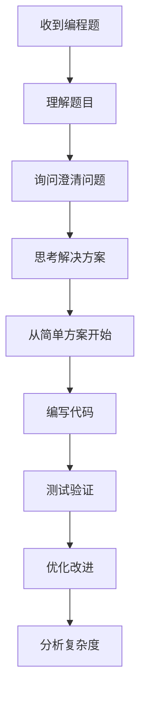
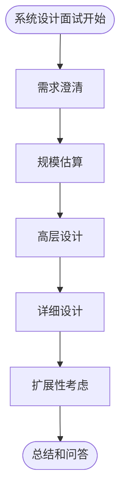

# 面试技巧指南

## 🎯 面试准备策略

### 技术面试准备
1. **基础知识巩固**
   - 数据结构与算法
   - 计算机网络基础
   - 操作系统原理
   - 数据库理论与实践

2. **技术栈深入**
   - 熟练掌握主要编程语言
   - 框架原理和最佳实践
   - 项目架构设计能力
   - 性能优化经验

3. **实践项目准备**
   - 准备 2-3 个代表性项目
   - 能清晰描述技术选型原因
   - 总结项目中遇到的挑战和解决方案

## 💬 面试沟通技巧

### 回答问题的结构
1. **STAR 法则**（适用于行为面试）
   - **S**ituation: 描述情况
   - **T**ask: 说明任务
   - **A**ction: 介绍行动
   - **R**esult: 总结结果

2. **技术问题回答结构**
   - 理解问题并确认需求
   - 思考多种解决方案
   - 选择最优方案并说明原因
   - 考虑边界情况和优化空间

### 有效沟通策略
- **主动提问**: 遇到不清楚的问题及时询问
- **思路展示**: 边思考边表达，让面试官了解你的思维过程
- **代码规范**: 即使是白板编程也要注意代码的可读性
- **时间管理**: 合理分配答题时间，避免在某个问题上耗时过长

## 🔧 技术面试实战技巧

### 算法题技巧
1. **理解题目**
   - 仔细阅读题目要求
   - 询问边界条件和约束
   - 给出示例验证理解

2. **解题步骤**
   - 暴力解法 → 优化解法
   - 时间复杂度和空间复杂度分析
   - 代码实现和测试

3. **常见优化思路**
   - 双指针技巧
   - 哈希表优化查找
   - 动态规划状态转移
   - 分治算法应用

### 系统设计技巧
1. **需求澄清**
   - 功能性需求
   - 非功能性需求（性能、可用性等）
   - 约束条件（用户量、数据量等）

2. **架构设计**
   - 从高层架构开始
   - 逐步细化各个组件
   - 考虑数据流和控制流

3. **技术选型**
   - 数据库选择（SQL vs NoSQL）
   - 缓存策略
   - 负载均衡
   - 消息队列

## 📊 面试类型与应对策略

### 编程面试

### 系统设计面试

## 🚀 面试前准备清单

### 技术准备
- [ ] 复习核心算法和数据结构
- [ ] 准备常见技术问题的答案
- [ ] 整理项目经历和技术亮点
- [ ] 模拟面试练习

### 材料准备
- [ ] 更新简历，突出相关经验
- [ ] 准备作品集和代码示例
- [ ] 整理技术博客或开源项目链接
- [ ] 准备提问面试官的问题

### 心理准备
- [ ] 保持自信和积极心态
- [ ] 准备应对压力的策略
- [ ] 设置合理的期望值
- [ ] 制定备选方案

## 💡 常见面试陷阱

### 技术陷阱
1. **过度优化**: 不要一开始就追求最优解
2. **忽略边界**: 考虑输入为空或异常情况
3. **代码bug**: 仔细检查循环条件和边界
4. **复杂度错误**: 正确分析时间和空间复杂度

### 沟通陷阱
1. **沉默思考**: 要边思考边表达
2. **固执己见**: 接受面试官的提示和建议
3. **过度紧张**: 保持冷静，出错了及时调整
4. **时间把控**: 合理分配时间，避免某个环节耗时过长

## 📈 面试后的总结

### 复盘要点
- 记录面试中遇到的技术问题
- 总结回答不理想的地方
- 分析面试官的反馈和建议
- 制定后续改进计划

### 持续改进
- 补强知识薄弱环节
- 练习表达和沟通技巧
- 扩充项目经验
- 关注行业技术发展趋势

---

*记住：面试是双向选择的过程，展示真实的自己，找到合适的机会！* 🌟 