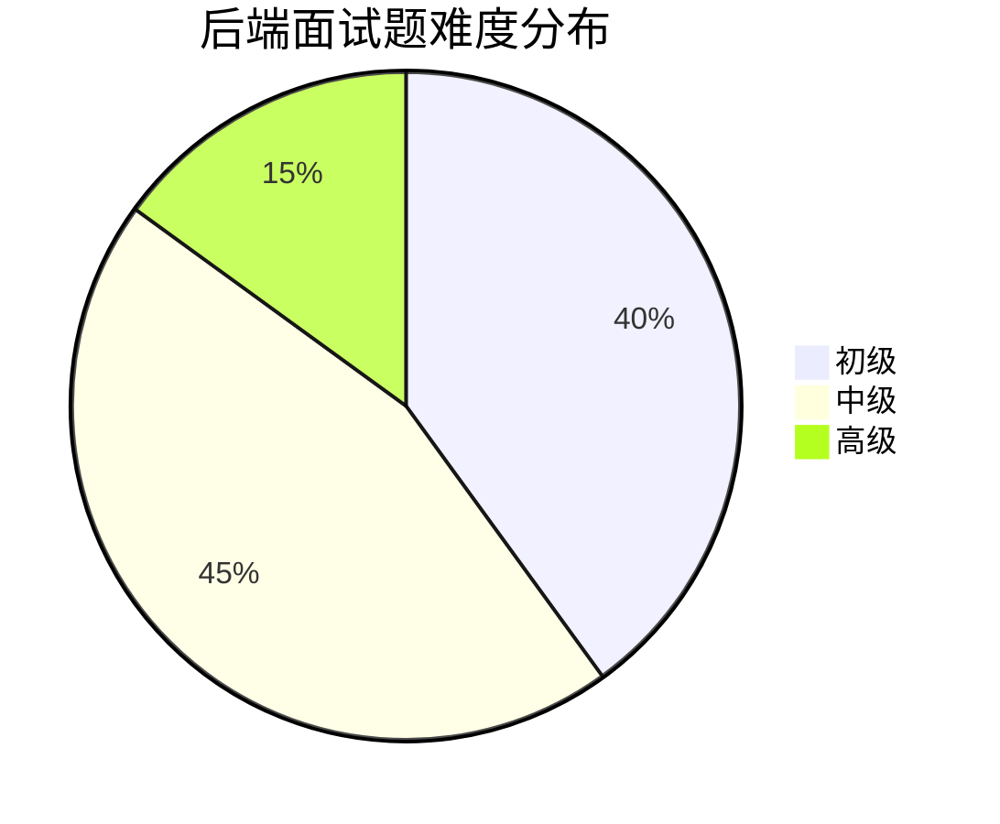
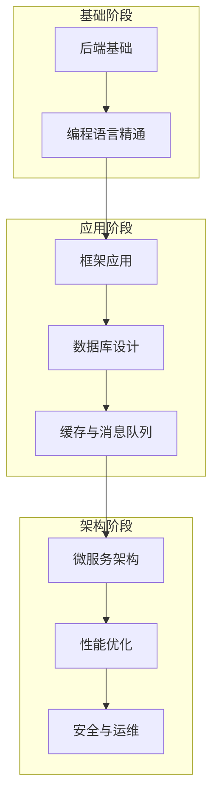

# 后端面试题库

## 📋 目录概览

本目录包含后端开发相关的面试题目，涵盖主流后端技术栈和常见面试场景。

## 🔍 题目分类

### Java 技术栈
- [Java 基础知识](./java-basics.md) - 语法、JVM、集合框架等
- [Spring 框架](./spring-framework.md) - Spring Boot、Spring MVC、Spring Security
- [并发编程](./java-concurrency.md) - 多线程、锁机制、线程池

### Python 技术栈
- [Python 基础](./python-basics.md) - 语法特性、内置函数、装饰器
- [Django/Flask](./python-web-frameworks.md) - Web框架原理和实践
- [异步编程](./python-async.md) - asyncio、协程、异步IO

### Go 技术栈
- [Go 语言基础](./go-basics.md) - 语法、goroutine、channel
- [Web 框架](./go-web-frameworks.md) - Gin、Echo、Beego
- [并发模型](./go-concurrency.md) - CSP模型、并发安全

### Node.js 技术栈
- [Node.js 基础](./nodejs-basics.md) - 事件循环、模块系统
- [Express 框架](./nodejs-express.md) - 中间件、路由、错误处理
- [性能优化](./nodejs-performance.md) - 内存管理、性能监控

## 🏗️ 架构设计
- [微服务架构](./microservices.md) - 服务拆分、通信机制
- [分布式系统](./distributed-systems.md) - CAP理论、一致性协议
- [API 设计](./api-design.md) - RESTful、GraphQL、RPC

## 🔧 中间件与工具
- [消息队列](./message-queues.md) - RabbitMQ、Kafka、Redis Pub/Sub
- [缓存技术](./caching.md) - Redis、Memcached、本地缓存
- [搜索引擎](./search-engines.md) - Elasticsearch、Solr

## 📊 性能与监控
- [性能优化](./performance-optimization.md) - 代码优化、架构优化
- [监控与调试](./monitoring-debugging.md) - 日志、指标、链路追踪
- [负载测试](./load-testing.md) - 压力测试、性能基准

## 🛡️ 安全与运维
- [Web 安全](./web-security.md) - XSS、CSRF、SQL注入防护
- [身份认证](./authentication.md) - JWT、OAuth、SSO
- [部署运维](./deployment-devops.md) - Docker、K8s、CI/CD

## 📈 难度分布

## 🎯 学习路径

## 📚 推荐学习资源

### 在线课程
- [后端开发进阶路线](https://example.com/backend-path)
- [系统设计面试指南](https://example.com/system-design)

### 技术书籍
- 《深入理解计算机系统》
- 《设计数据密集型应用》
- 《高性能MySQL》

### 实践项目
- 构建一个完整的后端API服务
- 实现一个简单的微服务架构
- 搭建监控和日志系统

## 🔗 相关链接

- [← 返回主目录](../../README.md)
- [数据库面试题](../database/README.md)
- [系统设计面试题](../system-design/README.md)
- [算法面试题](../algorithms/README.md)

---

*专注于后端技术的深度和广度，构建完整的技术体系* 🚀 