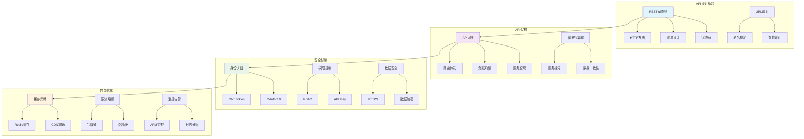

# API设计面试题

[← 返回后端面试题目录](./README.md)

## 📚 题目概览

API设计是现代软件架构的核心组成部分，直接影响系统的可用性、可维护性和扩展性。本章节重点考察候选人对RESTful API设计原则的理解，以及在复杂业务场景中的API架构设计能力，包括版本控制、安全认证、性能优化等关键技术。

## 🎯 核心技术考察重点

### RESTful API设计原则
- HTTP方法的正确使用和语义化设计
- 资源命名规范和URL结构设计
- HTTP状态码的准确使用和错误处理
- 请求响应格式的标准化设计

### API架构与治理
- API版本控制策略和向后兼容性
- API网关的设计和微服务集成
- 接口文档自动化生成和维护
- API监控、限流和熔断机制

### 安全与认证
- JWT、OAuth 2.0等认证授权机制
- API密钥管理和权限控制
- HTTPS加密和数据安全传输
- 防止常见安全攻击的设计策略

### 性能与优化
- 缓存策略和CDN加速
- 数据分页和批量操作设计
- 异步处理和长连接优化
- API性能监控和调优策略

## 📊 知识结构关联图

## 📝 核心面试题目

### RESTful API设计 🌐

#### 题目1：电商系统RESTful API完整设计
**问题背景**：设计一个完整的电商系统API，包含用户管理、商品管理、订单处理等核心功能

**技术挑战**：
- 复杂业务场景的资源建模和关系设计
- HTTP方法的语义化使用和幂等性保证
- 错误处理和异常场景的API设计
- 数据验证和业务规则的API层实现

**考察要点**：
- RESTful设计原则的深度理解和应用
- 复杂业务逻辑的API抽象能力
- HTTP协议的正确使用和优化
- API可用性和用户体验的设计考虑

**📁 完整解决方案**：[电商系统RESTful API设计](../../solutions/common/ecommerce-restful-api.md)

#### 题目2：API版本控制与向后兼容策略
**问题背景**：在不断演进的业务需求中，设计灵活的API版本控制机制

**技术挑战**：
- 多版本API的并行维护和管理
- 向后兼容性的保证和破坏性变更处理
- 版本废弃策略和客户端迁移方案
- 版本控制对系统性能的影响

**考察要点**：
- API演进策略的系统性思考
- 版本控制技术方案的对比分析
- 客户端兼容性的实际考虑
- API生命周期管理的最佳实践

**📁 完整解决方案**：[API版本控制系统](../../solutions/common/api-versioning-system.md)

### API网关与微服务 🚪

#### 题目3：高性能API网关架构设计
**问题背景**：构建支持高并发的API网关系统，实现统一的服务入口

**技术挑战**：
- 请求路由和负载均衡算法设计
- 服务发现和健康检查机制
- 限流熔断和故障隔离策略
- 性能监控和实时告警系统

**考察要点**：
- 分布式系统架构的设计能力
- 高可用和高性能的技术方案
- 微服务治理的实践经验
- 系统监控和运维的综合考虑

**📁 完整解决方案**：[高性能API网关实现](../../solutions/common/api-gateway-system.md)

### 安全与认证 🔐

#### 题目4：企业级API安全认证系统
**问题背景**：设计安全可靠的API认证授权系统，支持多种认证方式

**技术挑战**：
- JWT Token的安全设计和刷新机制
- OAuth 2.0授权流程的完整实现
- API密钥管理和权限控制系统
- 安全攻击防护和审计日志记录

**考察要点**：
- 安全认证机制的深度理解
- 多种认证方式的适用场景分析
- 安全威胁的识别和防护策略
- 合规性要求的技术实现

**📁 完整解决方案**：[API安全认证系统](../../solutions/common/api-security-auth.md)

### 性能优化与监控 ⚡

#### 题目5：API性能优化与缓存策略
**问题背景**：优化API响应性能，设计多层次的缓存架构

**技术挑战**：
- 多级缓存策略的设计和实现
- 缓存一致性和失效策略
- CDN加速和静态资源优化
- 数据库查询优化和连接池管理

**考察要点**：
- 性能优化的系统性方法
- 缓存技术的深度应用
- 性能瓶颈的识别和解决
- 大规模系统的性能调优经验

**📁 完整解决方案**：[API性能优化系统](../../solutions/common/api-performance-optimization.md)

#### 题目6：API监控与故障诊断系统
**问题背景**：构建完整的API监控体系，实现快速故障定位和恢复

**技术挑战**：
- 全链路监控和分布式追踪
- 实时性能指标收集和分析
- 智能告警和故障自动恢复
- API使用分析和业务洞察

**考察要点**：
- 可观测性系统的设计和实现
- 监控数据的收集和分析策略
- 故障诊断和根因分析能力
- DevOps实践和自动化运维

**📁 完整解决方案**：[API监控诊断系统](../../solutions/common/api-monitoring-system.md)

## 📊 面试评分标准

### 设计能力 (35分)
- **架构设计**：能够设计合理的API架构和服务拆分策略
- **接口设计**：遵循RESTful原则，设计清晰易用的API接口
- **数据模型**：合理的数据结构设计和关系建模

### 技术深度 (35分)
- **协议理解**：深入理解HTTP协议和RESTful设计原则
- **安全机制**：掌握API安全认证和防护的技术方案
- **性能优化**：具备API性能分析和优化的实战能力

### 实践经验 (30分)
- **项目经验**：有实际API设计和开发的项目经验
- **问题解决**：能够分析和解决复杂的API设计问题
- **最佳实践**：了解行业最佳实践和设计模式

## 🎯 备考建议

### 学习路径
1. **基础理论**：深入学习HTTP协议和RESTful设计原则
2. **实践项目**：通过实际项目掌握API设计和开发技能
3. **架构设计**：学习微服务架构和API网关的设计模式
4. **安全机制**：掌握API安全认证和防护的技术方案
5. **性能优化**：学习API性能分析和优化的方法

### 技术重点
- **RESTful设计**：掌握资源设计、HTTP方法使用、状态码规范
- **API网关**：了解服务路由、负载均衡、限流熔断等机制
- **安全认证**：掌握JWT、OAuth 2.0等认证授权技术
- **性能优化**：学习缓存策略、CDN加速、数据库优化
- **监控运维**：了解API监控、日志分析、故障诊断

### 实践项目建议
- 设计完整的电商API系统
- 实现API网关和服务治理
- 构建API安全认证系统
- 开发API监控分析平台
- 创建API文档自动化工具

## 🔗 相关资源链接

- [微服务架构面试题](./microservices.md)
- [Web安全面试题](./web-security.md)
- [性能优化面试题](./performance-optimization.md)
- [系统设计面试题](../system-design/README.md)
- [← 返回后端面试题目录](./README.md)

---

*设计优雅的API，构建可扩展的服务架构* 🚀 