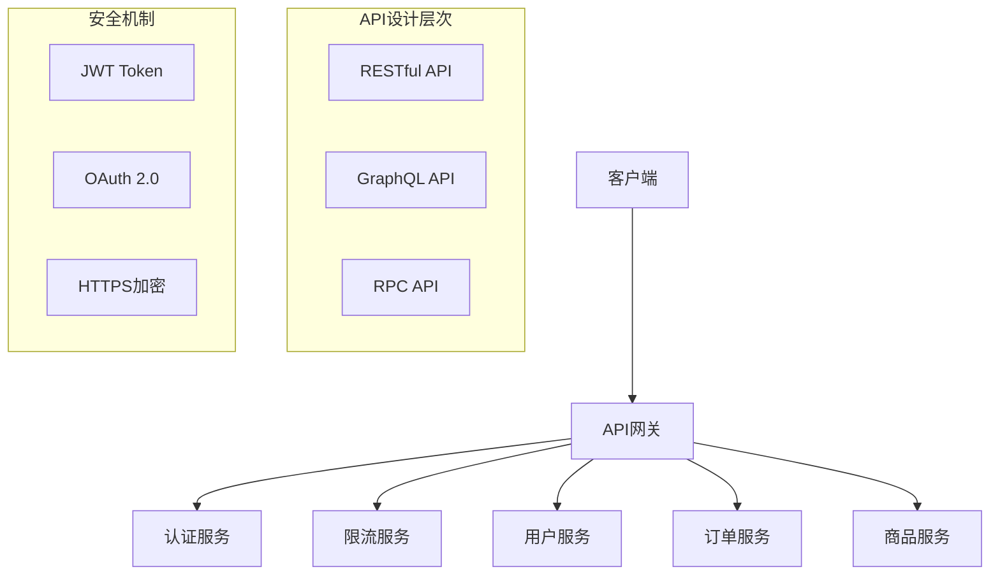

# API 设计面试题

## 🏷️ 标签
- 技术栈: RESTful API, GraphQL, API网关
- 难度: 中级到高级
- 类型: 设计题, 架构题, 实践题

## 💡 核心知识点
- RESTful API 设计原则
- HTTP 状态码和请求方法
- API 版本控制策略
- 认证授权机制
- API 文档和测试
- 性能优化和安全防护

## 📊 API 设计架构



## 📝 面试题目

### 1. RESTful API 设计原则

#### **【中级】** 设计一个电商系统的 RESTful API，包含用户、商品、订单管理

**💡 考察要点:**
- REST 设计原则理解
- HTTP 方法的正确使用
- 资源命名规范
- 状态码使用

**📝 参考答案:**

**RESTful API 设计实例:**

```java
// 1. 用户管理 API 设计
@RestController
@RequestMapping("/api/v1/users")
@Validated
public class UserController {
    
    @Autowired
    private UserService userService;
    
    // 获取用户列表 (支持分页和筛选)
    @GetMapping
    public ResponseEntity<ApiResponse<PageResult<UserDTO>>> getUsers(
            @RequestParam(defaultValue = "1") int page,
            @RequestParam(defaultValue = "20") int size,
            @RequestParam(required = false) String keyword,
            @RequestParam(required = false) UserStatus status) {
        
        PageRequest pageRequest = PageRequest.of(page - 1, size);
        UserQueryParam queryParam = UserQueryParam.builder()
            .keyword(keyword)
            .status(status)
            .build();
            
        PageResult<UserDTO> result = userService.getUsers(queryParam, pageRequest);
        
        return ResponseEntity.ok(ApiResponse.success(result));
    }
    
    // 获取单个用户
    @GetMapping("/{userId}")
    public ResponseEntity<ApiResponse<UserDTO>> getUser(@PathVariable Long userId) {
        UserDTO user = userService.getUserById(userId);
        if (user == null) {
            return ResponseEntity.notFound().build();
        }
        return ResponseEntity.ok(ApiResponse.success(user));
    }
    
    // 创建用户
    @PostMapping
    public ResponseEntity<ApiResponse<UserDTO>> createUser(
            @Valid @RequestBody CreateUserRequest request) {
        
        UserDTO createdUser = userService.createUser(request);
        
        URI location = ServletUriComponentsBuilder
            .fromCurrentRequest()
            .path("/{id}")
            .buildAndExpand(createdUser.getId())
            .toUri();
            
        return ResponseEntity.created(location)
            .body(ApiResponse.success(createdUser));
    }
    
    // 更新用户 (完整更新)
    @PutMapping("/{userId}")
    public ResponseEntity<ApiResponse<UserDTO>> updateUser(
            @PathVariable Long userId,
            @Valid @RequestBody UpdateUserRequest request) {
        
        UserDTO updatedUser = userService.updateUser(userId, request);
        return ResponseEntity.ok(ApiResponse.success(updatedUser));
    }
    
    // 部分更新用户
    @PatchMapping("/{userId}")
    public ResponseEntity<ApiResponse<UserDTO>> patchUser(
            @PathVariable Long userId,
            @RequestBody Map<String, Object> updates) {
        
        UserDTO patchedUser = userService.patchUser(userId, updates);
        return ResponseEntity.ok(ApiResponse.success(patchedUser));
    }
    
    // 删除用户 (软删除)
    @DeleteMapping("/{userId}")
    public ResponseEntity<Void> deleteUser(@PathVariable Long userId) {
        userService.deleteUser(userId);
        return ResponseEntity.noContent().build();
    }
    
    // 用户关系管理 - 关注用户
    @PostMapping("/{userId}/following/{targetUserId}")
    public ResponseEntity<Void> followUser(
            @PathVariable Long userId,
            @PathVariable Long targetUserId) {
        
        userService.followUser(userId, targetUserId);
        return ResponseEntity.ok().build();
    }
    
    // 获取用户关注列表
    @GetMapping("/{userId}/following")
    public ResponseEntity<ApiResponse<List<UserDTO>>> getFollowing(
            @PathVariable Long userId) {
        
        List<UserDTO> following = userService.getFollowing(userId);
        return ResponseEntity.ok(ApiResponse.success(following));
    }
}

// 2. 商品管理 API 设计
@RestController
@RequestMapping("/api/v1/products")
public class ProductController {
    
    @Autowired
    private ProductService productService;
    
    // 商品列表 (支持搜索、筛选、排序)
    @GetMapping
    public ResponseEntity<ApiResponse<PageResult<ProductDTO>>> getProducts(
            @RequestParam(defaultValue = "1") int page,
            @RequestParam(defaultValue = "20") int size,
            @RequestParam(required = false) String keyword,
            @RequestParam(required = false) Long categoryId,
            @RequestParam(required = false) BigDecimal minPrice,
            @RequestParam(required = false) BigDecimal maxPrice,
            @RequestParam(defaultValue = "createdAt") String sortBy,
            @RequestParam(defaultValue = "desc") String sortDir) {
        
        ProductSearchParam searchParam = ProductSearchParam.builder()
            .keyword(keyword)
            .categoryId(categoryId)
            .minPrice(minPrice)
            .maxPrice(maxPrice)
            .build();
            
        Sort sort = Sort.by(
            "desc".equals(sortDir) ? Sort.Direction.DESC : Sort.Direction.ASC,
            sortBy
        );
        
        PageRequest pageRequest = PageRequest.of(page - 1, size, sort);
        PageResult<ProductDTO> result = productService.searchProducts(searchParam, pageRequest);
        
        return ResponseEntity.ok(ApiResponse.success(result));
    }
    
    // 商品详情
    @GetMapping("/{productId}")
    public ResponseEntity<ApiResponse<ProductDetailDTO>> getProduct(
            @PathVariable Long productId) {
        
        ProductDetailDTO product = productService.getProductDetail(productId);
        if (product == null) {
            return ResponseEntity.notFound().build();
        }
        
        return ResponseEntity.ok(ApiResponse.success(product));
    }
    
    // 商品库存信息
    @GetMapping("/{productId}/inventory")
    public ResponseEntity<ApiResponse<InventoryDTO>> getInventory(
            @PathVariable Long productId) {
        
        InventoryDTO inventory = productService.getInventory(productId);
        return ResponseEntity.ok(ApiResponse.success(inventory));
    }
    
    // 商品评价列表
    @GetMapping("/{productId}/reviews")
    public ResponseEntity<ApiResponse<PageResult<ReviewDTO>>> getReviews(
            @PathVariable Long productId,
            @RequestParam(defaultValue = "1") int page,
            @RequestParam(defaultValue = "10") int size) {
        
        PageRequest pageRequest = PageRequest.of(page - 1, size);
        PageResult<ReviewDTO> reviews = productService.getReviews(productId, pageRequest);
        
        return ResponseEntity.ok(ApiResponse.success(reviews));
    }
}

// 3. 订单管理 API 设计
@RestController
@RequestMapping("/api/v1/orders")
public class OrderController {
    
    @Autowired
    private OrderService orderService;
    
    // 创建订单
    @PostMapping
    public ResponseEntity<ApiResponse<OrderDTO>> createOrder(
            @Valid @RequestBody CreateOrderRequest request,
            @AuthenticationPrincipal UserPrincipal currentUser) {
        
        OrderDTO order = orderService.createOrder(currentUser.getId(), request);
        
        URI location = ServletUriComponentsBuilder
            .fromCurrentRequest()
            .path("/{id}")
            .buildAndExpand(order.getId())
            .toUri();
            
        return ResponseEntity.created(location)
            .body(ApiResponse.success(order));
    }
    
    // 获取用户订单列表
    @GetMapping
    public ResponseEntity<ApiResponse<PageResult<OrderDTO>>> getUserOrders(
            @RequestParam(defaultValue = "1") int page,
            @RequestParam(defaultValue = "10") int size,
            @RequestParam(required = false) OrderStatus status,
            @AuthenticationPrincipal UserPrincipal currentUser) {
        
        PageRequest pageRequest = PageRequest.of(page - 1, size);
        PageResult<OrderDTO> orders = orderService.getUserOrders(
            currentUser.getId(), status, pageRequest);
            
        return ResponseEntity.ok(ApiResponse.success(orders));
    }
    
    // 订单详情
    @GetMapping("/{orderId}")
    public ResponseEntity<ApiResponse<OrderDetailDTO>> getOrder(
            @PathVariable Long orderId,
            @AuthenticationPrincipal UserPrincipal currentUser) {
        
        OrderDetailDTO order = orderService.getOrderDetail(orderId, currentUser.getId());
        if (order == null) {
            return ResponseEntity.notFound().build();
        }
        
        return ResponseEntity.ok(ApiResponse.success(order));
    }
    
    // 支付订单
    @PostMapping("/{orderId}/payment")
    public ResponseEntity<ApiResponse<PaymentDTO>> payOrder(
            @PathVariable Long orderId,
            @Valid @RequestBody PaymentRequest request,
            @AuthenticationPrincipal UserPrincipal currentUser) {
        
        PaymentDTO payment = orderService.payOrder(orderId, currentUser.getId(), request);
        return ResponseEntity.ok(ApiResponse.success(payment));
    }
    
    // 取消订单
    @PostMapping("/{orderId}/cancellation")
    public ResponseEntity<Void> cancelOrder(
            @PathVariable Long orderId,
            @RequestBody(required = false) CancelOrderRequest request,
            @AuthenticationPrincipal UserPrincipal currentUser) {
        
        orderService.cancelOrder(orderId, currentUser.getId(), 
            request != null ? request.getReason() : null);
        return ResponseEntity.ok().build();
    }
    
    // 确认收货
    @PostMapping("/{orderId}/confirmation")
    public ResponseEntity<Void> confirmOrder(
            @PathVariable Long orderId,
            @AuthenticationPrincipal UserPrincipal currentUser) {
        
        orderService.confirmOrder(orderId, currentUser.getId());
        return ResponseEntity.ok().build();
    }
}

// 4. 统一响应格式
@Data
@Builder
@AllArgsConstructor
@NoArgsConstructor
public class ApiResponse<T> {
    private boolean success;
    private String message;
    private T data;
    private String timestamp;
    private String traceId;
    
    public static <T> ApiResponse<T> success(T data) {
        return ApiResponse.<T>builder()
            .success(true)
            .message("操作成功")
            .data(data)
            .timestamp(LocalDateTime.now().toString())
            .traceId(MDC.get("traceId"))
            .build();
    }
    
    public static <T> ApiResponse<T> error(String message) {
        return ApiResponse.<T>builder()
            .success(false)
            .message(message)
            .timestamp(LocalDateTime.now().toString())
            .traceId(MDC.get("traceId"))
            .build();
    }
}

// 5. 分页结果封装
@Data
@Builder
@AllArgsConstructor
@NoArgsConstructor
public class PageResult<T> {
    private List<T> content;
    private int page;
    private int size;
    private long totalElements;
    private int totalPages;
    private boolean first;
    private boolean last;
    private boolean hasNext;
    private boolean hasPrevious;
}
```

**API 设计规范总结:**

| 方面 | 规范 | 示例 |
|------|------|------|
| **URL命名** | 名词复数，小写，连字符分隔 | `/api/v1/users`, `/api/v1/order-items` |
| **HTTP方法** | 语义化使用 | GET查询、POST创建、PUT更新、DELETE删除 |
| **状态码** | 标准HTTP状态码 | 200成功、201创建、400错误、404未找到 |
| **版本控制** | URL路径版本 | `/api/v1/`, `/api/v2/` |
| **请求体** | JSON格式，驼峰命名 | `{"firstName": "John"}` |
| **响应体** | 统一格式包装 | `{"success": true, "data": {}}` |

---

### 2. API 版本控制和兼容性

#### **【高级】** 如何设计API版本控制策略，保证向后兼容？

**💡 考察要点:**
- 版本控制策略对比
- 兼容性保证机制
- 平滑迁移方案

**📝 参考答案:**

```java
// 1. URL路径版本控制
@RestController
@RequestMapping("/api/v1/users")
public class UserV1Controller {
    
    @GetMapping("/{id}")
    public ResponseEntity<UserV1DTO> getUser(@PathVariable Long id) {
        // V1版本的用户数据结构
        UserV1DTO user = userService.getUserV1(id);
        return ResponseEntity.ok(user);
    }
}

@RestController
@RequestMapping("/api/v2/users")
public class UserV2Controller {
    
    @GetMapping("/{id}")
    public ResponseEntity<UserV2DTO> getUser(@PathVariable Long id) {
        // V2版本的用户数据结构 (新增字段)
        UserV2DTO user = userService.getUserV2(id);
        return ResponseEntity.ok(user);
    }
}

// 2. Header版本控制
@RestController
@RequestMapping("/api/users")
public class UserVersionController {
    
    @GetMapping(value = "/{id}", headers = "API-Version=1")
    public ResponseEntity<UserV1DTO> getUserV1(@PathVariable Long id) {
        return ResponseEntity.ok(userService.getUserV1(id));
    }
    
    @GetMapping(value = "/{id}", headers = "API-Version=2")
    public ResponseEntity<UserV2DTO> getUserV2(@PathVariable Long id) {
        return ResponseEntity.ok(userService.getUserV2(id));
    }
    
    @GetMapping("/{id}")
    public ResponseEntity<UserV2DTO> getUser(@PathVariable Long id) {
        // 默认使用最新版本
        return getUserV2(id);
    }
}

// 3. 参数版本控制
@RestController
@RequestMapping("/api/users")
public class UserParamVersionController {
    
    @GetMapping("/{id}")
    public ResponseEntity<?> getUser(
            @PathVariable Long id,
            @RequestParam(defaultValue = "2") String version) {
        
        switch (version) {
            case "1":
                return ResponseEntity.ok(userService.getUserV1(id));
            case "2":
                return ResponseEntity.ok(userService.getUserV2(id));
            default:
                return ResponseEntity.badRequest()
                    .body("不支持的API版本: " + version);
        }
    }
}

// 4. 内容协商版本控制
@RestController
@RequestMapping("/api/users")
public class UserContentNegotiationController {
    
    @GetMapping(value = "/{id}", produces = "application/vnd.company.user-v1+json")
    public ResponseEntity<UserV1DTO> getUserV1(@PathVariable Long id) {
        return ResponseEntity.ok(userService.getUserV1(id));
    }
    
    @GetMapping(value = "/{id}", produces = "application/vnd.company.user-v2+json")
    public ResponseEntity<UserV2DTO> getUserV2(@PathVariable Long id) {
        return ResponseEntity.ok(userService.getUserV2(id));
    }
}

// 5. 版本兼容性处理服务
@Service
public class ApiVersionService {
    
    // 数据转换器映射
    private final Map<String, Function<Object, Object>> converters = Map.of(
        "user:v1->v2", this::convertUserV1ToV2,
        "user:v2->v1", this::convertUserV2ToV1
    );
    
    public <T> T convertData(Object source, String fromVersion, String toVersion, Class<T> targetClass) {
        String converterKey = String.format("user:%s->%s", fromVersion, toVersion);
        Function<Object, Object> converter = converters.get(converterKey);
        
        if (converter != null) {
            return targetClass.cast(converter.apply(source));
        }
        
        // 如果没有转换器，尝试直接转换
        return objectMapper.convertValue(source, targetClass);
    }
    
    private UserV2DTO convertUserV1ToV2(Object userV1) {
        UserV1DTO v1 = (UserV1DTO) userV1;
        return UserV2DTO.builder()
            .id(v1.getId())
            .username(v1.getUsername())
            .email(v1.getEmail())
            .createdAt(v1.getCreatedAt())
            // V2新增字段设置默认值
            .profilePicture(null)
            .lastLoginAt(null)
            .preferences(Collections.emptyMap())
            .build();
    }
    
    private UserV1DTO convertUserV2ToV1(Object userV2) {
        UserV2DTO v2 = (UserV2DTO) userV2;
        return UserV1DTO.builder()
            .id(v2.getId())
            .username(v2.getUsername())
            .email(v2.getEmail())
            .createdAt(v2.getCreatedAt())
            // 忽略V2新增字段
            .build();
    }
}

// 6. 弃用警告机制
@RestController
@RequestMapping("/api/v1/users")
@Deprecated
public class DeprecatedUserController {
    
    @GetMapping("/{id}")
    public ResponseEntity<UserV1DTO> getUser(@PathVariable Long id, HttpServletResponse response) {
        // 添加弃用警告头
        response.addHeader("Deprecation", "true");
        response.addHeader("Sunset", "2024-12-31");
        response.addHeader("Link", "</api/v2/users>; rel=\"successor-version\"");
        
        UserV1DTO user = userService.getUserV1(id);
        return ResponseEntity.ok(user);
    }
}

// 7. API版本管理配置
@Configuration
public class ApiVersionConfig {
    
    @Bean
    public VersionedRequestMappingHandlerMapping versionedRequestMappingHandlerMapping() {
        return new VersionedRequestMappingHandlerMapping();
    }
    
    // 自定义版本解析器
    public static class VersionedRequestMappingHandlerMapping extends RequestMappingHandlerMapping {
        
        @Override
        protected RequestCondition<?> getCustomTypeCondition(Class<?> handlerType) {
            ApiVersion typeAnnotation = AnnotationUtils.findAnnotation(handlerType, ApiVersion.class);
            return createCondition(typeAnnotation);
        }
        
        @Override
        protected RequestCondition<?> getCustomMethodCondition(Method method) {
            ApiVersion methodAnnotation = AnnotationUtils.findAnnotation(method, ApiVersion.class);
            return createCondition(methodAnnotation);
        }
        
        private RequestCondition<?> createCondition(ApiVersion apiVersion) {
            return apiVersion == null ? null : new ApiVersionCondition(apiVersion.value());
        }
    }
}

// API版本注解
@Target({ElementType.TYPE, ElementType.METHOD})
@Retention(RetentionPolicy.RUNTIME)
public @interface ApiVersion {
    String value();
}

// 使用版本注解
@RestController
@RequestMapping("/api/users")
@ApiVersion("2.0")
public class VersionedUserController {
    
    @GetMapping("/{id}")
    @ApiVersion("2.1")  // 方法级别版本覆盖类级别
    public ResponseEntity<UserV2DTO> getUser(@PathVariable Long id) {
        return ResponseEntity.ok(userService.getUserV2(id));
    }
}
```

**版本控制策略对比:**

| 策略 | 优点 | 缺点 | 适用场景 |
|------|------|------|----------|
| **URL路径** | 简单直观，缓存友好 | URL冗余，路由复杂 | 大版本变更 |
| **Header** | URL简洁，灵活 | 不直观，缓存困难 | 小版本迭代 |
| **参数** | 简单实现 | 容易忽略，不规范 | 临时兼容 |
| **内容协商** | 标准化，专业 | 复杂度高，理解困难 | 企业级API |

---

## 🎯 面试技巧建议

### API设计回答策略
1. **原则先行**: 先说明设计原则
2. **实例说明**: 用具体例子演示
3. **场景分析**: 分析不同场景的选择
4. **最佳实践**: 分享行业最佳实践

### 常见追问问题
- "如何设计API的错误处理？"
- "GraphQL和REST API的区别？"
- "API网关的作用是什么？"
- "如何保证API的安全性？"

## 🔗 相关链接

- [← 返回后端目录](./README.md)
- [微服务架构](./microservices.md)
- [Web安全](./web-security.md)
- [认证授权](./authentication.md)

---

*良好的API设计是系统成功的基石，需要平衡易用性、扩展性和兼容性* 🔗 