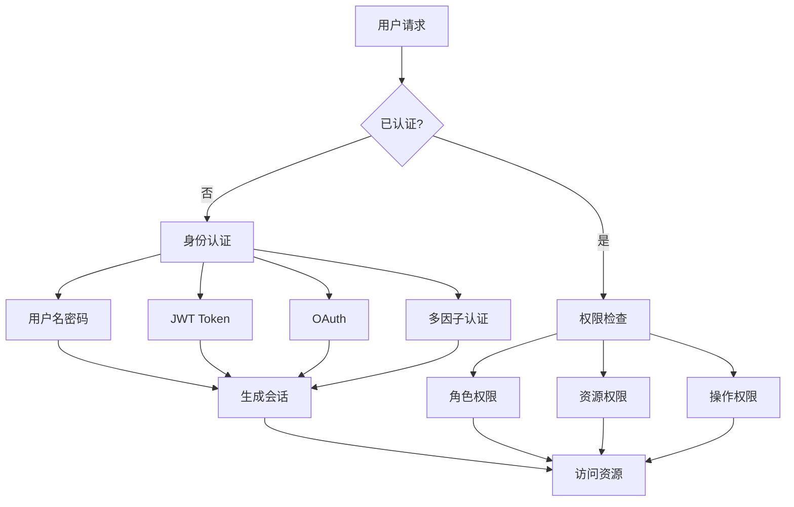
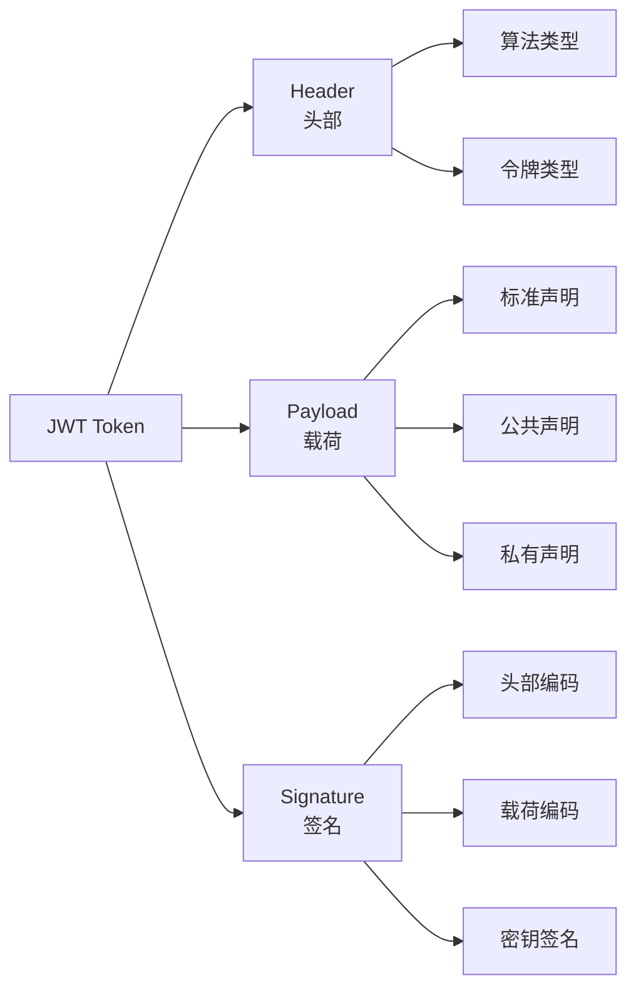
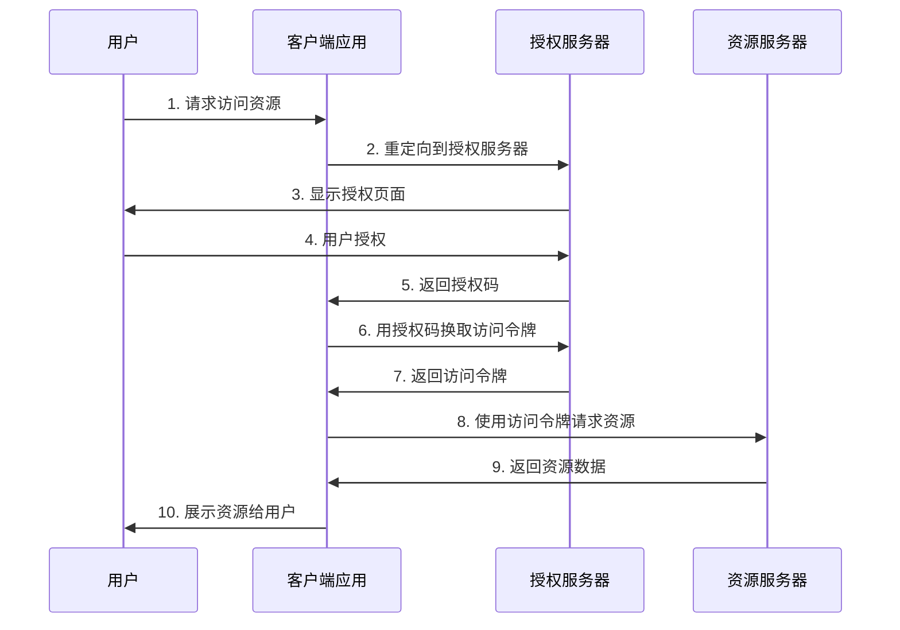

# 身份认证面试题

## 📋 目录
- [JWT 认证](#jwt-认证)
- [OAuth 2.0](#oauth-20)
- [SSO 单点登录](#sso-单点登录)
- [多因子认证](#多因子认证)
- [会话管理](#会话管理)

## 🎯 核心知识点
- 认证与授权区别
- JWT 结构和安全性
- OAuth 流程和场景
- SSO 实现原理
- 会话安全管理

## 📊 认证授权架构图



## JWT 认证

### 💡 面试题目

#### 1. **[中级]** JWT 的结构和工作原理

**JWT 结构说明：**



**JWT 实现示例：**

```python
# Python JWT 实现
import json
import base64
import hmac
import hashlib
import time
from typing import Dict, Any, Optional
from datetime import datetime, timedelta

class JWTService:
    """JWT 服务类"""
    
    def __init__(self, secret_key: str, algorithm: str = 'HS256'):
        self.secret_key = secret_key
        self.algorithm = algorithm
    
    def encode(self, payload: Dict[str, Any], expires_in: int = 3600) -> str:
        """编码 JWT"""
        
        # 1. 构建头部
        header = {
            'typ': 'JWT',
            'alg': self.algorithm
        }
        
        # 2. 构建载荷
        now = int(time.time())
        jwt_payload = {
            'iat': now,  # 签发时间
            'exp': now + expires_in,  # 过期时间
            'nbf': now,  # 生效时间
            **payload
        }
        
        # 3. Base64 编码
        header_encoded = self._base64_encode(json.dumps(header))
        payload_encoded = self._base64_encode(json.dumps(jwt_payload))
        
        # 4. 生成签名
        message = f"{header_encoded}.{payload_encoded}"
        signature = self._sign(message)
        
        # 5. 组合 JWT
        return f"{message}.{signature}"
    
    def decode(self, token: str) -> Dict[str, Any]:
        """解码 JWT"""
        try:
            # 1. 分割 token
            parts = token.split('.')
            if len(parts) != 3:
                raise ValueError("Invalid JWT format")
            
            header_encoded, payload_encoded, signature = parts
            
            # 2. 验证签名
            message = f"{header_encoded}.{payload_encoded}"
            if not self._verify_signature(message, signature):
                raise ValueError("Invalid signature")
            
            # 3. 解码载荷
            payload = json.loads(self._base64_decode(payload_encoded))
            
            # 4. 验证时间
            now = int(time.time())
            
            if 'exp' in payload and payload['exp'] < now:
                raise ValueError("Token expired")
            
            if 'nbf' in payload and payload['nbf'] > now:
                raise ValueError("Token not yet valid")
            
            return payload
            
        except Exception as e:
            raise ValueError(f"Invalid JWT: {str(e)}")
    
    def refresh(self, token: str, expires_in: int = 3600) -> str:
        """刷新 JWT"""
        try:
            # 解码现有 token（允许过期）
            payload = self._decode_without_verification(token)
            
            # 移除时间相关的声明
            for key in ['iat', 'exp', 'nbf']:
                payload.pop(key, None)
            
            # 生成新 token
            return self.encode(payload, expires_in)
            
        except Exception as e:
            raise ValueError(f"Cannot refresh token: {str(e)}")
    
    def _base64_encode(self, data: str) -> str:
        """Base64 URL 安全编码"""
        return base64.urlsafe_b64encode(data.encode()).decode().rstrip('=')
    
    def _base64_decode(self, data: str) -> str:
        """Base64 URL 安全解码"""
        # 补充填充
        padding = len(data) % 4
        if padding:
            data += '=' * (4 - padding)
        return base64.urlsafe_b64decode(data).decode()
    
    def _sign(self, message: str) -> str:
        """生成签名"""
        if self.algorithm == 'HS256':
            signature = hmac.new(
                self.secret_key.encode(),
                message.encode(),
                hashlib.sha256
            ).digest()
            return base64.urlsafe_b64encode(signature).decode().rstrip('=')
        else:
            raise ValueError(f"Unsupported algorithm: {self.algorithm}")
    
    def _verify_signature(self, message: str, signature: str) -> bool:
        """验证签名"""
        expected_signature = self._sign(message)
        return hmac.compare_digest(signature, expected_signature)
    
    def _decode_without_verification(self, token: str) -> Dict[str, Any]:
        """不验证直接解码（仅用于刷新）"""
        parts = token.split('.')
        if len(parts) != 3:
            raise ValueError("Invalid JWT format")
        
        payload_encoded = parts[1]
        return json.loads(self._base64_decode(payload_encoded))

# 使用示例
class AuthenticationService:
    """认证服务"""
    
    def __init__(self, secret_key: str):
        self.jwt_service = JWTService(secret_key)
        self.refresh_tokens = {}  # 实际应用中应使用数据库
    
    def login(self, username: str, password: str) -> Dict[str, str]:
        """用户登录"""
        # 验证用户凭据（示例）
        if not self._verify_credentials(username, password):
            raise ValueError("Invalid credentials")
        
        # 获取用户信息
        user = self._get_user(username)
        
        # 生成访问令牌
        access_payload = {
            'user_id': user['id'],
            'username': user['username'],
            'roles': user['roles'],
            'type': 'access'
        }
        access_token = self.jwt_service.encode(access_payload, expires_in=900)  # 15分钟
        
        # 生成刷新令牌
        refresh_payload = {
            'user_id': user['id'],
            'type': 'refresh'
        }
        refresh_token = self.jwt_service.encode(refresh_payload, expires_in=604800)  # 7天
        
        # 存储刷新令牌
        self.refresh_tokens[refresh_token] = user['id']
        
        return {
            'access_token': access_token,
            'refresh_token': refresh_token,
            'token_type': 'Bearer',
            'expires_in': 900
        }
    
    def refresh_access_token(self, refresh_token: str) -> Dict[str, str]:
        """刷新访问令牌"""
        try:
            # 验证刷新令牌
            payload = self.jwt_service.decode(refresh_token)
            
            if payload.get('type') != 'refresh':
                raise ValueError("Invalid refresh token")
            
            # 检查刷新令牌是否在白名单中
            if refresh_token not in self.refresh_tokens:
                raise ValueError("Refresh token revoked")
            
            # 获取用户信息
            user_id = payload['user_id']
            user = self._get_user_by_id(user_id)
            
            # 生成新的访问令牌
            access_payload = {
                'user_id': user['id'],
                'username': user['username'],
                'roles': user['roles'],
                'type': 'access'
            }
            access_token = self.jwt_service.encode(access_payload, expires_in=900)
            
            return {
                'access_token': access_token,
                'token_type': 'Bearer',
                'expires_in': 900
            }
            
        except Exception as e:
            raise ValueError(f"Cannot refresh token: {str(e)}")
    
    def logout(self, refresh_token: str):
        """用户登出"""
        # 撤销刷新令牌
        self.refresh_tokens.pop(refresh_token, None)
    
    def verify_token(self, token: str) -> Dict[str, Any]:
        """验证访问令牌"""
        try:
            payload = self.jwt_service.decode(token)
            
            if payload.get('type') != 'access':
                raise ValueError("Invalid access token")
            
            return payload
            
        except Exception as e:
            raise ValueError(f"Token verification failed: {str(e)}")
    
    def _verify_credentials(self, username: str, password: str) -> bool:
        """验证用户凭据"""
        # 实际应用中应查询数据库并验证密码哈希
        return username == "admin" and password == "password"
    
    def _get_user(self, username: str) -> Dict[str, Any]:
        """获取用户信息"""
        # 示例用户数据
        return {
            'id': 1,
            'username': username,
            'roles': ['user', 'admin']
        }
    
    def _get_user_by_id(self, user_id: int) -> Dict[str, Any]:
        """根据ID获取用户信息"""
        return {
            'id': user_id,
            'username': 'admin',
            'roles': ['user', 'admin']
        }

# Flask 集成示例
from flask import Flask, request, jsonify, g
from functools import wraps

app = Flask(__name__)
auth_service = AuthenticationService('your-secret-key-here')

def token_required(f):
    """JWT 认证装饰器"""
    @wraps(f)
    def decorated(*args, **kwargs):
        token = request.headers.get('Authorization')
        
        if not token:
            return jsonify({'error': 'Token is missing'}), 401
        
        try:
            # 移除 "Bearer " 前缀
            if token.startswith('Bearer '):
                token = token[7:]
            
            # 验证令牌
            payload = auth_service.verify_token(token)
            g.current_user = payload
            
        except Exception as e:
            return jsonify({'error': str(e)}), 401
        
        return f(*args, **kwargs)
    
    return decorated

@app.route('/login', methods=['POST'])
def login():
    """登录接口"""
    data = request.get_json()
    username = data.get('username')
    password = data.get('password')
    
    try:
        tokens = auth_service.login(username, password)
        return jsonify(tokens)
    except Exception as e:
        return jsonify({'error': str(e)}), 401

@app.route('/refresh', methods=['POST'])
def refresh():
    """刷新令牌接口"""
    data = request.get_json()
    refresh_token = data.get('refresh_token')
    
    try:
        tokens = auth_service.refresh_access_token(refresh_token)
        return jsonify(tokens)
    except Exception as e:
        return jsonify({'error': str(e)}), 401

@app.route('/protected', methods=['GET'])
@token_required
def protected():
    """受保护的接口"""
    return jsonify({
        'message': 'Access granted',
        'user': g.current_user
    })

@app.route('/logout', methods=['POST'])
@token_required
def logout():
    """登出接口"""
    data = request.get_json()
    refresh_token = data.get('refresh_token')
    
    auth_service.logout(refresh_token)
    return jsonify({'message': 'Logged out successfully'})

if __name__ == '__main__':
    app.run(debug=True)
```

#### 2. **[高级]** JWT 安全性和最佳实践

**JWT 安全实践：**

```python
# JWT 安全增强实现
import json
import secrets
import hashlib
from cryptography.hazmat.primitives import hashes, serialization
from cryptography.hazmat.primitives.asymmetric import rsa, padding
from cryptography.hazmat.primitives.ciphers import Cipher, algorithms, modes
import redis

class SecureJWTService:
    """安全增强的 JWT 服务"""
    
    def __init__(self, private_key_path: str = None, public_key_path: str = None):
        self.redis_client = redis.Redis(host='localhost', port=6379, db=0)
        
        # 使用 RSA 非对称加密
        if private_key_path and public_key_path:
            self.private_key = self._load_private_key(private_key_path)
            self.public_key = self._load_public_key(public_key_path)
        else:
            # 生成密钥对
            self.private_key = rsa.generate_private_key(
                public_exponent=65537,
                key_size=2048
            )
            self.public_key = self.private_key.public_key()
    
    def encode_secure(self, payload: Dict[str, Any], expires_in: int = 3600) -> Dict[str, str]:
        """安全编码 JWT"""
        
        # 1. 添加安全声明
        now = int(time.time())
        jti = secrets.token_urlsafe(32)  # JWT ID
        
        secure_payload = {
            'iat': now,
            'exp': now + expires_in,
            'nbf': now,
            'jti': jti,
            'aud': 'your-app',  # 受众
            'iss': 'your-service',  # 签发者
            **payload
        }
        
        # 2. 构建头部（使用 RS256）
        header = {
            'typ': 'JWT',
            'alg': 'RS256',
            'kid': self._get_key_id()  # 密钥 ID
        }
        
        # 3. 编码和签名
        header_encoded = self._base64_encode(json.dumps(header))
        payload_encoded = self._base64_encode(json.dumps(secure_payload))
        
        message = f"{header_encoded}.{payload_encoded}"
        signature = self._sign_rsa(message)
        
        jwt_token = f"{message}.{signature}"
        
        # 4. 存储 JWT ID（用于撤销）
        self.redis_client.setex(f"jwt:{jti}", expires_in, "valid")
        
        # 5. 生成指纹（用于检测篡改）
        fingerprint = self._generate_fingerprint(jwt_token)
        
        return {
            'token': jwt_token,
            'fingerprint': fingerprint,
            'expires_in': expires_in
        }
    
    def decode_secure(self, token: str, fingerprint: str = None) -> Dict[str, Any]:
        """安全解码 JWT"""
        try:
            # 1. 验证指纹
            if fingerprint and not self._verify_fingerprint(token, fingerprint):
                raise ValueError("Token fingerprint mismatch")
            
            # 2. 分割和解码
            parts = token.split('.')
            if len(parts) != 3:
                raise ValueError("Invalid JWT format")
            
            header_encoded, payload_encoded, signature = parts
            header = json.loads(self._base64_decode(header_encoded))
            
            # 3. 验证算法
            if header.get('alg') != 'RS256':
                raise ValueError("Unsupported algorithm")
            
            # 4. 验证签名
            message = f"{header_encoded}.{payload_encoded}"
            if not self._verify_rsa_signature(message, signature):
                raise ValueError("Invalid signature")
            
            # 5. 解码载荷
            payload = json.loads(self._base64_decode(payload_encoded))
            
            # 6. 验证时间和声明
            self._validate_claims(payload)
            
            # 7. 检查 JWT 是否被撤销
            jti = payload.get('jti')
            if jti and not self.redis_client.exists(f"jwt:{jti}"):
                raise ValueError("Token has been revoked")
            
            return payload
            
        except Exception as e:
            # 记录安全事件
            self._log_security_event("jwt_validation_failed", str(e))
            raise ValueError(f"JWT validation failed: {str(e)}")
    
    def revoke_token(self, token: str):
        """撤销 JWT"""
        try:
            # 解码获取 JTI（不验证过期时间）
            parts = token.split('.')
            payload = json.loads(self._base64_decode(parts[1]))
            jti = payload.get('jti')
            
            if jti:
                # 从 Redis 中删除
                self.redis_client.delete(f"jwt:{jti}")
                
                # 添加到黑名单
                exp = payload.get('exp', int(time.time()) + 3600)
                ttl = max(0, exp - int(time.time()))
                self.redis_client.setex(f"blacklist:{jti}", ttl, "revoked")
                
        except Exception as e:
            self._log_security_event("token_revocation_failed", str(e))
    
    def _sign_rsa(self, message: str) -> str:
        """RSA 签名"""
        signature = self.private_key.sign(
            message.encode(),
            padding.PSS(
                mgf=padding.MGF1(hashes.SHA256()),
                salt_length=padding.PSS.MAX_LENGTH
            ),
            hashes.SHA256()
        )
        return base64.urlsafe_b64encode(signature).decode().rstrip('=')
    
    def _verify_rsa_signature(self, message: str, signature: str) -> bool:
        """验证 RSA 签名"""
        try:
            # 补充 base64 填充
            padding_needed = len(signature) % 4
            if padding_needed:
                signature += '=' * (4 - padding_needed)
            
            signature_bytes = base64.urlsafe_b64decode(signature)
            
            self.public_key.verify(
                signature_bytes,
                message.encode(),
                padding.PSS(
                    mgf=padding.MGF1(hashes.SHA256()),
                    salt_length=padding.PSS.MAX_LENGTH
                ),
                hashes.SHA256()
            )
            return True
        except Exception:
            return False
    
    def _generate_fingerprint(self, token: str) -> str:
        """生成 JWT 指纹"""
        return hashlib.sha256(token.encode()).hexdigest()[:16]
    
    def _verify_fingerprint(self, token: str, fingerprint: str) -> bool:
        """验证指纹"""
        expected = self._generate_fingerprint(token)
        return hmac.compare_digest(expected, fingerprint)
    
    def _validate_claims(self, payload: Dict[str, Any]):
        """验证 JWT 声明"""
        now = int(time.time())
        
        # 验证过期时间
        if 'exp' in payload and payload['exp'] < now:
            raise ValueError("Token expired")
        
        # 验证生效时间
        if 'nbf' in payload and payload['nbf'] > now:
            raise ValueError("Token not yet valid")
        
        # 验证受众
        if 'aud' in payload and payload['aud'] != 'your-app':
            raise ValueError("Invalid audience")
        
        # 验证签发者
        if 'iss' in payload and payload['iss'] != 'your-service':
            raise ValueError("Invalid issuer")
    
    def _get_key_id(self) -> str:
        """获取密钥 ID"""
        public_key_bytes = self.public_key.public_bytes(
            encoding=serialization.Encoding.PEM,
            format=serialization.PublicFormat.SubjectPublicKeyInfo
        )
        return hashlib.sha256(public_key_bytes).hexdigest()[:8]
    
    def _log_security_event(self, event_type: str, details: str):
        """记录安全事件"""
        import logging
        
        security_logger = logging.getLogger('security')
        security_logger.warning(f"Security Event: {event_type} - {details}")
    
    # ... 其他辅助方法
```

## OAuth 2.0

#### 3. **[高级]** OAuth 2.0 授权流程和实现

**OAuth 2.0 流程图：**



**OAuth 2.0 实现：**

```python
# OAuth 2.0 服务端实现
import uuid
import secrets
from datetime import datetime, timedelta
from typing import Dict, Optional, List
import hashlib

class OAuth2Server:
    """OAuth 2.0 授权服务器"""
    
    def __init__(self):
        self.clients = {}  # 客户端注册信息
        self.authorization_codes = {}  # 授权码
        self.access_tokens = {}  # 访问令牌
        self.refresh_tokens = {}  # 刷新令牌
        self.scopes = ['read', 'write', 'admin']  # 支持的权限范围
    
    def register_client(self, client_name: str, redirect_uris: List[str]) -> Dict[str, str]:
        """注册客户端应用"""
        client_id = str(uuid.uuid4())
        client_secret = secrets.token_urlsafe(32)
        
        self.clients[client_id] = {
            'name': client_name,
            'secret': client_secret,
            'redirect_uris': redirect_uris,
            'created_at': datetime.now()
        }
        
        return {
            'client_id': client_id,
            'client_secret': client_secret
        }
    
    def authorize(self, client_id: str, redirect_uri: str, scope: str, 
                  state: str = None, response_type: str = 'code') -> Dict[str, str]:
        """处理授权请求"""
        
        # 1. 验证客户端
        if not self._validate_client(client_id, redirect_uri):
            raise ValueError("Invalid client or redirect URI")
        
        # 2. 验证响应类型
        if response_type != 'code':
            raise ValueError("Unsupported response type")
        
        # 3. 验证权限范围
        requested_scopes = scope.split() if scope else []
        if not self._validate_scopes(requested_scopes):
            raise ValueError("Invalid scope")
        
        # 4. 生成授权码
        auth_code = secrets.token_urlsafe(32)
        
        self.authorization_codes[auth_code] = {
            'client_id': client_id,
            'redirect_uri': redirect_uri,
            'scope': requested_scopes,
            'expires_at': datetime.now() + timedelta(minutes=10),
            'used': False
        }
        
        # 5. 构建重定向 URL
        redirect_url = f"{redirect_uri}?code={auth_code}"
        if state:
            redirect_url += f"&state={state}"
        
        return {
            'redirect_url': redirect_url,
            'authorization_code': auth_code
        }
    
    def token(self, grant_type: str, **kwargs) -> Dict[str, Any]:
        """令牌端点处理"""
        
        if grant_type == 'authorization_code':
            return self._handle_authorization_code_grant(**kwargs)
        elif grant_type == 'refresh_token':
            return self._handle_refresh_token_grant(**kwargs)
        elif grant_type == 'client_credentials':
            return self._handle_client_credentials_grant(**kwargs)
        else:
            raise ValueError("Unsupported grant type")
    
    def _handle_authorization_code_grant(self, code: str, client_id: str, 
                                        client_secret: str, redirect_uri: str) -> Dict[str, Any]:
        """处理授权码授权"""
        
        # 1. 验证客户端
        if not self._authenticate_client(client_id, client_secret):
            raise ValueError("Client authentication failed")
        
        # 2. 验证授权码
        if code not in self.authorization_codes:
            raise ValueError("Invalid authorization code")
        
        auth_code_info = self.authorization_codes[code]
        
        # 检查是否过期
        if datetime.now() > auth_code_info['expires_at']:
            del self.authorization_codes[code]
            raise ValueError("Authorization code expired")
        
        # 检查是否已使用
        if auth_code_info['used']:
            raise ValueError("Authorization code already used")
        
        # 检查客户端和重定向URI
        if (auth_code_info['client_id'] != client_id or 
            auth_code_info['redirect_uri'] != redirect_uri):
            raise ValueError("Client or redirect URI mismatch")
        
        # 3. 标记授权码为已使用
        auth_code_info['used'] = True
        
        # 4. 生成访问令牌和刷新令牌
        access_token = secrets.token_urlsafe(32)
        refresh_token = secrets.token_urlsafe(32)
        
        token_info = {
            'client_id': client_id,
            'scope': auth_code_info['scope'],
            'expires_at': datetime.now() + timedelta(hours=1),
            'user_id': 'user123'  # 实际应用中应该是真实用户ID
        }
        
        self.access_tokens[access_token] = token_info
        self.refresh_tokens[refresh_token] = {
            'client_id': client_id,
            'scope': auth_code_info['scope'],
            'access_token': access_token,
            'expires_at': datetime.now() + timedelta(days=30)
        }
        
        return {
            'access_token': access_token,
            'token_type': 'Bearer',
            'expires_in': 3600,
            'refresh_token': refresh_token,
            'scope': ' '.join(auth_code_info['scope'])
        }
    
    def _handle_refresh_token_grant(self, refresh_token: str, 
                                   client_id: str, client_secret: str) -> Dict[str, Any]:
        """处理刷新令牌授权"""
        
        # 1. 验证客户端
        if not self._authenticate_client(client_id, client_secret):
            raise ValueError("Client authentication failed")
        
        # 2. 验证刷新令牌
        if refresh_token not in self.refresh_tokens:
            raise ValueError("Invalid refresh token")
        
        refresh_info = self.refresh_tokens[refresh_token]
        
        # 检查是否过期
        if datetime.now() > refresh_info['expires_at']:
            del self.refresh_tokens[refresh_token]
            raise ValueError("Refresh token expired")
        
        # 检查客户端
        if refresh_info['client_id'] != client_id:
            raise ValueError("Client ID mismatch")
        
        # 3. 撤销旧的访问令牌
        old_access_token = refresh_info['access_token']
        if old_access_token in self.access_tokens:
            del self.access_tokens[old_access_token]
        
        # 4. 生成新的访问令牌
        new_access_token = secrets.token_urlsafe(32)
        
        token_info = {
            'client_id': client_id,
            'scope': refresh_info['scope'],
            'expires_at': datetime.now() + timedelta(hours=1),
            'user_id': 'user123'
        }
        
        self.access_tokens[new_access_token] = token_info
        refresh_info['access_token'] = new_access_token
        
        return {
            'access_token': new_access_token,
            'token_type': 'Bearer',
            'expires_in': 3600,
            'scope': ' '.join(refresh_info['scope'])
        }
    
    def validate_token(self, access_token: str) -> Dict[str, Any]:
        """验证访问令牌"""
        
        if access_token not in self.access_tokens:
            raise ValueError("Invalid access token")
        
        token_info = self.access_tokens[access_token]
        
        # 检查是否过期
        if datetime.now() > token_info['expires_at']:
            del self.access_tokens[access_token]
            raise ValueError("Access token expired")
        
        return token_info
    
    def _validate_client(self, client_id: str, redirect_uri: str) -> bool:
        """验证客户端"""
        if client_id not in self.clients:
            return False
        
        client = self.clients[client_id]
        return redirect_uri in client['redirect_uris']
    
    def _authenticate_client(self, client_id: str, client_secret: str) -> bool:
        """客户端认证"""
        if client_id not in self.clients:
            return False
        
        client = self.clients[client_id]
        return client['secret'] == client_secret
    
    def _validate_scopes(self, requested_scopes: List[str]) -> bool:
        """验证权限范围"""
        return all(scope in self.scopes for scope in requested_scopes)

# OAuth 2.0 客户端实现
import requests
from urllib.parse import urlencode, parse_qs, urlparse

class OAuth2Client:
    """OAuth 2.0 客户端"""
    
    def __init__(self, client_id: str, client_secret: str, 
                 authorization_url: str, token_url: str):
        self.client_id = client_id
        self.client_secret = client_secret
        self.authorization_url = authorization_url
        self.token_url = token_url
    
    def get_authorization_url(self, redirect_uri: str, scope: str = None, 
                             state: str = None) -> str:
        """获取授权URL"""
        params = {
            'response_type': 'code',
            'client_id': self.client_id,
            'redirect_uri': redirect_uri
        }
        
        if scope:
            params['scope'] = scope
        
        if state:
            params['state'] = state
        
        return f"{self.authorization_url}?{urlencode(params)}"
    
    def exchange_code_for_token(self, code: str, redirect_uri: str) -> Dict[str, Any]:
        """用授权码换取访问令牌"""
        data = {
            'grant_type': 'authorization_code',
            'code': code,
            'client_id': self.client_id,
            'client_secret': self.client_secret,
            'redirect_uri': redirect_uri
        }
        
        response = requests.post(self.token_url, data=data)
        
        if response.status_code != 200:
            raise ValueError(f"Token exchange failed: {response.text}")
        
        return response.json()
    
    def refresh_access_token(self, refresh_token: str) -> Dict[str, Any]:
        """刷新访问令牌"""
        data = {
            'grant_type': 'refresh_token',
            'refresh_token': refresh_token,
            'client_id': self.client_id,
            'client_secret': self.client_secret
        }
        
        response = requests.post(self.token_url, data=data)
        
        if response.status_code != 200:
            raise ValueError(f"Token refresh failed: {response.text}")
        
        return response.json()
    
    def make_authenticated_request(self, url: str, access_token: str, 
                                  method: str = 'GET', **kwargs) -> requests.Response:
        """使用访问令牌发起请求"""
        headers = kwargs.get('headers', {})
        headers['Authorization'] = f'Bearer {access_token}'
        kwargs['headers'] = headers
        
        return requests.request(method, url, **kwargs)

# 使用示例
def demo_oauth2():
    """OAuth 2.0 演示"""
    
    # 1. 创建授权服务器
    auth_server = OAuth2Server()
    
    # 2. 注册客户端
    client_info = auth_server.register_client(
        client_name="My App",
        redirect_uris=["http://localhost:8080/callback"]
    )
    
    print(f"Client registered: {client_info}")
    
    # 3. 创建客户端
    client = OAuth2Client(
        client_id=client_info['client_id'],
        client_secret=client_info['client_secret'],
        authorization_url="http://localhost:8000/oauth/authorize",
        token_url="http://localhost:8000/oauth/token"
    )
    
    # 4. 获取授权URL
    auth_url = client.get_authorization_url(
        redirect_uri="http://localhost:8080/callback",
        scope="read write",
        state="random-state-value"
    )
    
    print(f"Authorization URL: {auth_url}")
    
    # 5. 模拟用户授权（实际应用中用户会在浏览器中完成）
    auth_result = auth_server.authorize(
        client_id=client_info['client_id'],
        redirect_uri="http://localhost:8080/callback",
        scope="read write",
        state="random-state-value"
    )
    
    # 6. 提取授权码
    parsed_url = urlparse(auth_result['redirect_url'])
    query_params = parse_qs(parsed_url.query)
    authorization_code = query_params['code'][0]
    
    print(f"Authorization code: {authorization_code}")
    
    # 7. 用授权码换取访问令牌
    token_response = auth_server.token(
        grant_type='authorization_code',
        code=authorization_code,
        client_id=client_info['client_id'],
        client_secret=client_info['client_secret'],
        redirect_uri="http://localhost:8080/callback"
    )
    
    print(f"Token response: {token_response}")
    
    # 8. 验证访问令牌
    token_info = auth_server.validate_token(token_response['access_token'])
    print(f"Token info: {token_info}")

if __name__ == '__main__':
    demo_oauth2()
```

## 🔗 相关链接

- [← 返回后端面试题](./README.md)
- [Web 安全面试题](./web-security.md)
- [SSO 单点登录](./sso-implementation.md)
- [会话管理](./session-management.md)

---

*构建安全可靠的身份认证系统* 🔐 