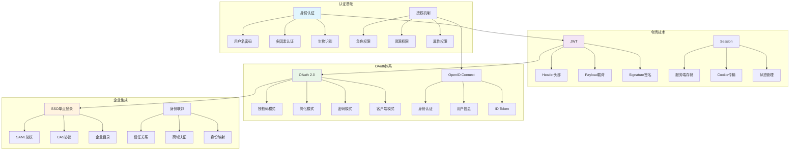

# 身份认证面试题

[← 返回后端面试题目录](./README.md)

## 📚 题目概览

身份认证和授权是现代Web应用的核心安全机制，直接关系到系统的安全性和用户体验。本章节重点考察候选人对现代认证技术的理解，包括JWT、OAuth、SSO等主流认证方案，以及在复杂业务场景中的安全设计和实现能力。

## 🎯 核心技术考察重点

### 身份认证基础
- 认证与授权的概念区别和关系
- 传统会话认证与无状态认证的对比
- 密码学基础和安全哈希算法
- 多因素认证的设计和实现

### JWT令牌机制
- JWT结构和签名验证原理
- 有状态与无状态认证的权衡
- JWT安全性考虑和最佳实践
- 令牌刷新和撤销机制

### OAuth和OpenID Connect
- OAuth 2.0授权流程和角色模型
- 不同授权类型的适用场景
- OpenID Connect身份层扩展
- 第三方登录集成和安全考虑

### 单点登录(SSO)
- SSO的实现原理和架构设计
- SAML和CAS协议的应用
- 跨域认证和信任关系建立
- 企业级身份管理集成

## 📊 知识结构关联图

## 📝 核心面试题目

### JWT令牌认证 🎫

#### 题目1：JWT认证机制设计与安全实践
**问题背景**：深入理解JWT的工作原理和在生产环境中的安全使用

**技术挑战**：
- JWT结构设计和签名算法选择
- 令牌过期和刷新机制的实现
- JWT安全漏洞的防护策略
- 分布式环境下的令牌管理

**考察要点**：
- 对JWT技术原理的深度理解
- 安全威胁识别和防护能力
- 大规模系统的令牌设计经验
- 性能和安全的平衡考虑

**📁 完整解决方案**：[JWT认证系统实现](../../solutions/common/jwt-authentication-system.md)

#### 题目2：无状态认证与有状态认证对比
**问题背景**：理解不同认证模式的特点和适用场景

**技术挑战**：
- Session和JWT的性能对比分析
- 分布式环境下的会话管理
- 认证状态的一致性保证
- 用户体验和安全性的权衡

**考察要点**：
- 认证架构的设计思维
- 分布式系统的状态管理
- 技术方案的权衡分析能力
- 业务场景的适配能力

**📁 完整解决方案**：[认证模式对比分析](../../solutions/common/authentication-patterns-comparison.md)

### OAuth授权体系 🔐

#### 题目3：OAuth 2.0授权流程深度实现
**问题背景**：掌握OAuth 2.0的完整授权流程和安全实现

**技术挑战**：
- 不同授权类型的实现和选择
- 授权码和访问令牌的安全管理
- PKCE扩展和安全增强
- 第三方应用的安全接入

**考察要点**：
- OAuth协议的深度理解
- 安全协议的实现能力
- 第三方集成的设计经验
- 安全威胁的识别和防护

**📁 完整解决方案**：[OAuth 2.0完整实现](../../solutions/common/oauth2-complete-implementation.md)

#### 题目4：OpenID Connect身份层集成
**问题背景**：实现基于OpenID Connect的身份认证和用户信息获取

**技术挑战**：
- ID Token的验证和用户信息提取
- 多个身份提供商的集成管理
- 用户身份的统一和映射
- 身份信息的安全传输和存储

**考察要点**：
- OpenID Connect协议的理解
- 身份联邦的设计能力
- 用户体验的优化考虑
- 隐私保护和合规要求

**📁 完整解决方案**：[OpenID Connect集成实现](../../solutions/common/openid-connect-integration.md)

### 单点登录(SSO) 🌐

#### 题目5：企业级SSO系统架构设计
**问题背景**：设计支持多应用的企业级单点登录系统

**技术挑战**：
- SSO协议的选择和实现策略
- 跨域认证和安全策略配置
- 用户会话的统一管理
- 应用接入的标准化流程

**考察要点**：
- 企业级系统的架构设计能力
- 安全协议的深度应用
- 系统集成的实践经验
- 用户体验和管理效率的平衡

**📁 完整解决方案**：[企业级SSO系统](../../solutions/common/enterprise-sso-system.md)

### 多因素认证(MFA) 🔒

#### 题目6：多因素认证体系设计与实现
**问题背景**：构建安全可靠的多因素认证系统

**技术挑战**：
- 多种认证因子的集成和管理
- TOTP和短信验证的实现
- 生物识别技术的应用
- 风险评估和自适应认证

**考察要点**：
- 多因素认证的技术实现
- 用户体验和安全性的平衡
- 风险评估模型的设计
- 新兴认证技术的应用

**📁 完整解决方案**：[多因素认证系统](../../solutions/common/multi-factor-authentication.md)

## 📊 面试评分标准

### 理论基础 (30分)
- **认证原理**：深入理解各种认证技术的工作原理
- **安全知识**：掌握认证安全的威胁和防护措施
- **协议标准**：熟悉相关的认证协议和标准规范

### 实践应用 (40分)
- **技术实现**：能够实现完整的认证授权系统
- **安全编码**：具备安全编码和最佳实践能力
- **问题解决**：能够分析和解决认证相关问题

### 架构设计 (30分)
- **系统设计**：能够设计大规模的认证授权架构
- **技术选型**：具备合理的技术选择和权衡能力
- **业务理解**：理解业务需求和用户体验要求

## 🎯 备考建议

### 学习路径
1. **基础概念**：深入理解认证和授权的基本概念
2. **技术原理**：学习JWT、OAuth、SSO等技术原理
3. **安全实践**：掌握认证安全的最佳实践
4. **实际项目**：通过项目实践加深理解
5. **新技术跟进**：关注认证技术的最新发展

### 技术重点
- **JWT技术**：结构、签名、安全性、刷新机制
- **OAuth 2.0**：授权流程、安全扩展、实际应用
- **SSO实现**：协议选择、架构设计、集成策略
- **多因素认证**：技术实现、用户体验、安全评估
- **安全防护**：威胁识别、防护措施、合规要求

### 实践项目建议
- 实现完整的JWT认证系统
- 开发OAuth 2.0授权服务器
- 构建企业级SSO解决方案
- 设计多因素认证系统
- 创建身份管理平台

### 学习资源
- **RFC文档**：OAuth 2.0、OpenID Connect等标准文档
- **安全指南**：OWASP认证安全指南
- **开源项目**：Spring Security、Keycloak等项目源码
- **技术博客**：认证技术的最佳实践分享
- **安全社区**：参与认证安全技术讨论

## 🔗 相关资源链接

- [Web安全面试题](./web-security.md)
- [API设计面试题](./api-design.md)
- [微服务架构面试题](./microservices.md)
- [系统设计面试题](../system-design/README.md)
- [← 返回后端面试题目录](./README.md)

---

*构建安全可靠的身份认证体系，保护用户数据和系统安全* 🔐 