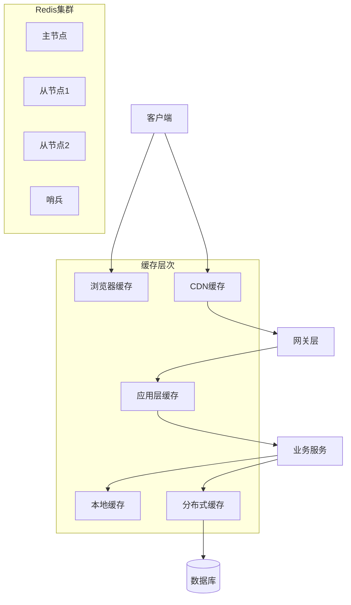
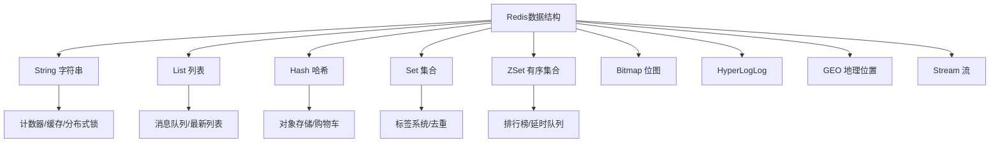

# 缓存系统面试题

## 🏷️ 标签
- 技术栈: Redis, Memcached, 本地缓存
- 难度: 中级到高级
- 类型: 原理题, 设计题, 优化题

## 📋 题目描述

本文包含缓存系统相关的面试题，涵盖缓存原理、Redis深度使用、缓存设计模式、性能优化、一致性保证等核心问题。

## 💡 核心知识点
- 缓存基础原理和策略
- Redis 数据结构和高级特性
- 缓存设计模式和最佳实践
- 缓存穿透、击穿、雪崩问题
- 分布式缓存和一致性哈希
- 缓存与数据库同步策略

## 📊 缓存架构层次



## 📝 面试题目

### 1. 缓存基础原理

#### **【中级】** 解释缓存的工作原理，对比不同缓存策略的特点和适用场景

**💡 考察要点:**
- 缓存的基本概念和价值
- 不同缓存策略的权衡
- 缓存设计的考虑因素

**📝 参考答案:**

**缓存策略对比:**

```java
// 1. Cache-Aside Pattern (旁路缓存)
@Service
public class CacheAsideService {
    
    @Autowired
    private RedisTemplate<String, Object> redisTemplate;
    
    @Autowired
    private UserRepository userRepository;
    
    // 读操作
    public User getUser(Long userId) {
        String cacheKey = "user:" + userId;
        
        // 1. 先查缓存
        User user = (User) redisTemplate.opsForValue().get(cacheKey);
        if (user != null) {
            return user; // 缓存命中
        }
        
        // 2. 缓存未命中，查数据库
        user = userRepository.findById(userId);
        if (user != null) {
            // 3. 写入缓存
            redisTemplate.opsForValue().set(cacheKey, user, Duration.ofMinutes(30));
        }
        
        return user;
    }
    
    // 写操作
    public void updateUser(User user) {
        // 1. 先更新数据库
        userRepository.save(user);
        
        // 2. 删除缓存
        String cacheKey = "user:" + user.getId();
        redisTemplate.delete(cacheKey);
    }
}

// 2. Write-Through Pattern (写透缓存)
@Service
public class WriteThroughService {
    
    @Autowired
    private RedisTemplate<String, Object> redisTemplate;
    
    @Autowired
    private UserRepository userRepository;
    
    public User getUser(Long userId) {
        String cacheKey = "user:" + userId;
        
        // 直接从缓存读取，缓存负责加载数据
        User user = (User) redisTemplate.opsForValue().get(cacheKey);
        if (user == null) {
            user = loadAndCache(userId);
        }
        
        return user;
    }
    
    public void updateUser(User user) {
        // 同时更新缓存和数据库
        userRepository.save(user);
        
        String cacheKey = "user:" + user.getId();
        redisTemplate.opsForValue().set(cacheKey, user, Duration.ofMinutes(30));
    }
    
    private User loadAndCache(Long userId) {
        User user = userRepository.findById(userId);
        if (user != null) {
            String cacheKey = "user:" + userId;
            redisTemplate.opsForValue().set(cacheKey, user, Duration.ofMinutes(30));
        }
        return user;
    }
}

// 3. Write-Behind Pattern (写回缓存)
@Service
public class WriteBehindService {
    
    @Autowired
    private RedisTemplate<String, Object> redisTemplate;
    
    @Autowired
    private UserRepository userRepository;
    
    private final Map<String, User> writeBackBuffer = new ConcurrentHashMap<>();
    private final ScheduledExecutorService scheduler = 
        Executors.newScheduledThreadPool(2);
    
    @PostConstruct
    public void init() {
        // 定期批量写回数据库
        scheduler.scheduleAtFixedRate(this::flushToDatabase, 5, 5, TimeUnit.SECONDS);
    }
    
    public User getUser(Long userId) {
        String cacheKey = "user:" + userId;
        
        // 先查缓存
        User user = (User) redisTemplate.opsForValue().get(cacheKey);
        if (user != null) {
            return user;
        }
        
        // 查数据库并缓存
        user = userRepository.findById(userId);
        if (user != null) {
            redisTemplate.opsForValue().set(cacheKey, user, Duration.ofMinutes(30));
        }
        
        return user;
    }
    
    public void updateUser(User user) {
        String cacheKey = "user:" + user.getId();
        
        // 1. 立即更新缓存
        redisTemplate.opsForValue().set(cacheKey, user, Duration.ofMinutes(30));
        
        // 2. 添加到写回缓冲区
        writeBackBuffer.put(cacheKey, user);
    }
    
    private void flushToDatabase() {
        if (!writeBackBuffer.isEmpty()) {
            // 批量写入数据库
            Map<String, User> buffer = new HashMap<>(writeBackBuffer);
            writeBackBuffer.clear();
            
            List<User> users = new ArrayList<>(buffer.values());
            userRepository.saveAll(users);
            
            System.out.println("批量写入数据库: " + users.size() + " 条记录");
        }
    }
}

// 4. Read-Through Pattern (读透缓存)
@Component
public class ReadThroughCache {
    
    @Autowired
    private RedisTemplate<String, Object> redisTemplate;
    
    @Autowired
    private UserRepository userRepository;
    
    public User getUser(Long userId) {
        String cacheKey = "user:" + userId;
        
        return (User) redisTemplate.execute((RedisCallback<Object>) connection -> {
            // 使用 Redis Lua 脚本实现读透逻辑
            String luaScript = 
                "local value = redis.call('GET', KEYS[1]) " +
                "if value then " +
                "   return value " +
                "else " +
                "   -- 此处需要调用外部数据源加载数据 " +
                "   return nil " +
                "end";
            
            Object result = connection.eval(
                luaScript.getBytes(), 
                ReturnType.VALUE, 
                1, 
                cacheKey.getBytes()
            );
            
            if (result == null) {
                // 缓存未命中，加载数据
                User user = userRepository.findById(userId);
                if (user != null) {
                    redisTemplate.opsForValue().set(cacheKey, user, Duration.ofMinutes(30));
                }
                return user;
            }
            
            return result;
        });
    }
}
```

**缓存策略对比分析:**

| 策略 | 优点 | 缺点 | 适用场景 |
|------|------|------|----------|
| **Cache-Aside** | 简单灵活<br/>应用控制逻辑 | 需要手动管理<br/>可能数据不一致 | 大多数应用场景 |
| **Write-Through** | 数据一致性好<br/>缓存管理透明 | 写入延迟高<br/>复杂度较高 | 强一致性要求 |
| **Write-Behind** | 写入性能高<br/>批量优化 | 数据可能丢失<br/>复杂度最高 | 高写入压力场景 |
| **Read-Through** | 读取透明<br/>缓存自管理 | 实现复杂<br/>首次加载慢 | 读密集型应用 |

---

### 2. Redis 深度应用

#### **【高级】** 详细说明 Redis 的数据结构，以及在实际项目中的高级应用

**💡 考察要点:**
- Redis 数据结构的内部实现
- 高级特性的实际应用
- 性能优化技巧



**📝 参考答案:**

**Redis 数据结构实战应用:**

```java
// 1. String 类型高级应用
@Service
public class RedisStringService {
    
    @Autowired
    private RedisTemplate<String, String> redisTemplate;
    
    // 分布式计数器
    public Long incrementCounter(String counterKey) {
        return redisTemplate.opsForValue().increment(counterKey);
    }
    
    // 分布式锁实现
    public boolean acquireLock(String lockKey, String lockValue, Duration expiration) {
        Boolean result = redisTemplate.opsForValue()
            .setIfAbsent(lockKey, lockValue, expiration);
        return Boolean.TRUE.equals(result);
    }
    
    public boolean releaseLock(String lockKey, String lockValue) {
        String luaScript = 
            "if redis.call('GET', KEYS[1]) == ARGV[1] then " +
            "   return redis.call('DEL', KEYS[1]) " +
            "else " +
            "   return 0 " +
            "end";
        
        Long result = redisTemplate.execute(
            (RedisCallback<Long>) connection -> 
                connection.eval(
                    luaScript.getBytes(),
                    ReturnType.INTEGER,
                    1,
                    lockKey.getBytes(),
                    lockValue.getBytes()
                )
        );
        
        return result != null && result == 1L;
    }
    
    // 限流器实现
    public boolean isAllowed(String key, int maxRequests, Duration window) {
        String luaScript = 
            "local current = redis.call('GET', KEYS[1]) " +
            "if current == false then " +
            "   redis.call('SET', KEYS[1], 1) " +
            "   redis.call('EXPIRE', KEYS[1], ARGV[1]) " +
            "   return 1 " +
            "else " +
            "   if tonumber(current) < tonumber(ARGV[2]) then " +
            "       return redis.call('INCR', KEYS[1]) " +
            "   else " +
            "       return 0 " +
            "   end " +
            "end";
        
        Long result = redisTemplate.execute(
            (RedisCallback<Long>) connection ->
                connection.eval(
                    luaScript.getBytes(),
                    ReturnType.INTEGER,
                    1,
                    key.getBytes(),
                    String.valueOf(window.getSeconds()).getBytes(),
                    String.valueOf(maxRequests).getBytes()
                )
        );
        
        return result != null && result > 0;
    }
}

// 2. Hash 类型应用 - 购物车实现
@Service
public class ShoppingCartService {
    
    @Autowired
    private RedisTemplate<String, Object> redisTemplate;
    
    private static final String CART_KEY_PREFIX = "cart:";
    
    // 添加商品到购物车
    public void addToCart(String userId, String productId, int quantity) {
        String cartKey = CART_KEY_PREFIX + userId;
        redisTemplate.opsForHash().put(cartKey, productId, quantity);
        
        // 设置过期时间 (30天)
        redisTemplate.expire(cartKey, Duration.ofDays(30));
    }
    
    // 更新商品数量
    public void updateQuantity(String userId, String productId, int quantity) {
        String cartKey = CART_KEY_PREFIX + userId;
        if (quantity <= 0) {
            redisTemplate.opsForHash().delete(cartKey, productId);
        } else {
            redisTemplate.opsForHash().put(cartKey, productId, quantity);
        }
    }
    
    // 获取购物车
    public Map<Object, Object> getCart(String userId) {
        String cartKey = CART_KEY_PREFIX + userId;
        return redisTemplate.opsForHash().entries(cartKey);
    }
    
    // 清空购物车
    public void clearCart(String userId) {
        String cartKey = CART_KEY_PREFIX + userId;
        redisTemplate.delete(cartKey);
    }
    
    // 获取购物车商品数量
    public Long getCartSize(String userId) {
        String cartKey = CART_KEY_PREFIX + userId;
        return redisTemplate.opsForHash().size(cartKey);
    }
}

// 3. ZSet 类型应用 - 排行榜和延时队列
@Service
public class RedisZSetService {
    
    @Autowired
    private RedisTemplate<String, String> redisTemplate;
    
    // 排行榜实现
    public void updateScore(String leaderboard, String player, double score) {
        redisTemplate.opsForZSet().add(leaderboard, player, score);
    }
    
    // 获取排行榜前N名
    public Set<ZSetOperations.TypedTuple<String>> getTopN(String leaderboard, int n) {
        return redisTemplate.opsForZSet().reverseRangeWithScores(leaderboard, 0, n - 1);
    }
    
    // 获取玩家排名
    public Long getPlayerRank(String leaderboard, String player) {
        return redisTemplate.opsForZSet().reverseRank(leaderboard, player);
    }
    
    // 延时队列实现
    public void addDelayedTask(String queueKey, String taskId, long delaySeconds) {
        long executeTime = System.currentTimeMillis() + delaySeconds * 1000;
        redisTemplate.opsForZSet().add(queueKey, taskId, executeTime);
    }
    
    // 获取到期任务
    public Set<String> getExpiredTasks(String queueKey) {
        long currentTime = System.currentTimeMillis();
        return redisTemplate.opsForZSet()
            .rangeByScore(queueKey, 0, currentTime);
    }
    
    // 移除已处理的任务
    public void removeTask(String queueKey, String taskId) {
        redisTemplate.opsForZSet().remove(queueKey, taskId);
    }
}

// 4. List 类型应用 - 消息队列
@Service
public class RedisListService {
    
    @Autowired
    private RedisTemplate<String, String> redisTemplate;
    
    // 生产者发送消息
    public void sendMessage(String queueKey, String message) {
        redisTemplate.opsForList().leftPush(queueKey, message);
    }
    
    // 消费者接收消息 (阻塞式)
    public String receiveMessage(String queueKey, Duration timeout) {
        return redisTemplate.opsForList()
            .rightPop(queueKey, timeout);
    }
    
    // 获取队列长度
    public Long getQueueSize(String queueKey) {
        return redisTemplate.opsForList().size(queueKey);
    }
    
    // 可靠消息队列实现
    public String reliableReceive(String queueKey, String processingKey) {
        // 原子地从队列移动到处理列表
        return redisTemplate.opsForList()
            .rightPopAndLeftPush(queueKey, processingKey);
    }
    
    // 确认消息处理完成
    public void ackMessage(String processingKey, String message) {
        redisTemplate.opsForList().remove(processingKey, 1, message);
    }
}

// 5. Set 类型应用 - 标签系统
@Service
public class TagService {
    
    @Autowired
    private RedisTemplate<String, String> redisTemplate;
    
    private static final String USER_TAGS_PREFIX = "user:tags:";
    private static final String TAG_USERS_PREFIX = "tag:users:";
    
    // 给用户添加标签
    public void addUserTag(String userId, String tag) {
        String userTagsKey = USER_TAGS_PREFIX + userId;
        String tagUsersKey = TAG_USERS_PREFIX + tag;
        
        redisTemplate.opsForSet().add(userTagsKey, tag);
        redisTemplate.opsForSet().add(tagUsersKey, userId);
    }
    
    // 移除用户标签
    public void removeUserTag(String userId, String tag) {
        String userTagsKey = USER_TAGS_PREFIX + userId;
        String tagUsersKey = TAG_USERS_PREFIX + tag;
        
        redisTemplate.opsForSet().remove(userTagsKey, tag);
        redisTemplate.opsForSet().remove(tagUsersKey, userId);
    }
    
    // 获取用户的所有标签
    public Set<String> getUserTags(String userId) {
        String userTagsKey = USER_TAGS_PREFIX + userId;
        return redisTemplate.opsForSet().members(userTagsKey);
    }
    
    // 获取拥有某标签的所有用户
    public Set<String> getTagUsers(String tag) {
        String tagUsersKey = TAG_USERS_PREFIX + tag;
        return redisTemplate.opsForSet().members(tagUsersKey);
    }
    
    // 获取两个用户的共同标签
    public Set<String> getCommonTags(String userId1, String userId2) {
        String userTags1 = USER_TAGS_PREFIX + userId1;
        String userTags2 = USER_TAGS_PREFIX + userId2;
        
        return redisTemplate.opsForSet().intersect(userTags1, userTags2);
    }
    
    // 推荐相似用户 (基于标签相似度)
    public Set<String> recommendSimilarUsers(String userId, int limit) {
        String userTagsKey = USER_TAGS_PREFIX + userId;
        Set<String> userTags = redisTemplate.opsForSet().members(userTagsKey);
        
        Map<String, Integer> similarityScore = new HashMap<>();
        
        for (String tag : userTags) {
            String tagUsersKey = TAG_USERS_PREFIX + tag;
            Set<String> tagUsers = redisTemplate.opsForSet().members(tagUsersKey);
            
            for (String user : tagUsers) {
                if (!user.equals(userId)) {
                    similarityScore.merge(user, 1, Integer::sum);
                }
            }
        }
        
        return similarityScore.entrySet().stream()
            .sorted(Map.Entry.<String, Integer>comparingByValue().reversed())
            .limit(limit)
            .map(Map.Entry::getKey)
            .collect(Collectors.toSet());
    }
}

// 6. HyperLogLog 应用 - 统计UV
@Service
public class UVStatService {
    
    @Autowired
    private RedisTemplate<String, String> redisTemplate;
    
    // 记录用户访问
    public void recordVisit(String date, String userId) {
        String key = "uv:" + date;
        redisTemplate.opsForHyperLogLog().add(key, userId);
        
        // 设置过期时间
        redisTemplate.expire(key, Duration.ofDays(7));
    }
    
    // 获取UV数量
    public Long getUV(String date) {
        String key = "uv:" + date;
        return redisTemplate.opsForHyperLogLog().size(key);
    }
    
    // 获取多天UV总数
    public Long getUVRange(String startDate, String endDate) {
        List<String> keys = getDateRange(startDate, endDate).stream()
            .map(date -> "uv:" + date)
            .collect(Collectors.toList());
        
        String unionKey = "uv:union:" + startDate + ":" + endDate;
        redisTemplate.opsForHyperLogLog().union(unionKey, keys.toArray(new String[0]));
        
        Long result = redisTemplate.opsForHyperLogLog().size(unionKey);
        
        // 删除临时联合key
        redisTemplate.delete(unionKey);
        
        return result;
    }
    
    private List<String> getDateRange(String startDate, String endDate) {
        // 实现日期范围生成逻辑
        return Arrays.asList(startDate, endDate); // 简化实现
    }
}
```

---

### 3. 缓存问题解决方案

#### **【高级】** 如何解决缓存穿透、缓存击穿、缓存雪崩问题？

**💡 考察要点:**
- 三大缓存问题的本质理解
- 多种解决方案的对比
- 实际项目中的最佳实践

**📝 参考答案:**

**缓存问题分析和解决:**

```java
// 1. 缓存穿透解决方案
@Service
public class CachePenetrationService {
    
    @Autowired
    private RedisTemplate<String, Object> redisTemplate;
    
    @Autowired
    private UserRepository userRepository;
    
    // 使用布隆过滤器预防缓存穿透
    private final BloomFilter<String> bloomFilter = BloomFilter.create(
        Funnels.stringFunnel(Charset.defaultCharset()),
        100000000, // 预期元素数量
        0.01       // 误判率
    );
    
    @PostConstruct
    public void initBloomFilter() {
        // 预加载所有有效的key到布隆过滤器
        List<Long> allUserIds = userRepository.findAllUserIds();
        for (Long userId : allUserIds) {
            bloomFilter.put("user:" + userId);
        }
    }
    
    public User getUserWithBloomFilter(Long userId) {
        String cacheKey = "user:" + userId;
        
        // 1. 布隆过滤器检查
        if (!bloomFilter.mightContain(cacheKey)) {
            return null; // 肯定不存在
        }
        
        // 2. 查询缓存
        User user = (User) redisTemplate.opsForValue().get(cacheKey);
        if (user != null) {
            return user;
        }
        
        // 3. 查询数据库
        user = userRepository.findById(userId);
        if (user != null) {
            // 4. 存入缓存
            redisTemplate.opsForValue().set(cacheKey, user, Duration.ofMinutes(30));
        } else {
            // 5. 缓存空对象，防止穿透
            redisTemplate.opsForValue().set(cacheKey, new NullUser(), Duration.ofMinutes(5));
        }
        
        return user;
    }
    
    // 缓存空对象方法
    public User getUserWithNullCache(Long userId) {
        String cacheKey = "user:" + userId;
        
        Object cached = redisTemplate.opsForValue().get(cacheKey);
        if (cached != null) {
            if (cached instanceof NullUser) {
                return null; // 空对象缓存
            }
            return (User) cached;
        }
        
        User user = userRepository.findById(userId);
        if (user != null) {
            redisTemplate.opsForValue().set(cacheKey, user, Duration.ofMinutes(30));
        } else {
            // 缓存空对象
            redisTemplate.opsForValue().set(cacheKey, new NullUser(), Duration.ofMinutes(5));
        }
        
        return user;
    }
    
    // 空对象标记类
    private static class NullUser {
        // 空标记对象
    }
}

// 2. 缓存击穿解决方案
@Service
public class CacheBreakdownService {
    
    @Autowired
    private RedisTemplate<String, Object> redisTemplate;
    
    @Autowired
    private UserRepository userRepository;
    
    // 使用本地锁防止击穿
    private final Map<String, ReentrantLock> lockMap = new ConcurrentHashMap<>();
    
    public User getUserWithLocalLock(Long userId) {
        String cacheKey = "user:" + userId;
        
        // 1. 查询缓存
        User user = (User) redisTemplate.opsForValue().get(cacheKey);
        if (user != null) {
            return user;
        }
        
        // 2. 获取锁
        ReentrantLock lock = lockMap.computeIfAbsent(cacheKey, k -> new ReentrantLock());
        
        try {
            lock.lock();
            
            // 3. 双重检查
            user = (User) redisTemplate.opsForValue().get(cacheKey);
            if (user != null) {
                return user;
            }
            
            // 4. 查询数据库
            user = userRepository.findById(userId);
            if (user != null) {
                // 5. 随机过期时间，防止同时失效
                int randomExpire = 30 + new Random().nextInt(10);
                redisTemplate.opsForValue().set(cacheKey, user, Duration.ofMinutes(randomExpire));
            }
            
            return user;
            
        } finally {
            lock.unlock();
            // 清理锁对象，防止内存泄漏
            if (lock.getQueueLength() == 0) {
                lockMap.remove(cacheKey);
            }
        }
    }
    
    // 使用分布式锁防止击穿
    public User getUserWithDistributedLock(Long userId) {
        String cacheKey = "user:" + userId;
        String lockKey = "lock:" + cacheKey;
        String lockValue = UUID.randomUUID().toString();
        
        // 1. 查询缓存
        User user = (User) redisTemplate.opsForValue().get(cacheKey);
        if (user != null) {
            return user;
        }
        
        // 2. 尝试获取分布式锁
        boolean locked = false;
        try {
            locked = redisTemplate.opsForValue()
                .setIfAbsent(lockKey, lockValue, Duration.ofSeconds(10));
            
            if (locked) {
                // 3. 获取锁成功，查询数据库
                user = userRepository.findById(userId);
                if (user != null) {
                    redisTemplate.opsForValue().set(cacheKey, user, Duration.ofMinutes(30));
                }
            } else {
                // 4. 获取锁失败，等待并重试
                Thread.sleep(100);
                return getUserWithDistributedLock(userId); // 递归重试
            }
            
        } catch (InterruptedException e) {
            Thread.currentThread().interrupt();
        } finally {
            // 5. 释放锁
            if (locked) {
                releaseLock(lockKey, lockValue);
            }
        }
        
        return user;
    }
    
    // 使用逻辑过期防止击穿
    public User getUserWithLogicalExpire(Long userId) {
        String cacheKey = "user:" + userId;
        
        // 1. 查询缓存
        CacheData<User> cacheData = (CacheData<User>) redisTemplate.opsForValue().get(cacheKey);
        
        if (cacheData == null) {
            // 2. 缓存未命中，直接返回空
            return null;
        }
        
        // 3. 检查逻辑过期
        if (cacheData.getExpireTime().isAfter(LocalDateTime.now())) {
            // 未过期，返回数据
            return cacheData.getData();
        }
        
        // 4. 逻辑过期，异步刷新
        CompletableFuture.runAsync(() -> {
            String lockKey = "refresh:" + cacheKey;
            String lockValue = UUID.randomUUID().toString();
            
            if (redisTemplate.opsForValue().setIfAbsent(lockKey, lockValue, Duration.ofSeconds(10))) {
                try {
                    // 获取锁成功，刷新缓存
                    User user = userRepository.findById(userId);
                    if (user != null) {
                        CacheData<User> newCacheData = new CacheData<>(
                            user, 
                            LocalDateTime.now().plusMinutes(30)
                        );
                        redisTemplate.opsForValue().set(cacheKey, newCacheData);
                    }
                } finally {
                    releaseLock(lockKey, lockValue);
                }
            }
        });
        
        // 5. 返回过期数据 (逻辑过期策略)
        return cacheData.getData();
    }
    
    // 缓存数据包装类
    private static class CacheData<T> {
        private T data;
        private LocalDateTime expireTime;
        
        public CacheData(T data, LocalDateTime expireTime) {
            this.data = data;
            this.expireTime = expireTime;
        }
        
        // getter/setter 方法
        public T getData() { return data; }
        public LocalDateTime getExpireTime() { return expireTime; }
    }
    
    private void releaseLock(String lockKey, String lockValue) {
        String luaScript = 
            "if redis.call('GET', KEYS[1]) == ARGV[1] then " +
            "   return redis.call('DEL', KEYS[1]) " +
            "else " +
            "   return 0 " +
            "end";
        
        redisTemplate.execute((RedisCallback<Long>) connection ->
            connection.eval(
                luaScript.getBytes(),
                ReturnType.INTEGER,
                1,
                lockKey.getBytes(),
                lockValue.getBytes()
            )
        );
    }
}

// 3. 缓存雪崩解决方案
@Service
public class CacheAvalancheService {
    
    @Autowired
    private RedisTemplate<String, Object> redisTemplate;
    
    @Autowired
    private UserRepository userRepository;
    
    // 服务降级组件
    private final CircuitBreaker circuitBreaker = CircuitBreaker.ofDefaults("userService");
    
    // 随机过期时间防雪崩
    public void cacheUserWithRandomExpire(User user) {
        String cacheKey = "user:" + user.getId();
        
        // 基础过期时间 + 随机时间
        int baseExpire = 30; // 30分钟
        int randomExpire = new Random().nextInt(10); // 0-10分钟随机
        
        redisTemplate.opsForValue().set(
            cacheKey, 
            user, 
            Duration.ofMinutes(baseExpire + randomExpire)
        );
    }
    
    // 多级缓存防雪崩
    @Autowired
    private CaffeineCache localCache; // 本地缓存
    
    public User getUserWithMultiLevelCache(Long userId) {
        String cacheKey = "user:" + userId;
        
        // 1. L1 缓存 (本地缓存)
        User user = localCache.get(cacheKey, User.class);
        if (user != null) {
            return user;
        }
        
        // 2. L2 缓存 (分布式缓存)
        user = (User) redisTemplate.opsForValue().get(cacheKey);
        if (user != null) {
            // 更新本地缓存
            localCache.put(cacheKey, user, Duration.ofMinutes(5));
            return user;
        }
        
        // 3. 数据库查询 (带熔断器)
        user = circuitBreaker.executeSupplier(() -> {
            User dbUser = userRepository.findById(userId);
            if (dbUser != null) {
                // 更新两级缓存
                cacheUserWithRandomExpire(dbUser);
                localCache.put(cacheKey, dbUser, Duration.ofMinutes(5));
            }
            return dbUser;
        });
        
        return user;
    }
    
    // 预热缓存防雪崩
    @EventListener(ApplicationReadyEvent.class)
    public void warmUpCache() {
        System.out.println("开始预热缓存...");
        
        // 异步预热热点数据
        CompletableFuture.runAsync(() -> {
            List<User> hotUsers = userRepository.findHotUsers(1000);
            
            for (User user : hotUsers) {
                cacheUserWithRandomExpire(user);
                
                // 避免对数据库造成压力
                try {
                    Thread.sleep(10);
                } catch (InterruptedException e) {
                    Thread.currentThread().interrupt();
                    break;
                }
            }
            
            System.out.println("缓存预热完成，预热数据: " + hotUsers.size() + " 条");
        });
    }
    
    // 降级策略
    public User getUserWithFallback(Long userId) {
        return circuitBreaker.executeSupplier(() -> {
            return getUserWithMultiLevelCache(userId);
        }).recover(throwable -> {
            // 降级逻辑：返回基础用户信息
            System.err.println("缓存服务异常，执行降级: " + throwable.getMessage());
            return createFallbackUser(userId);
        });
    }
    
    private User createFallbackUser(Long userId) {
        User fallbackUser = new User();
        fallbackUser.setId(userId);
        fallbackUser.setUsername("Unknown User");
        fallbackUser.setEmail("unknown@example.com");
        return fallbackUser;
    }
}
```

**缓存问题总结:**

| 问题 | 产生原因 | 解决方案 | 适用场景 |
|------|----------|----------|----------|
| **缓存穿透** | 查询不存在的数据 | 布隆过滤器<br/>缓存空对象 | 防止恶意攻击 |
| **缓存击穿** | 热点数据过期 | 分布式锁<br/>逻辑过期 | 高并发热点数据 |
| **缓存雪崩** | 大量缓存同时失效 | 随机过期<br/>多级缓存<br/>熔断降级 | 系统高可用保障 |

---

## 🎯 面试技巧建议

### 缓存系统回答策略
1. **场景分析**: 结合具体业务场景讨论
2. **方案对比**: 分析不同方案的优缺点
3. **实践经验**: 分享项目中的实际应用
4. **性能数据**: 提供具体的性能改进数据

### 常见追问问题
- "Redis 和 Memcached 有什么区别？"
- "如何保证缓存和数据库的一致性？"
- "Redis 集群如何实现？"
- "缓存的淘汰策略有哪些？"

## 🔗 相关链接

- [← 返回后端目录](./README.md)
- [数据库系统](./database-systems.md)
- [性能优化](./performance-optimization.md)
- [分布式系统](./distributed-systems.md)

---

*缓存是提升系统性能的利器，但需要谨慎处理一致性和可靠性问题* ⚡ 