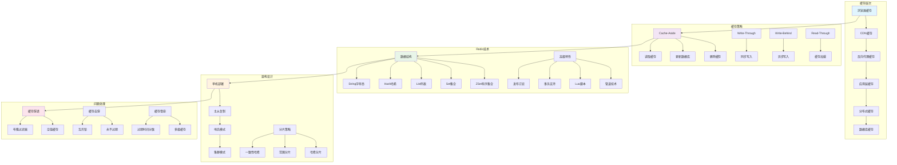

# 缓存系统面试题

[← 返回后端面试题目录](./README.md)

## 📚 题目概览

缓存系统是现代高性能应用的核心组件，直接影响系统的响应速度、并发能力和用户体验。本章节重点考察候选人对缓存技术的深度理解，包括缓存原理、Redis应用、缓存设计模式、一致性保证等核心问题，以及在大规模分布式系统中的实际应用能力。

## 🎯 核心技术考察重点

### 缓存基础理论
- 缓存的基本原理和价值分析
- 不同缓存策略的特点和适用场景
- 缓存命中率优化和性能调优
- 缓存层次设计和架构规划

### Redis深度应用
- Redis数据结构的高级应用
- Redis持久化机制和数据安全
- Redis集群架构和高可用设计
- Redis性能优化和监控策略

### 缓存设计模式
- Cache-Aside、Write-Through等模式对比
- 缓存更新策略和一致性保证
- 分布式缓存的设计和实现
- 缓存预热和数据迁移策略

### 缓存问题解决
- 缓存穿透、击穿、雪崩的识别和防护
- 热点数据处理和负载均衡
- 缓存监控和故障恢复机制
- 缓存安全和数据保护

## 📊 知识结构关联图

## 📝 核心面试题目

### 缓存基础与策略 [中级]

#### 题目1：缓存策略深度对比与选择
**问题背景**：理解不同缓存策略的实现原理和在复杂业务场景中的选择

**技术挑战**：
- Cache-Aside、Write-Through、Write-Behind模式的权衡
- 缓存一致性与性能的平衡考虑
- 不同业务场景下的缓存策略选择
- 缓存失效和更新机制的设计

**考察要点**：
- 缓存理论的深度理解
- 系统架构设计的实践能力
- 业务场景分析和技术方案匹配
- 性能优化和一致性保证的权衡

**📁 完整解决方案**：[缓存策略深度实现](../../solutions/common/caching-strategies-implementation.md)

#### 题目2：多级缓存架构设计与优化
**问题背景**：设计高性能的多级缓存系统，实现最优的缓存命中率

**技术挑战**：
- 多级缓存的层次设计和数据流转
- 缓存预热和数据同步策略
- 缓存容量规划和淘汰算法选择
- 缓存监控和性能调优机制

**考察要点**：
- 系统架构的整体设计能力
- 缓存性能优化的实践经验
- 大规模系统的容量规划能力
- 运维监控和问题排查经验

**📁 完整解决方案**：[多级缓存架构设计](../../solutions/common/multi-level-cache-architecture.md)

### Redis技术深度应用 [高级]

#### 题目3：Redis数据结构高级应用与性能优化
**问题背景**：深入理解Redis各种数据结构的特点和在复杂场景中的应用

**技术挑战**：
- 不同数据结构的内存占用和性能特点
- 复杂业务场景的数据结构选择策略
- Redis内存优化和数据压缩技术
- 大key和热key问题的识别和解决

**考察要点**：
- Redis底层实现的深度理解
- 数据结构选择的技术判断能力
- 性能优化和内存管理经验
- 生产环境问题的分析和解决能力

**📁 完整解决方案**：[Redis数据结构优化](../../solutions/common/redis-data-structures-optimization.md)

#### 题目4：Redis集群架构与高可用设计
**问题背景**：设计高可用、高性能的Redis集群架构

**技术挑战**：
- 主从复制、哨兵模式、集群模式的选择
- 数据分片策略和一致性哈希算法
- 故障检测和自动故障转移机制
- 集群扩容和数据迁移策略

**考察要点**：
- 分布式系统的架构设计能力
- 高可用系统的实现经验
- 数据一致性和分区容错的理解
- 运维自动化和监控告警设计

**📁 完整解决方案**：[Redis集群高可用架构](../../solutions/common/redis-cluster-high-availability.md)

### 缓存问题与解决方案 [高级]

#### 题目5：缓存穿透、击穿、雪崩综合防护
**问题背景**：识别和解决缓存系统中的经典问题，保障系统稳定性

**技术挑战**：
- 缓存穿透的多种防护策略和选择
- 缓存击穿的预防和实时处理机制
- 缓存雪崩的系统性防护方案
- 监控告警和自动恢复机制

**考察要点**：
- 缓存问题的深度理解和识别能力
- 系统稳定性保障的实践经验
- 监控体系和应急响应能力
- 预防性设计和容错机制构建

**📁 完整解决方案**：[缓存问题综合防护](../../solutions/common/cache-problems-comprehensive-protection.md)

#### 题目6：分布式缓存一致性保证
**问题背景**：在分布式环境下保证缓存与数据库的一致性

**技术挑战**：
- 分布式环境下的数据一致性挑战
- 最终一致性和强一致性的权衡选择
- 分布式锁和事务的应用场景
- 数据同步和冲突解决机制

**考察要点**：
- 分布式系统理论的深度理解
- 一致性协议和算法的应用能力
- 复杂场景下的技术方案设计
- 系统可靠性和性能的平衡

**📁 完整解决方案**：[分布式缓存一致性](../../solutions/common/distributed-cache-consistency.md)

### 缓存性能优化 [中级]

#### 题目7：缓存命中率优化和热点数据处理
**问题背景**：提升缓存系统的命中率和处理热点数据的性能问题

**技术挑战**：
- 缓存命中率的监控和分析方法
- 热点数据的识别和处理策略
- 缓存预加载和智能预测机制
- 负载均衡和数据分散技术

**考察要点**：
- 性能分析和优化的实践能力
- 数据分布和负载均衡的理解
- 监控体系和数据分析能力
- 预测算法和智能优化技术

**📁 完整解决方案**：[缓存性能优化实践](../../solutions/common/cache-performance-optimization.md)

#### 题目8：缓存容量规划和成本优化
**问题背景**：进行合理的缓存容量规划和成本控制

**技术挑战**：
- 缓存容量需求的评估和预测
- 内存使用优化和数据压缩技术
- 成本效益分析和资源配置优化
- 动态扩缩容和弹性伸缩机制

**考察要点**：
- 容量规划和资源管理能力
- 成本控制和效益分析思维
- 系统架构的可扩展性设计
- 运维自动化和智能化水平

**📁 完整解决方案**：[缓存容量规划与成本优化](../../solutions/common/cache-capacity-planning.md)

### 缓存监控与运维 [中级]

#### 题目9：缓存监控体系和告警机制设计
**问题背景**：建立完善的缓存监控体系和智能告警机制

**技术挑战**：
- 关键指标的选择和监控策略
- 告警阈值的设置和动态调整
- 监控数据的收集和分析处理
- 故障预测和自动化处理机制

**考察要点**：
- 监控体系的设计和实施能力
- 数据分析和异常检测技术
- 运维自动化和智能化水平
- 故障处理和应急响应能力

**📁 完整解决方案**：[缓存监控告警体系](../../solutions/common/cache-monitoring-alerting.md)

#### 题目10：缓存数据备份和灾难恢复
**问题背景**：设计缓存数据的备份策略和灾难恢复方案

**技术挑战**：
- 数据备份策略和恢复时间目标
- 跨地域备份和多活架构设计
- 数据一致性验证和完整性检查
- 灾难恢复演练和应急预案

**考察要点**：
- 数据安全和灾备设计能力
- 高可用架构的实践经验
- 风险评估和应急处理能力
- 业务连续性保障的意识

**📁 完整解决方案**：[缓存数据备份与灾难恢复](../../solutions/common/cache-backup-disaster-recovery.md)

## 📊 面试评分标准

### 基础知识 (30分)
- 缓存基础理论和原理的理解
- Redis等缓存技术的掌握程度
- 常见缓存问题的识别和解决

### 技术深度 (40分)
- 缓存架构设计的系统性思考
- 复杂场景下的技术方案设计
- 性能优化和问题排查能力

### 实践能力 (30分)
- 生产环境缓存系统的运维经验
- 缓存相关问题的处理和优化
- 监控体系和自动化运维能力

## 🎯 备考建议

### 理论学习路径
1. **缓存基础**：理解缓存原理、策略和设计模式
2. **Redis掌握**：深入学习Redis的数据结构和高级特性
3. **架构设计**：学习分布式缓存的架构设计和实现
4. **问题解决**：掌握常见缓存问题的分析和解决方法

### 实践项目建议
1. **缓存系统搭建**：从零搭建Redis集群和监控体系
2. **性能优化项目**：进行缓存命中率和性能的优化实践
3. **问题模拟**：模拟缓存穿透、击穿等问题并实现解决方案
4. **架构设计**：设计支持高并发的多级缓存架构

## 🔗 相关资源链接

- [Redis官方文档](https://redis.io/documentation)
- [分布式系统设计](./distributed-systems.md)
- [性能优化面试题](./performance-optimization.md)
- [数据库设计面试题](../database/README.md)

---

*构建高性能的缓存系统，提升应用响应速度和用户体验* 🚀 