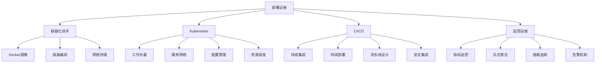

# 部署运维面试题

[← 返回后端面试题目录](./README.md)

## 📚 题目概览

部署运维面试题涵盖容器化技术、Kubernetes编排、CI/CD流水线、监控运维等现代DevOps核心技术栈。重点考察候选人对云原生架构的理解、自动化运维能力，以及在大规模生产环境中的实践经验。

## 🎯 核心技术考察重点

### 容器化技术
- **Docker核心概念**：镜像、容器、仓库的工作原理
- **镜像优化**：多阶段构建、层缓存、安全基线
- **容器编排**：Docker Compose的服务定义和依赖管理
- **网络与存储**：容器网络模型和数据持久化策略

### Kubernetes生态
- **核心组件**：Pod、Service、Deployment的设计原理
- **配置管理**：ConfigMap、Secret的最佳实践
- **服务发现**：Ingress、Service Mesh的应用场景
- **资源调度**：节点选择、资源限制、HPA自动扩缩容

### CI/CD流水线
- **持续集成**：代码质量检查、自动化测试策略
- **持续部署**：蓝绿部署、滚动更新、金丝雀发布
- **流水线设计**：阶段划分、并行执行、失败回滚
- **安全集成**：代码扫描、镜像安全、权限管理

### 监控运维体系
- **指标监控**：Prometheus、Grafana的架构设计
- **日志聚合**：ELK/EFK栈的部署和优化
- **链路追踪**：分布式追踪系统的实现原理
- **告警机制**：告警规则设计、通知渠道、降噪策略

## 📊 知识结构关联图

## 📝 核心面试题目

### 容器化技术 ⭐⭐

#### 题目1：Docker镜像优化和多阶段构建策略
**问题背景**：如何构建轻量级、安全的Docker镜像？

**技术挑战**：
- 如何减小镜像体积和层数
- 多阶段构建的最佳实践
- 基础镜像的选择和安全考虑

**考察要点**：
- 理解Docker镜像的分层结构
- 掌握镜像构建优化技巧
- 了解容器安全的基本原则

**📁 完整解决方案**：[Docker镜像优化完整实现](../../solutions/common/docker-image-optimization.md)

#### 题目2：容器编排和服务依赖管理
**问题背景**：如何使用Docker Compose管理复杂的多服务应用？

**技术挑战**：
- 服务间依赖关系的定义
- 网络和存储的配置策略
- 环境变量和配置文件管理

**考察要点**：
- 掌握Docker Compose的核心概念
- 理解容器网络和数据卷
- 能够设计可扩展的服务架构

**📁 完整解决方案**：[容器编排架构完整实现](../../solutions/common/container-orchestration.md)

### Kubernetes生态 ⭐⭐⭐

#### 题目3：Kubernetes核心组件和工作原理
**问题背景**：K8s如何实现容器的自动化编排和管理？

**技术挑战**：
- Pod、Service、Deployment的关系
- 控制器模式的工作机制
- 服务发现和负载均衡原理

**考察要点**：
- 深入理解K8s的架构设计
- 掌握核心资源对象的使用
- 理解声明式API的优势

**📁 完整解决方案**：[Kubernetes核心架构完整实现](../../solutions/common/kubernetes-core-architecture.md)

#### 题目4：K8s配置管理和安全策略
**问题背景**：如何在K8s中安全地管理应用配置和敏感信息？

**技术挑战**：
- ConfigMap和Secret的使用场景
- RBAC权限控制机制
- 网络策略和Pod安全策略

**考察要点**：
- 掌握K8s的配置管理最佳实践
- 理解K8s的安全模型
- 能够设计安全的部署策略

**📁 完整解决方案**：[K8s配置安全管理完整实现](../../solutions/common/k8s-config-security.md)

### CI/CD流水线 ⭐⭐⭐

#### 题目5：CI/CD流水线设计和实现
**问题背景**：如何设计高效、可靠的持续集成和部署流水线？

**技术挑战**：
- 流水线阶段的合理划分
- 并行构建和测试策略
- 部署策略的选择和实现

**考察要点**：
- 理解CI/CD的核心理念
- 掌握流水线设计的最佳实践
- 了解不同部署策略的适用场景

**📁 完整解决方案**：[CI/CD流水线完整实现](../../solutions/common/cicd-pipeline-design.md)

### 监控运维体系 ⭐⭐⭐

#### 题目6：生产环境监控和告警体系
**问题背景**：如何构建完整的监控告警体系保障服务稳定性？

**技术挑战**：
- 监控指标的选择和采集
- 告警规则的设计和优化
- 日志聚合和分析策略

**考察要点**：
- 理解可观测性的三大支柱
- 掌握监控系统的架构设计
- 能够设计有效的告警策略

**📁 完整解决方案**：[监控告警体系完整实现](../../solutions/common/monitoring-alerting-system.md)

## 📊 面试评分标准

### 基础理解 (30分)
- **容器技术掌握** (10分)：Docker基本概念、镜像构建
- **K8s核心概念** (10分)：Pod、Service、Deployment理解
- **CI/CD理念** (10分)：持续集成和部署的基本流程

### 深度分析 (40分)
- **架构设计能力** (15分)：能够设计可扩展的容器化架构
- **问题解决能力** (15分)：能够分析和解决部署运维问题
- **安全意识** (10分)：容器安全、K8s安全的最佳实践

### 实践应用 (30分)
- **生产经验** (15分)：大规模生产环境的运维经验
- **自动化能力** (10分)：CI/CD流水线设计和优化经验
- **监控运维** (5分)：监控告警体系的建设经验

## 🎯 备考建议

### 基础知识路径
1. **容器技术**：深入学习Docker的核心概念和最佳实践
2. **Kubernetes**：系统掌握K8s的架构和核心组件
3. **CI/CD工具**：熟悉主流CI/CD平台的使用
4. **监控运维**：了解Prometheus、Grafana等监控工具

### 进阶实践重点
1. **架构设计**：学习云原生架构的设计原则
2. **安全加固**：掌握容器和K8s的安全最佳实践
3. **性能优化**：了解容器化应用的性能调优
4. **故障排查**：积累生产环境问题排查经验

### 实战项目建议
1. **个人项目容器化**：将现有项目改造为容器化部署
2. **K8s集群搭建**：搭建完整的K8s开发环境
3. **CI/CD流水线**：为项目设计完整的CI/CD流程
4. **监控系统搭建**：部署Prometheus+Grafana监控栈

## 🔗 相关资源链接

- [Docker官方文档](https://docs.docker.com/)
- [Kubernetes官方文档](https://kubernetes.io/docs/)
- [CNCF云原生技术栈](https://landscape.cncf.io/)
- [12-Factor App方法论](https://12factor.net/)
- [GitOps实践指南](https://www.gitops.tech/)

[← 返回后端面试题目录](./README.md) 