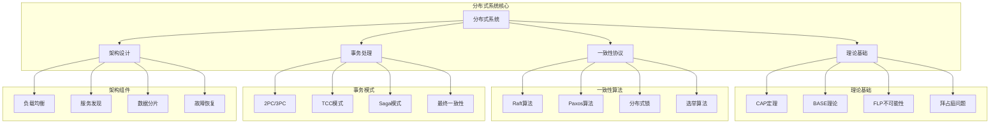

# 分布式系统架构面试题

[← 返回后端面试题目录](./README.md)

## 📚 题目概览

分布式系统是现代大规模应用的基础架构，直接关系到系统的可扩展性、可用性和一致性。本章节重点考察候选人对分布式系统核心理论的深度理解，包括CAP定理、一致性协议、分布式事务等关键概念，以及在复杂业务场景中的架构设计和实现能力。

## 🎯 核心技术考察重点

### 分布式系统理论基础
- CAP定理和BASE理论的深度理解
- 分布式系统的核心挑战和解决思路
- 一致性、可用性、分区容错的权衡策略
- 分布式系统的设计原则和模式

### 一致性协议与算法
- Raft、Paxos等一致性算法的原理
- 分布式锁的实现机制和应用场景
- 选举算法和故障检测机制
- 分布式时钟和事件顺序

### 分布式事务处理
- 两阶段提交(2PC)和三阶段提交(3PC)
- TCC、Saga等事务模式的应用
- 分布式事务的性能优化策略
- 最终一致性的实现机制

### 系统架构设计
- 负载均衡和服务发现机制
- 数据分片和复制策略
- 分布式缓存和存储系统
- 容错设计和故障恢复

## 📊 知识结构关联图

## 📝 核心面试题目

### 分布式系统理论 📚

#### 题目1：CAP定理深度解析与实际应用
**问题背景**：设计一个全球分布式的社交媒体平台

**技术挑战**：
- 如何在CAP三者间进行权衡选择
- 如何处理网络分区和节点故障
- 如何保证用户体验和数据一致性

**考察要点**：
- CAP定理的准确理解和应用
- 分布式系统的权衡决策能力
- 实际场景中的架构设计思维

**📁 完整解决方案**：[CAP定理实践应用完整实现](../../solutions/common/cap-theorem-implementation.md)

#### 题目2：BASE理论与最终一致性设计
**问题背景**：构建大规模电商平台的订单处理系统

**技术挑战**：
- 设计最终一致性的数据同步机制
- 处理分布式系统的可用性要求
- 平衡性能和一致性的需求

**考察要点**：
- BASE理论的深度理解
- 最终一致性的实现策略
- 分布式系统的可用性设计

**📁 完整解决方案**：[BASE理论应用完整实现](../../solutions/common/base-theory-application.md)

### 一致性协议与算法 🔄

#### 题目3：Raft一致性算法实现与优化
**问题背景**：构建高可用的分布式配置管理系统

**技术挑战**：
- 实现Raft算法的核心机制
- 处理网络分区和节点故障
- 优化算法性能和收敛速度

**考察要点**：
- Raft算法的深度理解
- 分布式一致性的实现能力
- 算法优化和性能调优

**📁 完整解决方案**：[Raft算法完整实现](../../solutions/common/raft-consensus-algorithm.md)

#### 题目4：分布式锁设计与实现
**问题背景**：设计高并发场景下的资源访问控制

**技术挑战**：
- 实现高性能的分布式锁机制
- 处理锁的超时和死锁问题
- 保证锁的公平性和可重入性

**考察要点**：
- 分布式锁的设计原理
- 并发控制的实现策略
- 性能优化和可靠性保证

**📁 完整解决方案**：[分布式锁系统完整实现](../../solutions/common/distributed-lock-system.md)

### 分布式事务处理 💳

#### 题目5：分布式事务模式设计与选择
**问题背景**：实现跨多个微服务的业务事务

**技术挑战**：
- 选择合适的分布式事务模式
- 处理事务的一致性和性能要求
- 设计事务失败的补偿机制

**考察要点**：
- 分布式事务模式的深度理解
- 事务一致性的实现策略
- 业务场景的分析和选择能力

**📁 完整解决方案**：[分布式事务模式完整实现](../../solutions/common/distributed-transaction-patterns.md)

#### 题目6：Saga事务模式实现与优化
**问题背景**：构建复杂业务流程的事务管理

**技术挑战**：
- 设计Saga事务的编排和协调
- 实现事务的补偿和回滚机制
- 处理长事务的性能和可靠性

**考察要点**：
- Saga模式的设计原理
- 事务编排的实现策略
- 长事务的管理和优化

**📁 完整解决方案**：[Saga事务模式完整实现](../../solutions/common/saga-transaction-pattern.md)

## 📊 面试评分标准

### 理论基础掌握 (30%)
- **优秀 (90-100分)**：深入理解分布式系统核心理论，能够准确分析权衡
- **良好 (80-89分)**：掌握主要理论概念，理解基本原理
- **一般 (70-79分)**：了解基础理论，但理解不够深入
- **不足 (60-69分)**：理论概念模糊，缺乏系统性理解

### 算法原理理解 (25%)
- **优秀 (90-100分)**：深入理解一致性算法原理，能够分析实现细节
- **良好 (80-89分)**：掌握主要算法概念，理解基本流程
- **一般 (70-79分)**：了解算法基础，但原理理解有限
- **不足 (60-69分)**：算法理解薄弱，缺乏深度认知

### 架构设计能力 (25%)
- **优秀 (90-100分)**：能够设计完整的分布式系统架构，考虑全面
- **良好 (80-89分)**：具备基本的架构设计能力，能够识别关键问题
- **一般 (70-79分)**：有一定设计思路，但系统性不够
- **不足 (60-69分)**：架构设计能力薄弱，思路不清晰

### 实践经验展示 (20%)
- **优秀 (90-100分)**：有丰富的分布式系统实践经验，能够分享具体案例
- **良好 (80-89分)**：有一定实践经验，能够结合项目讲解
- **一般 (70-79分)**：有基础实践，但经验不够丰富
- **不足 (60-69分)**：缺乏实际项目经验

## 🎯 备考建议

### 理论基础强化
- 深入学习CAP定理、BASE理论等核心概念
- 理解分布式系统的基本挑战和解决思路
- 掌握一致性、可用性、分区容错的权衡策略
- 学习分布式系统的设计原则和最佳实践

### 算法原理深入
- 深入研究Raft、Paxos等一致性算法
- 理解分布式锁和选举算法的实现原理
- 掌握分布式时钟和事件顺序的处理
- 学习拜占庭容错和故障检测机制

### 实践项目积累
- 参与分布式系统的设计和实现项目
- 积累分布式事务和一致性的实践经验
- 掌握分布式系统的监控和故障排查
- 了解分布式存储和计算框架的应用

### 架构思维培养
- 学习大规模分布式系统的架构案例
- 理解不同业务场景下的架构选择
- 掌握分布式系统的演进和扩展策略
- 培养系统性的分布式思维

## 🔗 相关资源链接

- [Raft算法论文](https://raft.github.io/raft.pdf)
- [分布式系统概念与设计](https://book.douban.com/subject/21624776/)
- [微服务架构设计](./microservices.md)
- [消息队列系统](./message-queues.md)

---

*分布式系统的核心在于理解和处理分布式环境下的一致性、可用性和分区容错性挑战* 🌐 