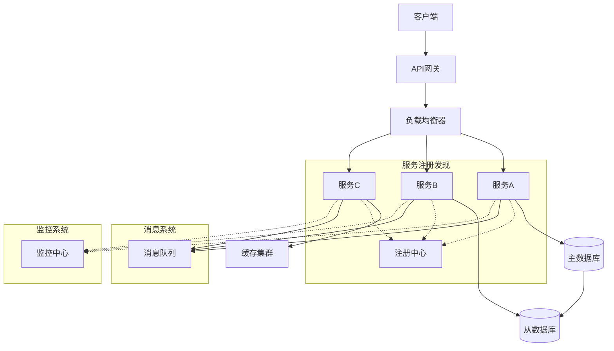
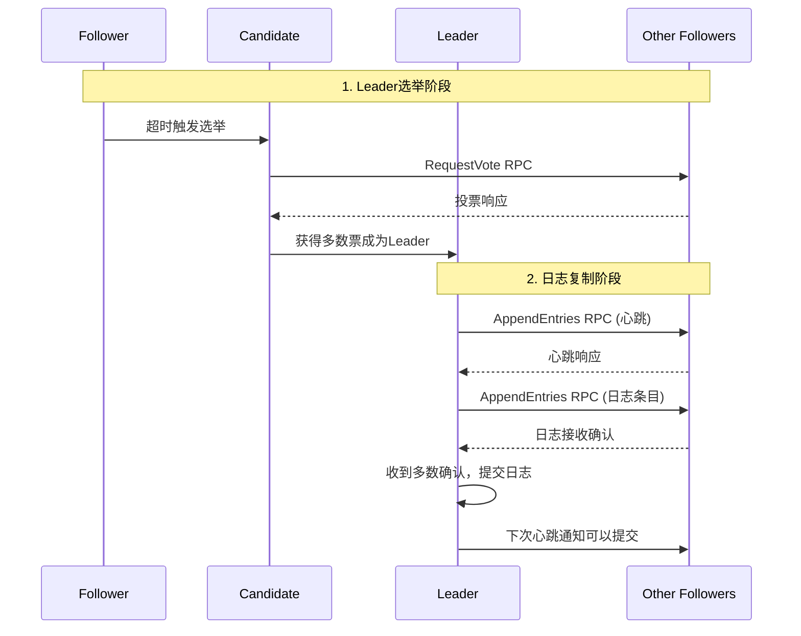
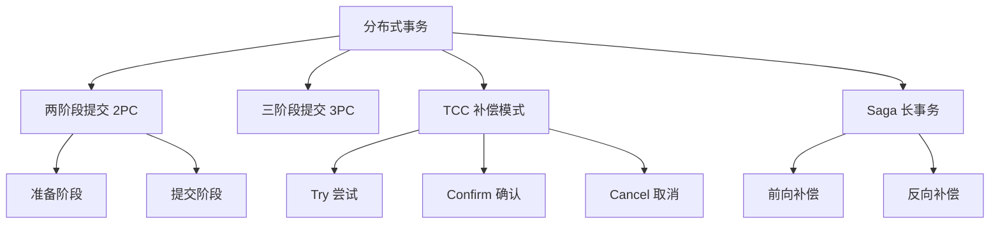

# 分布式系统架构面试题

## 🏷️ 标签
- 技术栈: 分布式系统, 架构设计, 微服务
- 难度: 中级到高级
- 类型: 架构题, 原理题, 场景题

## 📋 题目描述

本文包含分布式系统架构相关的面试题，涵盖CAP理论、一致性、可用性、分区容错性、分布式事务、负载均衡等核心概念。

## 💡 核心知识点
- CAP 理论和 BASE 理论
- 分布式一致性协议 (Raft, Paxos)
- 分布式事务 (2PC, 3PC, TCC, Saga)
- 分布式锁和选举算法
- 负载均衡和服务发现
- 数据分片和复制

## 📊 分布式系统核心架构



## 📝 面试题目

### 1. CAP 理论深度解析

#### **【高级】** 请详细解释 CAP 理论，并举例说明在实际项目中如何进行权衡？

**💡 考察要点:**
- CAP 理论的准确理解
- 实际系统中的权衡策略
- 不同场景下的选择

**📝 参考答案:**

**CAP 理论核心内容:**

```mermaid
graph TD
    CAP[CAP理论] --> C[一致性 Consistency]
    CAP --> A[可用性 Availability]
    CAP --> P[分区容错性 Partition Tolerance]
    
    C --> C1[强一致性]
    C --> C2[弱一致性]
    C --> C3[最终一致性]
    
    A --> A1[高可用性 99.9%]
    A --> A2[容错能力]
    A --> A3[故障恢复]
    
    P --> P1[网络分区]
    P --> P2[节点故障]
    P --> P3[数据中心隔离]
    
    subgraph "权衡选择"
        CP[CP: 一致性+分区容错<br/>放弃可用性]
        AP[AP: 可用性+分区容错<br/>放弃强一致性]
        CA[CA: 一致性+可用性<br/>放弃分区容错<br/>(单体系统)]
    end
```

**实际案例分析:**

```java
// 1. CP系统示例 - 分布式锁实现
public class DistributedLockExample {
    private final ZooKeeper zooKeeper;
    private final String lockPath = "/distributed-locks";
    
    public boolean acquireLock(String resourceId, long timeoutMs) {
        String lockNode = lockPath + "/" + resourceId;
        try {
            // 创建临时顺序节点
            String createdPath = zooKeeper.create(
                lockNode + "-", 
                new byte[0], 
                ZooDefs.Ids.OPEN_ACL_UNSAFE,
                CreateMode.EPHEMERAL_SEQUENTIAL
            );
            
            // 检查是否是最小节点
            List<String> children = zooKeeper.getChildren(lockPath, false);
            Collections.sort(children);
            
            String minNode = children.get(0);
            String currentNode = createdPath.substring(createdPath.lastIndexOf('/') + 1);
            
            if (minNode.equals(currentNode)) {
                return true; // 获得锁
            } else {
                // 监听前一个节点
                String prevNode = null;
                for (int i = 0; i < children.size(); i++) {
                    if (children.get(i).equals(currentNode)) {
                        prevNode = children.get(i - 1);
                        break;
                    }
                }
                
                if (prevNode != null) {
                    CountDownLatch latch = new CountDownLatch(1);
                    Stat stat = zooKeeper.exists(lockPath + "/" + prevNode, event -> {
                        if (event.getType() == Watcher.Event.EventType.NodeDeleted) {
                            latch.countDown();
                        }
                    });
                    
                    if (stat == null) {
                        return acquireLock(resourceId, timeoutMs); // 递归重试
                    }
                    
                    return latch.await(timeoutMs, TimeUnit.MILLISECONDS);
                }
            }
            
        } catch (Exception e) {
            e.printStackTrace();
        }
        return false;
    }
}

// 2. AP系统示例 - 最终一致性
public class EventualConsistencyExample {
    private final List<DataNode> dataNodes;
    private final MessageQueue messageQueue;
    
    public void updateData(String key, String value) {
        // 异步更新所有节点
        CompletableFuture.runAsync(() -> {
            // 更新主节点
            DataNode primaryNode = dataNodes.get(0);
            primaryNode.update(key, value);
            
            // 异步同步到其他节点
            for (int i = 1; i < dataNodes.size(); i++) {
                final int nodeIndex = i;
                CompletableFuture.runAsync(() -> {
                    try {
                        dataNodes.get(nodeIndex).update(key, value);
                    } catch (Exception e) {
                        // 失败则发送到消息队列重试
                        messageQueue.send(new SyncMessage(nodeIndex, key, value));
                    }
                });
            }
        });
    }
    
    // 处理同步失败的消息
    public void handleSyncFailure() {
        messageQueue.consume(message -> {
            SyncMessage syncMsg = (SyncMessage) message;
            try {
                dataNodes.get(syncMsg.getNodeIndex())
                    .update(syncMsg.getKey(), syncMsg.getValue());
            } catch (Exception e) {
                // 继续重试或记录错误
                scheduleRetry(syncMsg);
            }
        });
    }
}
```

**不同场景的CAP选择:**

| 系统类型 | CAP选择 | 典型应用 | 权衡说明 |
|----------|---------|----------|----------|
| **金融系统** | CP | 银行转账、交易系统 | 宁可暂停服务也要保证数据一致性 |
| **社交媒体** | AP | 微博、朋友圈 | 允许数据延迟，优先保证用户体验 |
| **电商库存** | CP | 商品库存管理 | 避免超卖，确保数据准确性 |
| **内容分发** | AP | CDN、新闻推送 | 允许数据不一致，优先保证可用性 |

---

### 2. 分布式一致性协议

#### **【高级】** 对比 Raft 和 Paxos 协议的异同，并解释 Raft 的选举和日志复制流程

**💡 考察要点:**
- 一致性协议的深度理解
- Raft 协议的详细流程
- 实际应用场景分析



**📝 参考答案:**

**Raft vs Paxos 对比:**

| 特性 | Raft | Paxos |
|------|------|-------|
| **理解难度** | 相对简单，分阶段设计 | 复杂，理论性强 |
| **实现复杂度** | 较低，工程化友好 | 较高，需要多种优化 |
| **性能** | 中等，但稳定 | 理论最优，但实现复杂 |
| **应用场景** | etcd, Consul, LogCabin | Chubby, Spanner |

**Raft 协议实现示例:**

```java
public class RaftNode {
    // 持久化状态
    private int currentTerm = 0;
    private String votedFor = null;
    private List<LogEntry> log = new ArrayList<>();
    
    // 易失状态
    private int commitIndex = 0;
    private int lastApplied = 0;
    
    // Leader特有状态
    private Map<String, Integer> nextIndex = new HashMap<>();
    private Map<String, Integer> matchIndex = new HashMap<>();
    
    private NodeState state = NodeState.FOLLOWER;
    private long lastHeartbeat = System.currentTimeMillis();
    
    public enum NodeState {
        FOLLOWER, CANDIDATE, LEADER
    }
    
    // 1. 选举超时处理
    public void handleElectionTimeout() {
        if (state != NodeState.LEADER) {
            startElection();
        }
    }
    
    private void startElection() {
        state = NodeState.CANDIDATE;
        currentTerm++;
        votedFor = getNodeId();
        lastHeartbeat = System.currentTimeMillis();
        
        int voteCount = 1; // 自己的票
        
        // 向其他节点请求投票
        for (String nodeId : getClusterNodes()) {
            CompletableFuture.supplyAsync(() -> 
                requestVote(nodeId, currentTerm, getLastLogIndex(), getLastLogTerm())
            ).thenAccept(granted -> {
                if (granted && state == NodeState.CANDIDATE) {
                    synchronized (this) {
                        voteCount++;
                        if (voteCount > getClusterSize() / 2) {
                            becomeLeader();
                        }
                    }
                }
            });
        }
    }
    
    // 2. 处理投票请求
    public boolean handleRequestVote(int term, String candidateId, 
                                   int lastLogIndex, int lastLogTerm) {
        if (term > currentTerm) {
            currentTerm = term;
            votedFor = null;
            state = NodeState.FOLLOWER;
        }
        
        if (term < currentTerm) {
            return false;
        }
        
        if (votedFor == null || votedFor.equals(candidateId)) {
            // 检查候选人日志是否至少和自己一样新
            int myLastLogTerm = getLastLogTerm();
            int myLastLogIndex = getLastLogIndex();
            
            if (lastLogTerm > myLastLogTerm || 
                (lastLogTerm == myLastLogTerm && lastLogIndex >= myLastLogIndex)) {
                votedFor = candidateId;
                lastHeartbeat = System.currentTimeMillis();
                return true;
            }
        }
        
        return false;
    }
    
    // 3. 成为Leader
    private void becomeLeader() {
        state = NodeState.LEADER;
        System.out.println("Node " + getNodeId() + " became leader for term " + currentTerm);
        
        // 初始化Leader状态
        for (String nodeId : getClusterNodes()) {
            nextIndex.put(nodeId, log.size());
            matchIndex.put(nodeId, 0);
        }
        
        // 立即发送心跳
        sendHeartbeats();
        
        // 定期发送心跳
        scheduleHeartbeats();
    }
    
    // 4. 日志复制
    public void appendEntries(String command) {
        if (state != NodeState.LEADER) {
            throw new IllegalStateException("Only leader can append entries");
        }
        
        LogEntry entry = new LogEntry(currentTerm, command, log.size());
        log.add(entry);
        
        // 异步复制到所有follower
        for (String nodeId : getClusterNodes()) {
            CompletableFuture.runAsync(() -> replicateToFollower(nodeId));
        }
    }
    
    private void replicateToFollower(String followerId) {
        int nextIdx = nextIndex.get(followerId);
        int prevLogIndex = nextIdx - 1;
        int prevLogTerm = prevLogIndex >= 0 ? log.get(prevLogIndex).getTerm() : 0;
        
        List<LogEntry> entries = log.subList(nextIdx, log.size());
        
        boolean success = sendAppendEntries(followerId, currentTerm, prevLogIndex, 
                                          prevLogTerm, entries, commitIndex);
        
        if (success) {
            // 更新索引
            nextIndex.put(followerId, log.size());
            matchIndex.put(followerId, log.size() - 1);
            
            // 检查是否可以提交
            checkCommitIndex();
        } else {
            // 回退重试
            nextIndex.put(followerId, Math.max(0, nextIndex.get(followerId) - 1));
            replicateToFollower(followerId);
        }
    }
    
    // 5. 检查提交索引
    private void checkCommitIndex() {
        for (int i = commitIndex + 1; i < log.size(); i++) {
            if (log.get(i).getTerm() == currentTerm) {
                int replicationCount = 1; // Leader自己
                
                for (int matchIdx : matchIndex.values()) {
                    if (matchIdx >= i) {
                        replicationCount++;
                    }
                }
                
                if (replicationCount > getClusterSize() / 2) {
                    commitIndex = i;
                    applyLogEntry(log.get(i));
                }
            }
        }
    }
}
```

---

### 3. 分布式事务处理

#### **【高级】** 比较 2PC、3PC、TCC、Saga 等分布式事务模式的优缺点和适用场景

**💡 考察要点:**
- 各种事务模式的原理
- 性能和一致性权衡
- 实际场景选择策略



**📝 参考答案:**

**各种分布式事务模式实现:**

```java
// 1. TCC 模式实现
public class TccTransactionExample {
    
    @Component
    public class AccountService {
        
        // Try: 预处理，冻结资源
        public boolean tryTransfer(String fromAccount, String toAccount, BigDecimal amount) {
            try {
                // 检查账户余额
                if (getBalance(fromAccount).compareTo(amount) < 0) {
                    return false;
                }
                
                // 冻结金额
                freezeAmount(fromAccount, amount);
                // 预留接收金额
                reserveAmount(toAccount, amount);
                
                return true;
            } catch (Exception e) {
                return false;
            }
        }
        
        // Confirm: 确认提交
        public boolean confirmTransfer(String fromAccount, String toAccount, BigDecimal amount) {
            try {
                // 扣除冻结金额
                deductFrozenAmount(fromAccount, amount);
                // 增加预留金额
                addReservedAmount(toAccount, amount);
                
                return true;
            } catch (Exception e) {
                return false;
            }
        }
        
        // Cancel: 取消补偿
        public boolean cancelTransfer(String fromAccount, String toAccount, BigDecimal amount) {
            try {
                // 释放冻结金额
                releaseFrozenAmount(fromAccount, amount);
                // 取消预留金额
                cancelReservedAmount(toAccount, amount);
                
                return true;
            } catch (Exception e) {
                return false;
            }
        }
    }
    
    @Service
    public class TccTransactionManager {
        
        public void executeTransfer(TransferRequest request) {
            String transactionId = UUID.randomUUID().toString();
            List<TccAction> actions = new ArrayList<>();
            
            try {
                // Try 阶段
                boolean allTrySuccess = true;
                
                // 转出账户操作
                TccAction fromAction = createFromAccountAction(request);
                if (fromAction.doTry()) {
                    actions.add(fromAction);
                } else {
                    allTrySuccess = false;
                }
                
                // 转入账户操作
                TccAction toAction = createToAccountAction(request);
                if (toAction.doTry()) {
                    actions.add(toAction);
                } else {
                    allTrySuccess = false;
                }
                
                if (allTrySuccess) {
                    // Confirm 阶段
                    confirmAll(actions);
                } else {
                    // Cancel 阶段
                    cancelAll(actions);
                }
                
            } catch (Exception e) {
                // 异常时执行 Cancel
                cancelAll(actions);
                throw new TransactionException("TCC transaction failed", e);
            }
        }
        
        private void confirmAll(List<TccAction> actions) {
            for (TccAction action : actions) {
                try {
                    action.doConfirm();
                } catch (Exception e) {
                    // 记录失败，可能需要人工干预
                    log.error("Confirm failed for action: " + action.getActionId(), e);
                }
            }
        }
        
        private void cancelAll(List<TccAction> actions) {
            for (TccAction action : actions) {
                try {
                    action.doCancel();
                } catch (Exception e) {
                    // 记录失败，可能需要人工干预
                    log.error("Cancel failed for action: " + action.getActionId(), e);
                }
            }
        }
    }
}

// 2. Saga 模式实现
public class SagaTransactionExample {
    
    @Service
    public class OrderSagaOrchestrator {
        
        public void processOrder(OrderRequest orderRequest) {
            SagaTransaction saga = SagaTransaction.builder()
                .transactionId(UUID.randomUUID().toString())
                .build();
            
            try {
                // 步骤1: 创建订单
                saga.addStep(
                    () -> orderService.createOrder(orderRequest),
                    () -> orderService.cancelOrder(orderRequest.getOrderId())
                );
                
                // 步骤2: 扣减库存
                saga.addStep(
                    () -> inventoryService.deductInventory(orderRequest.getProductId(), orderRequest.getQuantity()),
                    () -> inventoryService.restoreInventory(orderRequest.getProductId(), orderRequest.getQuantity())
                );
                
                // 步骤3: 处理支付
                saga.addStep(
                    () -> paymentService.processPayment(orderRequest.getPaymentInfo()),
                    () -> paymentService.refundPayment(orderRequest.getPaymentInfo().getTransactionId())
                );
                
                // 步骤4: 发送通知
                saga.addStep(
                    () -> notificationService.sendOrderConfirmation(orderRequest.getUserId()),
                    () -> notificationService.sendOrderCancellation(orderRequest.getUserId())
                );
                
                // 执行Saga
                executeSaga(saga);
                
            } catch (Exception e) {
                // 执行补偿
                compensateSaga(saga);
                throw new OrderProcessingException("Order processing failed", e);
            }
        }
        
        private void executeSaga(SagaTransaction saga) {
            for (int i = 0; i < saga.getSteps().size(); i++) {
                SagaStep step = saga.getSteps().get(i);
                try {
                    step.execute();
                    saga.setCurrentStep(i);
                } catch (Exception e) {
                    // 执行失败，触发补偿
                    saga.setCurrentStep(i - 1);
                    throw e;
                }
            }
        }
        
        private void compensateSaga(SagaTransaction saga) {
            // 从失败步骤开始，逆序执行补偿
            for (int i = saga.getCurrentStep(); i >= 0; i--) {
                SagaStep step = saga.getSteps().get(i);
                try {
                    step.compensate();
                } catch (Exception e) {
                    // 补偿失败，记录日志，可能需要人工干预
                    log.error("Compensation failed for step: " + i, e);
                }
            }
        }
    }
    
    public static class SagaTransaction {
        private String transactionId;
        private List<SagaStep> steps = new ArrayList<>();
        private int currentStep = -1;
        
        public void addStep(Runnable action, Runnable compensation) {
            steps.add(new SagaStep(action, compensation));
        }
    }
    
    public static class SagaStep {
        private final Runnable action;
        private final Runnable compensation;
        
        public void execute() {
            action.run();
        }
        
        public void compensate() {
            compensation.run();
        }
    }
}
```

**分布式事务模式对比:**

| 模式 | 一致性 | 性能 | 复杂度 | 适用场景 |
|------|--------|------|--------|----------|
| **2PC** | 强一致 | 低 | 中等 | 金融系统、关键业务 |
| **3PC** | 强一致 | 低 | 高 | 对可用性要求更高的场景 |
| **TCC** | 最终一致 | 中等 | 高 | 电商、支付等业务 |
| **Saga** | 最终一致 | 高 | 中等 | 长流程业务、微服务 |

---

## 🎯 面试技巧建议

### 分布式系统回答策略
1. **理论基础**: 先阐述基本概念和原理
2. **权衡分析**: 分析不同方案的优缺点
3. **场景应用**: 结合具体业务场景举例
4. **实践经验**: 分享遇到的问题和解决方案

### 常见追问问题
- "如何解决分布式系统中的脑裂问题？"
- "分布式ID生成有哪些方案？"
- "如何实现分布式限流？"
- "微服务间如何保证数据一致性？"

## 🔗 相关链接

- [← 返回后端目录](./README.md)
- [微服务架构](./microservices.md)
- [消息队列](./message-queues.md)
- [缓存系统](./caching.md)

---

*分布式系统是现代后端架构的核心，理解其设计原理对系统架构师至关重要* 🏗️ 