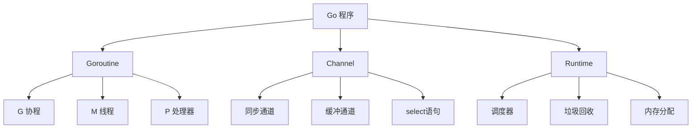
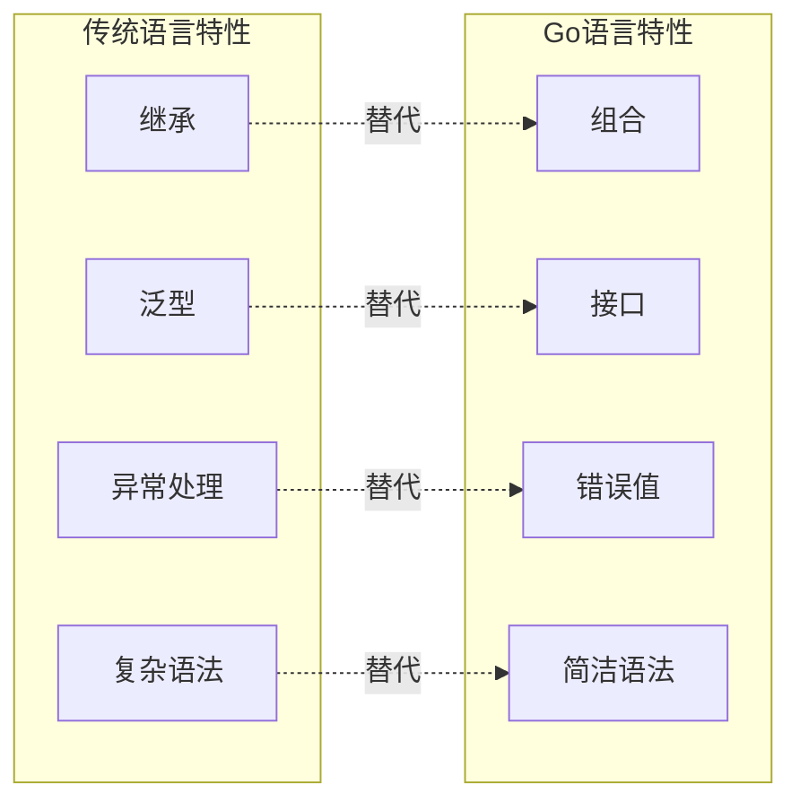
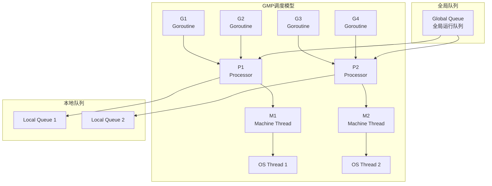
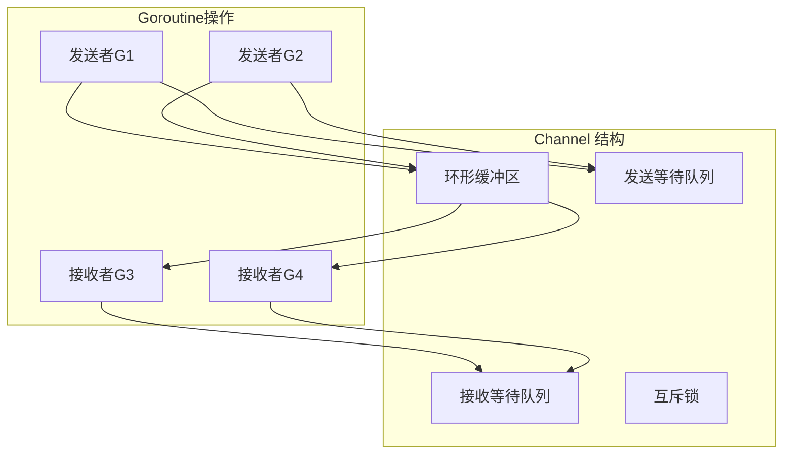
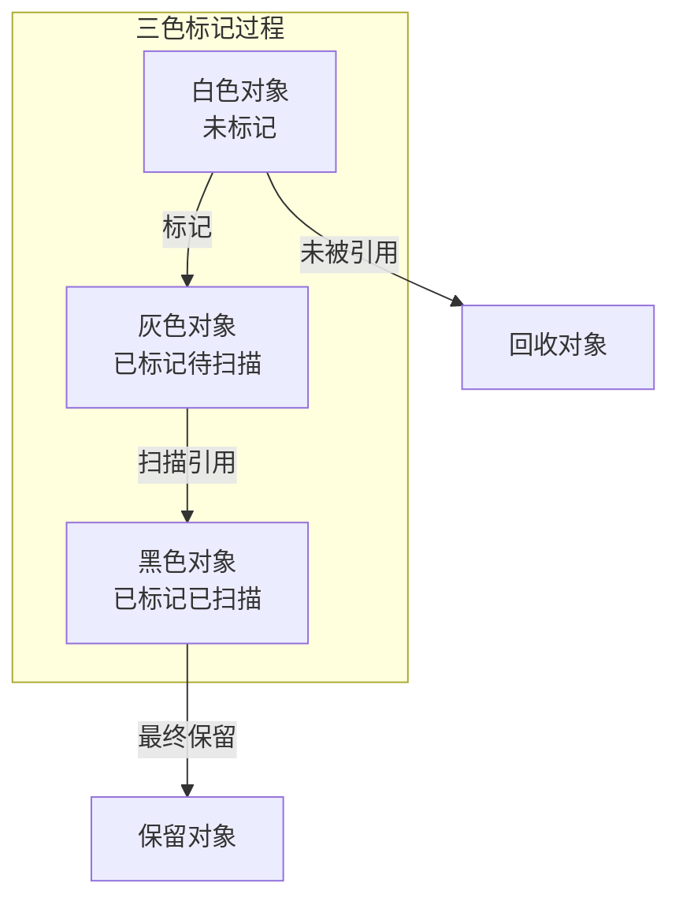

# Go 语言基础面试题

## 📋 目录
- [语言特性](#语言特性)
- [Goroutine 协程](#goroutine-协程)
- [Channel 通道](#channel-通道)
- [内存管理](#内存管理)
- [接口与类型](#接口与类型)

## 🎯 核心知识点
- Go 语言设计哲学
- Goroutine 轻量级线程
- Channel 通信机制
- 垃圾回收器特性
- 接口与组合模式

## 📊 Go 语言架构图



## 语言特性

### 💡 面试题目

#### 1. **[中级]** Go 语言的设计哲学和核心特性是什么？

**设计哲学：**
- 简洁性：语法简单，易于学习
- 并发性：原生支持并发编程
- 效率性：编译快速，运行高效
- 安全性：类型安全，内存安全

**核心特性对比：**



**代码示例：**

```go
package main

import (
    "fmt"
    "time"
)

// 1. 结构体和方法
type User struct {
    ID   int    `json:"id"`
    Name string `json:"name"`
    Age  int    `json:"age"`
}

// 方法定义（值接收者）
func (u User) String() string {
    return fmt.Sprintf("User{ID: %d, Name: %s, Age: %d}", u.ID, u.Name, u.Age)
}

// 方法定义（指针接收者）
func (u *User) UpdateAge(newAge int) {
    u.Age = newAge
}

// 2. 接口定义
type Stringer interface {
    String() string
}

type Updater interface {
    UpdateAge(int)
}

// 组合接口
type UserInterface interface {
    Stringer
    Updater
}

// 3. 错误处理
func validateUser(u *User) error {
    if u.Name == "" {
        return fmt.Errorf("用户名不能为空")
    }
    if u.Age < 0 {
        return fmt.Errorf("年龄不能为负数")
    }
    return nil
}

// 4. 多返回值
func createUser(name string, age int) (*User, error) {
    user := &User{
        ID:   int(time.Now().Unix()),
        Name: name,
        Age:  age,
    }
    
    if err := validateUser(user); err != nil {
        return nil, err
    }
    
    return user, nil
}

// 5. defer 语句
func processUser(name string, age int) {
    fmt.Println("开始处理用户")
    defer fmt.Println("用户处理完成") // 延迟执行
    
    user, err := createUser(name, age)
    if err != nil {
        fmt.Printf("创建用户失败: %v\n", err)
        return
    }
    
    fmt.Println("创建用户成功:", user)
}

func main() {
    // 正常情况
    processUser("张三", 25)
    
    // 错误情况
    processUser("", -1)
}
```

#### 2. **[高级]** Go 语言的类型系统和接口机制

**类型系统特点：**

```go
package main

import (
    "fmt"
    "reflect"
)

// 1. 类型定义和类型别名
type UserID int           // 新类型
type UserName = string    // 类型别名

// 2. 自定义类型方法
func (id UserID) IsValid() bool {
    return id > 0
}

func (id UserID) String() string {
    return fmt.Sprintf("UserID(%d)", int(id))
}

// 3. 接口定义
type Shape interface {
    Area() float64
    Perimeter() float64
}

type Drawable interface {
    Draw()
}

// 组合接口
type DrawableShape interface {
    Shape
    Drawable
}

// 4. 具体类型实现
type Rectangle struct {
    Width, Height float64
}

func (r Rectangle) Area() float64 {
    return r.Width * r.Height
}

func (r Rectangle) Perimeter() float64 {
    return 2 * (r.Width + r.Height)
}

func (r Rectangle) Draw() {
    fmt.Printf("绘制矩形: %.1fx%.1f\n", r.Width, r.Height)
}

type Circle struct {
    Radius float64
}

func (c Circle) Area() float64 {
    return 3.14159 * c.Radius * c.Radius
}

func (c Circle) Perimeter() float64 {
    return 2 * 3.14159 * c.Radius
}

func (c Circle) Draw() {
    fmt.Printf("绘制圆形: 半径%.1f\n", c.Radius)
}

// 5. 接口类型断言和类型开关
func describeShape(s Shape) {
    fmt.Printf("面积: %.2f, 周长: %.2f\n", s.Area(), s.Perimeter())
    
    // 类型断言
    if rect, ok := s.(Rectangle); ok {
        fmt.Printf("这是一个矩形，宽度: %.1f, 高度: %.1f\n", rect.Width, rect.Height)
    }
    
    // 类型开关
    switch shape := s.(type) {
    case Rectangle:
        fmt.Printf("矩形类型: %+v\n", shape)
    case Circle:
        fmt.Printf("圆形类型: %+v\n", shape)
    default:
        fmt.Printf("未知形状类型: %T\n", shape)
    }
}

// 6. 空接口和反射
func analyzeInterface(v interface{}) {
    fmt.Printf("值: %v, 类型: %T\n", v, v)
    
    // 反射获取类型信息
    rt := reflect.TypeOf(v)
    rv := reflect.ValueOf(v)
    
    fmt.Printf("反射类型: %v, 种类: %v\n", rt, rt.Kind())
    
    // 如果是结构体，遍历字段
    if rt.Kind() == reflect.Struct {
        for i := 0; i < rt.NumField(); i++ {
            field := rt.Field(i)
            value := rv.Field(i)
            fmt.Printf("字段 %s: %v (类型: %v)\n", 
                field.Name, value.Interface(), field.Type)
        }
    }
}

func main() {
    // 类型使用示例
    var id UserID = 123
    fmt.Println("用户ID:", id, "有效性:", id.IsValid())
    
    var name UserName = "张三"
    fmt.Println("用户名:", name)
    
    // 接口使用示例
    shapes := []Shape{
        Rectangle{Width: 10, Height: 5},
        Circle{Radius: 3},
    }
    
    for _, shape := range shapes {
        describeShape(shape)
        
        // 检查是否实现了Drawable接口
        if drawable, ok := shape.(Drawable); ok {
            drawable.Draw()
        }
        fmt.Println("---")
    }
    
    // 空接口和反射示例
    analyzeInterface(id)
    analyzeInterface(Rectangle{Width: 8, Height: 6})
}
```

## Goroutine 协程

#### 3. **[高级]** Goroutine 的调度模型 GMP 详解

**GMP 模型架构：**



**GMP 调度示例：**

```go
package main

import (
    "fmt"
    "runtime"
    "sync"
    "time"
)

// 演示 Goroutine 调度
func scheduleDemo() {
    fmt.Printf("GOMAXPROCS: %d\n", runtime.GOMAXPROCS(0))
    fmt.Printf("NumCPU: %d\n", runtime.NumCPU())
    fmt.Printf("NumGoroutine: %d\n", runtime.NumGoroutine())
    
    var wg sync.WaitGroup
    
    // 创建多个 Goroutine
    for i := 0; i < 10; i++ {
        wg.Add(1)
        go func(id int) {
            defer wg.Done()
            
            // CPU密集型任务
            for j := 0; j < 1000000; j++ {
                if j%100000 == 0 {
                    fmt.Printf("Goroutine %d: 进度 %d%%, 线程ID: %d\n", 
                        id, j/10000, getGoroutineID())
                    runtime.Gosched() // 主动让出CPU
                }
            }
        }(i)
    }
    
    wg.Wait()
    fmt.Printf("最终 NumGoroutine: %d\n", runtime.NumGoroutine())
}

// 获取 Goroutine ID (仅用于演示)
func getGoroutineID() int {
    var buf [64]byte
    n := runtime.Stack(buf[:], false)
    // 简化的ID提取，实际应用不建议使用
    return int(buf[n-1]) % 1000
}

// 演示 Goroutine 泄漏
func goroutineLeakDemo() {
    fmt.Println("=== Goroutine 泄漏演示 ===")
    
    // 错误示例：Goroutine 泄漏
    ch := make(chan int)
    
    // 启动 Goroutine 但永远不会结束
    go func() {
        select {
        case <-ch:
            fmt.Println("收到数据")
        case <-time.After(time.Hour): // 永远不会超时
            fmt.Println("超时")
        }
    }()
    
    fmt.Printf("泄漏前 NumGoroutine: %d\n", runtime.NumGoroutine())
    time.Sleep(100 * time.Millisecond)
    fmt.Printf("泄漏后 NumGoroutine: %d\n", runtime.NumGoroutine())
    
    // 正确示例：使用 context 控制 Goroutine 生命周期
    correctGoroutineUsage()
}

func correctGoroutineUsage() {
    fmt.Println("=== 正确的 Goroutine 使用 ===")
    
    ctx, cancel := context.WithTimeout(context.Background(), 2*time.Second)
    defer cancel()
    
    var wg sync.WaitGroup
    
    for i := 0; i < 5; i++ {
        wg.Add(1)
        go func(id int) {
            defer wg.Done()
            
            select {
            case <-ctx.Done():
                fmt.Printf("Goroutine %d: 收到取消信号\n", id)
                return
            case <-time.After(time.Duration(id) * time.Second):
                fmt.Printf("Goroutine %d: 工作完成\n", id)
            }
        }(i)
    }
    
    wg.Wait()
    fmt.Printf("清理后 NumGoroutine: %d\n", runtime.NumGoroutine())
}

// Goroutine 池实现
type GoroutinePool struct {
    tasks   chan func()
    workers int
    wg      sync.WaitGroup
    quit    chan struct{}
}

func NewGoroutinePool(workers int, queueSize int) *GoroutinePool {
    pool := &GoroutinePool{
        tasks:   make(chan func(), queueSize),
        workers: workers,
        quit:    make(chan struct{}),
    }
    
    pool.start()
    return pool
}

func (p *GoroutinePool) start() {
    for i := 0; i < p.workers; i++ {
        p.wg.Add(1)
        go p.worker(i)
    }
}

func (p *GoroutinePool) worker(id int) {
    defer p.wg.Done()
    
    for {
        select {
        case task := <-p.tasks:
            if task != nil {
                task()
            }
        case <-p.quit:
            fmt.Printf("Worker %d 退出\n", id)
            return
        }
    }
}

func (p *GoroutinePool) Submit(task func()) {
    select {
    case p.tasks <- task:
    default:
        fmt.Println("任务队列已满，丢弃任务")
    }
}

func (p *GoroutinePool) Close() {
    close(p.quit)
    p.wg.Wait()
    close(p.tasks)
}

func poolDemo() {
    fmt.Println("=== Goroutine 池演示 ===")
    
    pool := NewGoroutinePool(3, 10)
    defer pool.Close()
    
    // 提交任务
    for i := 0; i < 10; i++ {
        taskID := i
        pool.Submit(func() {
            fmt.Printf("执行任务 %d\n", taskID)
            time.Sleep(500 * time.Millisecond)
        })
    }
    
    time.Sleep(3 * time.Second)
}

func main() {
    scheduleDemo()
    goroutineLeakDemo()
    poolDemo()
}
```

## Channel 通道

#### 4. **[高级]** Channel 的内部实现和使用模式

**Channel 实现原理：**



**Channel 使用模式：**

```go
package main

import (
    "context"
    "fmt"
    "math/rand"
    "sync"
    "time"
)

// 1. 基本 Channel 使用
func basicChannelDemo() {
    fmt.Println("=== 基本 Channel 使用 ===")
    
    // 无缓冲 Channel（同步）
    ch1 := make(chan int)
    go func() {
        ch1 <- 42
        fmt.Println("发送数据到无缓冲 Channel")
    }()
    
    value := <-ch1
    fmt.Printf("从无缓冲 Channel 接收: %d\n", value)
    
    // 缓冲 Channel（异步）
    ch2 := make(chan string, 3)
    ch2 <- "hello"
    ch2 <- "world"
    ch2 <- "go"
    
    fmt.Printf("缓冲 Channel 长度: %d, 容量: %d\n", len(ch2), cap(ch2))
    
    for len(ch2) > 0 {
        fmt.Printf("接收: %s\n", <-ch2)
    }
}

// 2. Channel 方向（单向Channel）
func channelDirectionDemo() {
    fmt.Println("=== Channel 方向演示 ===")
    
    ch := make(chan int, 1)
    
    // 只能发送的Channel
    go sender(ch)
    
    // 只能接收的Channel
    receiver(ch)
}

func sender(ch chan<- int) { // 只能发送
    ch <- 100
    fmt.Println("发送完成")
}

func receiver(ch <-chan int) { // 只能接收
    value := <-ch
    fmt.Printf("接收到: %d\n", value)
}

// 3. Select 语句和多路复用
func selectDemo() {
    fmt.Println("=== Select 语句演示 ===")
    
    ch1 := make(chan string)
    ch2 := make(chan string)
    
    go func() {
        time.Sleep(1 * time.Second)
        ch1 <- "来自 ch1"
    }()
    
    go func() {
        time.Sleep(2 * time.Second)
        ch2 <- "来自 ch2"
    }()
    
    for i := 0; i < 2; i++ {
        select {
        case msg1 := <-ch1:
            fmt.Println("收到:", msg1)
        case msg2 := <-ch2:
            fmt.Println("收到:", msg2)
        case <-time.After(3 * time.Second):
            fmt.Println("超时")
        }
    }
}

// 4. 扇入扇出模式
func fanInFanOutDemo() {
    fmt.Println("=== 扇入扇出模式 ===")
    
    // 数据源
    source := make(chan int, 10)
    go func() {
        defer close(source)
        for i := 1; i <= 20; i++ {
            source <- i
        }
    }()
    
    // 扇出：多个worker处理数据
    workerChannels := make([]<-chan int, 3)
    for i := 0; i < 3; i++ {
        workerChannels[i] = worker(i, source)
    }
    
    // 扇入：合并结果
    result := fanIn(workerChannels...)
    
    // 收集结果
    var results []int
    for r := range result {
        results = append(results, r)
    }
    
    fmt.Printf("处理完成，共 %d 个结果\n", len(results))
}

func worker(id int, input <-chan int) <-chan int {
    output := make(chan int)
    go func() {
        defer close(output)
        for n := range input {
            // 模拟处理时间
            time.Sleep(time.Duration(rand.Intn(100)) * time.Millisecond)
            result := n * n
            fmt.Printf("Worker %d: %d -> %d\n", id, n, result)
            output <- result
        }
    }()
    return output
}

func fanIn(channels ...<-chan int) <-chan int {
    output := make(chan int)
    var wg sync.WaitGroup
    
    for _, ch := range channels {
        wg.Add(1)
        go func(c <-chan int) {
            defer wg.Done()
            for n := range c {
                output <- n
            }
        }(ch)
    }
    
    go func() {
        wg.Wait()
        close(output)
    }()
    
    return output
}

// 5. 管道模式
func pipelineDemo() {
    fmt.Println("=== 管道模式演示 ===")
    
    // 创建管道：numbers -> squares -> evens
    numbers := generateNumbers(1, 20)
    squares := squareNumbers(numbers)
    evens := filterEvens(squares)
    
    // 消费结果
    for n := range evens {
        fmt.Printf("偶数平方: %d\n", n)
    }
}

func generateNumbers(start, end int) <-chan int {
    ch := make(chan int)
    go func() {
        defer close(ch)
        for i := start; i <= end; i++ {
            ch <- i
        }
    }()
    return ch
}

func squareNumbers(input <-chan int) <-chan int {
    output := make(chan int)
    go func() {
        defer close(output)
        for n := range input {
            output <- n * n
        }
    }()
    return output
}

func filterEvens(input <-chan int) <-chan int {
    output := make(chan int)
    go func() {
        defer close(output)
        for n := range input {
            if n%2 == 0 {
                output <- n
            }
        }
    }()
    return output
}

// 6. 超时和取消模式
func timeoutCancelDemo() {
    fmt.Println("=== 超时和取消模式 ===")
    
    ctx, cancel := context.WithTimeout(context.Background(), 2*time.Second)
    defer cancel()
    
    result := make(chan string, 1)
    
    go func() {
        // 模拟耗时操作
        select {
        case <-time.After(3 * time.Second):
            result <- "操作完成"
        case <-ctx.Done():
            fmt.Println("操作被取消")
            return
        }
    }()
    
    select {
    case res := <-result:
        fmt.Println("收到结果:", res)
    case <-ctx.Done():
        fmt.Println("操作超时")
    }
}

// 7. Channel 关闭和检测
func channelCloseDemo() {
    fmt.Println("=== Channel 关闭演示 ===")
    
    ch := make(chan int, 3)
    
    // 发送数据
    go func() {
        defer close(ch) // 关闭Channel
        for i := 1; i <= 5; i++ {
            ch <- i
            time.Sleep(100 * time.Millisecond)
        }
    }()
    
    // 接收数据
    for {
        select {
        case value, ok := <-ch:
            if !ok {
                fmt.Println("Channel 已关闭")
                return
            }
            fmt.Printf("接收到: %d\n", value)
        case <-time.After(1 * time.Second):
            fmt.Println("接收超时")
            return
        }
    }
}

func main() {
    rand.Seed(time.Now().UnixNano())
    
    basicChannelDemo()
    channelDirectionDemo()
    selectDemo()
    fanInFanOutDemo()
    pipelineDemo()
    timeoutCancelDemo()
    channelCloseDemo()
}
```

## 内存管理

#### 5. **[高级]** Go 垃圾回收器的工作原理

**三色标记算法：**



**内存管理示例：**

```go
package main

import (
    "fmt"
    "runtime"
    "runtime/debug"
    "time"
)

// 内存分配演示
func memoryAllocDemo() {
    fmt.Println("=== 内存分配演示 ===")
    
    // 获取初始内存统计
    var m1 runtime.MemStats
    runtime.ReadMemStats(&m1)
    
    fmt.Printf("初始堆内存: %d KB\n", m1.HeapAlloc/1024)
    
    // 分配大量内存
    data := make([][]byte, 1000)
    for i := 0; i < 1000; i++ {
        data[i] = make([]byte, 1024*10) // 10KB per slice
    }
    
    var m2 runtime.MemStats
    runtime.ReadMemStats(&m2)
    fmt.Printf("分配后堆内存: %d KB\n", m2.HeapAlloc/1024)
    
    // 释放内存引用
    data = nil
    
    // 手动触发GC
    runtime.GC()
    
    var m3 runtime.MemStats
    runtime.ReadMemStats(&m3)
    fmt.Printf("GC后堆内存: %d KB\n", m3.HeapAlloc/1024)
    
    printGCStats()
}

func printGCStats() {
    var m runtime.MemStats
    runtime.ReadMemStats(&m)
    
    fmt.Printf("GC统计:\n")
    fmt.Printf("  总GC次数: %d\n", m.NumGC)
    fmt.Printf("  GC暂停时间: %v\n", time.Duration(m.PauseTotalNs))
    fmt.Printf("  堆对象数: %d\n", m.HeapObjects)
    fmt.Printf("  堆大小: %d KB\n", m.HeapAlloc/1024)
    fmt.Printf("  系统内存: %d KB\n", m.Sys/1024)
}

// 内存泄漏演示
func memoryLeakDemo() {
    fmt.Println("=== 内存泄漏演示 ===")
    
    // 错误示例：slice内存泄漏
    bigSlice := make([]byte, 1024*1024) // 1MB
    smallSlice := bigSlice[:10]         // 只使用前10个字节
    
    // 问题：smallSlice仍然引用整个bigSlice
    fmt.Printf("小切片长度: %d, 容量: %d\n", len(smallSlice), cap(smallSlice))
    
    // 正确做法：复制需要的部分
    correctSlice := make([]byte, 10)
    copy(correctSlice, bigSlice[:10])
    bigSlice = nil // 可以被GC回收
    
    fmt.Printf("正确切片长度: %d, 容量: %d\n", len(correctSlice), cap(correctSlice))
}

// 内存池模式
type Pool struct {
    pool sync.Pool
}

func NewPool() *Pool {
    return &Pool{
        pool: sync.Pool{
            New: func() interface{} {
                return make([]byte, 1024) // 1KB buffer
            },
        },
    }
}

func (p *Pool) Get() []byte {
    return p.pool.Get().([]byte)
}

func (p *Pool) Put(b []byte) {
    if cap(b) >= 1024 {
        p.pool.Put(b[:0]) // 重置长度但保持容量
    }
}

func poolDemo() {
    fmt.Println("=== 内存池演示 ===")
    
    pool := NewPool()
    
    // 模拟大量临时内存分配
    for i := 0; i < 1000; i++ {
        buffer := pool.Get()
        
        // 使用buffer
        for j := 0; j < len(buffer); j++ {
            buffer[j] = byte(i % 256)
        }
        
        // 归还到池中
        pool.Put(buffer)
    }
    
    fmt.Println("内存池使用完成")
}

func main() {
    // 设置GC目标百分比
    debug.SetGCPercent(50)
    
    memoryAllocDemo()
    memoryLeakDemo()
    poolDemo()
}
```

## 🔗 相关链接

- [← 返回后端面试题](./README.md)
- [Go Web 框架](./go-web-frameworks.md)
- [Go 并发模型](./go-concurrency.md)
- [性能优化面试题](./performance-optimization.md)

---

*掌握Go语言核心特性，构建高效的并发程序* ⚡ 