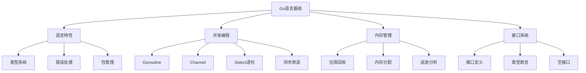

# Go语言基础面试题

[← 返回后端面试题目录](./README.md)

## 📚 题目概览

Go语言基础面试题涵盖Go语言的核心特性、并发编程模型、内存管理、接口系统等关键技术点。重点考察候选人对Go语言设计哲学的理解、Goroutine和Channel的掌握程度，以及在实际项目中的应用能力。

## 🎯 核心技术考察重点

### Go语言特性与设计哲学
- **简洁性原则**：语法简单、易于学习和维护
- **并发性支持**：原生的Goroutine和Channel机制
- **组合优于继承**：接口和结构体组合的设计模式
- **错误处理**：显式错误处理vs异常机制

### 并发编程模型
- **Goroutine调度**：GMP模型的工作原理
- **Channel通信**：同步和缓冲通道的使用场景
- **Select语句**：多路复用和超时控制
- **并发安全**：数据竞争和同步原语

### 内存管理与性能
- **垃圾回收**：三色标记算法和GC调优
- **内存分配**：栈vs堆的分配策略
- **逃逸分析**：编译器优化机制
- **性能分析**：pprof工具的使用

## 📊 知识结构关联图

## 📝 核心面试题目

### 语言特性 ⭐⭐

#### 题目1：Go语言的设计哲学和核心优势
**问题背景**：作为现代系统编程语言，Go在设计上有哪些独特的理念？

**技术挑战**：
- 如何理解"少即是多"的设计哲学
- Go语言相比其他语言的优势和劣势
- 为什么Go选择组合而非继承

**考察要点**：
- 对Go语言设计理念的深入理解
- 能够对比分析不同编程语言的特点
- 理解简洁性和表达力之间的平衡

**📁 完整解决方案**：[Go语言特性与设计理念完整实现](../../solutions/common/go-language-features.md)

### 并发编程 ⭐⭐⭐

#### 题目2：Goroutine和Channel的工作原理
**问题背景**：Go的并发模型是其最大特色，如何深入理解GMP调度模型？

**技术挑战**：
- Goroutine的创建、调度和销毁过程
- Channel的内部实现和通信机制
- 如何避免Goroutine泄漏

**考察要点**：
- 对Go并发模型的深入理解
- 能够分析并发程序的性能瓶颈
- 掌握并发安全的编程实践

**📁 完整解决方案**：[Goroutine调度器完整实现](../../solutions/common/goroutine-scheduler.md)

#### 题目3：Select语句和超时控制机制
**问题背景**：在复杂的并发场景中，如何实现多路复用和超时控制？

**技术挑战**：
- Select语句的执行顺序和随机性
- 如何实现优雅的超时控制
- 处理Channel关闭的最佳实践

**考察要点**：
- 理解Select语句的工作机制
- 能够设计健壮的并发控制逻辑
- 掌握Channel的生命周期管理

**📁 完整解决方案**：[Go并发控制模式完整实现](../../solutions/common/go-concurrency-patterns.md)

### 内存管理 ⭐⭐⭐

#### 题目4：Go垃圾回收器的工作原理
**问题背景**：Go的GC如何在保证低延迟的同时实现高效的内存回收？

**技术挑战**：
- 三色标记算法的具体实现
- 写屏障和混合写屏障的作用
- GC调优的策略和参数

**考察要点**：
- 深入理解GC算法原理
- 能够分析内存使用模式
- 掌握GC性能调优技巧

**📁 完整解决方案**：[Go内存管理与GC优化完整实现](../../solutions/common/go-memory-management.md)

### 接口系统 ⭐⭐

#### 题目5：接口的底层实现和类型断言
**问题背景**：Go的接口是如何实现动态分发的？

**技术挑战**：
- 接口的内部数据结构
- 类型断言的性能考虑
- 空接口的使用场景和限制

**考察要点**：
- 理解接口的底层实现机制
- 掌握类型断言的最佳实践
- 能够设计灵活的接口体系

**📁 完整解决方案**：[Go接口系统完整实现](../../solutions/common/go-interface-system.md)

#### 题目6：反射机制的原理和应用
**问题背景**：Go的反射如何在运行时检查和操作类型信息？

**技术挑战**：
- reflect包的核心API使用
- 反射的性能开销和优化
- 反射在框架开发中的应用

**考察要点**：
- 掌握反射的基本概念和用法
- 理解反射的性能影响
- 能够在适当场景使用反射

**📁 完整解决方案**：[Go反射机制完整实现](../../solutions/common/go-reflection-system.md)

## 📊 面试评分标准

### 基础理解 (30分)
- **语言特性掌握** (10分)：Go语法、类型系统、包管理
- **并发概念理解** (10分)：Goroutine、Channel基本概念
- **内存模型认知** (10分)：栈堆区别、GC基本原理

### 深度分析 (40分)
- **并发模型深度** (15分)：GMP调度、Channel实现原理
- **性能优化能力** (15分)：内存优化、并发优化策略
- **接口设计能力** (10分)：接口抽象、组合模式应用

### 实践应用 (30分)
- **问题解决能力** (15分)：能够分析和解决实际并发问题
- **代码质量意识** (10分)：错误处理、代码组织、测试覆盖
- **工程实践经验** (5分)：项目经验、性能调优实践

## 🎯 备考建议

### 基础巩固路径
1. **语言特性**：深入理解Go的设计哲学和核心特性
2. **并发编程**：系统学习Goroutine和Channel的使用模式
3. **内存管理**：了解Go的内存分配和垃圾回收机制
4. **接口系统**：掌握接口的定义、实现和最佳实践

### 进阶学习重点
1. **源码阅读**：阅读Go运行时和标准库的关键部分
2. **性能分析**：学习使用pprof等工具进行性能分析
3. **并发模式**：掌握常见的并发设计模式
4. **工程实践**：在实际项目中应用Go的最佳实践

### 实战项目建议
1. **并发服务器**：实现高并发的TCP/HTTP服务器
2. **分布式系统**：使用Go构建微服务架构
3. **性能工具**：开发性能监控和分析工具
4. **开源贡献**：参与Go生态的开源项目

## 🔗 相关资源链接

- [Go官方文档](https://golang.org/doc/)
- [Go语言规范](https://golang.org/ref/spec)
- [Effective Go](https://golang.org/doc/effective_go.html)
- [Go内存模型](https://golang.org/ref/mem)
- [Go并发模式](https://talks.golang.org/2012/concurrency.slide)

[← 返回后端面试题目录](./README.md) 