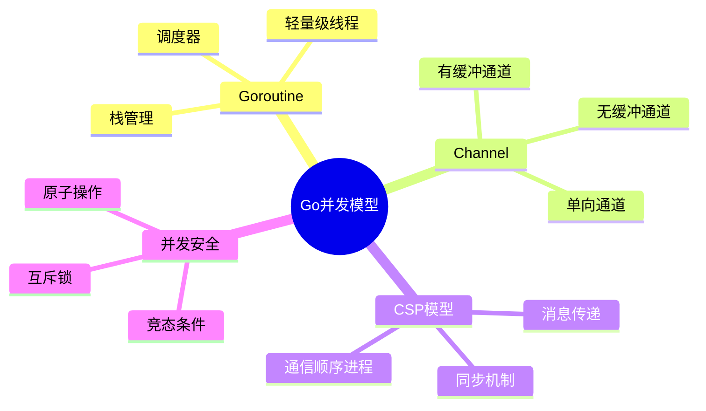
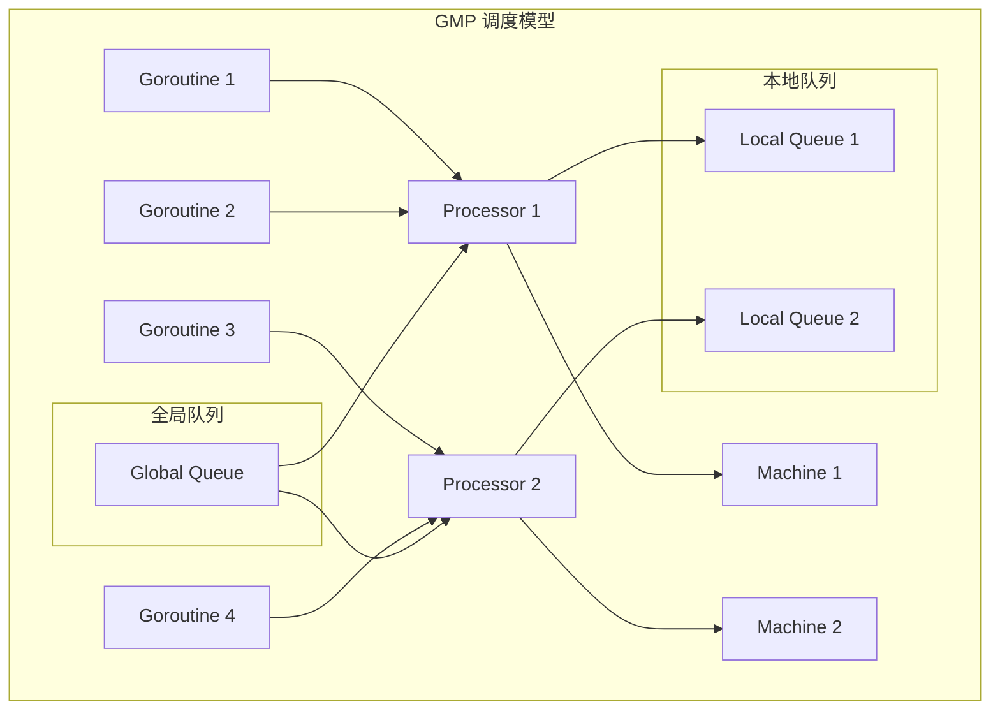
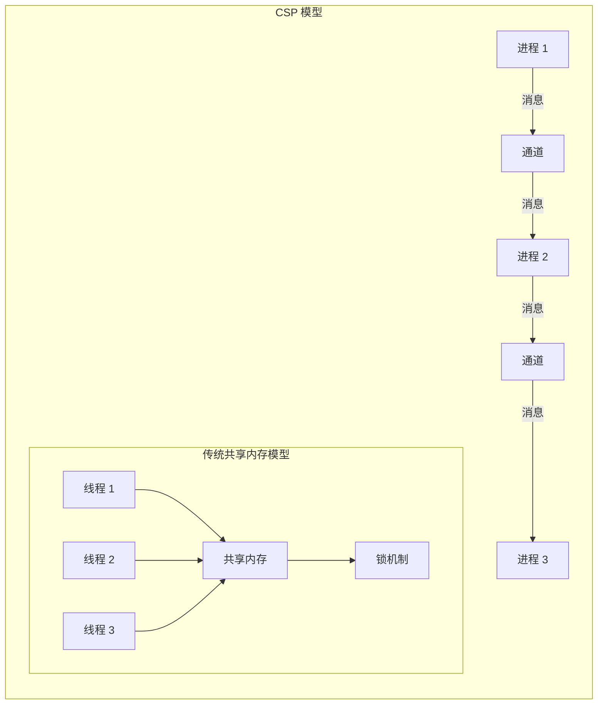

# Go 并发模型面试题

[← 返回后端面试题目录](./README.md)

## 📋 目录

- [Goroutine 基础](#goroutine-基础)
- [Channel 通信](#channel-通信)
- [CSP 模型](#csp-模型)
- [并发安全](#并发安全)
- [性能优化](#性能优化)
- [实战案例](#实战案例)

## 🎯 核心知识点



## Goroutine 基础

### 💡 初级题目

#### 1. Goroutine 与线程的区别是什么？

**答案要点：**
- **内存占用**：Goroutine 初始栈 2KB，线程 8MB
- **创建成本**：Goroutine 创建成本极低
- **调度方式**：Goroutine 由 Go 运行时调度，线程由操作系统调度
- **通信方式**：Goroutine 通过 channel 通信，线程通过共享内存

```go
package main

import (
    "fmt"
    "runtime"
    "sync"
    "time"
)

// Goroutine 基础示例
func basicGoroutineExample() {
    fmt.Println("主 goroutine 开始")
    
    // 启动多个 goroutine
    var wg sync.WaitGroup
    
    for i := 0; i < 5; i++ {
        wg.Add(1)
        go func(id int) {
            defer wg.Done()
            fmt.Printf("Goroutine %d 执行中\n", id)
            time.Sleep(time.Millisecond * 100)
            fmt.Printf("Goroutine %d 完成\n", id)
        }(i)
    }
    
    wg.Wait()
    fmt.Println("所有 goroutine 完成")
}

// 监控 goroutine 数量
func monitorGoroutines() {
    ticker := time.NewTicker(time.Second)
    defer ticker.Stop()
    
    for i := 0; i < 10; i++ {
        select {
        case <-ticker.C:
            fmt.Printf("当前 goroutine 数量: %d\n", runtime.NumGoroutine())
        }
    }
}
```

#### 2. Go 调度器 GMP 模型是什么？

**答案要点：**
- **G (Goroutine)**：用户级线程
- **M (Machine)**：操作系统线程
- **P (Processor)**：逻辑处理器，连接 G 和 M
- **调度策略**：工作窃取、抢占式调度



```go
// 调度器信息查看
func schedulerInfo() {
    fmt.Printf("GOMAXPROCS: %d\n", runtime.GOMAXPROCS(0))
    fmt.Printf("NumCPU: %d\n", runtime.NumCPU())
    fmt.Printf("NumGoroutine: %d\n", runtime.NumGoroutine())
    
    // 设置最大并行度
    runtime.GOMAXPROCS(runtime.NumCPU())
}

// 工作窃取示例
func workStealingExample() {
    const numWorkers = 4
    const numTasks = 100
    
    tasks := make(chan int, numTasks)
    results := make(chan int, numTasks)
    
    // 启动工作者
    var wg sync.WaitGroup
    for i := 0; i < numWorkers; i++ {
        wg.Add(1)
        go worker(i, tasks, results, &wg)
    }
    
    // 发送任务
    go func() {
        for i := 0; i < numTasks; i++ {
            tasks <- i
        }
        close(tasks)
    }()
    
    // 等待完成
    go func() {
        wg.Wait()
        close(results)
    }()
    
    // 收集结果
    for result := range results {
        fmt.Printf("任务 %d 完成\n", result)
    }
}

func worker(id int, tasks <-chan int, results chan<- int, wg *sync.WaitGroup) {
    defer wg.Done()
    
    for task := range tasks {
        fmt.Printf("工作者 %d 处理任务 %d\n", id, task)
        time.Sleep(time.Millisecond * 10) // 模拟工作
        results <- task
    }
}
```

### 🔥 中级题目

#### 3. 如何控制 Goroutine 的生命周期？

**答案要点：**
- **Context 包**：用于取消和超时控制
- **Done Channel**：通知 goroutine 退出
- **WaitGroup**：等待 goroutine 完成
- **优雅关闭**：确保资源清理

```go
import (
    "context"
    "fmt"
    "sync"
    "time"
)

// Goroutine 生命周期管理
type GoroutineManager struct {
    ctx    context.Context
    cancel context.CancelFunc
    wg     sync.WaitGroup
}

func NewGoroutineManager() *GoroutineManager {
    ctx, cancel := context.WithCancel(context.Background())
    return &GoroutineManager{
        ctx:    ctx,
        cancel: cancel,
    }
}

func (gm *GoroutineManager) StartWorker(name string, work func(context.Context)) {
    gm.wg.Add(1)
    go func() {
        defer gm.wg.Done()
        defer fmt.Printf("工作者 %s 退出\n", name)
        
        fmt.Printf("工作者 %s 启动\n", name)
        work(gm.ctx)
    }()
}

func (gm *GoroutineManager) Stop() {
    fmt.Println("开始停止所有工作者...")
    gm.cancel()
    gm.wg.Wait()
    fmt.Println("所有工作者已停止")
}

// 使用示例
func lifecycleExample() {
    manager := NewGoroutineManager()
    
    // 启动多个工作者
    manager.StartWorker("worker-1", func(ctx context.Context) {
        ticker := time.NewTicker(time.Second)
        defer ticker.Stop()
        
        for {
            select {
            case <-ctx.Done():
                return
            case <-ticker.C:
                fmt.Println("worker-1 执行任务")
            }
        }
    })
    
    manager.StartWorker("worker-2", func(ctx context.Context) {
        for {
            select {
            case <-ctx.Done():
                return
            default:
                fmt.Println("worker-2 执行任务")
                time.Sleep(time.Millisecond * 500)
            }
        }
    })
    
    // 运行 5 秒后停止
    time.Sleep(5 * time.Second)
    manager.Stop()
}

// 超时控制示例
func timeoutExample() {
    ctx, cancel := context.WithTimeout(context.Background(), 3*time.Second)
    defer cancel()
    
    done := make(chan bool)
    
    go func() {
        // 模拟长时间运行的任务
        time.Sleep(5 * time.Second)
        done <- true
    }()
    
    select {
    case <-done:
        fmt.Println("任务完成")
    case <-ctx.Done():
        fmt.Println("任务超时:", ctx.Err())
    }
}
```

## Channel 通信

### 💡 初级题目

#### 4. Channel 的基本用法和类型有哪些？

**答案要点：**
- **无缓冲通道**：同步通信，发送和接收必须同时准备好
- **有缓冲通道**：异步通信，可以存储一定数量的值
- **单向通道**：只能发送或只能接收
- **关闭通道**：通知接收者没有更多数据

```go
// Channel 基本用法示例
func channelBasics() {
    // 无缓冲通道
    unbuffered := make(chan int)
    
    go func() {
        unbuffered <- 42
        fmt.Println("发送完成")
    }()
    
    value := <-unbuffered
    fmt.Printf("接收到: %d\n", value)
    
    // 有缓冲通道
    buffered := make(chan string, 3)
    buffered <- "hello"
    buffered <- "world"
    buffered <- "go"
    
    fmt.Println(<-buffered) // hello
    fmt.Println(<-buffered) // world
    fmt.Println(<-buffered) // go
    
    // 单向通道
    sendOnly := make(chan<- int)    // 只能发送
    receiveOnly := make(<-chan int) // 只能接收
    
    // 通道关闭
    ch := make(chan int, 2)
    ch <- 1
    ch <- 2
    close(ch)
    
    // 接收直到通道关闭
    for value := range ch {
        fmt.Printf("接收到: %d\n", value)
    }
}

// 通道方向示例
func channelDirections() {
    ch := make(chan string, 1)
    
    // 发送函数
    send := func(ch chan<- string, message string) {
        ch <- message
    }
    
    // 接收函数
    receive := func(ch <-chan string) string {
        return <-ch
    }
    
    go send(ch, "Hello Channel")
    message := receive(ch)
    fmt.Println(message)
}
```

#### 5. Select 语句的用法和注意事项？

**答案要点：**
- **多路复用**：同时监听多个通道操作
- **非阻塞操作**：使用 default 分支
- **随机选择**：多个 case 同时准备好时随机选择
- **超时处理**：结合 time.After 实现超时

```go
// Select 语句示例
func selectExample() {
    ch1 := make(chan string)
    ch2 := make(chan string)
    
    go func() {
        time.Sleep(1 * time.Second)
        ch1 <- "来自 ch1"
    }()
    
    go func() {
        time.Sleep(2 * time.Second)
        ch2 <- "来自 ch2"
    }()
    
    for i := 0; i < 2; i++ {
        select {
        case msg1 := <-ch1:
            fmt.Println("接收到:", msg1)
        case msg2 := <-ch2:
            fmt.Println("接收到:", msg2)
        case <-time.After(3 * time.Second):
            fmt.Println("超时")
            return
        }
    }
}

// 非阻塞操作
func nonBlockingExample() {
    ch := make(chan string, 1)
    
    // 非阻塞发送
    select {
    case ch <- "hello":
        fmt.Println("发送成功")
    default:
        fmt.Println("通道已满，发送失败")
    }
    
    // 非阻塞接收
    select {
    case msg := <-ch:
        fmt.Println("接收到:", msg)
    default:
        fmt.Println("通道为空，接收失败")
    }
}

// 扇入模式 - 多个输入合并到一个输出
func fanIn(input1, input2 <-chan string) <-chan string {
    output := make(chan string)
    
    go func() {
        defer close(output)
        for {
            select {
            case msg, ok := <-input1:
                if !ok {
                    input1 = nil
                } else {
                    output <- msg
                }
            case msg, ok := <-input2:
                if !ok {
                    input2 = nil
                } else {
                    output <- msg
                }
            }
            
            if input1 == nil && input2 == nil {
                break
            }
        }
    }()
    
    return output
}

// 扇出模式 - 一个输入分发到多个输出
func fanOut(input <-chan string, workers int) []<-chan string {
    outputs := make([]<-chan string, workers)
    
    for i := 0; i < workers; i++ {
        output := make(chan string)
        outputs[i] = output
        
        go func(out chan<- string) {
            defer close(out)
            for msg := range input {
                out <- msg
            }
        }(output)
    }
    
    return outputs
}
```

### 🔥 中级题目

#### 6. 如何实现通道池和工作池模式？

**答案要点：**
- **工作池**：固定数量的工作者处理任务
- **通道池**：复用通道对象减少 GC 压力
- **任务分发**：合理分配任务到工作者
- **结果收集**：汇总处理结果

```go
import (
    "fmt"
    "sync"
    "time"
)

// 工作池实现
type WorkerPool struct {
    workerCount int
    taskQueue   chan Task
    resultQueue chan Result
    wg          sync.WaitGroup
    quit        chan bool
}

type Task struct {
    ID   int
    Data interface{}
}

type Result struct {
    TaskID int
    Data   interface{}
    Error  error
}

func NewWorkerPool(workerCount, queueSize int) *WorkerPool {
    return &WorkerPool{
        workerCount: workerCount,
        taskQueue:   make(chan Task, queueSize),
        resultQueue: make(chan Result, queueSize),
        quit:        make(chan bool),
    }
}

func (wp *WorkerPool) Start() {
    for i := 0; i < wp.workerCount; i++ {
        wp.wg.Add(1)
        go wp.worker(i)
    }
}

func (wp *WorkerPool) worker(id int) {
    defer wp.wg.Done()
    
    fmt.Printf("工作者 %d 启动\n", id)
    
    for {
        select {
        case task := <-wp.taskQueue:
            fmt.Printf("工作者 %d 处理任务 %d\n", id, task.ID)
            result := wp.processTask(task)
            wp.resultQueue <- result
            
        case <-wp.quit:
            fmt.Printf("工作者 %d 退出\n", id)
            return
        }
    }
}

func (wp *WorkerPool) processTask(task Task) Result {
    // 模拟任务处理
    time.Sleep(time.Millisecond * 100)
    
    return Result{
        TaskID: task.ID,
        Data:   fmt.Sprintf("处理结果: %v", task.Data),
        Error:  nil,
    }
}

func (wp *WorkerPool) Submit(task Task) {
    wp.taskQueue <- task
}

func (wp *WorkerPool) GetResult() <-chan Result {
    return wp.resultQueue
}

func (wp *WorkerPool) Stop() {
    close(wp.quit)
    wp.wg.Wait()
    close(wp.taskQueue)
    close(wp.resultQueue)
}

// 通道池实现
type ChannelPool struct {
    pool sync.Pool
    size int
}

func NewChannelPool(size int) *ChannelPool {
    return &ChannelPool{
        pool: sync.Pool{
            New: func() interface{} {
                return make(chan interface{}, size)
            },
        },
        size: size,
    }
}

func (cp *ChannelPool) Get() chan interface{} {
    return cp.pool.Get().(chan interface{})
}

func (cp *ChannelPool) Put(ch chan interface{}) {
    // 清空通道
    for len(ch) > 0 {
        <-ch
    }
    cp.pool.Put(ch)
}

// 使用示例
func workerPoolExample() {
    pool := NewWorkerPool(3, 10)
    pool.Start()
    
    // 提交任务
    go func() {
        for i := 0; i < 10; i++ {
            task := Task{
                ID:   i,
                Data: fmt.Sprintf("任务数据 %d", i),
            }
            pool.Submit(task)
        }
    }()
    
    // 收集结果
    go func() {
        for result := range pool.GetResult() {
            fmt.Printf("收到结果: 任务 %d - %s\n", result.TaskID, result.Data)
        }
    }()
    
    time.Sleep(2 * time.Second)
    pool.Stop()
}
```

## CSP 模型

### 🔥 中级题目

#### 7. CSP (Communicating Sequential Processes) 模型的核心思想是什么？

**答案要点：**
- **通信顺序进程**：通过消息传递进行通信
- **不共享内存**：避免共享状态的竞态条件
- **同步通信**：发送和接收操作同步进行
- **组合性**：可以组合简单的进程构建复杂系统



```go
// CSP 模型示例 - 生产者消费者
func cspProducerConsumer() {
    // 创建通道
    dataChannel := make(chan int, 5)
    doneChannel := make(chan bool)
    
    // 生产者
    go func() {
        defer close(dataChannel)
        for i := 0; i < 10; i++ {
            fmt.Printf("生产: %d\n", i)
            dataChannel <- i
            time.Sleep(time.Millisecond * 100)
        }
    }()
    
    // 消费者
    go func() {
        defer func() { doneChannel <- true }()
        for data := range dataChannel {
            fmt.Printf("消费: %d\n", data)
            time.Sleep(time.Millisecond * 200)
        }
    }()
    
    <-doneChannel
    fmt.Println("生产消费完成")
}

// 管道模式 - 数据流处理
func pipelinePattern() {
    // 数据源
    source := func() <-chan int {
        out := make(chan int)
        go func() {
            defer close(out)
            for i := 1; i <= 10; i++ {
                out <- i
            }
        }()
        return out
    }
    
    // 处理阶段1：平方
    square := func(in <-chan int) <-chan int {
        out := make(chan int)
        go func() {
            defer close(out)
            for n := range in {
                out <- n * n
            }
        }()
        return out
    }
    
    // 处理阶段2：过滤偶数
    filterEven := func(in <-chan int) <-chan int {
        out := make(chan int)
        go func() {
            defer close(out)
            for n := range in {
                if n%2 == 0 {
                    out <- n
                }
            }
        }()
        return out
    }
    
    // 构建管道
    pipeline := filterEven(square(source()))
    
    // 输出结果
    for result := range pipeline {
        fmt.Printf("结果: %d\n", result)
    }
}
```

#### 8. 如何实现基于 CSP 的并发服务器？

**答案要点：**
- **请求处理**：每个请求在独立的 goroutine 中处理
- **服务发现**：通过通道进行服务注册和发现
- **负载均衡**：请求分发到不同的处理器
- **错误处理**：通过通道传递错误信息

```go
import (
    "context"
    "fmt"
    "math/rand"
    "sync"
    "time"
)

// 基于 CSP 的并发服务器
type CSPServer struct {
    requestChan  chan Request
    responseChan chan Response
    workerPool   []*Worker
    registry     *ServiceRegistry
    ctx          context.Context
    cancel       context.CancelFunc
    wg           sync.WaitGroup
}

type Request struct {
    ID      string
    Service string
    Data    interface{}
    ReplyTo chan Response
}

type Response struct {
    RequestID string
    Data      interface{}
    Error     error
}

type Worker struct {
    ID       int
    requests chan Request
    quit     chan bool
}

type ServiceRegistry struct {
    services map[string][]ServiceHandler
    mu       sync.RWMutex
}

type ServiceHandler func(interface{}) (interface{}, error)

func NewCSPServer(workerCount int) *CSPServer {
    ctx, cancel := context.WithCancel(context.Background())
    
    server := &CSPServer{
        requestChan:  make(chan Request, 100),
        responseChan: make(chan Response, 100),
        workerPool:   make([]*Worker, workerCount),
        registry:     NewServiceRegistry(),
        ctx:          ctx,
        cancel:       cancel,
    }
    
    // 创建工作者
    for i := 0; i < workerCount; i++ {
        server.workerPool[i] = &Worker{
            ID:       i,
            requests: make(chan Request, 10),
            quit:     make(chan bool),
        }
    }
    
    return server
}

func NewServiceRegistry() *ServiceRegistry {
    return &ServiceRegistry{
        services: make(map[string][]ServiceHandler),
    }
}

func (sr *ServiceRegistry) Register(service string, handler ServiceHandler) {
    sr.mu.Lock()
    defer sr.mu.Unlock()
    sr.services[service] = append(sr.services[service], handler)
}

func (sr *ServiceRegistry) GetHandler(service string) (ServiceHandler, bool) {
    sr.mu.RLock()
    defer sr.mu.RUnlock()
    
    handlers, exists := sr.services[service]
    if !exists || len(handlers) == 0 {
        return nil, false
    }
    
    // 简单的负载均衡 - 随机选择
    handler := handlers[rand.Intn(len(handlers))]
    return handler, true
}

func (s *CSPServer) Start() {
    // 启动请求分发器
    s.wg.Add(1)
    go s.requestDispatcher()
    
    // 启动工作者
    for _, worker := range s.workerPool {
        s.wg.Add(1)
        go s.startWorker(worker)
    }
    
    fmt.Println("CSP 服务器启动")
}

func (s *CSPServer) requestDispatcher() {
    defer s.wg.Done()
    
    for {
        select {
        case request := <-s.requestChan:
            // 选择工作者 - 简单轮询
            worker := s.selectWorker()
            select {
            case worker.requests <- request:
                // 请求已分发
            case <-time.After(time.Second):
                // 工作者忙碌，返回错误
                if request.ReplyTo != nil {
                    request.ReplyTo <- Response{
                        RequestID: request.ID,
                        Error:     fmt.Errorf("服务器忙碌"),
                    }
                }
            }
            
        case <-s.ctx.Done():
            return
        }
    }
}

func (s *CSPServer) selectWorker() *Worker {
    // 简单的轮询选择
    return s.workerPool[rand.Intn(len(s.workerPool))]
}

func (s *CSPServer) startWorker(worker *Worker) {
    defer s.wg.Done()
    
    fmt.Printf("工作者 %d 启动\n", worker.ID)
    
    for {
        select {
        case request := <-worker.requests:
            response := s.processRequest(request)
            if request.ReplyTo != nil {
                request.ReplyTo <- response
            }
            
        case <-worker.quit:
            fmt.Printf("工作者 %d 退出\n", worker.ID)
            return
            
        case <-s.ctx.Done():
            return
        }
    }
}

func (s *CSPServer) processRequest(request Request) Response {
    handler, exists := s.registry.GetHandler(request.Service)
    if !exists {
        return Response{
            RequestID: request.ID,
            Error:     fmt.Errorf("服务 %s 不存在", request.Service),
        }
    }
    
    data, err := handler(request.Data)
    return Response{
        RequestID: request.ID,
        Data:      data,
        Error:     err,
    }
}

func (s *CSPServer) RegisterService(service string, handler ServiceHandler) {
    s.registry.Register(service, handler)
}

func (s *CSPServer) HandleRequest(request Request) <-chan Response {
    responseChan := make(chan Response, 1)
    request.ReplyTo = responseChan
    
    select {
    case s.requestChan <- request:
        return responseChan
    case <-time.After(time.Second):
        response := Response{
            RequestID: request.ID,
            Error:     fmt.Errorf("请求超时"),
        }
        responseChan <- response
        return responseChan
    }
}

func (s *CSPServer) Stop() {
    fmt.Println("停止 CSP 服务器...")
    s.cancel()
    
    // 停止所有工作者
    for _, worker := range s.workerPool {
        close(worker.quit)
    }
    
    s.wg.Wait()
    fmt.Println("CSP 服务器已停止")
}

// 使用示例
func cspServerExample() {
    server := NewCSPServer(3)
    
    // 注册服务
    server.RegisterService("echo", func(data interface{}) (interface{}, error) {
        return fmt.Sprintf("Echo: %v", data), nil
    })
    
    server.RegisterService("math", func(data interface{}) (interface{}, error) {
        if num, ok := data.(int); ok {
            return num * num, nil
        }
        return nil, fmt.Errorf("需要整数参数")
    })
    
    server.Start()
    
    // 发送请求
    for i := 0; i < 5; i++ {
        request := Request{
            ID:      fmt.Sprintf("req-%d", i),
            Service: "echo",
            Data:    fmt.Sprintf("消息 %d", i),
        }
        
        responseChan := server.HandleRequest(request)
        go func(i int) {
            response := <-responseChan
            if response.Error != nil {
                fmt.Printf("请求 %d 错误: %v\n", i, response.Error)
            } else {
                fmt.Printf("请求 %d 响应: %v\n", i, response.Data)
            }
        }(i)
    }
    
    time.Sleep(2 * time.Second)
    server.Stop()
}
```

## 并发安全

### 🔥 中级题目

#### 9. 如何避免竞态条件和数据竞争？

**答案要点：**
- **使用通道**：通过消息传递避免共享状态
- **互斥锁**：保护共享资源的访问
- **原子操作**：对简单类型进行原子操作
- **竞态检测**：使用 `go run -race` 检测竞态条件

```go
import (
    "sync"
    "sync/atomic"
    "time"
)

// 竞态条件示例和解决方案
type Counter struct {
    mu    sync.Mutex
    value int64
}

// 不安全的计数器
type UnsafeCounter struct {
    value int64
}

func (c *UnsafeCounter) Increment() {
    c.value++ // 竞态条件
}

func (c *UnsafeCounter) Value() int64 {
    return c.value // 竞态条件
}

// 使用互斥锁的安全计数器
func (c *Counter) Increment() {
    c.mu.Lock()
    defer c.mu.Unlock()
    c.value++
}

func (c *Counter) Value() int64 {
    c.mu.Lock()
    defer c.mu.Unlock()
    return c.value
}

// 使用原子操作的计数器
type AtomicCounter struct {
    value int64
}

func (c *AtomicCounter) Increment() {
    atomic.AddInt64(&c.value, 1)
}

func (c *AtomicCounter) Value() int64 {
    return atomic.LoadInt64(&c.value)
}

// 使用通道的计数器
type ChannelCounter struct {
    ch chan int
    value int64
}

func NewChannelCounter() *ChannelCounter {
    cc := &ChannelCounter{
        ch: make(chan int),
    }
    
    go func() {
        for increment := range cc.ch {
            cc.value += int64(increment)
        }
    }()
    
    return cc
}

func (c *ChannelCounter) Increment() {
    c.ch <- 1
}

func (c *ChannelCounter) Value() int64 {
    // 注意：这里仍然有竞态条件，实际使用中需要通过通道查询
    return atomic.LoadInt64(&c.value)
}

// 性能比较测试
func compareCounters() {
    const iterations = 1000000
    const goroutines = 10
    
    // 测试不安全计数器（会有竞态条件）
    fmt.Println("测试不安全计数器:")
    unsafeCounter := &UnsafeCounter{}
    testCounter(unsafeCounter, iterations, goroutines)
    
    // 测试互斥锁计数器
    fmt.Println("测试互斥锁计数器:")
    mutexCounter := &Counter{}
    testCounter(mutexCounter, iterations, goroutines)
    
    // 测试原子操作计数器
    fmt.Println("测试原子操作计数器:")
    atomicCounter := &AtomicCounter{}
    testCounter(atomicCounter, iterations, goroutines)
}

type CounterInterface interface {
    Increment()
    Value() int64
}

func testCounter(counter CounterInterface, iterations, goroutines int) {
    start := time.Now()
    
    var wg sync.WaitGroup
    for i := 0; i < goroutines; i++ {
        wg.Add(1)
        go func() {
            defer wg.Done()
            for j := 0; j < iterations/goroutines; j++ {
                counter.Increment()
            }
        }()
    }
    
    wg.Wait()
    duration := time.Since(start)
    
    fmt.Printf("期望值: %d, 实际值: %d, 耗时: %v\n", 
        iterations, counter.Value(), duration)
}
```

### ⚡ 高级题目

#### 10. 实现一个并发安全的缓存系统

**答案要点：**
- **读写锁**：优化读多写少的场景
- **分片锁**：减少锁竞争
- **LRU 淘汰**：内存管理策略
- **过期机制**：自动清理过期数据

```go
import (
    "container/list"
    "sync"
    "time"
)

// 并发安全的 LRU 缓存
type ConcurrentLRUCache struct {
    capacity int
    shards   []*CacheShard
    shardNum int
    hash     func(string) uint32
}

type CacheShard struct {
    mu       sync.RWMutex
    capacity int
    items    map[string]*list.Element
    lruList  *list.List
}

type CacheItem struct {
    key        string
    value      interface{}
    expireTime time.Time
}

func NewConcurrentLRUCache(capacity, shardNum int) *ConcurrentLRUCache {
    cache := &ConcurrentLRUCache{
        capacity: capacity,
        shardNum: shardNum,
        shards:   make([]*CacheShard, shardNum),
        hash:     fnv32Hash,
    }
    
    shardCapacity := capacity / shardNum
    if shardCapacity == 0 {
        shardCapacity = 1
    }
    
    for i := 0; i < shardNum; i++ {
        cache.shards[i] = &CacheShard{
            capacity: shardCapacity,
            items:    make(map[string]*list.Element),
            lruList:  list.New(),
        }
    }
    
    // 启动清理 goroutine
    go cache.cleanupExpired()
    
    return cache
}

func (c *ConcurrentLRUCache) getShard(key string) *CacheShard {
    return c.shards[c.hash(key)%uint32(c.shardNum)]
}

func (c *ConcurrentLRUCache) Set(key string, value interface{}, ttl time.Duration) {
    shard := c.getShard(key)
    shard.set(key, value, ttl)
}

func (c *ConcurrentLRUCache) Get(key string) (interface{}, bool) {
    shard := c.getShard(key)
    return shard.get(key)
}

func (c *ConcurrentLRUCache) Delete(key string) {
    shard := c.getShard(key)
    shard.delete(key)
}

func (s *CacheShard) set(key string, value interface{}, ttl time.Duration) {
    s.mu.Lock()
    defer s.mu.Unlock()
    
    var expireTime time.Time
    if ttl > 0 {
        expireTime = time.Now().Add(ttl)
    }
    
    item := &CacheItem{
        key:        key,
        value:      value,
        expireTime: expireTime,
    }
    
    if elem, exists := s.items[key]; exists {
        // 更新现有项
        s.lruList.MoveToFront(elem)
        elem.Value = item
    } else {
        // 添加新项
        if s.lruList.Len() >= s.capacity {
            s.evictLRU()
        }
        elem := s.lruList.PushFront(item)
        s.items[key] = elem
    }
}

func (s *CacheShard) get(key string) (interface{}, bool) {
    s.mu.Lock()
    defer s.mu.Unlock()
    
    elem, exists := s.items[key]
    if !exists {
        return nil, false
    }
    
    item := elem.Value.(*CacheItem)
    
    // 检查是否过期
    if !item.expireTime.IsZero() && time.Now().After(item.expireTime) {
        s.removeLocked(elem)
        return nil, false
    }
    
    // 移动到前面（最近使用）
    s.lruList.MoveToFront(elem)
    return item.value, true
}

func (s *CacheShard) delete(key string) {
    s.mu.Lock()
    defer s.mu.Unlock()
    
    if elem, exists := s.items[key]; exists {
        s.removeLocked(elem)
    }
}

func (s *CacheShard) evictLRU() {
    elem := s.lruList.Back()
    if elem != nil {
        s.removeLocked(elem)
    }
}

func (s *CacheShard) removeLocked(elem *list.Element) {
    item := elem.Value.(*CacheItem)
    delete(s.items, item.key)
    s.lruList.Remove(elem)
}

func (c *ConcurrentLRUCache) cleanupExpired() {
    ticker := time.NewTicker(time.Minute)
    defer ticker.Stop()
    
    for range ticker.C {
        now := time.Now()
        for _, shard := range c.shards {
            shard.cleanupExpiredItems(now)
        }
    }
}

func (s *CacheShard) cleanupExpiredItems(now time.Time) {
    s.mu.Lock()
    defer s.mu.Unlock()
    
    var toRemove []*list.Element
    
    for elem := s.lruList.Back(); elem != nil; elem = elem.Prev() {
        item := elem.Value.(*CacheItem)
        if !item.expireTime.IsZero() && now.After(item.expireTime) {
            toRemove = append(toRemove, elem)
        }
    }
    
    for _, elem := range toRemove {
        s.removeLocked(elem)
    }
}

// 简单的 FNV-32 哈希函数
func fnv32Hash(key string) uint32 {
    hash := uint32(2166136261)
    const prime32 = uint32(16777619)
    
    for i := 0; i < len(key); i++ {
        hash *= prime32
        hash ^= uint32(key[i])
    }
    
    return hash
}

// 缓存统计信息
func (c *ConcurrentLRUCache) Stats() map[string]interface{} {
    stats := make(map[string]interface{})
    totalItems := 0
    
    for i, shard := range c.shards {
        shard.mu.RLock()
        shardSize := len(shard.items)
        shard.mu.RUnlock()
        
        stats[fmt.Sprintf("shard_%d_size", i)] = shardSize
        totalItems += shardSize
    }
    
    stats["total_items"] = totalItems
    stats["capacity"] = c.capacity
    stats["shard_count"] = c.shardNum
    
    return stats
}

// 使用示例
func cacheExample() {
    cache := NewConcurrentLRUCache(1000, 16)
    
    // 并发写入
    var wg sync.WaitGroup
    for i := 0; i < 100; i++ {
        wg.Add(1)
        go func(i int) {
            defer wg.Done()
            key := fmt.Sprintf("key_%d", i)
            value := fmt.Sprintf("value_%d", i)
            cache.Set(key, value, time.Minute)
        }(i)
    }
    
    wg.Wait()
    
    // 并发读取
    for i := 0; i < 100; i++ {
        wg.Add(1)
        go func(i int) {
            defer wg.Done()
            key := fmt.Sprintf("key_%d", i)
            if value, found := cache.Get(key); found {
                fmt.Printf("找到 %s: %s\n", key, value)
            }
        }(i)
    }
    
    wg.Wait()
    
    // 打印统计信息
    fmt.Printf("缓存统计: %+v\n", cache.Stats())
}
```

## 🔗 相关链接

- [← 返回后端面试题目录](./README.md)
- [Go 语言基础面试题](./go-basics.md)
- [Go Web 框架面试题](./go-web-frameworks.md)
- [性能优化面试题](./performance-optimization.md)
- [分布式系统面试题](./distributed-systems.md)

---

*深入理解 Go 并发模型，掌握高性能并发编程* 🚀 