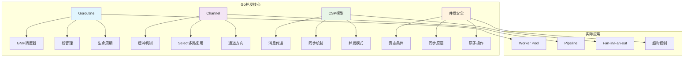

# Go并发模型面试题

[← 返回后端面试题目录](./README.md)

## 📚 题目概览

Go语言的并发模型是其最重要的特性之一，基于CSP（Communicating Sequential Processes）理论设计。本章节重点考察候选人对Goroutine、Channel、调度器等核心概念的理解，以及在实际项目中的应用能力。

## 🎯 核心技术考察重点

### Goroutine与调度器
- GMP调度模型的工作原理
- Goroutine的生命周期管理
- 调度器的抢占式调度机制
- 工作窃取算法的实现

### Channel通信机制
- 有缓冲与无缓冲通道的区别
- Select语句的多路复用
- 通道的关闭和方向性
- 通道在并发模式中的应用

### 并发安全与同步
- 竞态条件的识别和避免
- 互斥锁与读写锁的使用场景
- 原子操作的性能优势
- Context包的超时和取消机制

## 📊 知识结构关联图

## 📝 核心面试题目

### Goroutine基础 💡

#### 题目1：Goroutine与线程的本质区别
**问题背景**：在高并发系统设计中，需要理解Goroutine相比传统线程的优势

**技术挑战**：
- 内存占用和创建成本的对比分析
- 调度机制的差异及其影响
- 通信方式选择的权衡

**考察要点**：
- GMP调度模型的深度理解
- 栈空间管理和动态扩容机制
- 协作式vs抢占式调度的优劣势

**📁 完整解决方案**：[Goroutine调度器实现详解](../../solutions/common/goroutine-scheduler.md)

#### 题目2：GMP调度器工作原理
**问题背景**：理解Go运行时调度器的核心机制，优化高并发程序性能

**技术挑战**：
- P（Processor）的作用和数量配置
- 工作窃取算法的实现原理
- 系统调用对调度的影响

**考察要点**：
- 全局队列vs本地队列的调度策略
- 抢占式调度的触发时机
- GOMAXPROCS参数的调优

**📁 完整解决方案**：[GMP调度器深度解析](../../solutions/common/gmp-scheduler.md)

### Channel通信机制 🔥

#### 题目3：Channel的设计模式应用
**问题背景**：在微服务架构中，使用Channel实现高效的并发通信模式

**技术挑战**：
- Worker Pool模式的实现和调优
- Pipeline模式的数据流控制
- Fan-in/Fan-out模式的负载均衡

**考察要点**：
- 有缓冲通道的容量设计
- Select语句的性能优化
- 通道关闭的最佳实践

**📁 完整解决方案**：[Channel并发模式实现](../../solutions/common/channel-patterns.md)

#### 题目4：Select语句的高级应用
**问题背景**：实现复杂的异步操作控制，包括超时、取消和优先级处理

**技术挑战**：
- 多通道的优先级调度
- 非阻塞操作的实现
- 超时机制的精确控制

**考察要点**：
- Default分支的使用场景
- time.After的内存泄漏问题
- Context包与Select的结合

**📁 完整解决方案**：[Select语句最佳实践](../../solutions/common/select-advanced.md)

### CSP并发模型 ⚡

#### 题目5：CSP模型在实际项目中的应用
**问题背景**：设计一个高性能的数据处理管道，体现CSP模型的优势

**技术挑战**：
- 消息传递vs共享内存的选择
- 背压（Backpressure）机制的实现
- 错误处理和恢复策略

**考察要点**：
- "不要通过共享内存来通信"的理解
- 管道模式的扩展性设计
- 流量控制和限流机制

**📁 完整解决方案**：[CSP模型数据管道实现](../../solutions/common/csp-pipeline.md)

### 并发安全控制 🛡️

#### 题目6：并发安全的最佳实践
**问题背景**：在高并发场景下，确保数据一致性和避免竞态条件

**技术挑战**：
- 锁的粒度控制和性能优化
- 无锁编程的适用场景
- 死锁检测和预防机制

**考察要点**：
- sync包各种同步原语的使用
- 原子操作的性能优势
- 内存模型和可见性保证

**📁 完整解决方案**：[Go并发安全实现指南](../../solutions/common/concurrency-safety.md)

## 📊 面试评分标准

### 基础理解 (30分)
- **概念掌握**：能清晰解释Goroutine、Channel、CSP模型等核心概念
- **原理理解**：理解GMP调度器的工作原理和设计思想
- **语法熟练**：熟练使用Go并发相关的语法和API

### 实践应用 (40分)
- **模式应用**：能够选择合适的并发模式解决实际问题
- **性能优化**：理解并发程序的性能瓶颈和优化方法
- **错误处理**：具备完善的错误处理和资源管理能力

### 架构设计 (30分)
- **系统思维**：能够设计可扩展的并发系统架构
- **权衡分析**：理解不同并发方案的优劣势和适用场景
- **生产实践**：具备生产环境的并发程序调试和监控经验

## 🎯 备考建议

### 学习路径
1. **基础概念**：深入理解Goroutine和Channel的工作原理
2. **调度器原理**：学习GMP模型和Go运行时的实现细节
3. **并发模式**：掌握常见的并发设计模式和最佳实践
4. **性能调优**：学习并发程序的性能分析和优化技巧
5. **实战项目**：通过实际项目积累并发编程经验

### 推荐资源
- 《Go语言实战》- 并发编程章节
- 《Go并发编程实战》- 深度讲解并发机制
- Go官方博客关于调度器的文章
- Dave Cheney的Go性能优化博客

## 🔗 相关资源链接

- [Go基础知识面试题](./go-basics.md)
- [Go Web框架面试题](./go-web-frameworks.md)
- [分布式系统面试题](./distributed-systems.md)
- [性能优化面试题](./performance-optimization.md)
- [← 返回后端面试题目录](./README.md)

---

*深入理解Go并发模型，掌握高性能并发程序设计* 🚀 