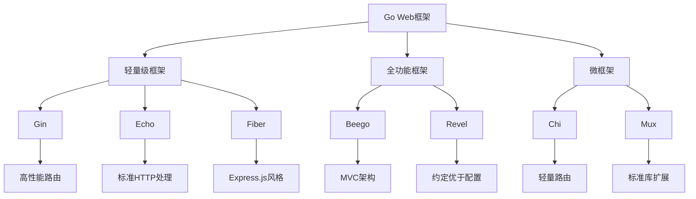

# Go Web框架面试题

[← 返回后端面试题目录](./README.md)

## 📚 题目概览

本部分考察Go语言Web开发框架的选择、使用和优化能力，重点关注主流框架的特性对比、架构设计和实践经验。

## 🎯 核心技术考察重点

### Go Web框架生态
- **轻量级框架**：Gin、Echo、Fiber的特性和适用场景
- **全功能框架**：Beego、Revel的MVC架构实现
- **微框架**：Chi、Mux的路由设计理念

### 框架核心机制
- **中间件设计**：中间件链的执行机制和自定义实现
- **路由系统**：路由匹配算法和性能优化
- **数据绑定**：JSON/XML数据的验证和转换机制

### 性能与选型
- **性能对比**：不同框架的吞吐量和内存使用对比
- **技术选型**：根据项目需求选择合适的框架
- **生产实践**：大规模应用中的框架使用经验

## 📊 知识结构关联图

## 📝 核心面试题目

### Go框架特性对比 [中级]

#### 题目1：Gin框架的核心特性和适用场景
**问题背景**：在微服务架构中需要选择合适的Go Web框架

**技术挑战**：
- 高并发场景下的性能要求
- 中间件机制的灵活性需求
- JSON数据处理的便捷性
- 路由设计的扩展性

**考察要点**：
- Gin框架基于httprouter的性能优势
- 中间件链的执行机制和自定义方法
- 数据绑定和验证的内置支持
- 路由分组和参数处理能力

**📁 完整解决方案**：[Gin框架核心特性实现](../../solutions/common/gin-framework-features.md)

#### 题目2：Echo与Gin框架的技术对比分析
**问题背景**：团队需要在Echo和Gin之间做技术选型决策

**技术挑战**：
- 框架性能和资源消耗对比
- API设计理念的差异分析
- 中间件生态的完整性
- 社区活跃度和维护状况

**考察要点**：
- 两个框架的架构设计差异
- HTTP处理方式和性能特点
- 中间件实现机制的对比
- 实际项目中的选择依据

**📁 完整解决方案**：[Go Web框架选型对比](../../solutions/common/go-web-framework-comparison.md)

### 中间件机制设计 [中级]

#### 题目3：自定义中间件的设计与实现
**问题背景**：需要实现统一的认证、日志和错误处理中间件

**技术挑战**：
- 中间件执行顺序的控制
- 请求上下文的传递机制
- 错误处理和中断机制
- 性能监控和日志记录

**考察要点**：
- 中间件函数签名和执行流程
- Context对象的使用和数据传递
- Next()和Abort()方法的作用机制
- 中间件链的组合和复用策略

**📁 完整解决方案**：[Go中间件机制实现](../../solutions/common/go-middleware-system.md)

### 框架架构设计 [高级]

#### 题目4：Beego框架的MVC架构实现原理
**问题背景**：理解全功能框架的架构设计和实现机制

**技术挑战**：
- MVC模式在Go中的实现方式
- ORM层与数据库的集成
- 模板引擎的选择和使用
- 配置管理和依赖注入

**考察要点**：
- Model层的ORM设计和数据访问
- View层的模板渲染机制
- Controller层的请求处理流程
- 框架级别的功能集成方案

**📁 完整解决方案**：[Beego MVC架构分析](../../solutions/common/beego-mvc-architecture.md)

### 性能优化实践 [高级]

#### 题目5：Go Web框架的性能优化策略
**问题背景**：在高并发场景下优化Web应用性能

**技术挑战**：
- 路由匹配算法的优化
- 内存分配和垃圾回收优化
- 连接池和资源管理
- 缓存策略和数据预处理

**考察要点**：
- 不同框架的性能特点分析
- 路由树和匹配算法优化
- 内存零分配的实现技巧
- 生产环境的监控和调优

**📁 完整解决方案**：[Go Web性能优化实践](../../solutions/common/go-web-performance-optimization.md)

#### 题目6：微服务架构中的框架选型策略
**问题背景**：在微服务架构中选择合适的Go Web框架

**技术挑战**：
- 服务间通信的效率要求
- 框架的轻量化和启动速度
- 监控和链路追踪的集成
- 容器化部署的适配性

**考察要点**：
- 微服务场景下的框架特性需求
- 服务发现和负载均衡集成
- 分布式追踪和监控支持
- 云原生环境的适配能力

**📁 完整解决方案**：[微服务Go框架选型](../../solutions/common/microservice-go-framework-selection.md)

## 📊 面试评分标准

### 基础知识 (30分)
- Go Web框架生态的了解程度
- 主流框架特性的掌握情况
- 基本概念和术语的准确性

### 技术深度 (40分)
- 框架内部机制的理解深度
- 中间件和路由系统的原理掌握
- 性能优化策略的实践经验

### 实践能力 (30分)
- 框架选型的决策能力
- 实际项目中的应用经验
- 问题诊断和解决能力

## 🎯 备考建议

### 理论学习路径
1. **框架基础**：了解Go Web开发的基本概念和生态
2. **核心机制**：深入学习中间件、路由、数据绑定等核心机制
3. **架构设计**：理解不同框架的设计理念和适用场景
4. **性能优化**：掌握Web应用的性能优化策略

### 实践项目建议
1. **框架对比项目**：使用不同框架实现相同功能进行对比
2. **中间件开发**：开发通用的认证、日志、监控中间件
3. **性能测试**：对不同框架进行压力测试和性能分析
4. **微服务实践**：在微服务架构中应用Go Web框架

## 🔗 相关资源链接

- [Go Web开发基础](./go-basics.md)
- [Go并发编程](./go-concurrency.md)
- [API设计最佳实践](./api-design.md)
- [微服务架构设计](./microservices.md) 