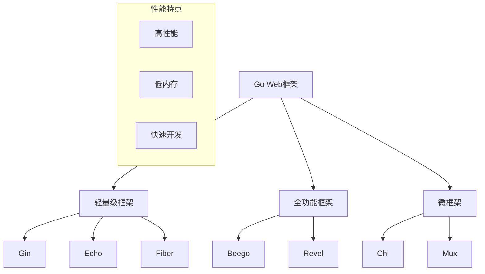
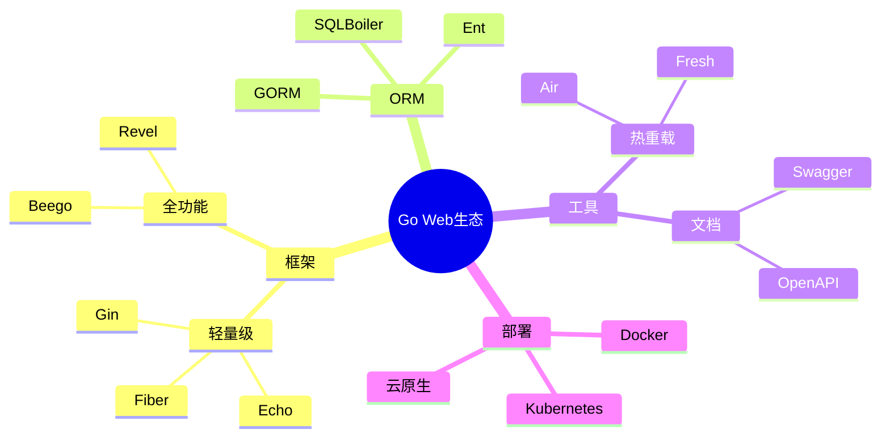

# Go Web 框架面试题

[← 返回后端面试题目录](./README.md)

## 🎯 核心知识点

- Gin 框架特性
- Echo 框架架构
- Beego 框架生态
- 中间件机制
- 路由设计
- 性能对比
- 项目选型

## 📊 Go Web 框架对比



## 💡 面试题目

### **初级题目**

#### 1. Gin框架的主要特性有哪些？

**答案要点：**
- 高性能：基于httprouter，速度快
- 中间件支持：灵活的中间件机制
- JSON验证：内置数据绑定和验证
- 路由分组：支持路由分组
- 错误管理：统一的错误处理
- 零分配路由：高效的内存使用

```go
package main

import (
    "github.com/gin-gonic/gin"
    "net/http"
)

func main() {
    r := gin.Default()
    
    // 基本路由
    r.GET("/ping", func(c *gin.Context) {
        c.JSON(http.StatusOK, gin.H{
            "message": "pong",
        })
    })
    
    // 路由参数
    r.GET("/user/:name", func(c *gin.Context) {
        name := c.Param("name")
        c.String(http.StatusOK, "Hello %s", name)
    })
    
    r.Run(":8080")
}
```

#### 2. Echo框架与Gin框架有什么区别？

**答案要点：**
- **性能**：Echo和Gin性能相近，都很高效
- **API设计**：Echo更注重标准HTTP处理，Gin更简洁
- **中间件**：两者都支持中间件，但实现方式略有不同
- **社区**：Gin社区更大，生态更丰富
- **文档**：两者文档都比较完善

```go
// Echo 示例
package main

import (
    "github.com/labstack/echo/v4"
    "github.com/labstack/echo/v4/middleware"
    "net/http"
)

func main() {
    e := echo.New()
    
    // 中间件
    e.Use(middleware.Logger())
    e.Use(middleware.Recover())
    
    // 路由
    e.GET("/", hello)
    e.GET("/users/:id", getUser)
    
    e.Logger.Fatal(e.Start(":1323"))
}

func hello(c echo.Context) error {
    return c.String(http.StatusOK, "Hello, World!")
}

func getUser(c echo.Context) error {
    id := c.Param("id")
    return c.String(http.StatusOK, id)
}
```

#### 3. Beego框架的MVC架构是如何实现的？

**答案要点：**
- **Model**：数据模型，使用ORM
- **View**：模板系统，支持多种模板引擎
- **Controller**：控制器，处理请求逻辑
- **配置驱动**：通过配置文件管理应用
- **自动化工具**：bee工具支持代码生成

### **中级题目**

#### 4. 如何在Gin中实现中间件？

**答案要点：**
- 中间件函数签名：`gin.HandlerFunc`
- 执行顺序：按注册顺序执行
- `c.Next()`：控制中间件执行
- `c.Abort()`：终止后续处理

```go
// 自定义中间件
func Logger() gin.HandlerFunc {
    return gin.LoggerWithFormatter(func(param gin.LogFormatterParams) string {
        return fmt.Sprintf("%s - [%s] \"%s %s %s %d %s \"%s\" %s\"\n",
            param.ClientIP,
            param.TimeStamp.Format(time.RFC1123),
            param.Method,
            param.Path,
            param.Request.Proto,
            param.StatusCode,
            param.Latency,
            param.Request.UserAgent(),
            param.ErrorMessage,
        )
    })
}

// 认证中间件
func AuthRequired() gin.HandlerFunc {
    return func(c *gin.Context) {
        token := c.GetHeader("Authorization")
        if token == "" {
            c.JSON(http.StatusUnauthorized, gin.H{"error": "Authorization header required"})
            c.Abort()
            return
        }
        
        // 验证token逻辑
        if !validateToken(token) {
            c.JSON(http.StatusUnauthorized, gin.H{"error": "Invalid token"})
            c.Abort()
            return
        }
        
        c.Next()
    }
}

// 使用中间件
func main() {
    r := gin.New()
    r.Use(Logger())
    
    // 路由组使用中间件
    api := r.Group("/api")
    api.Use(AuthRequired())
    {
        api.GET("/users", getUsers)
        api.POST("/users", createUser)
    }
}
```

#### 5. 如何处理JSON数据绑定和验证？

**答案要点：**
- `ShouldBindJSON()`：绑定JSON数据
- 结构体标签：定义验证规则
- 自定义验证：实现Validator接口
- 错误处理：处理绑定和验证错误

```go
type User struct {
    Name     string `json:"name" binding:"required,min=2,max=50"`
    Email    string `json:"email" binding:"required,email"`
    Age      int    `json:"age" binding:"gte=0,lte=120"`
    Password string `json:"password" binding:"required,min=6"`
}

func createUser(c *gin.Context) {
    var user User
    
    // 绑定JSON数据
    if err := c.ShouldBindJSON(&user); err != nil {
        c.JSON(http.StatusBadRequest, gin.H{
            "error": err.Error(),
        })
        return
    }
    
    // 业务逻辑处理
    if err := saveUser(&user); err != nil {
        c.JSON(http.StatusInternalServerError, gin.H{
            "error": "Failed to save user",
        })
        return
    }
    
    c.JSON(http.StatusCreated, gin.H{
        "message": "User created successfully",
        "user":    user,
    })
}

// 自定义验证器
func init() {
    if v, ok := binding.Validator.Engine().(*validator.Validate); ok {
        v.RegisterValidation("customtag", customValidation)
    }
}

func customValidation(fl validator.FieldLevel) bool {
    return fl.Field().String() != "forbidden"
}
```

### **高级题目**

#### 6. 如何实现Go Web应用的性能优化？

**答案要点：**
- **路由优化**：使用高效的路由器
- **连接池**：数据库连接池配置
- **缓存策略**：内存缓存和分布式缓存
- **并发控制**：goroutine池管理
- **资源管理**：及时释放资源

```go
// 连接池配置
func setupDatabase() *sql.DB {
    db, err := sql.Open("mysql", dsn)
    if err != nil {
        log.Fatal(err)
    }
    
    // 连接池配置
    db.SetMaxOpenConns(100)
    db.SetMaxIdleConns(10)
    db.SetConnMaxLifetime(time.Hour)
    
    return db
}

// 缓存中间件
func CacheMiddleware(duration time.Duration) gin.HandlerFunc {
    cache := make(map[string]cacheItem)
    mu := sync.RWMutex{}
    
    return func(c *gin.Context) {
        key := c.Request.URL.String()
        
        mu.RLock()
        if item, exists := cache[key]; exists && time.Now().Before(item.expiry) {
            mu.RUnlock()
            c.Data(http.StatusOK, "application/json", item.data)
            return
        }
        mu.RUnlock()
        
        // 记录响应
        w := &responseWriter{body: bytes.NewBufferString(""), ResponseWriter: c.Writer}
        c.Writer = w
        
        c.Next()
        
        // 缓存响应
        if c.Writer.Status() == http.StatusOK {
            mu.Lock()
            cache[key] = cacheItem{
                data:   w.body.Bytes(),
                expiry: time.Now().Add(duration),
            }
            mu.Unlock()
        }
    }
}

// Goroutine池管理
type WorkerPool struct {
    workers   int
    taskQueue chan func()
    wg        sync.WaitGroup
}

func NewWorkerPool(workers int) *WorkerPool {
    return &WorkerPool{
        workers:   workers,
        taskQueue: make(chan func(), workers*2),
    }
}

func (p *WorkerPool) Start() {
    for i := 0; i < p.workers; i++ {
        p.wg.Add(1)
        go p.worker()
    }
}

func (p *WorkerPool) worker() {
    defer p.wg.Done()
    for task := range p.taskQueue {
        task()
    }
}

func (p *WorkerPool) Submit(task func()) {
    p.taskQueue <- task
}
```

#### 7. 如何实现微服务架构中的服务发现？

**答案要点：**
- **服务注册**：启动时注册到注册中心
- **健康检查**：定期上报服务状态
- **负载均衡**：客户端或服务端负载均衡
- **配置管理**：动态配置更新

```go
// 服务发现接口
type ServiceDiscovery interface {
    Register(service *Service) error
    Deregister(serviceID string) error
    Discover(serviceName string) ([]*Service, error)
    HealthCheck(serviceID string) error
}

// Consul实现
type ConsulDiscovery struct {
    client *consul.Client
}

func (c *ConsulDiscovery) Register(service *Service) error {
    registration := &consul.AgentServiceRegistration{
        ID:      service.ID,
        Name:    service.Name,
        Tags:    service.Tags,
        Port:    service.Port,
        Address: service.Address,
        Check: &consul.AgentServiceCheck{
            HTTP:                           fmt.Sprintf("http://%s:%d/health", service.Address, service.Port),
            Timeout:                        "10s",
            Interval:                       "30s",
            DeregisterCriticalServiceAfter: "90s",
        },
    }
    
    return c.client.Agent().ServiceRegister(registration)
}

// 服务实例
type Service struct {
    ID      string   `json:"id"`
    Name    string   `json:"name"`
    Address string   `json:"address"`
    Port    int      `json:"port"`
    Tags    []string `json:"tags"`
}

// 在Gin应用中集成
func main() {
    r := gin.Default()
    
    // 健康检查端点
    r.GET("/health", func(c *gin.Context) {
        c.JSON(http.StatusOK, gin.H{"status": "healthy"})
    })
    
    // 服务注册
    service := &Service{
        ID:      "user-service-1",
        Name:    "user-service",
        Address: "localhost",
        Port:    8080,
        Tags:    []string{"api", "v1"},
    }
    
    discovery := NewConsulDiscovery()
    if err := discovery.Register(service); err != nil {
        log.Fatal("Failed to register service:", err)
    }
    
    // 优雅关闭
    c := make(chan os.Signal, 1)
    signal.Notify(c, os.Interrupt)
    go func() {
        <-c
        discovery.Deregister(service.ID)
        os.Exit(0)
    }()
    
    r.Run(":8080")
}
```

### **实战题目**

#### 8. 实现一个完整的RESTful API

```go
package main

import (
    "log"
    "net/http"
    "strconv"
    
    "github.com/gin-gonic/gin"
    "gorm.io/driver/mysql"
    "gorm.io/gorm"
)

type User struct {
    ID    uint   `json:"id" gorm:"primarykey"`
    Name  string `json:"name" binding:"required"`
    Email string `json:"email" binding:"required,email" gorm:"unique"`
}

type UserService struct {
    db *gorm.DB
}

func NewUserService(db *gorm.DB) *UserService {
    return &UserService{db: db}
}

func (s *UserService) GetUsers(c *gin.Context) {
    var users []User
    
    // 分页参数
    page, _ := strconv.Atoi(c.DefaultQuery("page", "1"))
    limit, _ := strconv.Atoi(c.DefaultQuery("limit", "10"))
    offset := (page - 1) * limit
    
    result := s.db.Offset(offset).Limit(limit).Find(&users)
    if result.Error != nil {
        c.JSON(http.StatusInternalServerError, gin.H{"error": result.Error.Error()})
        return
    }
    
    c.JSON(http.StatusOK, gin.H{
        "users": users,
        "page":  page,
        "limit": limit,
    })
}

func (s *UserService) CreateUser(c *gin.Context) {
    var user User
    if err := c.ShouldBindJSON(&user); err != nil {
        c.JSON(http.StatusBadRequest, gin.H{"error": err.Error()})
        return
    }
    
    result := s.db.Create(&user)
    if result.Error != nil {
        c.JSON(http.StatusInternalServerError, gin.H{"error": result.Error.Error()})
        return
    }
    
    c.JSON(http.StatusCreated, user)
}

func (s *UserService) GetUser(c *gin.Context) {
    id := c.Param("id")
    var user User
    
    result := s.db.First(&user, id)
    if result.Error != nil {
        if result.Error == gorm.ErrRecordNotFound {
            c.JSON(http.StatusNotFound, gin.H{"error": "User not found"})
            return
        }
        c.JSON(http.StatusInternalServerError, gin.H{"error": result.Error.Error()})
        return
    }
    
    c.JSON(http.StatusOK, user)
}

func (s *UserService) UpdateUser(c *gin.Context) {
    id := c.Param("id")
    var user User
    
    if err := s.db.First(&user, id).Error; err != nil {
        c.JSON(http.StatusNotFound, gin.H{"error": "User not found"})
        return
    }
    
    var updateData User
    if err := c.ShouldBindJSON(&updateData); err != nil {
        c.JSON(http.StatusBadRequest, gin.H{"error": err.Error()})
        return
    }
    
    s.db.Model(&user).Updates(updateData)
    c.JSON(http.StatusOK, user)
}

func (s *UserService) DeleteUser(c *gin.Context) {
    id := c.Param("id")
    result := s.db.Delete(&User{}, id)
    
    if result.Error != nil {
        c.JSON(http.StatusInternalServerError, gin.H{"error": result.Error.Error()})
        return
    }
    
    if result.RowsAffected == 0 {
        c.JSON(http.StatusNotFound, gin.H{"error": "User not found"})
        return
    }
    
    c.JSON(http.StatusOK, gin.H{"message": "User deleted successfully"})
}

func main() {
    // 数据库连接
    db, err := gorm.Open(mysql.Open("user:password@tcp(localhost:3306)/testdb?charset=utf8mb4&parseTime=True"), &gorm.Config{})
    if err != nil {
        log.Fatal("Failed to connect to database:", err)
    }
    
    // 自动迁移
    db.AutoMigrate(&User{})
    
    // 初始化服务
    userService := NewUserService(db)
    
    // 路由设置
    r := gin.Default()
    
    // API路由组
    api := r.Group("/api/v1")
    {
        users := api.Group("/users")
        {
            users.GET("", userService.GetUsers)
            users.POST("", userService.CreateUser)
            users.GET("/:id", userService.GetUser)
            users.PUT("/:id", userService.UpdateUser)
            users.DELETE("/:id", userService.DeleteUser)
        }
    }
    
    r.Run(":8080")
}
```

## 🔗 扩展学习

### Go Web框架生态



### 相关主题
- [Go 语言基础面试题](./go-basics.md)
- [Go 并发模型面试题](./go-concurrency.md)
- [API 设计面试题](./api-design.md)
- [微服务架构面试题](./microservices.md)

## 📚 推荐资源

### 官方文档
- [Gin 官方文档](https://gin-gonic.com/)
- [Echo 官方文档](https://echo.labstack.com/)
- [Beego 官方文档](https://beego.me/)

### 学习材料
- 《Go Web编程》
- [Awesome Go](https://github.com/avelino/awesome-go)

---

*选择合适的框架，构建高效的Go Web应用* 🚀 