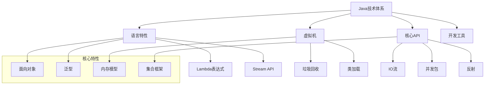
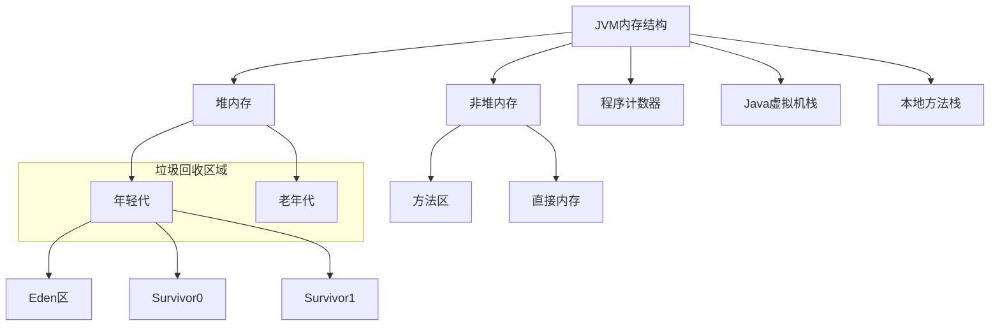
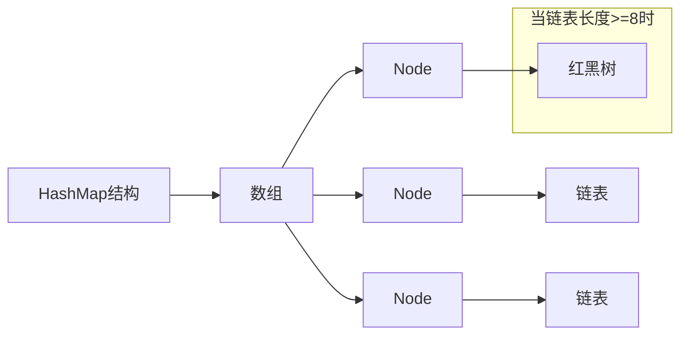
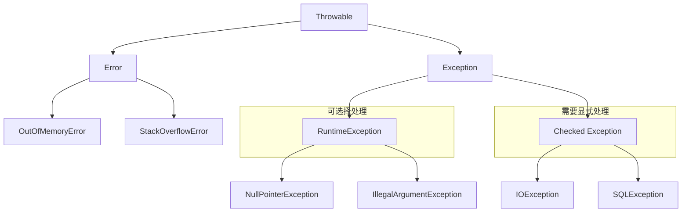

# Java 基础面试题

## 🏷️ 标签
- 技术栈: Java
- 难度: 初级到中级
- 类型: 概念题, 编程题, 原理题

## 📋 题目描述

本文包含 Java 基础知识相关的常见面试题，涵盖语法特性、JVM 原理、集合框架、异常处理等核心概念。

## 💡 核心知识点
- 面向对象编程 (OOP)
- JVM 内存模型和垃圾回收
- 集合框架 (Collections Framework)
- 异常处理机制
- I/O 流操作
- 反射和注解

## 📊 Java 核心技术体系



## 📝 面试题目

### 1. 面向对象基础

#### **【初级】** 解释 Java 中的四大基本特性

**💡 考察要点:**
- 面向对象编程的核心概念
- 各特性的实际应用
- 与其他编程范式的区别

**📝 参考答案:**

Java 面向对象的四大特性：

1. **封装 (Encapsulation)**
   - 将数据和操作数据的方法绑定在一起
   - 通过访问修饰符控制访问权限
   - 隐藏内部实现细节

```java
public class Student {
    private String name;        // 私有属性
    private int age;
    
    // 公共方法提供访问接口
    public String getName() {
        return name;
    }
    
    public void setAge(int age) {
        if (age > 0 && age < 120) {  // 数据验证
            this.age = age;
        }
    }
}
```

2. **继承 (Inheritance)**
   - 子类获得父类的属性和方法
   - 实现代码复用
   - 建立类之间的层次关系

```java
public class Animal {
    protected String name;
    
    public void eat() {
        System.out.println(name + " is eating");
    }
}

public class Dog extends Animal {
    public void bark() {
        System.out.println(name + " is barking");
    }
    
    @Override
    public void eat() {
        System.out.println(name + " is eating dog food");
    }
}
```

3. **多态 (Polymorphism)**
   - 同一接口的不同实现
   - 运行时动态绑定
   - 提高代码灵活性

```java
public interface Shape {
    double getArea();
}

public class Circle implements Shape {
    private double radius;
    
    @Override
    public double getArea() {
        return Math.PI * radius * radius;
    }
}

public class Rectangle implements Shape {
    private double width, height;
    
    @Override
    public double getArea() {
        return width * height;
    }
}

// 多态应用
Shape[] shapes = {new Circle(), new Rectangle()};
for (Shape shape : shapes) {
    System.out.println(shape.getArea()); // 运行时确定调用哪个实现
}
```

4. **抽象 (Abstraction)**
   - 抽取共同特征，忽略具体细节
   - 通过抽象类和接口实现
   - 定义规范和契约

```java
public abstract class Vehicle {
    protected String brand;
    
    // 抽象方法，由子类实现
    public abstract void start();
    
    // 具体方法，可被继承
    public void stop() {
        System.out.println("Vehicle stopped");
    }
}
```

---

#### **【中级】** String、StringBuilder、StringBuffer 的区别和使用场景

**💡 考察要点:**
- 字符串处理的性能考虑
- 线程安全性
- 内存使用效率

**📝 参考答案:**

**主要区别:**

| 特性 | String | StringBuilder | StringBuffer |
|------|--------|---------------|--------------|
| 可变性 | 不可变 | 可变 | 可变 |
| 线程安全 | 安全 | 不安全 | 安全 |
| 性能 | 低 | 高 | 中等 |
| 内存开销 | 高 | 低 | 中等 |

**实现原理:**

```java
// String - 不可变，每次操作创建新对象
String str = "Hello";
str += " World";  // 创建新的String对象

// StringBuilder - 可变字符序列
StringBuilder sb = new StringBuilder("Hello");
sb.append(" World");  // 在原有基础上修改

// StringBuffer - 线程安全的可变字符序列
StringBuffer buffer = new StringBuffer("Hello");
synchronized (buffer) {  // 内部方法都加了synchronized
    buffer.append(" World");
}
```

**性能测试对比:**

```java
public class StringPerformanceTest {
    
    @Test
    public void testStringConcatenation() {
        int iterations = 10000;
        
        // String 方式 - 性能最差
        long start = System.currentTimeMillis();
        String str = "";
        for (int i = 0; i < iterations; i++) {
            str += "a";  // 每次创建新对象
        }
        System.out.println("String: " + (System.currentTimeMillis() - start) + "ms");
        
        // StringBuilder 方式 - 性能最好
        start = System.currentTimeMillis();
        StringBuilder sb = new StringBuilder();
        for (int i = 0; i < iterations; i++) {
            sb.append("a");
        }
        String result = sb.toString();
        System.out.println("StringBuilder: " + (System.currentTimeMillis() - start) + "ms");
        
        // StringBuffer 方式 - 中等性能
        start = System.currentTimeMillis();
        StringBuffer buffer = new StringBuffer();
        for (int i = 0; i < iterations; i++) {
            buffer.append("a");
        }
        result = buffer.toString();
        System.out.println("StringBuffer: " + (System.currentTimeMillis() - start) + "ms");
    }
}
```

**使用场景:**
- **String**: 字符串不经常变化的场景
- **StringBuilder**: 单线程环境下频繁字符串操作
- **StringBuffer**: 多线程环境下需要字符串操作

---

### 2. JVM 相关

#### **【中级】** 解释 Java 内存模型和垃圾回收机制

**💡 考察要点:**
- JVM 内存结构理解
- 垃圾回收算法原理
- 性能调优相关知识



**📝 参考答案:**

**JVM 内存结构:**

1. **堆内存 (Heap)**
   - **年轻代**: Eden区 + 2个Survivor区
   - **老年代**: 长时间存活的对象
   - 垃圾回收的主要区域

2. **非堆内存**
   - **方法区**: 类信息、常量池、静态变量
   - **程序计数器**: 当前线程执行的字节码行号
   - **虚拟机栈**: 方法调用栈帧
   - **本地方法栈**: Native方法调用

**垃圾回收算法:**

```java
public class GCExample {
    
    // 演示对象的生命周期
    public void demonstrateGC() {
        // 1. 对象在Eden区创建
        String temp = new String("temporary");
        
        // 2. 短生命周期对象被MinorGC回收
        temp = null;
        
        // 3. 长生命周期对象晋升到老年代
        List<String> longLived = new ArrayList<>();
        for (int i = 0; i < 1000; i++) {
            longLived.add("String " + i);
        }
        
        // 4. 主动触发GC
        System.gc();  // 建议JVM进行垃圾回收
    }
}
```

**常见垃圾回收器:**
- **Serial GC**: 单线程收集器
- **Parallel GC**: 多线程收集器
- **CMS**: 并发标记清除
- **G1**: 低延迟垃圾收集器

**GC 调优参数:**
```bash
# 设置堆内存大小
-Xms2g -Xmx4g

# 设置年轻代大小
-Xmn1g

# 选择垃圾回收器
-XX:+UseG1GC

# GC日志
-XX:+PrintGC -XX:+PrintGCDetails
```

---

### 3. 集合框架

#### **【中级】** HashMap 的实现原理和扩容机制

**💡 考察要点:**
- 哈希表的实现原理
- 冲突解决方案
- 性能特征分析



**📝 参考答案:**

**HashMap 核心实现:**

```java
public class HashMapExample {
    
    // 模拟HashMap的基本结构
    static class MyHashMap<K, V> {
        private Node<K, V>[] table;
        private int size;
        private static final int DEFAULT_CAPACITY = 16;
        private static final double LOAD_FACTOR = 0.75;
        
        static class Node<K, V> {
            final int hash;
            final K key;
            V value;
            Node<K, V> next;
            
            Node(int hash, K key, V value, Node<K, V> next) {
                this.hash = hash;
                this.key = key;
                this.value = value;
                this.next = next;
            }
        }
        
        @SuppressWarnings("unchecked")
        public MyHashMap() {
            table = new Node[DEFAULT_CAPACITY];
        }
        
        // 计算hash值
        private int hash(K key) {
            if (key == null) return 0;
            int h = key.hashCode();
            return h ^ (h >>> 16);  // 高16位与低16位异或
        }
        
        // 获取数组索引
        private int indexFor(int hash, int length) {
            return hash & (length - 1);  // 等价于 hash % length
        }
        
        public V put(K key, V value) {
            int hash = hash(key);
            int index = indexFor(hash, table.length);
            
            // 处理链表
            for (Node<K, V> e = table[index]; e != null; e = e.next) {
                if (e.hash == hash && Objects.equals(e.key, key)) {
                    V oldValue = e.value;
                    e.value = value;
                    return oldValue;
                }
            }
            
            // 添加新节点
            table[index] = new Node<>(hash, key, value, table[index]);
            size++;
            
            // 检查是否需要扩容
            if (size >= table.length * LOAD_FACTOR) {
                resize();
            }
            
            return null;
        }
        
        // 扩容机制
        @SuppressWarnings("unchecked")
        private void resize() {
            Node<K, V>[] oldTable = table;
            table = new Node[oldTable.length * 2];
            size = 0;
            
            // 重新哈希所有元素
            for (Node<K, V> head : oldTable) {
                for (Node<K, V> e = head; e != null; e = e.next) {
                    put(e.key, e.value);
                }
            }
        }
    }
}
```

**关键特性:**
1. **哈希冲突解决**: 链地址法（拉链法）
2. **红黑树优化**: 链表长度≥8时转换为红黑树
3. **扩容机制**: 负载因子达到0.75时扩容为原来的2倍
4. **线程不安全**: 多线程环境需要使用ConcurrentHashMap

---

### 4. 异常处理

#### **【初级】** Java 异常处理机制和最佳实践

**💡 考察要点:**
- 异常体系结构
- 异常处理策略
- 自定义异常的使用



**📝 参考答案:**

**异常处理最佳实践:**

```java
public class ExceptionHandlingExample {
    
    // 1. 具体异常处理
    public void readFile(String filename) {
        try (BufferedReader reader = new BufferedReader(new FileReader(filename))) {
            String line;
            while ((line = reader.readLine()) != null) {
                processLine(line);
            }
        } catch (FileNotFoundException e) {
            log.error("文件未找到: " + filename, e);
            throw new BusinessException("文件不存在", e);
        } catch (IOException e) {
            log.error("文件读取错误: " + filename, e);
            throw new BusinessException("文件读取失败", e);
        }
    }
    
    // 2. 自定义异常
    public class BusinessException extends Exception {
        private String errorCode;
        
        public BusinessException(String message) {
            super(message);
        }
        
        public BusinessException(String message, Throwable cause) {
            super(message, cause);
        }
        
        public BusinessException(String errorCode, String message) {
            super(message);
            this.errorCode = errorCode;
        }
    }
    
    // 3. 异常处理原则
    public User getUserById(Long id) throws BusinessException {
        // 参数验证
        if (id == null || id <= 0) {
            throw new IllegalArgumentException("用户ID不能为空或小于等于0");
        }
        
        try {
            User user = userRepository.findById(id);
            if (user == null) {
                throw new BusinessException("USER_NOT_FOUND", "用户不存在: " + id);
            }
            return user;
        } catch (DataAccessException e) {
            log.error("数据库访问异常, userId: " + id, e);
            throw new BusinessException("数据访问失败", e);
        }
    }
    
    // 4. 全局异常处理
    @ControllerAdvice
    public class GlobalExceptionHandler {
        
        @ExceptionHandler(BusinessException.class)
        public ResponseEntity<ErrorResponse> handleBusinessException(BusinessException e) {
            return ResponseEntity.badRequest()
                .body(new ErrorResponse(e.getErrorCode(), e.getMessage()));
        }
        
        @ExceptionHandler(Exception.class)
        public ResponseEntity<ErrorResponse> handleGenericException(Exception e) {
            log.error("未预期的异常", e);
            return ResponseEntity.status(HttpStatus.INTERNAL_SERVER_ERROR)
                .body(new ErrorResponse("INTERNAL_ERROR", "系统内部错误"));
        }
    }
}
```

**异常处理原则:**
1. **早抛出，晚捕获**: 在问题发生的地方抛出，在能处理的地方捕获
2. **不要忽略异常**: 即使是RuntimeException也要适当处理
3. **异常信息要详细**: 包含足够的上下文信息
4. **资源清理**: 使用try-with-resources或finally块
5. **层次化处理**: 不同层次处理不同类型的异常

---

## 🎯 面试技巧建议

### 常见面试问题
1. **基础概念**: "解释一下面向对象的特性"
2. **性能优化**: "如何优化Java应用的性能？"
3. **内存管理**: "什么情况下会发生内存泄漏？"
4. **并发处理**: "多线程环境下如何保证数据安全？"

### 回答技巧
- **理论+实践**: 既要说清楚原理，也要结合实际使用经验
- **举例说明**: 用具体的代码示例证明你的理解
- **对比分析**: 比较不同方案的优缺点
- **扩展延伸**: 从一个知识点延伸到相关领域

## 🔗 相关链接

- [← 返回后端目录](./README.md)
- [Spring 框架](./spring-framework.md)
- [Java 并发编程](./java-concurrency.md)
- [JVM 调优](./jvm-tuning.md)

---

*扎实的 Java 基础是后端开发的根基，深入理解原理才能写出高质量的代码* ☕ 