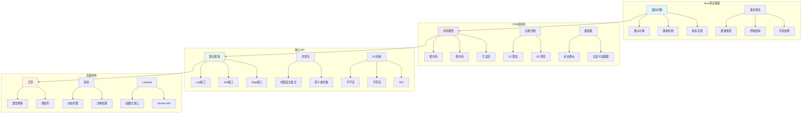

# Java基础面试题

[← 返回后端面试题目录](./README.md)

## 📚 题目概览

Java作为企业级开发的主流语言，其基础知识的掌握程度直接影响开发效率和代码质量。本章节重点考察候选人对Java核心特性的理解，包括面向对象编程、JVM机制、集合框架等基础知识，以及在实际开发中的应用能力。

## 🎯 核心技术考察重点

### 面向对象编程基础
- 封装、继承、多态、抽象四大特性的理解和应用
- 类与对象的设计原则和最佳实践
- 接口与抽象类的区别和使用场景
- 设计模式在Java中的实现

### JVM虚拟机机制
- JVM内存模型和垃圾回收机制
- 类加载过程和双亲委派模型
- JVM性能调优和监控工具
- 字节码执行和即时编译原理

### 集合框架与数据结构
- List、Set、Map接口的实现类特点
- 集合类的性能特点和选择策略
- 并发集合类的使用和原理
- 自定义集合类的设计和实现

### 异常处理与I/O操作
- 异常处理机制和最佳实践
- 检查异常与运行时异常的区别
- I/O流的分类和使用场景
- NIO与传统I/O的性能对比

## 📊 知识结构关联图

## 📝 核心面试题目

### 面向对象编程 🏗️

#### 题目1：Java面向对象四大特性深度解析
**问题背景**：深入理解Java面向对象编程的核心特性和实际应用

**技术挑战**：
- 封装性的访问控制和数据保护机制
- 继承关系的设计和方法重写策略
- 多态性的实现原理和动态绑定
- 抽象类与接口的设计模式应用

**考察要点**：
- 面向对象设计原则的深度理解
- 类继承体系的合理设计能力
- 多态机制在实际项目中的应用
- 抽象设计和接口定义的最佳实践

**📁 完整解决方案**：[Java面向对象特性实现](../../solutions/common/java-oop-features.md)

#### 题目2：String类深度分析与性能优化
**问题背景**：理解String类的不可变性设计和字符串处理的性能优化

**技术挑战**：
- String不可变性的设计原理和安全考虑
- String常量池的内存管理机制
- StringBuilder和StringBuffer的性能对比
- 字符串处理的最佳实践和性能调优

**考察要点**：
- 对Java内存模型的深度理解
- 字符串处理的性能分析能力
- 线程安全和性能之间的权衡
- 大量字符串操作的优化策略

**📁 完整解决方案**：[Java字符串处理优化](../../solutions/common/java-string-optimization.md)

### JVM虚拟机机制 ⚙️

#### 题目3：JVM内存模型与垃圾回收深度剖析
**问题背景**：深入理解JVM内存管理和垃圾回收机制的工作原理

**技术挑战**：
- 堆内存分代模型的设计原理
- 不同垃圾回收算法的适用场景
- 内存泄漏的识别和解决策略
- JVM参数调优和性能监控

**考察要点**：
- JVM内存结构的深度理解
- 垃圾回收算法的原理和选择
- 内存性能问题的诊断能力
- 生产环境的JVM调优经验

**📁 完整解决方案**：[JVM内存管理与调优](../../solutions/common/java-jvm-memory.md)

### 集合框架与数据结构 📊

#### 题目4：Java集合框架设计与性能分析
**问题背景**：深入理解Java集合框架的设计思想和性能特点

**技术挑战**：
- 不同集合类的底层数据结构实现
- 集合类的时间复杂度和空间复杂度分析
- 并发场景下的集合选择和线程安全处理
- 自定义集合类的设计和实现

**考察要点**：
- 数据结构和算法的深度理解
- 集合类性能特点的准确分析
- 并发编程中的集合使用技巧
- 根据业务场景选择合适集合的能力

**📁 完整解决方案**：[Java集合框架实现原理](../../solutions/common/java-collections-framework.md)

### 高级特性与应用 ⚡

#### 题目5：Java泛型机制与类型安全
**问题背景**：理解Java泛型的实现原理和类型安全保证机制

**技术挑战**：
- 泛型类型擦除的实现原理和限制
- 通配符的使用场景和边界限定
- 泛型方法和泛型类的设计模式
- 泛型在集合框架中的应用

**考察要点**：
- 泛型机制的深度理解和应用
- 类型安全编程的最佳实践
- 复杂泛型场景的设计能力
- 泛型与反射结合使用的技巧

**📁 完整解决方案**：[Java泛型深度应用](../../solutions/common/java-generics-advanced.md)

#### 题目6：反射机制与动态编程
**问题背景**：掌握Java反射机制在框架开发中的应用

**技术挑战**：
- 反射API的使用和性能考虑
- 动态代理的实现原理和应用场景
- 注解处理和元数据编程
- 反射在框架中的设计模式

**考察要点**：
- 反射机制的深度理解和应用
- 动态编程的设计思想和实现
- 框架级编程的技术能力
- 性能和灵活性的平衡考虑

**📁 完整解决方案**：[Java反射与动态代理](../../solutions/common/java-reflection-proxy.md)

## 📊 面试评分标准

### 基础理解 (30分)
- **语言特性**：深入理解Java语言的核心特性和设计原理
- **语法掌握**：熟练掌握Java语法和API的正确使用
- **概念理解**：准确理解面向对象、JVM、集合等核心概念

### 实践应用 (40分)
- **问题解决**：能够分析和解决复杂的Java开发问题
- **代码质量**：编写高质量、可维护的Java代码
- **性能优化**：具备Java应用性能分析和优化能力

### 深度理解 (30分)
- **原理洞察**：深入理解JVM、集合框架等底层实现原理
- **架构设计**：能够进行合理的面向对象设计和架构规划
- **最佳实践**：掌握Java开发的最佳实践和设计模式

## 🎯 备考建议

### 学习路径
1. **基础巩固**：深入理解Java语言特性和面向对象编程
2. **JVM深入**：学习JVM内存模型、垃圾回收和性能调优
3. **集合框架**：掌握集合类的实现原理和性能特点
4. **高级特性**：学习泛型、反射、注解等高级特性
5. **实践应用**：通过项目实践加深理解和应用能力

### 技术重点
- **面向对象**：深度理解封装、继承、多态、抽象的应用
- **JVM机制**：掌握内存模型、垃圾回收、类加载等核心机制
- **集合框架**：熟练使用各种集合类并理解其实现原理
- **并发编程**：了解Java并发包和线程安全编程
- **性能优化**：掌握Java应用的性能分析和调优技巧

### 实践项目建议
- 实现自定义集合类
- 开发简单的ORM框架
- 构建基于反射的依赖注入容器
- 创建内存监控和分析工具
- 设计高性能缓存系统

## 🔗 相关资源链接

- [Java并发编程面试题](./java-concurrency.md)
- [Spring框架面试题](./spring-framework.md)
- [JVM调优面试题](../company-specific/alibaba/java-advanced.md)
- [设计模式面试题](../system-design/README.md)
- [← 返回后端面试题目录](./README.md)

---

*掌握Java核心技术，构建高质量企业级应用* ☕ 