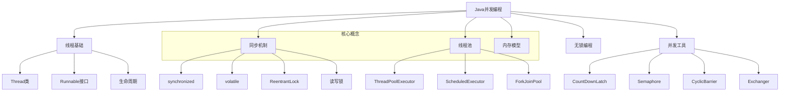
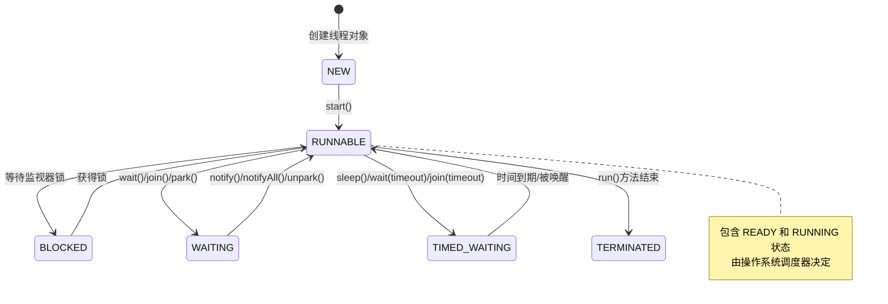
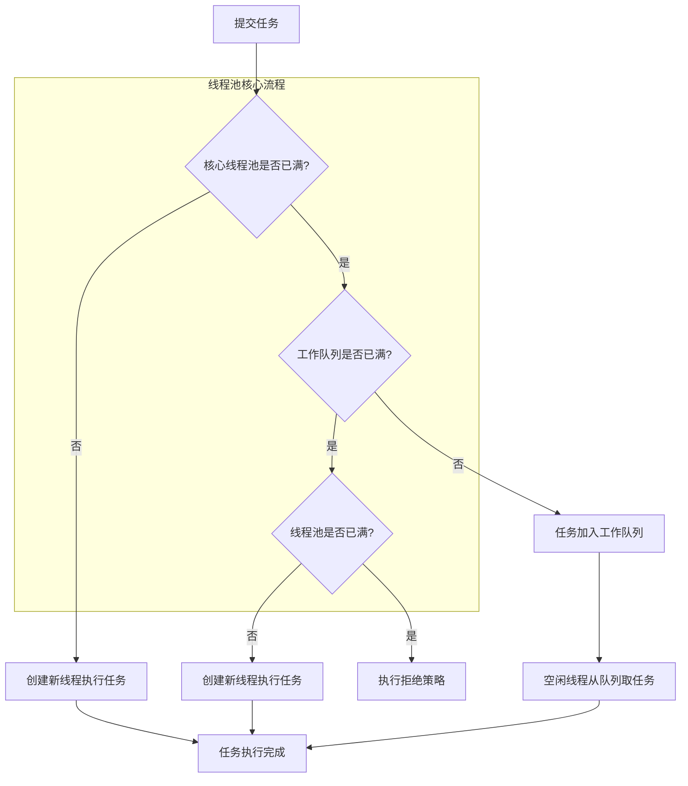

# Java 并发编程面试题

## 🏷️ 标签
- 技术栈: Java, 并发编程, 多线程
- 难度: 中级到高级
- 类型: 概念题, 编程题, 原理题

## 📋 题目描述

本文包含 Java 并发编程相关的面试题，涵盖线程基础、同步机制、线程池、并发工具类等核心概念。

## 💡 核心知识点
- 线程基础和生命周期
- 同步机制 (synchronized, volatile, Lock)
- 线程池和 Executor 框架
- 并发工具类 (CountDownLatch, Semaphore 等)
- 内存模型和可见性
- 无锁编程和 CAS

## 📊 Java 并发编程体系



## 📝 面试题目

### 1. 线程基础

#### **【中级】** 解释 Java 中创建线程的几种方式，各有什么优缺点？

**💡 考察要点:**
- 线程创建的不同方法
- 各种方式的适用场景
- 线程与任务的分离

**📝 参考答案:**

**Java 创建线程的方式:**

1. **继承 Thread 类**
```java
public class MyThread extends Thread {
    @Override
    public void run() {
        System.out.println("线程名称: " + Thread.currentThread().getName());
        // 执行具体任务
        for (int i = 0; i < 5; i++) {
            System.out.println("执行任务: " + i);
            try {
                Thread.sleep(1000);
            } catch (InterruptedException e) {
                Thread.currentThread().interrupt();
                break;
            }
        }
    }
}

// 使用方式
MyThread thread = new MyThread();
thread.start();
```

2. **实现 Runnable 接口**
```java
public class MyRunnable implements Runnable {
    @Override
    public void run() {
        System.out.println("线程名称: " + Thread.currentThread().getName());
        // 执行具体任务
        for (int i = 0; i < 5; i++) {
            System.out.println("执行任务: " + i);
            try {
                Thread.sleep(1000);
            } catch (InterruptedException e) {
                Thread.currentThread().interrupt();
                break;
            }
        }
    }
}

// 使用方式
Thread thread = new Thread(new MyRunnable(), "MyThread");
thread.start();
```

3. **实现 Callable 接口**
```java
public class MyCallable implements Callable<String> {
    @Override
    public String call() throws Exception {
        System.out.println("线程名称: " + Thread.currentThread().getName());
        // 执行具体任务并返回结果
        Thread.sleep(2000);
        return "任务执行完成，结果: " + System.currentTimeMillis();
    }
}

// 使用方式
ExecutorService executor = Executors.newSingleThreadExecutor();
Future<String> future = executor.submit(new MyCallable());
try {
    String result = future.get(); // 阻塞等待结果
    System.out.println(result);
} catch (InterruptedException | ExecutionException e) {
    e.printStackTrace();
} finally {
    executor.shutdown();
}
```

4. **使用 Lambda 表达式**
```java
// 使用 Lambda 创建线程
Thread thread = new Thread(() -> {
    System.out.println("Lambda 线程: " + Thread.currentThread().getName());
    try {
        Thread.sleep(1000);
        System.out.println("任务执行完成");
    } catch (InterruptedException e) {
        Thread.currentThread().interrupt();
    }
});
thread.start();

// 使用线程池 + Lambda
ExecutorService executor = Executors.newFixedThreadPool(3);
executor.submit(() -> {
    System.out.println("线程池执行任务");
    return "执行结果";
});
executor.shutdown();
```

**优缺点对比:**

| 方式 | 优点 | 缺点 | 适用场景 |
|------|------|------|----------|
| **继承Thread** | 代码简单<br/>可直接访问线程方法 | 不能继承其他类<br/>线程任务耦合 | 简单的线程任务 |
| **实现Runnable** | 任务与线程分离<br/>可继承其他类 | 无返回值<br/>异常处理复杂 | 大多数场景 |
| **实现Callable** | 有返回值<br/>可抛出异常 | 必须配合线程池使用 | 需要返回结果的任务 |
| **Lambda表达式** | 代码简洁<br/>函数式编程 | 调试困难<br/>可读性差(复杂逻辑) | 简单的一次性任务 |

---

#### **【高级】** 详细解释 Java 线程的生命周期和状态转换

**💡 考察要点:**
- 线程状态的完整理解
- 状态转换的触发条件
- 实际编程中的应用



**📝 参考答案:**

**线程状态详解:**

```java
public class ThreadStateDemo {
    
    public static void main(String[] args) throws InterruptedException {
        Object lock = new Object();
        
        // 1. NEW 状态
        Thread thread1 = new Thread(() -> {
            synchronized (lock) {
                try {
                    System.out.println("Thread1 进入 WAITING 状态");
                    lock.wait(); // 进入 WAITING 状态
                    System.out.println("Thread1 被唤醒");
                } catch (InterruptedException e) {
                    Thread.currentThread().interrupt();
                }
            }
        }, "Thread-1");
        
        System.out.println("Thread1 状态: " + thread1.getState()); // NEW
        
        // 2. RUNNABLE 状态
        thread1.start();
        Thread.sleep(100);
        
        // 3. BLOCKED 状态示例
        Thread thread2 = new Thread(() -> {
            System.out.println("Thread2 尝试获取锁");
            synchronized (lock) { // 会进入 BLOCKED 状态
                System.out.println("Thread2 获得锁");
            }
        }, "Thread-2");
        
        thread2.start();
        Thread.sleep(100);
        System.out.println("Thread2 状态: " + thread2.getState()); // BLOCKED
        
        // 4. TIMED_WAITING 状态示例
        Thread thread3 = new Thread(() -> {
            try {
                System.out.println("Thread3 进入 TIMED_WAITING 状态");
                Thread.sleep(5000); // 进入 TIMED_WAITING 状态
            } catch (InterruptedException e) {
                Thread.currentThread().interrupt();
            }
        }, "Thread-3");
        
        thread3.start();
        Thread.sleep(100);
        System.out.println("Thread3 状态: " + thread3.getState()); // TIMED_WAITING
        
        // 唤醒 thread1
        synchronized (lock) {
            lock.notify();
        }
        
        // 等待所有线程结束
        thread1.join();
        thread2.join();
        thread3.join();
        
        // 5. TERMINATED 状态
        System.out.println("Thread1 最终状态: " + thread1.getState()); // TERMINATED
    }
}
```

**状态转换详细说明:**

1. **NEW → RUNNABLE**: 调用 `start()` 方法
2. **RUNNABLE → BLOCKED**: 尝试获取已被其他线程持有的监视器锁
3. **BLOCKED → RUNNABLE**: 成功获得监视器锁
4. **RUNNABLE → WAITING**: 
   - `Object.wait()` (无超时)
   - `Thread.join()` (无超时)
   - `LockSupport.park()`
5. **WAITING → RUNNABLE**: 
   - `Object.notify()/notifyAll()`
   - 被join的线程执行完毕
   - `LockSupport.unpark()`
6. **RUNNABLE → TIMED_WAITING**:
   - `Thread.sleep(long)`
   - `Object.wait(long)`
   - `Thread.join(long)`
   - `LockSupport.parkNanos()/parkUntil()`
7. **TIMED_WAITING → RUNNABLE**: 时间到期或被提前唤醒
8. **RUNNABLE → TERMINATED**: `run()` 方法执行完毕

---

### 2. 同步机制

#### **【高级】** synchronized 和 ReentrantLock 的区别和使用场景

**💡 考察要点:**
- 不同锁机制的实现原理
- 性能特点对比
- 具体使用场景分析

**📝 参考答案:**

**synchronized vs ReentrantLock 对比:**

```java
public class LockComparisonDemo {
    
    // 使用 synchronized 的示例
    private final Object syncLock = new Object();
    private int syncCounter = 0;
    
    public void synchronizedIncrement() {
        synchronized (syncLock) {
            syncCounter++;
            // 自动释放锁，即使发生异常
        }
    }
    
    // 使用 ReentrantLock 的示例
    private final ReentrantLock reentrantLock = new ReentrantLock();
    private int reentrantCounter = 0;
    
    public void reentrantLockIncrement() {
        reentrantLock.lock();
        try {
            reentrantCounter++;
            // 业务逻辑
        } finally {
            reentrantLock.unlock(); // 必须手动释放锁
        }
    }
    
    // ReentrantLock 的高级功能
    public boolean tryIncrementWithTimeout() {
        try {
            // 尝试在指定时间内获取锁
            if (reentrantLock.tryLock(100, TimeUnit.MILLISECONDS)) {
                try {
                    reentrantCounter++;
                    return true;
                } finally {
                    reentrantLock.unlock();
                }
            }
        } catch (InterruptedException e) {
            Thread.currentThread().interrupt();
        }
        return false;
    }
    
    // 可中断的锁获取
    public void interruptibleIncrement() throws InterruptedException {
        reentrantLock.lockInterruptibly(); // 可被中断的锁获取
        try {
            reentrantCounter++;
            // 长时间运行的任务
            Thread.sleep(1000);
        } finally {
            reentrantLock.unlock();
        }
    }
    
    // 公平锁示例
    private final ReentrantLock fairLock = new ReentrantLock(true); // 公平锁
    
    public void fairLockExample() {
        fairLock.lock();
        try {
            System.out.println(Thread.currentThread().getName() + " 获得公平锁");
            Thread.sleep(100);
        } catch (InterruptedException e) {
            Thread.currentThread().interrupt();
        } finally {
            fairLock.unlock();
        }
    }
}
```

**详细对比分析:**

| 特性 | synchronized | ReentrantLock |
|------|--------------|---------------|
| **锁的实现** | JVM 内置，监视器锁 | JDK 提供，基于 AQS |
| **性能** | JDK 1.6后优化，性能接近 | 高性能，低争用下略优 |
| **使用方式** | 自动加锁解锁 | 手动加锁解锁 |
| **可中断性** | 不可中断 | 支持中断 `lockInterruptibly()` |
| **超时机制** | 不支持 | 支持 `tryLock(timeout)` |
| **公平性** | 非公平锁 | 支持公平锁和非公平锁 |
| **条件变量** | 单个条件(wait/notify) | 多个条件 `Condition` |
| **可重入性** | 支持 | 支持 |
| **异常安全** | 自动释放 | 需要 finally 块 |

**使用场景选择:**

1. **使用 synchronized 的场景:**
```java
public class SynchronizedUseCases {
    
    // 1. 简单的同步需求
    private int counter = 0;
    
    public synchronized void simpleIncrement() {
        counter++; // 简单操作，synchronized 更简洁
    }
    
    // 2. 方法级别同步
    public synchronized String getUniqueId() {
        return UUID.randomUUID().toString();
    }
    
    // 3. 静态方法同步
    public static synchronized void staticMethod() {
        // 类级别的同步
    }
}
```

2. **使用 ReentrantLock 的场景:**
```java
public class ReentrantLockUseCases {
    private final ReentrantLock lock = new ReentrantLock();
    private final Condition notEmpty = lock.newCondition();
    private final Condition notFull = lock.newCondition();
    private final Queue<String> queue = new LinkedList<>();
    private final int maxSize = 10;
    
    // 1. 需要超时机制的场景
    public boolean processWithTimeout() {
        try {
            if (lock.tryLock(5, TimeUnit.SECONDS)) {
                try {
                    // 处理业务逻辑
                    return true;
                } finally {
                    lock.unlock();
                }
            }
        } catch (InterruptedException e) {
            Thread.currentThread().interrupt();
        }
        return false;
    }
    
    // 2. 需要多个条件变量的场景
    public void put(String item) throws InterruptedException {
        lock.lock();
        try {
            while (queue.size() == maxSize) {
                notFull.await(); // 等待队列不满
            }
            queue.offer(item);
            notEmpty.signal(); // 通知队列不空
        } finally {
            lock.unlock();
        }
    }
    
    public String take() throws InterruptedException {
        lock.lock();
        try {
            while (queue.isEmpty()) {
                notEmpty.await(); // 等待队列不空
            }
            String item = queue.poll();
            notFull.signal(); // 通知队列不满
            return item;
        } finally {
            lock.unlock();
        }
    }
    
    // 3. 需要可中断锁的场景
    public void interruptibleTask() {
        try {
            lock.lockInterruptibly();
            try {
                // 长时间运行的任务
                while (!Thread.currentThread().isInterrupted()) {
                    // 执行可被中断的任务
                    Thread.sleep(100);
                }
            } finally {
                lock.unlock();
            }
        } catch (InterruptedException e) {
            Thread.currentThread().interrupt();
            System.out.println("任务被中断");
        }
    }
}
```

---

### 3. 线程池

#### **【高级】** 解释 ThreadPoolExecutor 的工作原理和参数配置

**💡 考察要点:**
- 线程池的执行流程
- 核心参数的作用
- 不同场景下的配置策略



**📝 参考答案:**

**ThreadPoolExecutor 核心参数:**

```java
public class ThreadPoolExecutorDemo {
    
    public static void main(String[] args) {
        // 创建自定义线程池
        ThreadPoolExecutor executor = new ThreadPoolExecutor(
            5,                                    // corePoolSize: 核心线程数
            10,                                   // maximumPoolSize: 最大线程数
            60L,                                  // keepAliveTime: 空闲线程存活时间
            TimeUnit.SECONDS,                     // timeUnit: 时间单位
            new ArrayBlockingQueue<>(100),        // workQueue: 工作队列
            new ThreadFactory() {                 // threadFactory: 线程工厂
                private final AtomicInteger threadNumber = new AtomicInteger(1);
                
                @Override
                public Thread newThread(Runnable r) {
                    Thread thread = new Thread(r, "CustomPool-" + threadNumber.getAndIncrement());
                    thread.setDaemon(false);
                    return thread;
                }
            },
            new ThreadPoolExecutor.CallerRunsPolicy() // rejectedExecutionHandler: 拒绝策略
        );
        
        // 提交任务
        for (int i = 0; i < 200; i++) {
            final int taskId = i;
            executor.submit(() -> {
                System.out.println("任务 " + taskId + " 在线程 " + 
                    Thread.currentThread().getName() + " 中执行");
                try {
                    Thread.sleep(1000); // 模拟任务执行
                } catch (InterruptedException e) {
                    Thread.currentThread().interrupt();
                }
            });
        }
        
        // 优雅关闭线程池
        executor.shutdown();
        try {
            if (!executor.awaitTermination(60, TimeUnit.SECONDS)) {
                executor.shutdownNow();
            }
        } catch (InterruptedException e) {
            executor.shutdownNow();
            Thread.currentThread().interrupt();
        }
    }
}
```

**参数详细说明:**

1. **核心参数配置策略:**
```java
public class ThreadPoolConfigurationStrategies {
    
    // 1. CPU 密集型任务配置
    public static ThreadPoolExecutor createCpuIntensivePool() {
        int processors = Runtime.getRuntime().availableProcessors();
        return new ThreadPoolExecutor(
            processors,                          // 核心线程数 = CPU 核数
            processors,                          // 最大线程数 = CPU 核数
            0L, TimeUnit.MILLISECONDS,           // 不需要额外线程
            new LinkedBlockingQueue<>(),         // 无界队列
            Executors.defaultThreadFactory(),
            new ThreadPoolExecutor.AbortPolicy()
        );
    }
    
    // 2. I/O 密集型任务配置
    public static ThreadPoolExecutor createIoIntensivePool() {
        int processors = Runtime.getRuntime().availableProcessors();
        return new ThreadPoolExecutor(
            processors * 2,                      // 核心线程数 = CPU 核数 * 2
            processors * 4,                      // 最大线程数 = CPU 核数 * 4
            60L, TimeUnit.SECONDS,              // 空闲线程60秒后回收
            new ArrayBlockingQueue<>(1000),      // 有界队列防止内存溢出
            Executors.defaultThreadFactory(),
            new ThreadPoolExecutor.CallerRunsPolicy() // 调用者执行策略
        );
    }
    
    // 3. 混合型任务配置
    public static ThreadPoolExecutor createMixedPool() {
        return new ThreadPoolExecutor(
            10,                                  // 固定核心线程数
            50,                                  // 最大线程数
            30L, TimeUnit.SECONDS,              // 空闲线程30秒后回收
            new SynchronousQueue<>(),            // 直接交付队列
            new ThreadFactory() {
                private final AtomicInteger threadNumber = new AtomicInteger(1);
                
                @Override
                public Thread newThread(Runnable r) {
                    Thread thread = new Thread(r, "MixedPool-" + threadNumber.getAndIncrement());
                    thread.setUncaughtExceptionHandler((t, e) -> {
                        System.err.println("线程 " + t.getName() + " 发生异常: " + e.getMessage());
                        e.printStackTrace();
                    });
                    return thread;
                }
            },
            new RejectedExecutionHandler() {
                @Override
                public void rejectedExecution(Runnable r, ThreadPoolExecutor executor) {
                    System.err.println("任务被拒绝: " + r.toString());
                    // 可以实现自定义拒绝逻辑，如记录日志、降级处理等
                }
            }
        );
    }
}
```

2. **拒绝策略详解:**
```java
public class RejectionPolicyDemo {
    
    public static void demonstrateRejectionPolicies() {
        // 1. AbortPolicy: 直接抛出异常
        ThreadPoolExecutor abortPool = new ThreadPoolExecutor(
            1, 1, 0L, TimeUnit.MILLISECONDS,
            new ArrayBlockingQueue<>(1),
            new ThreadPoolExecutor.AbortPolicy()
        );
        
        // 2. CallerRunsPolicy: 调用者执行
        ThreadPoolExecutor callerRunsPool = new ThreadPoolExecutor(
            1, 1, 0L, TimeUnit.MILLISECONDS,
            new ArrayBlockingQueue<>(1),
            new ThreadPoolExecutor.CallerRunsPolicy()
        );
        
        // 3. DiscardPolicy: 静默丢弃
        ThreadPoolExecutor discardPool = new ThreadPoolExecutor(
            1, 1, 0L, TimeUnit.MILLISECONDS,
            new ArrayBlockingQueue<>(1),
            new ThreadPoolExecutor.DiscardPolicy()
        );
        
        // 4. DiscardOldestPolicy: 丢弃最老的任务
        ThreadPoolExecutor discardOldestPool = new ThreadPoolExecutor(
            1, 1, 0L, TimeUnit.MILLISECONDS,
            new ArrayBlockingQueue<>(1),
            new ThreadPoolExecutor.DiscardOldestPolicy()
        );
        
        // 5. 自定义拒绝策略
        ThreadPoolExecutor customPool = new ThreadPoolExecutor(
            1, 1, 0L, TimeUnit.MILLISECONDS,
            new ArrayBlockingQueue<>(1),
            new RejectedExecutionHandler() {
                @Override
                public void rejectedExecution(Runnable r, ThreadPoolExecutor executor) {
                    // 记录拒绝日志
                    System.err.println("任务被拒绝，当前线程池状态: " +
                        "核心线程数=" + executor.getCorePoolSize() +
                        ", 活跃线程数=" + executor.getActiveCount() +
                        ", 队列大小=" + executor.getQueue().size());
                    
                    // 可以实现重试、降级等逻辑
                    try {
                        Thread.sleep(100);
                        if (!executor.isShutdown()) {
                            executor.execute(r); // 重试执行
                        }
                    } catch (InterruptedException e) {
                        Thread.currentThread().interrupt();
                    }
                }
            }
        );
    }
}
```

---

### 4. 并发工具类

#### **【中级】** CountDownLatch、CyclicBarrier、Semaphore 的使用场景和区别

**💡 考察要点:**
- 各工具类的适用场景
- 实现原理的理解
- 实际应用案例

**📝 参考答案:**

**并发工具类对比和应用:**

```java
public class ConcurrentUtilitiesDemo {
    
    // 1. CountDownLatch 示例：等待多个任务完成
    public static void countDownLatchExample() throws InterruptedException {
        int taskCount = 5;
        CountDownLatch latch = new CountDownLatch(taskCount);
        ExecutorService executor = Executors.newFixedThreadPool(taskCount);
        
        System.out.println("开始执行 " + taskCount + " 个任务");
        
        for (int i = 0; i < taskCount; i++) {
            final int taskId = i;
            executor.submit(() -> {
                try {
                    // 模拟任务执行
                    Thread.sleep((taskId + 1) * 1000);
                    System.out.println("任务 " + taskId + " 完成");
                } catch (InterruptedException e) {
                    Thread.currentThread().interrupt();
                } finally {
                    latch.countDown(); // 任务完成，计数减1
                }
            });
        }
        
        // 等待所有任务完成
        latch.await();
        System.out.println("所有任务执行完成");
        
        executor.shutdown();
    }
    
    // 2. CyclicBarrier 示例：多线程协同工作
    public static void cyclicBarrierExample() {
        int participantCount = 3;
        CyclicBarrier barrier = new CyclicBarrier(participantCount, () -> {
            System.out.println("所有参与者都到达屏障点，开始下一阶段");
        });
        
        ExecutorService executor = Executors.newFixedThreadPool(participantCount);
        
        for (int i = 0; i < participantCount; i++) {
            final int workerId = i;
            executor.submit(() -> {
                try {
                    // 第一阶段工作
                    System.out.println("工作者 " + workerId + " 完成第一阶段工作");
                    Thread.sleep((workerId + 1) * 1000);
                    
                    barrier.await(); // 等待其他工作者完成第一阶段
                    
                    // 第二阶段工作
                    System.out.println("工作者 " + workerId + " 开始第二阶段工作");
                    Thread.sleep((workerId + 1) * 1000);
                    
                    barrier.await(); // 等待其他工作者完成第二阶段
                    
                    System.out.println("工作者 " + workerId + " 完成所有工作");
                    
                } catch (InterruptedException | BrokenBarrierException e) {
                    Thread.currentThread().interrupt();
                    System.err.println("工作者 " + workerId + " 被中断");
                }
            });
        }
        
        executor.shutdown();
    }
    
    // 3. Semaphore 示例：控制资源访问数量
    public static void semaphoreExample() {
        int resourceCount = 3; // 假设有3个数据库连接
        Semaphore semaphore = new Semaphore(resourceCount);
        ExecutorService executor = Executors.newFixedThreadPool(10);
        
        for (int i = 0; i < 10; i++) {
            final int userId = i;
            executor.submit(() -> {
                try {
                    // 获取许可证（数据库连接）
                    semaphore.acquire();
                    System.out.println("用户 " + userId + " 获得数据库连接，当前可用连接数: " + 
                        semaphore.availablePermits());
                    
                    // 模拟数据库操作
                    Thread.sleep(2000);
                    
                    System.out.println("用户 " + userId + " 释放数据库连接");
                    
                } catch (InterruptedException e) {
                    Thread.currentThread().interrupt();
                } finally {
                    semaphore.release(); // 释放许可证
                }
            });
        }
        
        executor.shutdown();
    }
    
    // 4. Exchanger 示例：两个线程间数据交换
    public static void exchangerExample() {
        Exchanger<String> exchanger = new Exchanger<>();
        ExecutorService executor = Executors.newFixedThreadPool(2);
        
        // 生产者线程
        executor.submit(() -> {
            try {
                String data = "生产者数据: " + System.currentTimeMillis();
                System.out.println("生产者准备交换数据: " + data);
                
                String received = exchanger.exchange(data);
                System.out.println("生产者收到数据: " + received);
                
            } catch (InterruptedException e) {
                Thread.currentThread().interrupt();
            }
        });
        
        // 消费者线程
        executor.submit(() -> {
            try {
                Thread.sleep(1000); // 模拟处理时间
                String data = "消费者数据: " + System.currentTimeMillis();
                System.out.println("消费者准备交换数据: " + data);
                
                String received = exchanger.exchange(data);
                System.out.println("消费者收到数据: " + received);
                
            } catch (InterruptedException e) {
                Thread.currentThread().interrupt();
            }
        });
        
        executor.shutdown();
    }
}
```

**工具类特性对比:**

| 工具类 | 主要用途 | 特点 | 典型场景 |
|--------|----------|------|----------|
| **CountDownLatch** | 等待多个任务完成 | 一次性使用<br/>只能减不能增 | 主线程等待多个子任务完成 |
| **CyclicBarrier** | 多线程同步协作 | 可重复使用<br/>支持回调 | 多阶段任务的同步点 |
| **Semaphore** | 控制资源访问数量 | 可获取多个许可<br/>支持公平性 | 连接池、限流控制 |
| **Exchanger** | 两线程数据交换 | 双向数据交换<br/>阻塞等待 | 生产者消费者数据交换 |

---

## 🎯 面试技巧建议

### 并发编程回答策略
1. **理论基础**: 先说明基本概念和原理
2. **代码示例**: 用具体代码展示使用方法
3. **性能考虑**: 分析不同方案的性能特点
4. **实践经验**: 结合实际项目中的应用场景

### 常见追问问题
- "如何避免死锁？"
- "volatile 和 synchronized 有什么区别？"
- "线程池的核心线程数如何设置？"
- "如何处理线程池中的异常？"

### 实战经验分享
- 分享并发编程中遇到的坑
- 讨论性能调优的经验
- 举例说明线程安全问题的解决方案

## 🔗 相关链接

- [← 返回后端目录](./README.md)
- [Java 基础知识](./java-basics.md)
- [Spring 框架](./spring-framework.md)
- [性能优化](./performance-optimization.md)

---

*掌握并发编程是 Java 后端开发的必备技能，理解原理比记住 API 更重要* ⚡ 