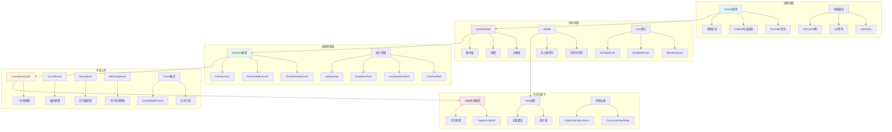

# Java并发编程面试题

[← 返回后端面试题目录](./README.md)

## 📚 题目概览

Java并发编程是后端开发的核心技能，直接影响系统的性能、稳定性和可扩展性。本章节重点考察候选人对Java并发机制的深度理解，包括线程模型、同步机制、线程池、并发工具类等核心概念，以及在高并发场景下的实际应用能力。

## 🎯 核心技术考察重点

### 线程基础与生命周期
- Java线程模型和创建方式对比
- 线程状态转换和生命周期管理
- 线程间通信和协作机制
- 线程中断和优雅关闭策略

### 同步机制深度理解
- synchronized关键字的实现原理
- volatile关键字和内存可见性
- Lock接口和AQS框架原理
- 读写锁和公平锁的应用场景

### 线程池与任务调度
- ThreadPoolExecutor核心参数调优
- 不同线程池类型的适用场景
- 任务拒绝策略和异常处理
- 自定义线程工厂和监控机制

### 并发工具类应用
- CountDownLatch和CyclicBarrier使用
- Semaphore信号量的应用场景
- 阻塞队列的选择和性能对比
- Future和CompletableFuture异步编程

### 内存模型与无锁编程
- JMM内存模型和happens-before规则
- CAS操作和原子类的使用
- 无锁数据结构的设计原理
- 并发容器的实现机制

## 📊 知识结构关联图

## 📝 核心面试题目

### 线程基础与管理 [中级]

#### 题目1：Java线程创建方式深度对比与最佳实践
**问题背景**：理解不同线程创建方式的特点和在企业级应用中的选择策略

**技术挑战**：
- 继承Thread vs 实现Runnable vs Callable的权衡
- Lambda表达式和方法引用在线程中的应用
- 线程与任务分离的设计原则
- 线程命名和异常处理的最佳实践

**考察要点**：
- 对Java线程模型的深度理解
- 面向对象设计原则的应用
- 企业级开发的最佳实践
- 代码可维护性和扩展性考虑

**📁 完整解决方案**：[Java线程创建与管理](../../solutions/common/java-thread-creation-management.md)

#### 题目2：线程状态转换与生命周期管理
**问题背景**：深入理解Java线程的完整生命周期和状态转换机制

**技术挑战**：
- 线程状态转换的触发条件和内部机制
- 线程中断机制的正确使用和响应
- 线程优雅关闭和资源清理策略
- 线程池中线程的生命周期管理

**考察要点**：
- 线程状态模型的准确理解
- 并发编程中的异常处理能力
- 系统资源管理的意识
- 生产环境的稳定性考虑

**📁 完整解决方案**：[线程生命周期管理](../../solutions/common/thread-lifecycle-management.md)

### 同步机制与锁 [高级]

#### 题目3：synchronized与Lock的深度对比与选择
**问题背景**：掌握Java中不同同步机制的实现原理和适用场景

**技术挑战**：
- synchronized锁升级过程和JVM优化
- ReentrantLock的高级特性和使用场景
- 公平锁与非公平锁的性能影响
- 死锁检测和避免策略

**考察要点**：
- 同步机制底层原理的理解
- 性能优化和锁竞争分析能力
- 并发安全设计的实践经验
- JVM层面的优化理解

**📁 完整解决方案**：[同步机制深度实现](../../solutions/common/java-synchronization-mechanisms.md)

#### 题目4：volatile关键字与内存可见性
**问题背景**：理解volatile的作用机制和在并发编程中的正确使用

**技术挑战**：
- volatile与synchronized的区别和联系
- 内存可见性问题的识别和解决
- 指令重排序和内存屏障的应用
- 双重检查锁定模式的正确实现

**考察要点**：
- JMM内存模型的深度理解
- 并发编程中的微妙问题识别
- 性能和正确性的平衡考虑
- 设计模式在并发中的应用

**📁 完整解决方案**：[volatile与内存模型](../../solutions/common/volatile-memory-model.md)

### 线程池与任务调度 [高级]

#### 题目5：ThreadPoolExecutor核心参数调优与监控
**问题背景**：掌握线程池的核心参数配置和在生产环境中的调优策略

**技术挑战**：
- 核心参数对线程池行为的影响分析
- 不同工作队列类型的选择和性能对比
- 拒绝策略的设计和自定义实现
- 线程池监控指标和告警机制

**考察要点**：
- 线程池内部机制的深度理解
- 系统性能调优的实践能力
- 生产环境监控和运维经验
- 业务场景与技术方案的匹配

**📁 完整解决方案**：[线程池调优与监控](../../solutions/common/threadpool-tuning-monitoring.md)

#### 题目6：自定义线程池与任务调度框架
**问题背景**：设计适合特定业务场景的线程池和任务调度系统

**技术挑战**：
- 自定义线程工厂和异常处理策略
- 动态线程池参数调整机制
- 任务优先级和延迟执行支持
- 分布式任务调度的实现方案

**考察要点**：
- 框架设计和扩展能力
- 复杂业务场景的抽象能力
- 系统架构的整体规划能力
- 高级特性的实现和优化

**📁 完整解决方案**：[自定义线程池框架](../../solutions/common/custom-threadpool-framework.md)

### 并发工具类应用 [中级]

#### 题目7：CountDownLatch与CyclicBarrier的应用场景
**问题背景**：掌握Java并发工具类的特点和在复杂业务中的应用

**技术挑战**：
- CountDownLatch一次性屏障的使用场景
- CyclicBarrier循环屏障的重复使用机制
- Semaphore信号量的资源控制应用
- 不同工具类的组合使用策略

**考察要点**：
- 并发工具类的原理理解
- 业务场景的技术方案选择
- 并发控制的设计能力
- 工具类的高级用法掌握

**📁 完整解决方案**：[并发工具类实践应用](../../solutions/common/concurrent-utilities-practice.md)

#### 题目8：阻塞队列与生产者消费者模式
**问题背景**：理解不同阻塞队列的特点和在异步处理中的应用

**技术挑战**：
- ArrayBlockingQueue、LinkedBlockingQueue等队列选择
- 生产者消费者模式的高级实现
- 队列容量设计和背压处理机制
- 异步处理的监控和异常处理

**考察要点**：
- 数据结构特性的深度理解
- 异步编程模式的实践能力
- 系统容量规划和性能调优
- 异常场景的处理和恢复

**📁 完整解决方案**：[阻塞队列与异步处理](../../solutions/common/blocking-queue-async-processing.md)

### 内存模型与无锁编程 [高级]

#### 题目9：JMM内存模型与happens-before规则
**问题背景**：深入理解Java内存模型和并发编程的理论基础

**技术挑战**：
- happens-before规则的理解和应用
- 内存屏障和指令重排序的控制
- 可见性、原子性、有序性的保证机制
- 并发编程中的性能优化策略

**考察要点**：
- 理论基础的深度掌握
- 并发问题的根因分析能力
- 性能优化的理论指导
- 复杂并发场景的设计能力

**📁 完整解决方案**：[JMM内存模型深度解析](../../solutions/common/jmm-memory-model-analysis.md)

#### 题目10：CAS操作与无锁数据结构
**问题背景**：掌握无锁编程技术和原子操作的应用

**技术挑战**：
- CAS操作的原理和ABA问题解决
- 原子类的使用和性能特点
- 无锁数据结构的设计原理
- 并发容器的实现机制分析

**考察要点**：
- 底层技术的理解和应用
- 高性能编程的实践能力
- 复杂数据结构的设计能力
- 并发安全和性能的平衡

**📁 完整解决方案**：[CAS与无锁编程实践](../../solutions/common/cas-lock-free-programming.md)

## 📊 面试评分标准

### 基础知识 (30分)
- Java并发基础概念的准确理解
- 线程、同步、锁等核心机制的掌握
- 常用并发工具类的使用能力

### 技术深度 (40分)
- JVM层面的并发机制理解
- 复杂并发问题的分析和解决能力
- 高性能并发编程的实践经验

### 实践能力 (30分)
- 生产环境并发问题的处理经验
- 并发系统的设计和优化能力
- 监控、调试和性能调优的实践

## 🎯 备考建议

### 理论学习路径
1. **基础概念**：线程、进程、并发、并行的区别和联系
2. **同步机制**：深入理解各种锁和同步工具的原理
3. **内存模型**：掌握JMM和happens-before规则
4. **并发工具**：熟练使用Executor框架和并发工具类

### 实践项目建议
1. **多线程应用**：开发涉及复杂并发场景的应用
2. **性能测试**：对比不同并发方案的性能表现
3. **问题排查**：模拟和解决常见的并发问题
4. **框架设计**：设计自定义的并发工具或框架

## 🔗 相关资源链接

- [Java基础面试题](./java-basics.md)
- [JVM调优面试题](../company-specific/alibaba/java-advanced.md)
- [分布式系统设计](./distributed-systems.md)
- [性能优化实践](./performance-optimization.md)
- [← 返回后端面试题目录](./README.md)

---

*掌握Java并发编程，构建高性能的多线程应用* 🚀 