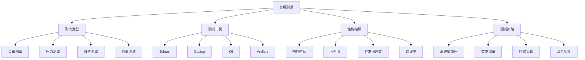

# 负载测试面试题

[← 返回后端面试题目录](./README.md)

## 📚 题目概览

本部分考察负载测试的设计、实施和分析能力，重点关注测试策略制定、工具选择和性能分析方法。

## 🎯 核心技术考察重点

### 测试类型与策略
- **负载测试**：验证系统在预期负载下的性能表现
- **压力测试**：确定系统的性能边界和破坏点
- **峰值测试**：评估系统处理突发流量的能力
- **容量测试**：确定系统的最大承载能力

### 测试工具与技术
- **工具选择**：JMeter、Gatling、K6、Artillery的特点对比
- **脚本设计**：测试脚本的编写和参数化
- **数据准备**：测试数据的生成和管理策略
- **环境配置**：测试环境的搭建和配置优化

### 性能指标与分析
- **核心指标**：响应时间、吞吐量、并发用户数、错误率
- **统计分析**：百分位数、平均值、标准差的意义
- **瓶颈识别**：系统瓶颈的定位和分析方法
- **报告生成**：测试结果的可视化和报告制作

## 📊 知识结构关联图

## 📝 核心面试题目

### 测试策略设计 [中级]

#### 题目1：负载测试策略的制定和实施
**问题背景**：为电商系统的促销活动制定负载测试策略

**技术挑战**：
- 预期流量的评估和建模
- 测试场景的设计和覆盖
- 测试数据的准备和管理
- 测试环境的配置和优化

**考察要点**：
- 不同测试类型的适用场景和目标
- 测试计划的制定和执行流程
- 性能基线的建立和对比方法
- 测试结果的分析和解读能力

**📁 完整解决方案**：[负载测试策略设计](../../solutions/common/load-testing-strategy.md)

#### 题目2：测试工具的选择和对比分析
**问题背景**：团队需要选择合适的负载测试工具

**技术挑战**：
- 不同工具的功能特点对比
- 脚本编写的复杂度和维护性
- 测试结果的准确性和可靠性
- 团队技能和学习成本考虑

**考察要点**：
- JMeter、Gatling、K6等工具的优缺点
- 工具选择的决策因素和权衡
- 脚本开发和维护的最佳实践
- 测试结果的可信度评估

**📁 完整解决方案**：[负载测试工具选型](../../solutions/common/load-testing-tools-comparison.md)

### 性能指标分析 [中级]

#### 题目3：性能指标的定义和分析方法
**问题背景**：分析系统性能测试结果并识别瓶颈

**技术挑战**：
- 关键性能指标的选择和定义
- 统计数据的正确解读和分析
- 异常值和趋势的识别方法
- 性能瓶颈的定位和诊断

**考察要点**：
- 响应时间分布的统计学意义
- 百分位数与平均值的差异和应用
- 吞吐量和并发用户数的关系
- 错误率的分类和影响分析

**📁 完整解决方案**：[性能指标分析方法](../../solutions/common/performance-metrics-analysis.md)

### 测试场景设计 [高级]

#### 题目4：复杂业务场景的测试设计
**问题背景**：设计模拟真实用户行为的负载测试场景

**技术挑战**：
- 用户行为模式的建模和仿真
- 多种业务流程的组合测试
- 数据一致性和状态管理
- 测试执行的协调和同步

**考察要点**：
- 用户行为路径的分析和建模
- 测试数据的生成和管理策略
- 并发场景的设计和控制方法
- 业务逻辑的完整性验证

**📁 完整解决方案**：[复杂场景测试设计](../../solutions/common/complex-load-testing-scenarios.md)

#### 题目5：分布式负载测试的实施
**问题背景**：实施大规模分布式负载测试

**技术挑战**：
- 测试节点的分布和协调
- 网络延迟和带宽的影响
- 测试结果的聚合和同步
- 资源使用和成本优化

**考察要点**：
- 分布式测试架构的设计原理
- 测试负载的分配和平衡策略
- 网络因素对测试结果的影响
- 云环境下的测试实施方案

**📁 完整解决方案**：[分布式负载测试实施](../../solutions/common/distributed-load-testing.md)

### 测试结果分析 [高级]

#### 题目6：性能瓶颈的识别和优化建议
**问题背景**：基于测试结果识别系统瓶颈并提供优化建议

**技术挑战**：
- 多层次性能数据的关联分析
- 瓶颈根因的追溯和定位
- 优化方案的评估和权衡
- 改进效果的验证方法

**考察要点**：
- 系统架构层面的瓶颈分析
- 数据库、缓存、网络等组件的性能特征
- 代码级别的性能优化建议
- 基础设施的扩展和配置优化

**📁 完整解决方案**：[性能瓶颈分析优化](../../solutions/common/performance-bottleneck-analysis.md)

## 📊 面试评分标准

### 基础知识 (30分)
- 负载测试基本概念的理解
- 测试类型和工具的熟悉程度
- 性能指标的定义和意义

### 技术深度 (40分)
- 测试策略的设计能力
- 性能分析的深度和准确性
- 瓶颈识别和优化建议的质量

### 实践能力 (30分)
- 实际测试项目的经验
- 工具使用的熟练程度
- 问题解决和沟通能力

## 🎯 备考建议

### 理论学习路径
1. **基础概念**：理解负载测试的类型、目标和方法论
2. **工具掌握**：熟练使用主流负载测试工具
3. **分析技能**：掌握性能数据分析和瓶颈识别方法
4. **实践经验**：积累不同场景下的测试实施经验

### 实践项目建议
1. **工具对比项目**：使用不同工具测试同一系统进行对比
2. **场景设计练习**：设计复杂的业务场景测试用例
3. **性能分析实践**：分析真实系统的性能测试结果
4. **优化验证项目**：实施性能优化并验证改进效果

## 🔗 相关资源链接

- [性能优化实践](./performance-optimization.md)
- [系统监控与调试](./monitoring-debugging.md)
- [分布式系统设计](./distributed-systems.md)
- [数据库性能优化](../database/performance-tuning.md) 