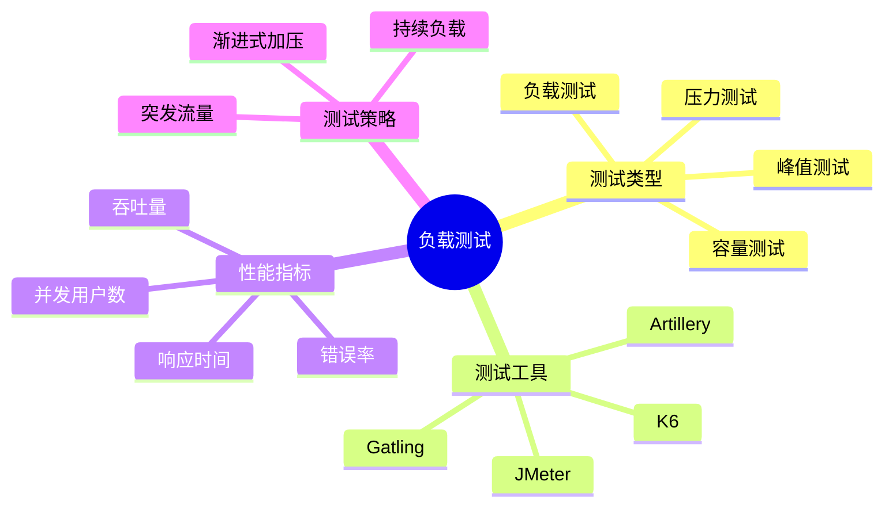

# 负载测试面试题

[← 返回后端面试题目录](./README.md)

## 📋 目录

- [负载测试基础](#负载测试基础)
- [测试工具](#测试工具)
- [测试策略](#测试策略)
- [性能分析](#性能分析)
- [实战案例](#实战案例)

## 🎯 核心知识点



## 负载测试基础

### 💡 初级题目

#### 1. 负载测试的类型和目的是什么？

**答案要点：**
- **负载测试**：验证系统在预期负载下的性能
- **压力测试**：找到系统的性能极限
- **峰值测试**：测试系统处理突发流量的能力
- **容量测试**：确定系统的最大处理能力
- **稳定性测试**：长时间运行验证系统稳定性

```python
import asyncio
import aiohttp
import time
import statistics
from dataclasses import dataclass
from typing import List, Dict, Any
import json

@dataclass
class TestResult:
    url: str
    method: str
    status_code: int
    response_time: float
    error: str = None
    timestamp: float = None

class LoadTester:
    def __init__(self, base_url: str):
        self.base_url = base_url
        self.results = []
    
    async def single_request(self, session: aiohttp.ClientSession, 
                           endpoint: str, method: str = 'GET', 
                           data: Dict = None) -> TestResult:
        """执行单个请求"""
        url = f"{self.base_url}{endpoint}"
        start_time = time.time()
        
        try:
            async with session.request(method, url, json=data) as response:
                await response.text()  # 读取响应内容
                response_time = time.time() - start_time
                
                return TestResult(
                    url=url,
                    method=method,
                    status_code=response.status,
                    response_time=response_time,
                    timestamp=start_time
                )
        except Exception as e:
            return TestResult(
                url=url,
                method=method,
                status_code=0,
                response_time=time.time() - start_time,
                error=str(e),
                timestamp=start_time
            )
    
    async def load_test(self, endpoint: str, concurrent_users: int, 
                       duration: int, method: str = 'GET', 
                       data: Dict = None) -> List[TestResult]:
        """执行负载测试"""
        print(f"开始负载测试: {concurrent_users} 并发用户, 持续 {duration} 秒")
        
        async with aiohttp.ClientSession() as session:
            tasks = []
            end_time = time.time() + duration
            
            # 创建并发任务
            for _ in range(concurrent_users):
                task = asyncio.create_task(
                    self._user_simulation(session, endpoint, end_time, method, data)
                )
                tasks.append(task)
            
            # 等待所有任务完成
            results = await asyncio.gather(*tasks)
            
            # 合并结果
            all_results = []
            for user_results in results:
                all_results.extend(user_results)
            
            self.results = all_results
            return all_results
    
    async def _user_simulation(self, session: aiohttp.ClientSession, 
                              endpoint: str, end_time: float, 
                              method: str, data: Dict) -> List[TestResult]:
        """模拟单个用户的行为"""
        user_results = []
        
        while time.time() < end_time:
            result = await self.single_request(session, endpoint, method, data)
            user_results.append(result)
            
            # 模拟用户思考时间
            await asyncio.sleep(0.1)
        
        return user_results
    
    def analyze_results(self) -> Dict[str, Any]:
        """分析测试结果"""
        if not self.results:
            return {}
        
        # 过滤成功的请求
        successful_results = [r for r in self.results if r.status_code == 200]
        failed_results = [r for r in self.results if r.status_code != 200]
        
        response_times = [r.response_time for r in successful_results]
        
        if not response_times:
            return {"error": "没有成功的请求"}
        
        # 计算统计指标
        total_requests = len(self.results)
        successful_requests = len(successful_results)
        failed_requests = len(failed_results)
        
        # 时间范围
        start_time = min(r.timestamp for r in self.results)
        end_time = max(r.timestamp for r in self.results)
        test_duration = end_time - start_time
        
        analysis = {
            "总请求数": total_requests,
            "成功请求数": successful_requests,
            "失败请求数": failed_requests,
            "成功率": f"{successful_requests / total_requests * 100:.2f}%",
            "测试持续时间": f"{test_duration:.2f}秒",
            "平均响应时间": f"{statistics.mean(response_times):.3f}秒",
            "中位数响应时间": f"{statistics.median(response_times):.3f}秒",
            "最小响应时间": f"{min(response_times):.3f}秒",
            "最大响应时间": f"{max(response_times):.3f}秒",
            "95百分位响应时间": f"{statistics.quantiles(response_times, n=20)[18]:.3f}秒",
            "99百分位响应时间": f"{statistics.quantiles(response_times, n=100)[98]:.3f}秒",
            "吞吐量": f"{successful_requests / test_duration:.2f} 请求/秒"
        }
        
        # 错误分析
        if failed_results:
            error_types = {}
            for result in failed_results:
                error_key = f"HTTP {result.status_code}"
                if result.error:
                    error_key = result.error
                error_types[error_key] = error_types.get(error_key, 0) + 1
            
            analysis["错误类型"] = error_types
        
        return analysis

# 使用示例
async def basic_load_test():
    tester = LoadTester("http://localhost:8000")
    
    # 执行负载测试
    results = await tester.load_test(
        endpoint="/api/users",
        concurrent_users=10,
        duration=30
    )
    
    # 分析结果
    analysis = tester.analyze_results()
    print(json.dumps(analysis, indent=2, ensure_ascii=False))
```

### 🔥 中级题目

#### 2. 如何设计渐进式负载测试？

**答案要点：**
- **阶梯式加压**：逐步增加并发用户数
- **性能基线**：建立性能基准
- **瓶颈识别**：找到性能拐点
- **容量规划**：确定系统容量

```python
class ProgressiveLoadTester(LoadTester):
    def __init__(self, base_url: str):
        super().__init__(base_url)
        self.stage_results = {}
    
    async def progressive_test(self, endpoint: str, 
                             start_users: int = 1,
                             max_users: int = 100,
                             step_size: int = 10,
                             step_duration: int = 60) -> Dict[str, Any]:
        """执行渐进式负载测试"""
        print(f"开始渐进式负载测试: {start_users} -> {max_users} 用户")
        
        current_users = start_users
        
        while current_users <= max_users:
            print(f"测试阶段: {current_users} 并发用户")
            
            # 执行当前阶段的测试
            stage_results = await self.load_test(
                endpoint=endpoint,
                concurrent_users=current_users,
                duration=step_duration
            )
            
            # 分析当前阶段结果
            stage_analysis = self.analyze_results()
            self.stage_results[current_users] = stage_analysis
            
            print(f"阶段 {current_users}: 平均响应时间 {stage_analysis.get('平均响应时间', 'N/A')}")
            
            # 检查是否达到性能阈值
            avg_response_time = statistics.mean([
                r.response_time for r in stage_results 
                if r.status_code == 200
            ]) if stage_results else float('inf')
            
            if avg_response_time > 2.0:  # 2秒阈值
                print(f"性能阈值达到，停止测试。当前用户数: {current_users}")
                break
            
            current_users += step_size
            
            # 清空结果为下一阶段准备
            self.results = []
        
        return self._analyze_progressive_results()
    
    def _analyze_progressive_results(self) -> Dict[str, Any]:
        """分析渐进式测试结果"""
        if not self.stage_results:
            return {}
        
        # 提取关键指标
        user_counts = list(self.stage_results.keys())
        response_times = []
        throughputs = []
        success_rates = []
        
        for users in user_counts:
            stage_data = self.stage_results[users]
            
            # 提取数值（去除单位）
            avg_time = float(stage_data.get('平均响应时间', '0').replace('秒', ''))
            throughput = float(stage_data.get('吞吐量', '0').replace(' 请求/秒', ''))
            success_rate = float(stage_data.get('成功率', '0%').replace('%', ''))
            
            response_times.append(avg_time)
            throughputs.append(throughput)
            success_rates.append(success_rate)
        
        # 找到最佳性能点
        best_throughput_idx = throughputs.index(max(throughputs))
        optimal_users = user_counts[best_throughput_idx]
        
        # 找到性能拐点
        breaking_point = None
        for i in range(1, len(response_times)):
            if response_times[i] > response_times[i-1] * 1.5:  # 响应时间增长50%
                breaking_point = user_counts[i]
                break
        
        return {
            "测试阶段数": len(user_counts),
            "最大并发用户数": max(user_counts),
            "最佳性能点": {
                "并发用户数": optimal_users,
                "吞吐量": f"{throughputs[best_throughput_idx]:.2f} 请求/秒",
                "平均响应时间": f"{response_times[best_throughput_idx]:.3f}秒"
            },
            "性能拐点": breaking_point,
            "各阶段详情": self.stage_results
        }

# 压力测试实现
class StressTester(LoadTester):
    async def stress_test(self, endpoint: str, 
                         target_rps: int,  # 目标每秒请求数
                         duration: int = 300) -> Dict[str, Any]:
        """执行压力测试"""
        print(f"开始压力测试: 目标 {target_rps} RPS, 持续 {duration} 秒")
        
        # 计算需要的并发用户数（估算）
        estimated_users = target_rps * 2  # 假设每个用户每2秒发送一个请求
        
        async with aiohttp.ClientSession() as session:
            # 使用令牌桶算法控制请求速率
            await self._rate_limited_test(
                session, endpoint, target_rps, duration
            )
        
        return self.analyze_results()
    
    async def _rate_limited_test(self, session: aiohttp.ClientSession,
                               endpoint: str, target_rps: int, duration: int):
        """使用速率限制的测试"""
        interval = 1.0 / target_rps  # 请求间隔
        end_time = time.time() + duration
        
        tasks = []
        last_request_time = time.time()
        
        while time.time() < end_time:
            current_time = time.time()
            
            # 控制请求速率
            if current_time - last_request_time >= interval:
                task = asyncio.create_task(
                    self.single_request(session, endpoint)
                )
                tasks.append(task)
                last_request_time = current_time
            
            await asyncio.sleep(0.001)  # 短暂休眠避免CPU占用过高
        
        # 等待所有请求完成
        self.results = await asyncio.gather(*tasks)

# 峰值测试实现
class SpikeTester(LoadTester):
    async def spike_test(self, endpoint: str,
                        baseline_users: int = 10,
                        spike_users: int = 100,
                        spike_duration: int = 30,
                        total_duration: int = 300) -> Dict[str, Any]:
        """执行峰值测试"""
        print(f"开始峰值测试: 基线 {baseline_users} 用户, 峰值 {spike_users} 用户")
        
        async with aiohttp.ClientSession() as session:
            tasks = []
            
            # 基线用户（持续运行）
            for _ in range(baseline_users):
                task = asyncio.create_task(
                    self._baseline_user(session, endpoint, total_duration)
                )
                tasks.append(task)
            
            # 等待一段时间后启动峰值用户
            await asyncio.sleep(60)  # 1分钟后开始峰值
            
            spike_end_time = time.time() + spike_duration
            for _ in range(spike_users - baseline_users):
                task = asyncio.create_task(
                    self._spike_user(session, endpoint, spike_end_time)
                )
                tasks.append(task)
            
            # 等待所有任务完成
            results = await asyncio.gather(*tasks)
            
            # 合并结果
            all_results = []
            for user_results in results:
                all_results.extend(user_results)
            
            self.results = all_results
        
        return self._analyze_spike_results()
    
    async def _baseline_user(self, session: aiohttp.ClientSession,
                           endpoint: str, duration: int) -> List[TestResult]:
        """基线用户行为"""
        results = []
        end_time = time.time() + duration
        
        while time.time() < end_time:
            result = await self.single_request(session, endpoint)
            result.timestamp = time.time()  # 记录实际时间戳
            results.append(result)
            await asyncio.sleep(1)  # 每秒一个请求
        
        return results
    
    async def _spike_user(self, session: aiohttp.ClientSession,
                         endpoint: str, end_time: float) -> List[TestResult]:
        """峰值用户行为"""
        results = []
        
        while time.time() < end_time:
            result = await self.single_request(session, endpoint)
            result.timestamp = time.time()
            results.append(result)
            await asyncio.sleep(0.1)  # 更频繁的请求
        
        return results
    
    def _analyze_spike_results(self) -> Dict[str, Any]:
        """分析峰值测试结果"""
        if not self.results:
            return {}
        
        # 按时间排序
        sorted_results = sorted(self.results, key=lambda x: x.timestamp)
        
        # 找到峰值开始时间（请求频率明显增加的时间点）
        spike_start = self._detect_spike_start(sorted_results)
        
        # 分析峰值前后的性能
        pre_spike = [r for r in sorted_results if r.timestamp < spike_start]
        during_spike = [r for r in sorted_results if r.timestamp >= spike_start]
        
        pre_spike_analysis = self._analyze_period(pre_spike, "峰值前")
        spike_analysis = self._analyze_period(during_spike, "峰值期间")
        
        return {
            "峰值开始时间": spike_start,
            "峰值前性能": pre_spike_analysis,
            "峰值期间性能": spike_analysis,
            "性能影响": self._calculate_performance_impact(
                pre_spike_analysis, spike_analysis
            )
        }
    
    def _detect_spike_start(self, sorted_results: List[TestResult]) -> float:
        """检测峰值开始时间"""
        if len(sorted_results) < 10:
            return sorted_results[0].timestamp
        
        # 计算每秒的请求数
        time_buckets = {}
        for result in sorted_results:
            bucket = int(result.timestamp)
            time_buckets[bucket] = time_buckets.get(bucket, 0) + 1
        
        # 找到请求数明显增加的时间点
        buckets = sorted(time_buckets.keys())
        for i in range(1, len(buckets)):
            current_rps = time_buckets[buckets[i]]
            previous_rps = time_buckets[buckets[i-1]]
            
            if current_rps > previous_rps * 2:  # 请求数翻倍
                return float(buckets[i])
        
        return sorted_results[0].timestamp
    
    def _analyze_period(self, results: List[TestResult], period_name: str) -> Dict:
        """分析特定时期的性能"""
        if not results:
            return {}
        
        successful = [r for r in results if r.status_code == 200]
        response_times = [r.response_time for r in successful]
        
        if not response_times:
            return {"错误": "没有成功的请求"}
        
        return {
            "时期": period_name,
            "请求总数": len(results),
            "成功请求数": len(successful),
            "平均响应时间": f"{statistics.mean(response_times):.3f}秒",
            "95百分位响应时间": f"{statistics.quantiles(response_times, n=20)[18]:.3f}秒"
        }
    
    def _calculate_performance_impact(self, pre_spike: Dict, during_spike: Dict) -> Dict:
        """计算性能影响"""
        if not pre_spike or not during_spike:
            return {}
        
        try:
            pre_avg = float(pre_spike["平均响应时间"].replace("秒", ""))
            spike_avg = float(during_spike["平均响应时间"].replace("秒", ""))
            
            impact = (spike_avg - pre_avg) / pre_avg * 100
            
            return {
                "响应时间增长": f"{impact:.1f}%",
                "性能退化程度": "严重" if impact > 100 else "中等" if impact > 50 else "轻微"
            }
        except:
            return {"错误": "无法计算性能影响"}

# 使用示例
async def comprehensive_load_testing():
    base_url = "http://localhost:8000"
    
    # 1. 渐进式负载测试
    print("=== 渐进式负载测试 ===")
    progressive_tester = ProgressiveLoadTester(base_url)
    progressive_results = await progressive_tester.progressive_test(
        endpoint="/api/users",
        start_users=5,
        max_users=50,
        step_size=5,
        step_duration=30
    )
    print(json.dumps(progressive_results, indent=2, ensure_ascii=False))
    
    # 2. 压力测试
    print("\n=== 压力测试 ===")
    stress_tester = StressTester(base_url)
    stress_results = await stress_tester.stress_test(
        endpoint="/api/users",
        target_rps=100,
        duration=120
    )
    print(json.dumps(stress_results, indent=2, ensure_ascii=False))
    
    # 3. 峰值测试
    print("\n=== 峰值测试 ===")
    spike_tester = SpikeTester(base_url)
    spike_results = await spike_tester.spike_test(
        endpoint="/api/users",
        baseline_users=10,
        spike_users=50,
        spike_duration=60,
        total_duration=300
    )
    print(json.dumps(spike_results, indent=2, ensure_ascii=False))

if __name__ == "__main__":
    asyncio.run(comprehensive_load_testing())
```

## 测试工具

### 🔥 中级题目

#### 3. 主流负载测试工具的特点和选择？

**答案要点：**
- **JMeter**：GUI界面，功能全面，适合复杂场景
- **Gatling**：高性能，Scala编写，适合大规模测试
- **K6**：JavaScript编写，云原生，易于CI/CD集成
- **Artillery**：Node.js编写，简单易用，适合API测试

```yaml
# K6 测试脚本示例
# test-script.js
import http from 'k6/http';
import { check, sleep } from 'k6';
import { Rate } from 'k6/metrics';

// 自定义指标
export let errorRate = new Rate('errors');

export let options = {
  stages: [
    { duration: '2m', target: 10 }, // 2分钟内增加到10个用户
    { duration: '5m', target: 10 }, // 保持10个用户5分钟
    { duration: '2m', target: 20 }, // 2分钟内增加到20个用户
    { duration: '5m', target: 20 }, // 保持20个用户5分钟
    { duration: '2m', target: 0 },  // 2分钟内减少到0个用户
  ],
  thresholds: {
    http_req_duration: ['p(95)<500'], // 95%的请求响应时间小于500ms
    http_req_failed: ['rate<0.1'],    // 错误率小于10%
  },
};

export default function() {
  let response = http.get('http://localhost:8000/api/users');
  
  check(response, {
    'status is 200': (r) => r.status === 200,
    'response time < 500ms': (r) => r.timings.duration < 500,
  });
  
  errorRate.add(response.status !== 200);
  
  sleep(1);
}
```

```xml
<!-- JMeter 测试计划示例 -->
<?xml version="1.0" encoding="UTF-8"?>
<jmeterTestPlan version="1.2">
  <hashTree>
    <TestPlan guiclass="TestPlanGui" testclass="TestPlan" testname="API Load Test">
      <elementProp name="TestPlan.arguments" elementType="Arguments" guiclass="ArgumentsPanel">
        <collectionProp name="Arguments.arguments"/>
      </elementProp>
      <stringProp name="TestPlan.user_define_classpath"></stringProp>
      <boolProp name="TestPlan.serialize_threadgroups">false</boolProp>
      <boolProp name="TestPlan.functional_mode">false</boolProp>
    </TestPlan>
    <hashTree>
      <ThreadGroup guiclass="ThreadGroupGui" testclass="ThreadGroup" testname="User Group">
        <stringProp name="ThreadGroup.on_sample_error">continue</stringProp>
        <elementProp name="ThreadGroup.main_controller" elementType="LoopController">
          <boolProp name="LoopController.continue_forever">false</boolProp>
          <stringProp name="LoopController.loops">10</stringProp>
        </elementProp>
        <stringProp name="ThreadGroup.num_threads">50</stringProp>
        <stringProp name="ThreadGroup.ramp_time">60</stringProp>
      </ThreadGroup>
      <hashTree>
        <HTTPSamplerProxy guiclass="HttpTestSampleGui" testclass="HTTPSamplerProxy" testname="Get Users">
          <elementProp name="HTTPsampler.Arguments" elementType="Arguments">
            <collectionProp name="Arguments.arguments"/>
          </elementProp>
          <stringProp name="HTTPSampler.domain">localhost</stringProp>
          <stringProp name="HTTPSampler.port">8000</stringProp>
          <stringProp name="HTTPSampler.path">/api/users</stringProp>
          <stringProp name="HTTPSampler.method">GET</stringProp>
        </HTTPSamplerProxy>
      </hashTree>
    </hashTree>
  </hashTree>
</jmeterTestPlan>
```

## 🔗 相关链接

- [← 返回后端面试题目录](./README.md)
- [性能优化面试题](./performance-optimization.md)
- [监控与调试面试题](./monitoring-debugging.md)
- [系统设计面试题](../system-design/README.md)

---

*掌握负载测试技能，确保系统性能和稳定性* 🚀 