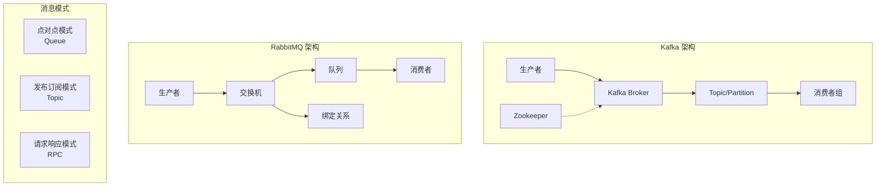
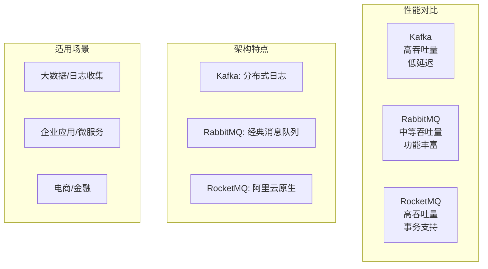
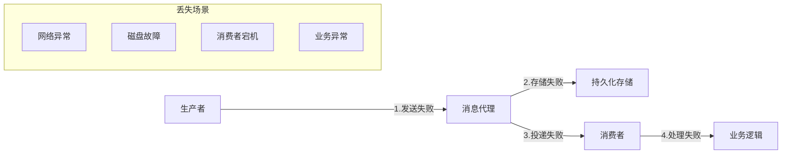

# 消息队列面试题

## 🏷️ 标签
- 技术栈: 消息队列, RabbitMQ, Kafka, Redis
- 难度: 中级到高级
- 类型: 原理题, 场景题, 实战题

## 📋 题目描述

本文包含消息队列相关的面试题，涵盖消息队列基础概念、主流MQ产品对比、消息可靠性、顺序性、重复消费等核心问题。

## 💡 核心知识点
- 消息队列基础概念和模式
- 主流MQ产品对比 (Kafka, RabbitMQ, RocketMQ)
- 消息可靠性保证机制
- 消息顺序性和幂等性
- 消息积压和性能调优
- 分布式消息系统设计

## 📊 消息队列架构对比



## 📝 面试题目

### 1. 消息队列基础概念

#### **【中级】** 解释消息队列的作用和主要应用场景，对比不同消息模式的特点

**💡 考察要点:**
- 消息队列的核心价值
- 不同消息模式的适用场景
- 消息队列解决的具体问题

**📝 参考答案:**

**消息队列的核心作用:**

1. **解耦** - 系统组件间松耦合
2. **异步** - 提高系统响应性能  
3. **削峰** - 处理流量高峰
4. **可靠性** - 保证消息不丢失

**消息模式对比:**

```java
// 1. 点对点模式实现
@Component
public class PointToPointExample {
    
    @Autowired
    private RabbitTemplate rabbitTemplate;
    
    // 生产者发送消息
    public void sendOrderMessage(OrderMessage order) {
        rabbitTemplate.convertAndSend("order.queue", order);
        System.out.println("订单消息已发送: " + order.getOrderId());
    }
    
    // 消费者处理消息 (只有一个消费者能收到)
    @RabbitListener(queues = "order.queue")
    public void handleOrderMessage(OrderMessage order) {
        System.out.println("处理订单: " + order.getOrderId());
        // 处理订单逻辑
        processOrder(order);
    }
}

// 2. 发布订阅模式实现
@Component
public class PublishSubscribeExample {
    
    @Autowired
    private RabbitTemplate rabbitTemplate;
    
    // 发布者发送消息
    public void publishUserEvent(UserEvent event) {
        rabbitTemplate.convertAndSend("user.events", "", event);
        System.out.println("用户事件已发布: " + event.getEventType());
    }
    
    // 订阅者1: 邮件服务
    @RabbitListener(queues = "user.events.email")
    public void handleUserEventForEmail(UserEvent event) {
        if (event.getEventType() == EventType.USER_REGISTERED) {
            emailService.sendWelcomeEmail(event.getUserId());
        }
    }
    
    // 订阅者2: 积分服务
    @RabbitListener(queues = "user.events.points")
    public void handleUserEventForPoints(UserEvent event) {
        if (event.getEventType() == EventType.USER_REGISTERED) {
            pointsService.grantSignupBonus(event.getUserId());
        }
    }
    
    // 订阅者3: 统计服务
    @RabbitListener(queues = "user.events.analytics")
    public void handleUserEventForAnalytics(UserEvent event) {
        analyticsService.recordUserEvent(event);
    }
}

// 3. 请求响应模式实现
@Component
public class RequestResponseExample {
    
    @Autowired
    private RabbitTemplate rabbitTemplate;
    
    // 发送请求并等待响应
    public UserProfile getUserProfile(String userId) {
        UserProfileRequest request = new UserProfileRequest(userId);
        
        // 发送请求并等待响应 (设置超时时间)
        UserProfile response = (UserProfile) rabbitTemplate.convertSendAndReceive(
            "user.profile.request", 
            request,
            message -> {
                message.getMessageProperties().setExpiration("5000"); // 5秒超时
                return message;
            }
        );
        
        if (response == null) {
            throw new TimeoutException("用户资料请求超时");
        }
        
        return response;
    }
    
    // 处理请求并返回响应
    @RabbitListener(queues = "user.profile.request")
    public UserProfile handleProfileRequest(UserProfileRequest request) {
        System.out.println("处理用户资料请求: " + request.getUserId());
        
        // 查询用户资料
        UserProfile profile = userService.getProfile(request.getUserId());
        
        return profile; // 自动发送响应
    }
}
```

**应用场景实例:**

| 场景 | 消息模式 | 具体实现 | 收益 |
|------|----------|----------|------|
| **订单处理** | 点对点 | 订单→库存→支付→物流 | 解耦各个服务 |
| **用户注册** | 发布订阅 | 注册事件→邮件/积分/统计 | 功能模块解耦 |
| **数据同步** | 请求响应 | 主系统查询从系统数据 | 实时数据获取 |
| **日志收集** | 发布订阅 | 应用日志→多个分析系统 | 多消费者处理 |

---

### 2. 主流MQ产品对比

#### **【高级】** 对比 Kafka、RabbitMQ、RocketMQ 的架构特点和适用场景

**💡 考察要点:**
- 不同MQ的架构设计
- 性能特点和适用场景
- 技术选型的考虑因素



**📝 参考答案:**

**详细对比分析:**

```java
// 1. Kafka 高性能配置示例
@Configuration
public class KafkaConfig {
    
    @Bean
    public ProducerFactory<String, Object> producerFactory() {
        Map<String, Object> props = new HashMap<>();
        props.put(ProducerConfig.BOOTSTRAP_SERVERS_CONFIG, "localhost:9092");
        props.put(ProducerConfig.KEY_SERIALIZER_CLASS_CONFIG, StringSerializer.class);
        props.put(ProducerConfig.VALUE_SERIALIZER_CLASS_CONFIG, JsonSerializer.class);
        
        // 性能优化配置
        props.put(ProducerConfig.BATCH_SIZE_CONFIG, 16384);     // 批量大小
        props.put(ProducerConfig.LINGER_MS_CONFIG, 5);          // 批量等待时间
        props.put(ProducerConfig.COMPRESSION_TYPE_CONFIG, "snappy"); // 压缩
        props.put(ProducerConfig.BUFFER_MEMORY_CONFIG, 33554432);    // 缓冲区大小
        
        // 可靠性配置
        props.put(ProducerConfig.ACKS_CONFIG, "all");           // 等待所有副本确认
        props.put(ProducerConfig.RETRIES_CONFIG, 3);            // 重试次数
        props.put(ProducerConfig.ENABLE_IDEMPOTENCE_CONFIG, true); // 幂等性
        
        return new DefaultKafkaProducerFactory<>(props);
    }
    
    @Bean
    public ConsumerFactory<String, Object> consumerFactory() {
        Map<String, Object> props = new HashMap<>();
        props.put(ConsumerConfig.BOOTSTRAP_SERVERS_CONFIG, "localhost:9092");
        props.put(ConsumerConfig.GROUP_ID_CONFIG, "my-group");
        props.put(ConsumerConfig.KEY_DESERIALIZER_CLASS_CONFIG, StringDeserializer.class);
        props.put(ConsumerConfig.VALUE_DESERIALIZER_CLASS_CONFIG, JsonDeserializer.class);
        
        // 性能优化配置
        props.put(ConsumerConfig.FETCH_MIN_BYTES_CONFIG, 1024);  // 最小拉取字节数
        props.put(ConsumerConfig.FETCH_MAX_WAIT_MS_CONFIG, 500); // 最大等待时间
        props.put(ConsumerConfig.MAX_POLL_RECORDS_CONFIG, 500);  // 每次poll最大记录数
        
        // 消费策略配置
        props.put(ConsumerConfig.AUTO_OFFSET_RESET_CONFIG, "earliest");
        props.put(ConsumerConfig.ENABLE_AUTO_COMMIT_CONFIG, false); // 手动提交
        
        return new DefaultKafkaConsumerFactory<>(props);
    }
}

// 2. RabbitMQ 灵活路由配置示例
@Configuration
public class RabbitMQConfig {
    
    // 主题交换机配置
    @Bean
    public TopicExchange orderExchange() {
        return new TopicExchange("order.topic", true, false);
    }
    
    // 队列配置
    @Bean
    public Queue orderCreatedQueue() {
        return QueueBuilder.durable("order.created")
            .withArgument("x-message-ttl", 60000)           // 消息TTL
            .withArgument("x-max-length", 10000)            // 队列最大长度
            .withArgument("x-dead-letter-exchange", "order.dlx") // 死信交换机
            .build();
    }
    
    @Bean
    public Queue orderPaidQueue() {
        return QueueBuilder.durable("order.paid")
            .withArgument("x-message-ttl", 60000)
            .build();
    }
    
    // 绑定配置
    @Bean
    public Binding orderCreatedBinding() {
        return BindingBuilder.bind(orderCreatedQueue())
            .to(orderExchange())
            .with("order.created.*");
    }
    
    @Bean
    public Binding orderPaidBinding() {
        return BindingBuilder.bind(orderPaidQueue())
            .to(orderExchange())
            .with("order.paid.*");
    }
    
    // 死信队列配置
    @Bean
    public DirectExchange deadLetterExchange() {
        return new DirectExchange("order.dlx");
    }
    
    @Bean
    public Queue deadLetterQueue() {
        return QueueBuilder.durable("order.dlq").build();
    }
    
    @Bean
    public Binding deadLetterBinding() {
        return BindingBuilder.bind(deadLetterQueue())
            .to(deadLetterExchange())
            .with("order.dlq");
    }
}

// 3. RocketMQ 事务消息示例
@Component
public class RocketMQTransactionExample {
    
    @Autowired
    private RocketMQTemplate rocketMQTemplate;
    
    // 发送事务消息
    public void sendTransactionMessage(OrderCreateEvent event) {
        // 发送事务消息
        TransactionSendResult result = rocketMQTemplate.sendMessageInTransaction(
            "order-tx-group",
            "order-topic:create",
            MessageBuilder.withPayload(event).build(),
            event // 传递给本地事务检查的参数
        );
        
        System.out.println("事务消息发送结果: " + result.getSendStatus());
    }
    
    // 本地事务监听器
    @RocketMQTransactionListener(txProducerGroup = "order-tx-group")
    public class OrderTransactionListener implements RocketMQLocalTransactionListener {
        
        @Override
        public RocketMQLocalTransactionState executeLocalTransaction(
            Message msg, Object arg) {
            OrderCreateEvent event = (OrderCreateEvent) arg;
            
            try {
                // 执行本地事务
                orderService.createOrder(event.getOrderId());
                
                // 本地事务成功，提交消息
                return RocketMQLocalTransactionState.COMMIT;
                
            } catch (Exception e) {
                // 本地事务失败，回滚消息
                return RocketMQLocalTransactionState.ROLLBACK;
            }
        }
        
        @Override
        public RocketMQLocalTransactionState checkLocalTransaction(Message msg) {
            // 检查本地事务状态
            String orderId = extractOrderId(msg);
            
            if (orderService.orderExists(orderId)) {
                return RocketMQLocalTransactionState.COMMIT;
            } else {
                return RocketMQLocalTransactionState.ROLLBACK;
            }
        }
    }
}
```

**产品特性对比:**

| 特性 | Kafka | RabbitMQ | RocketMQ |
|------|-------|----------|----------|
| **吞吐量** | 极高 (百万级/秒) | 中等 (万级/秒) | 高 (十万级/秒) |
| **延迟** | 毫秒级 | 微秒级 | 毫秒级 |
| **可靠性** | 高 (副本机制) | 高 (持久化+确认) | 高 (主从+事务) |
| **消息顺序** | 分区有序 | 队列有序 | 全局有序 |
| **事务支持** | 有限支持 | 支持 | 完整支持 |
| **运维复杂度** | 高 | 中等 | 中等 |
| **生态成熟度** | 成熟 | 成熟 | 较新 |

**技术选型建议:**

```java
// 选型决策工具类
public class MqSelectionHelper {
    
    public static MqType recommendMq(BusinessScenario scenario) {
        switch (scenario.getType()) {
            case LOG_COLLECTION:
            case BIG_DATA_PIPELINE:
                return MqType.KAFKA; // 高吞吐量场景
                
            case MICROSERVICE_COMMUNICATION:
            case ENTERPRISE_INTEGRATION:
                return MqType.RABBITMQ; // 功能丰富、易用
                
            case FINANCIAL_TRANSACTION:
            case ECOMMERCE_ORDER:
                return MqType.ROCKETMQ; // 事务支持
                
            default:
                return evaluateByMetrics(scenario);
        }
    }
    
    private static MqType evaluateByMetrics(BusinessScenario scenario) {
        int score = 0;
        
        // 吞吐量权重
        if (scenario.getThroughputRequirement() > 100000) {
            score += 10; // 偏向 Kafka/RocketMQ
        }
        
        // 延迟权重
        if (scenario.getLatencyRequirement() < 10) {
            score += 5; // 偏向 RabbitMQ
        }
        
        // 功能复杂度权重
        if (scenario.getComplexityLevel() > 7) {
            score += 8; // 偏向 RabbitMQ
        }
        
        // 运维团队技能权重
        if (scenario.getTeamSkillLevel() < 7) {
            score += 6; // 偏向 RabbitMQ
        }
        
        return score > 15 ? MqType.RABBITMQ : 
               scenario.getThroughputRequirement() > 50000 ? MqType.KAFKA : MqType.ROCKETMQ;
    }
}
```

---

### 3. 消息可靠性保证

#### **【高级】** 如何保证消息不丢失？分析消息丢失的各种场景和解决方案

**💡 考察要点:**
- 消息丢失的各种场景分析
- 端到端的可靠性保证机制
- 性能与可靠性的平衡

**📝 参考答案:**

**消息丢失场景分析:**



**完整的可靠性保证方案:**

```java
// 1. 生产者可靠性保证
@Component
public class ReliableProducer {
    
    @Autowired
    private RabbitTemplate rabbitTemplate;
    
    @Autowired
    private RedisTemplate<String, Object> redisTemplate;
    
    // 配置确认回调
    @PostConstruct
    public void initRabbitTemplate() {
        // 消息到达交换机确认
        rabbitTemplate.setConfirmCallback((correlationData, ack, cause) -> {
            String messageId = correlationData.getId();
            if (ack) {
                // 消息到达交换机，删除缓存
                redisTemplate.delete("msg_cache:" + messageId);
                System.out.println("消息 " + messageId + " 已到达交换机");
            } else {
                // 消息未到达交换机，重试
                System.err.println("消息 " + messageId + " 未到达交换机: " + cause);
                retryMessage(messageId);
            }
        });
        
        // 消息到达队列确认
        rabbitTemplate.setReturnsCallback(returned -> {
            String messageId = returned.getMessage().getMessageProperties().getMessageId();
            System.err.println("消息 " + messageId + " 未到达队列: " + returned.getReplyText());
            retryMessage(messageId);
        });
        
        // 强制确认
        rabbitTemplate.setMandatory(true);
    }
    
    public void sendReliableMessage(String routingKey, Object message) {
        String messageId = UUID.randomUUID().toString();
        
        // 1. 先缓存消息
        cacheMessage(messageId, routingKey, message);
        
        // 2. 发送消息
        CorrelationData correlationData = new CorrelationData(messageId);
        MessageProperties properties = new MessageProperties();
        properties.setMessageId(messageId);
        properties.setTimestamp(new Date());
        properties.setDeliveryMode(MessageDeliveryMode.PERSISTENT); // 持久化
        
        Message rabbitMessage = new Message(
            JSON.toJSONBytes(message), 
            properties
        );
        
        rabbitTemplate.send("order.exchange", routingKey, rabbitMessage, correlationData);
        
        // 3. 设置定时检查
        scheduleMessageCheck(messageId);
    }
    
    private void cacheMessage(String messageId, String routingKey, Object message) {
        MessageCache cache = new MessageCache(messageId, routingKey, message, System.currentTimeMillis());
        redisTemplate.opsForValue().set(
            "msg_cache:" + messageId, 
            cache, 
            Duration.ofMinutes(30)
        );
    }
    
    private void retryMessage(String messageId) {
        MessageCache cache = (MessageCache) redisTemplate.opsForValue()
            .get("msg_cache:" + messageId);
        
        if (cache != null && cache.getRetryCount() < 3) {
            cache.setRetryCount(cache.getRetryCount() + 1);
            redisTemplate.opsForValue().set("msg_cache:" + messageId, cache);
            
            // 延迟重试
            CompletableFuture.delayedExecution(
                () -> sendReliableMessage(cache.getRoutingKey(), cache.getMessage()),
                Duration.ofSeconds(Math.pow(2, cache.getRetryCount()))
            );
        } else {
            // 重试失败，记录错误
            logFailedMessage(messageId, cache);
        }
    }
}

// 2. 消息代理可靠性配置
@Configuration
public class BrokerReliabilityConfig {
    
    // 配置持久化队列
    @Bean
    public Queue durableQueue() {
        return QueueBuilder.durable("order.process")
            .withArgument("x-message-ttl", 300000)              // 5分钟TTL
            .withArgument("x-dead-letter-exchange", "order.dlx") // 死信队列
            .withArgument("x-dead-letter-routing-key", "failed")
            .build();
    }
    
    // 配置镜像队列 (高可用)
    @Bean
    public Queue mirroredQueue() {
        return QueueBuilder.durable("order.important")
            .withArgument("x-ha-policy", "all")     // 所有节点镜像
            .withArgument("x-ha-sync-mode", "automatic") // 自动同步
            .build();
    }
    
    // 配置死信队列
    @Bean
    public Queue deadLetterQueue() {
        return QueueBuilder.durable("order.dlq").build();
    }
    
    @Bean
    public DirectExchange deadLetterExchange() {
        return new DirectExchange("order.dlx", true, false);
    }
}

// 3. 消费者可靠性保证
@Component
public class ReliableConsumer {
    
    @Autowired
    private OrderService orderService;
    
    @Autowired
    private RedisTemplate<String, Object> redisTemplate;
    
    // 手动确认消费
    @RabbitListener(
        queues = "order.process",
        ackMode = "MANUAL"
    )
    public void handleOrderMessage(
        @Payload OrderMessage order,
        @Header Map<String, Object> headers,
        Channel channel,
        @Header(AmqpHeaders.DELIVERY_TAG) long deliveryTag
    ) {
        String messageId = (String) headers.get("messageId");
        
        try {
            // 1. 检查消息是否已处理 (幂等性)
            if (isMessageProcessed(messageId)) {
                channel.basicAck(deliveryTag, false);
                return;
            }
            
            // 2. 处理业务逻辑
            boolean success = processOrder(order);
            
            if (success) {
                // 3. 标记消息已处理
                markMessageProcessed(messageId);
                
                // 4. 确认消息
                channel.basicAck(deliveryTag, false);
                
                System.out.println("订单处理成功: " + order.getOrderId());
            } else {
                // 业务处理失败，拒绝消息
                channel.basicNack(deliveryTag, false, false);
            }
            
        } catch (Exception e) {
            System.err.println("处理订单异常: " + e.getMessage());
            
            try {
                // 获取重试次数
                Integer retryCount = (Integer) headers.get("x-retry-count");
                if (retryCount == null) retryCount = 0;
                
                if (retryCount < 3) {
                    // 重新投递到延迟队列
                    redeliverWithDelay(order, messageId, retryCount + 1, channel, deliveryTag);
                } else {
                    // 重试次数耗尽，发送到死信队列
                    channel.basicNack(deliveryTag, false, false);
                }
            } catch (IOException ioException) {
                System.err.println("消息确认异常: " + ioException.getMessage());
            }
        }
    }
    
    private boolean isMessageProcessed(String messageId) {
        return redisTemplate.hasKey("processed:" + messageId);
    }
    
    private void markMessageProcessed(String messageId) {
        redisTemplate.opsForValue().set(
            "processed:" + messageId, 
            true, 
            Duration.ofHours(24)
        );
    }
    
    private boolean processOrder(OrderMessage order) {
        try {
            // 模拟业务处理
            orderService.processOrder(order);
            return true;
        } catch (BusinessException e) {
            // 业务异常，不重试
            System.err.println("业务处理失败: " + e.getMessage());
            return false;
        } catch (Exception e) {
            // 系统异常，可重试
            throw e;
        }
    }
    
    private void redeliverWithDelay(OrderMessage order, String messageId, 
                                  int retryCount, Channel channel, long deliveryTag) 
                                  throws IOException {
        // 发送到延迟队列
        Map<String, Object> headers = new HashMap<>();
        headers.put("x-retry-count", retryCount);
        headers.put("messageId", messageId);
        
        MessageProperties properties = new MessageProperties();
        properties.setExpiration(String.valueOf(retryCount * 1000)); // 递增延迟
        properties.getHeaders().putAll(headers);
        
        Message retryMessage = new Message(JSON.toJSONBytes(order), properties);
        
        // 发送到延迟队列
        channel.basicPublish("delay.exchange", "order.retry", null, retryMessage.getBody());
        
        // 确认原消息
        channel.basicAck(deliveryTag, false);
    }
}

// 4. 消息监控和告警
@Component
public class MessageMonitor {
    
    @Autowired
    private MeterRegistry meterRegistry;
    
    private final Timer messageProcessingTimer;
    private final Counter messageSuccessCounter;
    private final Counter messageFailureCounter;
    
    public MessageMonitor(MeterRegistry meterRegistry) {
        this.meterRegistry = meterRegistry;
        this.messageProcessingTimer = Timer.builder("message.processing.time")
            .description("消息处理时间")
            .register(meterRegistry);
        this.messageSuccessCounter = Counter.builder("message.success")
            .description("消息处理成功数")
            .register(meterRegistry);
        this.messageFailureCounter = Counter.builder("message.failure")
            .description("消息处理失败数")
            .register(meterRegistry);
    }
    
    public void recordMessageProcessing(String messageId, Runnable processor) {
        Timer.Sample sample = Timer.start(meterRegistry);
        
        try {
            processor.run();
            messageSuccessCounter.increment();
        } catch (Exception e) {
            messageFailureCounter.increment();
            throw e;
        } finally {
            sample.stop(messageProcessingTimer);
        }
    }
    
    // 定期检查消息积压
    @Scheduled(fixedRate = 60000) // 每分钟检查一次
    public void checkMessageBacklog() {
        try {
            // 检查队列深度
            int queueDepth = getQueueDepth("order.process");
            
            meterRegistry.gauge("queue.depth", queueDepth);
            
            if (queueDepth > 1000) {
                // 发送告警
                alertService.sendAlert("消息队列积压告警", 
                    "order.process 队列深度: " + queueDepth);
            }
        } catch (Exception e) {
            System.err.println("检查消息积压异常: " + e.getMessage());
        }
    }
}
```

**可靠性保证策略总结:**

| 阶段 | 可能丢失场景 | 解决方案 | 性能影响 |
|------|-------------|----------|----------|
| **生产阶段** | 网络异常、代理故障 | 发送确认+重试+缓存 | 中等 |
| **存储阶段** | 磁盘故障、节点宕机 | 持久化+副本+镜像 | 较高 |
| **投递阶段** | 消费者不可达 | 死信队列+重试机制 | 较低 |
| **消费阶段** | 处理异常、消费者宕机 | 手动确认+幂等处理 | 较低 |

---

## 🎯 面试技巧建议

### 消息队列回答策略
1. **场景驱动**: 先了解具体业务场景需求
2. **架构设计**: 从整体架构角度分析问题
3. **权衡分析**: 分析可靠性、性能、复杂度的权衡
4. **实践经验**: 分享实际项目中的经验和踩坑

### 常见追问问题
- "如何处理消息重复消费？"
- "消息顺序性如何保证？"
- "消息积压如何处理？"
- "如何选择合适的消息队列产品？"

## 🔗 相关链接

- [← 返回后端目录](./README.md)
- [分布式系统](./distributed-systems.md)
- [微服务架构](./microservices.md)
- [缓存系统](./caching.md)

---

*消息队列是构建可扩展分布式系统的重要基础设施* 📨 