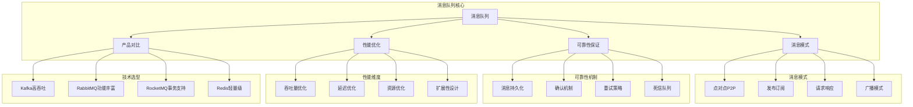

# 消息队列面试题

[← 返回后端面试题目录](./README.md)

## 📚 题目概览

消息队列是现代分布式系统的核心基础设施，直接影响系统的解耦程度、可靠性和扩展性。本章节重点考察候选人对消息队列原理的深度理解，包括不同MQ产品的技术特点、消息可靠性保证、性能调优等核心问题，以及在高并发场景下的实际应用能力。

## 🎯 核心技术考察重点

### 消息队列基础理论
- 消息队列的核心价值和应用场景
- 不同消息模式的特点和适用性
- 消息队列与传统RPC调用的对比
- 消息队列在系统架构中的定位

### 主流MQ产品对比
- Kafka、RabbitMQ、RocketMQ的架构差异
- 不同MQ的性能特点和适用场景
- 消息存储和分发机制的设计
- 集群部署和高可用架构

### 消息可靠性保证
- 消息丢失的原因和防护策略
- 消息重复的处理和幂等性设计
- 消息顺序性的保证机制
- 事务消息和分布式事务

### 性能优化策略
- 消息积压的识别和处理
- 生产者和消费者性能调优
- 批量处理和异步优化
- 监控指标和容量规划

## 📊 知识结构关联图

## 📝 核心面试题目

### 消息队列基础原理 📨

#### 题目1：消息队列核心价值与应用场景分析
**问题背景**：设计一个高并发电商系统的消息处理架构

**技术挑战**：
- 如何选择合适的消息模式
- 如何保证系统的解耦和可扩展性
- 如何处理流量削峰和异步处理

**考察要点**：
- 消息队列的核心价值理解
- 不同消息模式的适用场景
- 系统架构设计能力

**📁 完整解决方案**：[消息队列架构设计完整实现](../../solutions/common/message-queue-architecture.md)

#### 题目2：消息模式设计与通信机制
**问题背景**：构建基于事件驱动的微服务通信系统

**技术挑战**：
- 设计合适的消息传递模式
- 处理服务间的异步通信
- 保证消息的顺序性和一致性

**考察要点**：
- 消息传递模式的深度理解
- 异步通信的设计原理
- 事件驱动架构的实现

**📁 完整解决方案**：[消息传递模式完整实现](../../solutions/common/message-passing-patterns.md)

### 主流MQ产品深度对比 ⚖️

#### 题目3：Kafka与RabbitMQ技术架构对比
**问题背景**：为不同业务场景选择合适的消息队列产品

**技术挑战**：
- 分析不同MQ的架构特点
- 评估性能和功能差异
- 制定技术选型策略

**考察要点**：
- 对主流MQ产品的深入理解
- 技术选型的决策能力
- 架构权衡的分析思维

**📁 完整解决方案**：[MQ产品对比分析完整实现](../../solutions/common/mq-products-comparison.md)

#### 题目4：高性能消息系统架构设计
**问题背景**：设计支撑日处理百亿消息的消息系统

**技术挑战**：
- 设计高吞吐量的消息架构
- 优化消息存储和分发机制
- 实现水平扩展和负载均衡

**考察要点**：
- 高性能系统的设计能力
- 分布式架构的扩展性考虑
- 性能优化的实践经验

**📁 完整解决方案**：[高性能消息系统完整实现](../../solutions/common/high-performance-message-system.md)

### 消息可靠性保证 🛡️

#### 题目5：消息可靠性与幂等性设计
**问题背景**：构建金融级别的消息处理系统

**技术挑战**：
- 保证消息的可靠传递
- 处理消息重复和幂等性
- 设计消息确认和重试机制

**考察要点**：
- 消息可靠性的实现机制
- 幂等性设计的最佳实践
- 分布式系统的一致性保证

**📁 完整解决方案**：[消息可靠性保证完整实现](../../solutions/common/message-reliability-guarantee.md)

#### 题目6：分布式事务消息处理
**问题背景**：实现跨多个服务的事务一致性

**技术挑战**：
- 设计事务消息的处理机制
- 保证分布式事务的ACID特性
- 处理事务失败的补偿策略

**考察要点**：
- 分布式事务的理解深度
- 事务消息的实现原理
- 一致性算法的应用能力

**📁 完整解决方案**：[分布式事务消息完整实现](../../solutions/common/distributed-transaction-message.md)

## 📊 面试评分标准

### 理论基础掌握 (30%)
- **优秀 (90-100分)**：深入理解消息队列原理，能够分析不同场景的适用性
- **良好 (80-89分)**：掌握消息队列基本概念，理解主要应用场景
- **一般 (70-79分)**：了解消息队列基础知识，但理解不够深入
- **不足 (60-69分)**：消息队列概念模糊，缺乏系统性理解

### 技术选型能力 (25%)
- **优秀 (90-100分)**：能够根据业务场景选择合适的MQ产品，权衡全面
- **良好 (80-89分)**：了解主流MQ产品特点，能够进行基本对比
- **一般 (70-79分)**：知道常见MQ产品，但对比分析能力有限
- **不足 (60-69分)**：对MQ产品了解有限，缺乏选型依据

### 架构设计思维 (25%)
- **优秀 (90-100分)**：能够设计完整的消息系统架构，考虑可靠性和性能
- **良好 (80-89分)**：具备基本的架构设计能力，能够识别关键问题
- **一般 (70-79分)**：有一定设计思路，但系统性不够
- **不足 (60-69分)**：架构设计能力薄弱，思路不清晰

### 实践经验展示 (20%)
- **优秀 (90-100分)**：有丰富的消息队列实践经验，能够分享具体案例
- **良好 (80-89分)**：有一定实践经验，能够结合项目讲解
- **一般 (70-79分)**：有基础实践，但经验不够丰富
- **不足 (60-69分)**：缺乏实际项目经验

## 🎯 备考建议

### 理论基础强化
- 深入学习消息队列的基本原理和设计模式
- 理解不同消息传递语义的特点和应用
- 掌握分布式系统中消息队列的作用
- 学习消息队列与其他中间件的关系

### 产品技术深入
- 深入研究Kafka、RabbitMQ等主流产品
- 理解不同MQ的架构设计和实现原理
- 掌握各产品的性能特点和适用场景
- 了解MQ产品的运维和监控实践

### 实践项目积累
- 参与消息队列的设计和实现项目
- 积累高并发场景下的调优经验
- 掌握消息队列的监控和故障排查
- 了解消息队列在微服务中的应用

### 架构思维培养
- 学习消息队列在系统架构中的定位
- 理解消息队列与系统解耦的关系
- 掌握基于事件驱动的架构设计
- 培养分布式系统的设计思维

## 🔗 相关资源链接

- [Apache Kafka 官方文档](https://kafka.apache.org/documentation/)
- [RabbitMQ 官方文档](https://www.rabbitmq.com/documentation.html)
- [微服务架构设计](./microservices.md)
- [分布式系统原理](./distributed-systems.md)

---

*消息队列的核心价值在于系统解耦和异步处理，选择合适的MQ产品需要综合考虑业务特点和技术要求* 📨 