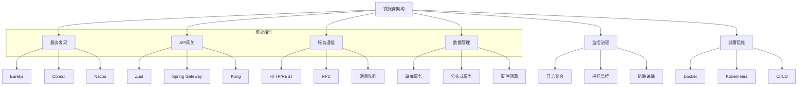
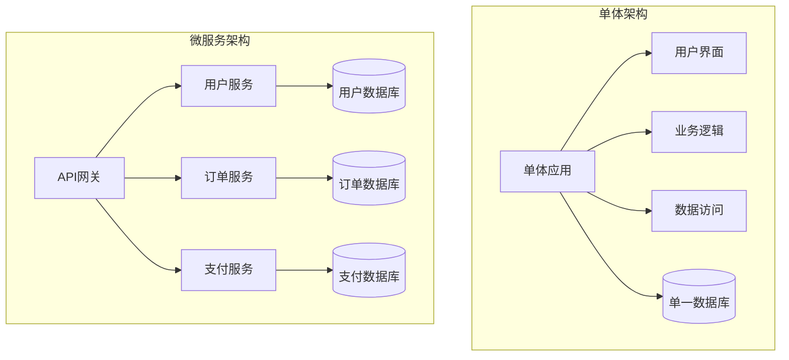
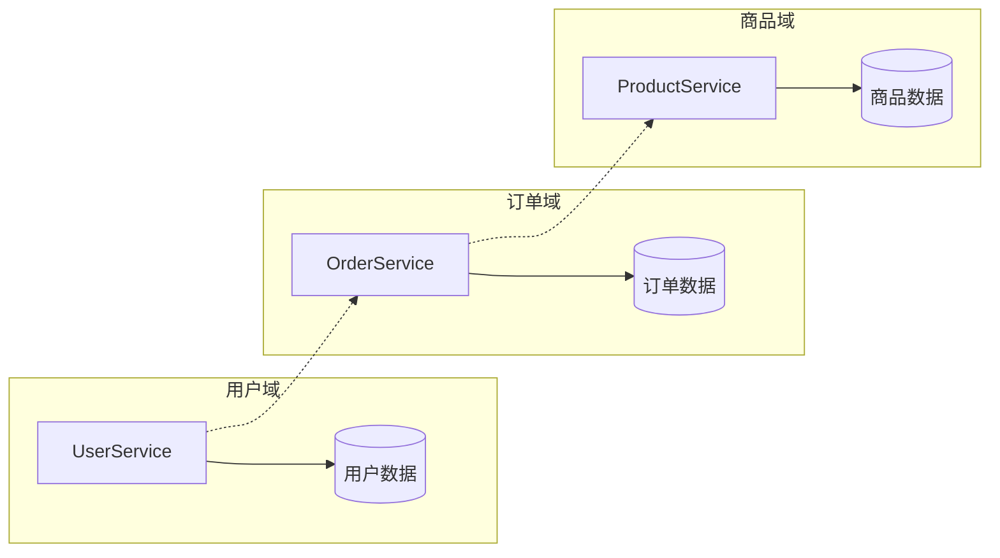
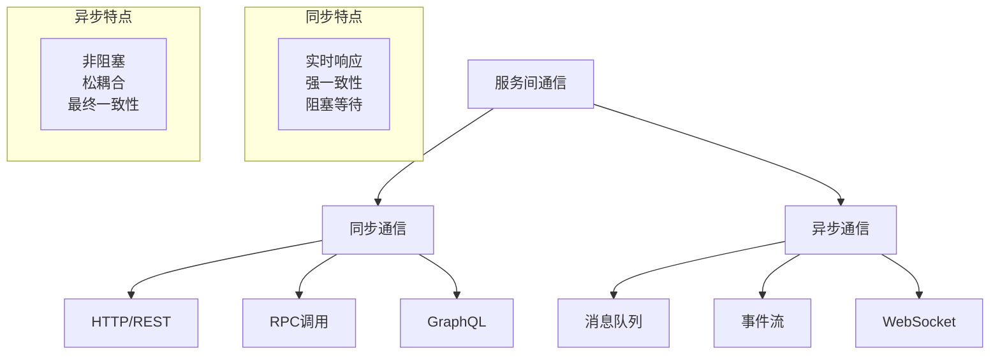
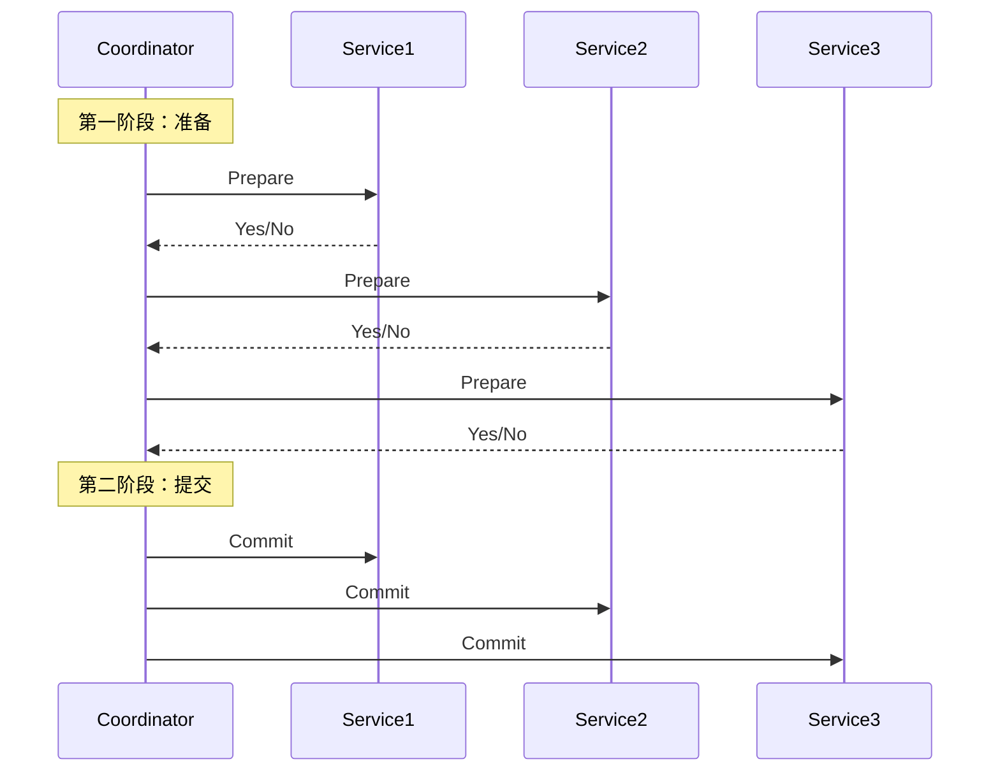
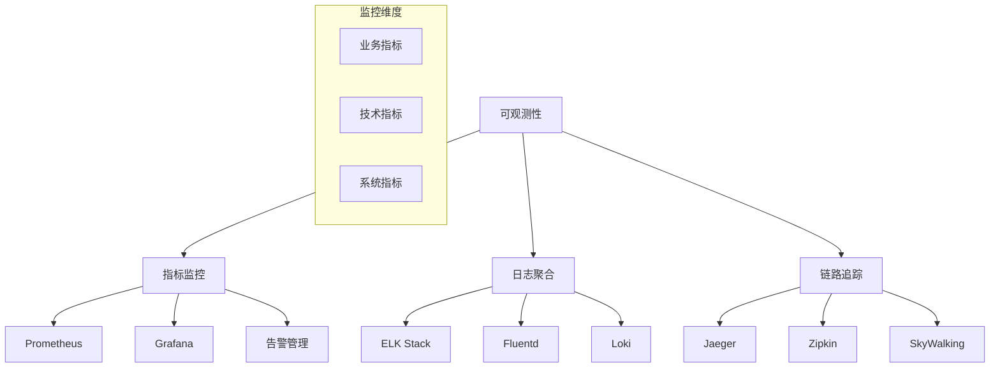

# 微服务架构面试题

## 🏷️ 标签
- 技术栈: 微服务, Spring Cloud, Docker, Kubernetes
- 难度: 中级到高级
- 类型: 架构题, 设计题, 实践题

## 📋 题目描述

本文包含微服务架构相关的面试题，涵盖服务拆分、服务间通信、数据一致性、部署运维等核心话题。

## 💡 核心知识点
- 微服务架构原理和设计模式
- 服务注册与发现
- 服务间通信机制
- 分布式事务处理
- 服务治理和监控
- 容器化部署

## 📊 微服务架构技术栈



## 📝 面试题目

### 1. 架构设计基础

#### **【中级】** 什么是微服务架构？它相比单体架构有什么优缺点？

**💡 考察要点:**
- 微服务架构的定义和特征
- 与单体架构的对比分析
- 适用场景的判断

**📝 参考答案:**

**微服务架构定义:**
微服务架构是一种将单一应用程序分解为多个小型、独立服务的架构风格，每个服务：
- 运行在独立的进程中
- 通过轻量级通信机制（通常是HTTP RESTful API）进行通信
- 围绕业务能力构建
- 可以独立部署和扩展

**架构对比:**



**优缺点对比:**

| 方面 | 单体架构 | 微服务架构 |
|------|----------|------------|
| **开发复杂度** | 低 | 高 |
| **部署复杂度** | 低 | 高 |
| **技术栈** | 统一 | 多样化 |
| **扩展性** | 垂直扩展 | 水平扩展 |
| **故障隔离** | 差 | 好 |
| **团队协作** | 紧耦合 | 松耦合 |
| **数据一致性** | 强一致 | 最终一致 |

**适用场景:**
- **单体架构适用于**: 小型项目、快速原型、团队规模小
- **微服务架构适用于**: 大型项目、高并发、多团队协作

---

#### **【高级】** 如何进行服务拆分？有哪些拆分策略？

**💡 考察要点:**
- 服务拆分的原则和方法
- 领域驱动设计(DDD)的应用
- 拆分粒度的把握

**📝 参考答案:**

**服务拆分原则:**

1. **业务功能驱动拆分**
```java
// 按业务能力拆分
@RestController
@RequestMapping("/users")
public class UserService {
    // 用户管理相关功能
    @PostMapping
    public User createUser(@RequestBody User user) { }
    
    @GetMapping("/{id}")
    public User getUser(@PathVariable Long id) { }
}

@RestController
@RequestMapping("/orders")
public class OrderService {
    // 订单管理相关功能
    @PostMapping
    public Order createOrder(@RequestBody Order order) { }
    
    @GetMapping("/{id}")
    public Order getOrder(@PathVariable Long id) { }
}
```

2. **数据驱动拆分**


**拆分策略:**

1. **按业务能力拆分 (Business Capability)**
```java
// 电商系统的服务拆分示例
public class ECommerceServices {
    
    // 用户服务 - 负责用户管理
    @Service
    public class UserService {
        public User createUser(UserRequest request) { }
        public User getUserById(Long id) { }
        public void updateUser(User user) { }
    }
    
    // 商品服务 - 负责商品管理
    @Service
    public class ProductService {
        public Product createProduct(ProductRequest request) { }
        public List<Product> searchProducts(String keyword) { }
        public void updateInventory(Long productId, int quantity) { }
    }
    
    // 订单服务 - 负责订单处理
    @Service
    public class OrderService {
        public Order createOrder(OrderRequest request) { }
        public Order getOrderById(Long id) { }
        public void updateOrderStatus(Long orderId, OrderStatus status) { }
    }
}
```

2. **按数据所有权拆分 (Data Ownership)**
```java
// 每个服务拥有自己的数据存储
@Configuration
public class ServiceDataConfiguration {
    
    @Bean
    @Primary
    public DataSource userDataSource() {
        return DataSourceBuilder.create()
            .url("jdbc:mysql://localhost:3306/user_db")
            .build();
    }
    
    @Bean
    public DataSource orderDataSource() {
        return DataSourceBuilder.create()
            .url("jdbc:mysql://localhost:3306/order_db")
            .build();
    }
}
```

**拆分实践建议:**
- **从粗粒度开始**: 先拆分大的业务模块，再细化
- **避免过度拆分**: 服务数量过多会增加运维复杂度
- **保持团队边界**: 一个团队负责一个或几个相关服务
- **考虑数据一致性**: 避免跨服务的频繁事务操作

---

### 2. 服务间通信

#### **【中级】** 微服务间有哪些通信方式？各有什么优缺点？

**💡 考察要点:**
- 同步vs异步通信
- 不同通信协议的特点
- 通信方式的选择原则

**📝 参考答案:**

**微服务通信模式:**



**1. HTTP/REST 通信**
```java
@RestController
public class OrderController {
    
    @Autowired
    private UserServiceClient userServiceClient;
    
    @PostMapping("/orders")
    public ResponseEntity<Order> createOrder(@RequestBody OrderRequest request) {
        // 同步调用用户服务
        User user = userServiceClient.getUserById(request.getUserId());
        
        if (user == null) {
            return ResponseEntity.badRequest().build();
        }
        
        Order order = orderService.createOrder(request, user);
        return ResponseEntity.ok(order);
    }
}

// 使用 OpenFeign 进行服务调用
@FeignClient(name = "user-service")
public interface UserServiceClient {
    
    @GetMapping("/users/{id}")
    User getUserById(@PathVariable("id") Long id);
}
```

**2. 消息队列异步通信**
```java
// 订单服务发送事件
@Service
public class OrderService {
    
    @Autowired
    private RabbitTemplate rabbitTemplate;
    
    public Order createOrder(OrderRequest request) {
        Order order = new Order(request);
        orderRepository.save(order);
        
        // 发送订单创建事件
        OrderCreatedEvent event = new OrderCreatedEvent(order.getId(), order.getUserId());
        rabbitTemplate.convertAndSend("order.created", event);
        
        return order;
    }
}

// 其他服务监听事件
@RabbitListener(queues = "order.created")
public class InventoryService {
    
    public void handleOrderCreated(OrderCreatedEvent event) {
        // 异步处理库存扣减
        inventoryService.reserveInventory(event.getOrderId());
    }
}
```

**通信方式对比:**

| 通信方式 | 优点 | 缺点 | 适用场景 |
|----------|------|------|----------|
| **HTTP/REST** | 简单易用<br/>标准化<br/>工具丰富 | 性能相对较低<br/>同步阻塞 | 查询操作<br/>简单业务逻辑 |
| **RPC** | 性能高<br/>类型安全 | 技术栈绑定<br/>复杂度高 | 高频调用<br/>性能敏感场景 |
| **消息队列** | 解耦<br/>可靠性高<br/>异步处理 | 复杂度高<br/>最终一致性 | 事件通知<br/>批量处理 |

---

### 3. 分布式事务

#### **【高级】** 在微服务架构中如何处理分布式事务？

**💡 考察要点:**
- 分布式事务的挑战
- 不同解决方案的原理
- 事务模式的选择

**📝 参考答案:**

**分布式事务挑战:**
- **原子性**: 确保所有服务的操作要么全部成功，要么全部失败
- **一致性**: 保证数据的一致性状态
- **隔离性**: 并发事务间的隔离
- **持久性**: 提交的事务永久保存

**解决方案:**

1. **两阶段提交 (2PC)**


2. **Saga 模式**
```java
// 订单处理 Saga 示例
@Service
public class OrderSagaOrchestrator {
    
    public void processOrder(OrderRequest request) {
        try {
            // 步骤1: 创建订单
            Order order = orderService.createOrder(request);
            
            // 步骤2: 扣减库存
            inventoryService.reserveInventory(order.getProductId(), order.getQuantity());
            
            // 步骤3: 处理支付
            paymentService.processPayment(order.getUserId(), order.getAmount());
            
            // 步骤4: 发货
            shippingService.createShipment(order);
            
        } catch (Exception e) {
            // 补偿操作
            compensateOrder(order);
        }
    }
    
    private void compensateOrder(Order order) {
        // 逆序执行补偿操作
        shippingService.cancelShipment(order.getId());
        paymentService.refundPayment(order.getId());
        inventoryService.releaseInventory(order.getProductId(), order.getQuantity());
        orderService.cancelOrder(order.getId());
    }
}
```

3. **事件溯源 (Event Sourcing)**
```java
// 基于事件的订单处理
@Entity
public class OrderAggregate {
    private Long id;
    private OrderStatus status;
    private List<OrderEvent> events = new ArrayList<>();
    
    public void createOrder(OrderRequest request) {
        OrderCreatedEvent event = new OrderCreatedEvent(request);
        applyEvent(event);
    }
    
    public void confirmPayment(PaymentInfo payment) {
        if (status != OrderStatus.PENDING) {
            throw new IllegalStateException("订单状态不允许支付");
        }
        
        PaymentConfirmedEvent event = new PaymentConfirmedEvent(id, payment);
        applyEvent(event);
    }
    
    private void applyEvent(OrderEvent event) {
        events.add(event);
        // 更新聚合状态
        when(event);
        // 发布事件
        eventPublisher.publish(event);
    }
}
```

**最佳实践选择:**
- **查询类操作**: 直接调用，保证强一致性
- **业务操作**: 使用 Saga 模式，保证最终一致性
- **对账要求高**: 事件溯源 + CQRS
- **简单场景**: 本地消息表

---

### 4. 服务治理

#### **【高级】** 如何实现微服务的监控和治理？

**💡 考察要点:**
- 微服务监控体系
- 服务治理策略
- 可观测性的实现

**📝 参考答案:**

**微服务可观测性三大支柱:**



**1. 指标监控实现**
```java
// 使用 Micrometer 收集指标
@RestController
public class OrderController {
    
    private final MeterRegistry meterRegistry;
    private final Counter orderCounter;
    private final Timer orderProcessingTimer;
    
    public OrderController(MeterRegistry meterRegistry) {
        this.meterRegistry = meterRegistry;
        this.orderCounter = Counter.builder("orders.created")
            .description("订单创建数量")
            .register(meterRegistry);
        this.orderProcessingTimer = Timer.builder("orders.processing.time")
            .description("订单处理时间")
            .register(meterRegistry);
    }
    
    @PostMapping("/orders")
    public ResponseEntity<Order> createOrder(@RequestBody OrderRequest request) {
        return orderProcessingTimer.recordCallable(() -> {
            try {
                Order order = orderService.createOrder(request);
                orderCounter.increment();
                return ResponseEntity.ok(order);
            } catch (Exception e) {
                meterRegistry.counter("orders.error", "type", e.getClass().getSimpleName())
                    .increment();
                throw e;
            }
        });
    }
}
```

**2. 分布式链路追踪**
```java
// 使用 Spring Cloud Sleuth 实现链路追踪
@RestController
public class OrderController {
    
    @NewSpan("order-creation")
    @PostMapping("/orders")
    public ResponseEntity<Order> createOrder(@RequestBody OrderRequest request) {
        // 自动生成 trace 和 span
        Order order = orderService.createOrder(request);
        return ResponseEntity.ok(order);
    }
}

@Service
public class OrderService {
    
    @Autowired
    private PaymentServiceClient paymentClient;
    
    @NewSpan("order-processing")
    public Order createOrder(OrderRequest request) {
        Order order = new Order(request);
        
        // 跨服务调用会自动传播 trace context
        PaymentResult result = paymentClient.processPayment(order.getAmount());
        
        order.setPaymentStatus(result.getStatus());
        return orderRepository.save(order);
    }
}
```

**3. 集中化日志管理**
```yaml
# logback-spring.xml 配置
<configuration>
    <springProfile name="prod">
        <appender name="STDOUT" class="ch.qos.logback.core.ConsoleAppender">
            <encoder class="net.logstash.logback.encoder.LoggingEventCompositeJsonEncoder">
                <providers>
                    <timestamp/>
                    <version/>
                    <logLevel/>
                    <loggerName/>
                    <mdc/>
                    <message/>
                    <stackTrace/>
                </providers>
            </encoder>
        </appender>
    </springProfile>
</configuration>
```

**4. 健康检查和服务发现**
```java
// 自定义健康检查
@Component
public class DatabaseHealthIndicator implements HealthIndicator {
    
    @Autowired
    private DataSource dataSource;
    
    @Override
    public Health health() {
        try (Connection connection = dataSource.getConnection()) {
            if (connection.isValid(1)) {
                return Health.up()
                    .withDetail("database", "Available")
                    .withDetail("validationQuery", "SELECT 1")
                    .build();
            }
        } catch (SQLException e) {
            return Health.down()
                .withDetail("database", "Unavailable")
                .withException(e)
                .build();
        }
        return Health.down().build();
    }
}
```

---

## 🎯 面试技巧建议

### 架构设计题回答思路
1. **需求澄清**: 明确系统规模、性能要求、约束条件
2. **架构设计**: 从高层架构开始，逐步细化
3. **技术选型**: 说明选择特定技术的原因
4. **扩展性考虑**: 讨论如何应对未来增长

### 常见追问问题
- "如何处理服务间的循环依赖？"
- "微服务拆分过细会有什么问题？"
- "如何保证微服务的数据一致性？"
- "微服务架构的运维复杂度如何控制？"

### 实战经验分享
- 结合具体项目经验
- 分享踩过的坑和解决方案
- 讨论技术选型的考虑因素
- 提及性能优化的实践

## 🔗 相关链接

- [← 返回后端目录](./README.md)
- [Spring 框架](./spring-framework.md)
- [分布式系统](./distributed-systems.md)
- [API 设计](./api-design.md)
- [系统设计面试题](../system-design/README.md)

---

*微服务架构不是银弹，选择合适的架构风格需要综合考虑业务场景、团队能力和技术成熟度* 🏗️ 