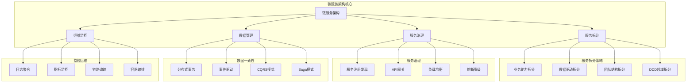

# 微服务架构面试题

[← 返回后端面试题目录](./README.md)

## 📚 题目概览

微服务架构是现代分布式系统的核心设计模式，直接关系到系统的可扩展性、可维护性和团队协作效率。本章节重点考察候选人对微服务架构设计原理的深度理解，包括服务拆分策略、服务治理、数据一致性等核心问题，以及在大规模分布式系统中的实际应用能力。

## 🎯 核心技术考察重点

### 微服务架构设计
- 微服务架构的核心原理和设计思想
- 服务拆分策略和领域驱动设计(DDD)
- 微服务与单体架构的对比分析
- 微服务架构的适用场景判断

### 服务治理机制
- 服务注册与发现的实现原理
- API网关的设计和功能职责
- 服务间通信机制和协议选择
- 负载均衡和故障转移策略

### 数据管理策略
- 微服务数据管理的挑战和解决方案
- 分布式事务的处理模式
- 数据一致性的保证机制
- 事件驱动架构的设计原理

### 运维监控体系
- 微服务监控和日志聚合
- 分布式链路追踪系统
- 服务健康检查和自动恢复
- 容器化部署和编排

## 📊 知识结构关联图

## 📝 核心面试题目

### 微服务架构设计 🏗️

#### 题目1：微服务架构原理与设计权衡
**问题背景**：作为架构师，需要为一个大型电商平台设计微服务架构

**技术挑战**：
- 如何合理拆分服务边界
- 如何平衡服务粒度和复杂度
- 如何处理服务间的依赖关系

**考察要点**：
- 微服务架构的核心原理和设计思想
- 服务拆分的策略和实践经验
- 架构权衡的决策能力

**📁 完整解决方案**：[微服务架构设计完整实现](../../solutions/common/microservices-architecture-design.md)

#### 题目2：服务拆分策略与领域建模
**问题背景**：将传统单体应用改造为微服务架构

**技术挑战**：
- 识别服务边界和业务能力
- 处理数据库拆分的复杂性
- 管理服务间的通信复杂度

**考察要点**：
- 领域驱动设计(DDD)的应用
- 服务拆分的最佳实践
- 数据一致性的处理策略

**📁 完整解决方案**：[服务拆分策略完整实现](../../solutions/common/service-decomposition-strategy.md)

### 服务治理机制 ⚙️

#### 题目3：服务注册发现与治理
**问题背景**：构建高可用的微服务治理平台

**技术挑战**：
- 服务注册发现的高可用设计
- 服务健康检查和故障处理
- 配置管理和动态更新

**考察要点**：
- 服务注册发现的实现原理
- 服务治理的核心功能
- 分布式系统的可用性设计

**📁 完整解决方案**：[服务治理平台完整实现](../../solutions/common/service-governance-platform.md)

#### 题目4：API网关设计与实现
**问题背景**：设计企业级API网关系统

**技术挑战**：
- 统一的请求路由和负载均衡
- 认证授权和安全控制
- 限流熔断和监控告警

**考察要点**：
- API网关的架构设计
- 性能优化和扩展性考虑
- 安全性和可观测性实现

**📁 完整解决方案**：[API网关系统完整实现](../../solutions/common/api-gateway-system.md)

### 数据一致性管理 💾

#### 题目5：分布式事务处理模式
**问题背景**：解决微服务架构中的数据一致性问题

**技术挑战**：
- 跨服务事务的一致性保证
- 性能与一致性的平衡
- 事务失败的补偿机制

**考察要点**：
- 分布式事务的实现模式
- CAP理论在实际场景中的应用
- 事务补偿和恢复策略

**📁 完整解决方案**：[分布式事务处理完整实现](../../solutions/common/distributed-transaction-patterns.md)

#### 题目6：事件驱动架构设计
**问题背景**：构建基于事件的松耦合微服务系统

**技术挑战**：
- 事件的设计和版本管理
- 事件处理的幂等性保证
- 事件溯源和状态重建

**考察要点**：
- 事件驱动架构的设计原理
- 事件存储和处理机制
- 系统的最终一致性实现

**📁 完整解决方案**：[事件驱动架构完整实现](../../solutions/common/event-driven-architecture.md)

## 📊 面试评分标准

### 架构设计能力 (30%)
- **优秀 (90-100分)**：能够设计完整的微服务架构，考虑全面，权衡合理
- **良好 (80-89分)**：理解微服务核心概念，能够设计基本架构
- **一般 (70-79分)**：了解微服务基础知识，设计思路基本正确
- **不足 (60-69分)**：微服务概念模糊，设计缺乏系统性

### 技术深度理解 (25%)
- **优秀 (90-100分)**：深入理解微服务技术原理，能够分析技术选型
- **良好 (80-89分)**：掌握主要技术组件，理解基本原理
- **一般 (70-79分)**：了解常用技术，但原理理解不够深入
- **不足 (60-69分)**：技术知识零散，缺乏系统理解

### 实践经验展示 (25%)
- **优秀 (90-100分)**：有丰富的微服务实践经验，能够分享具体案例
- **良好 (80-89分)**：有一定实践经验，能够结合项目讲解
- **一般 (70-79分)**：有基础实践，但经验不够丰富
- **不足 (60-69分)**：缺乏实际项目经验

### 问题解决能力 (20%)
- **优秀 (90-100分)**：能够识别和解决复杂的微服务架构问题
- **良好 (80-89分)**：具备基本的问题分析和解决能力
- **一般 (70-79分)**：能够处理常见问题，但分析不够深入
- **不足 (60-69分)**：问题解决能力有限

## 🎯 备考建议

### 理论基础强化
- 深入学习微服务架构的核心原理和设计模式
- 掌握分布式系统的基础理论（CAP、BASE等）
- 理解领域驱动设计(DDD)的核心概念
- 学习主流微服务框架的技术原理

### 实践项目积累
- 参与或主导微服务架构的设计和实现
- 积累服务拆分和重构的实践经验
- 掌握微服务监控和运维的最佳实践
- 了解容器化和云原生技术的应用

### 案例分析能力
- 分析知名公司的微服务架构案例
- 理解不同业务场景下的架构选择
- 掌握架构演进的策略和方法
- 培养系统性的架构思维

### 技术广度拓展
- 了解多种微服务技术栈和工具
- 掌握服务网格等新兴技术
- 学习云原生和容器编排技术
- 关注微服务架构的发展趋势

## 🔗 相关资源链接

- [Spring Cloud 官方文档](https://spring.io/projects/spring-cloud)
- [微服务架构设计模式](../system-design/microservices-architecture.md)
- [分布式系统原理](./distributed-systems.md)
- [容器化部署实践](./deployment-devops.md)

---

*微服务架构的核心在于合理的服务拆分和有效的服务治理，需要平衡复杂性和收益* 🏗️ 