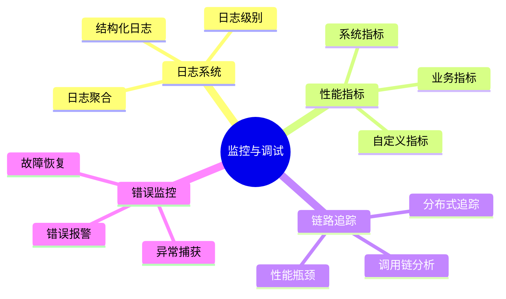
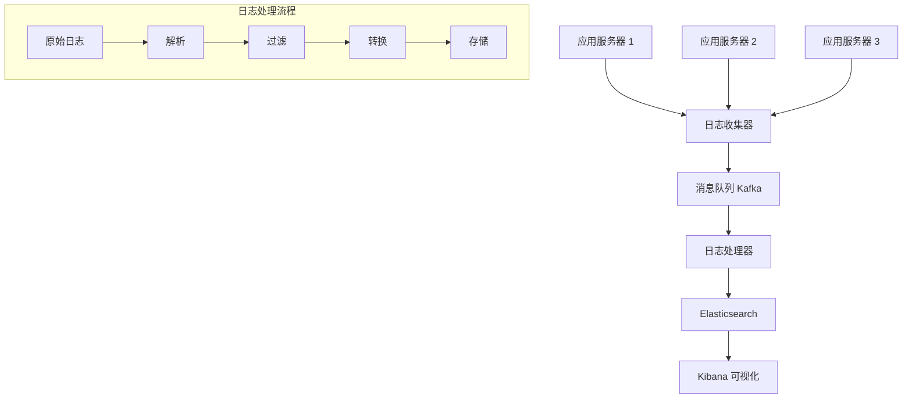
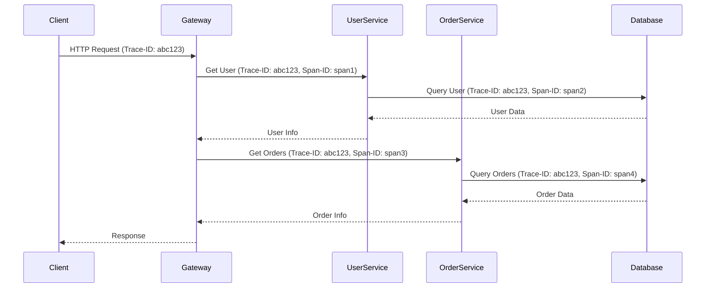

# 监控与调试面试题

[← 返回后端面试题目录](./README.md)

## 📋 目录

- [日志系统](#日志系统)
- [性能指标](#性能指标)
- [链路追踪](#链路追踪)
- [错误监控](#错误监控)
- [调试技巧](#调试技巧)
- [实战案例](#实战案例)

## 🎯 核心知识点



## 日志系统

### 💡 初级题目

#### 1. 日志级别的分类和使用场景？

**答案要点：**
- **TRACE**：最详细的信息，通常只在开发时使用
- **DEBUG**：调试信息，用于问题诊断
- **INFO**：一般信息，记录程序运行状态
- **WARN**：警告信息，可能的问题
- **ERROR**：错误信息，需要关注但不影响程序运行
- **FATAL**：致命错误，程序无法继续运行

```python
import logging
import json
from datetime import datetime
from typing import Dict, Any

# 配置结构化日志
class StructuredLogger:
    def __init__(self, name: str, level: str = "INFO"):
        self.logger = logging.getLogger(name)
        self.logger.setLevel(getattr(logging, level.upper()))
        
        # 创建格式化器
        formatter = logging.Formatter(
            '%(asctime)s - %(name)s - %(levelname)s - %(message)s'
        )
        
        # 控制台处理器
        console_handler = logging.StreamHandler()
        console_handler.setFormatter(formatter)
        self.logger.addHandler(console_handler)
        
        # 文件处理器
        file_handler = logging.FileHandler('app.log')
        file_handler.setFormatter(formatter)
        self.logger.addHandler(file_handler)
    
    def _log_structured(self, level: str, message: str, **kwargs):
        """记录结构化日志"""
        log_data = {
            'timestamp': datetime.utcnow().isoformat(),
            'level': level,
            'message': message,
            'service': 'backend-service',
            **kwargs
        }
        
        getattr(self.logger, level.lower())(json.dumps(log_data))
    
    def info(self, message: str, **kwargs):
        self._log_structured('INFO', message, **kwargs)
    
    def error(self, message: str, **kwargs):
        self._log_structured('ERROR', message, **kwargs)
    
    def warning(self, message: str, **kwargs):
        self._log_structured('WARNING', message, **kwargs)
    
    def debug(self, message: str, **kwargs):
        self._log_structured('DEBUG', message, **kwargs)

# 使用示例
logger = StructuredLogger('user_service')

def process_user_request(user_id: int, action: str):
    logger.info(
        "Processing user request",
        user_id=user_id,
        action=action,
        request_id="req-123"
    )
    
    try:
        # 模拟业务逻辑
        if action == "delete" and user_id == 1:
            raise ValueError("Cannot delete admin user")
        
        logger.info(
            "User request completed successfully",
            user_id=user_id,
            action=action,
            duration_ms=150
        )
        
    except Exception as e:
        logger.error(
            "User request failed",
            user_id=user_id,
            action=action,
            error=str(e),
            error_type=type(e).__name__
        )
        raise
```

#### 2. 如何设计高性能的日志系统？

**答案要点：**
- **异步写入**：避免阻塞主线程
- **批量写入**：减少 I/O 操作
- **日志轮转**：控制日志文件大小
- **缓冲机制**：提高写入效率

```python
import asyncio
import aiofiles
from collections import deque
from threading import Thread, Lock
import time
import os

class AsyncLogger:
    def __init__(self, filename: str, max_size: int = 10*1024*1024, 
                 backup_count: int = 5, batch_size: int = 100):
        self.filename = filename
        self.max_size = max_size
        self.backup_count = backup_count
        self.batch_size = batch_size
        
        self.log_queue = deque()
        self.queue_lock = Lock()
        self.running = True
        
        # 启动后台写入线程
        self.writer_thread = Thread(target=self._writer_loop, daemon=True)
        self.writer_thread.start()
    
    def log(self, level: str, message: str, **kwargs):
        """添加日志到队列"""
        log_entry = {
            'timestamp': time.time(),
            'level': level,
            'message': message,
            **kwargs
        }
        
        with self.queue_lock:
            self.log_queue.append(json.dumps(log_entry) + '\n')
    
    def _writer_loop(self):
        """后台写入循环"""
        while self.running:
            batch = []
            
            # 收集批量日志
            with self.queue_lock:
                while len(batch) < self.batch_size and self.log_queue:
                    batch.append(self.log_queue.popleft())
            
            if batch:
                self._write_batch(batch)
            else:
                time.sleep(0.1)  # 没有日志时短暂休眠
    
    def _write_batch(self, batch: list):
        """批量写入日志"""
        try:
            # 检查文件大小，必要时轮转
            if os.path.exists(self.filename) and \
               os.path.getsize(self.filename) > self.max_size:
                self._rotate_logs()
            
            with open(self.filename, 'a', encoding='utf-8') as f:
                f.writelines(batch)
                f.flush()
                
        except Exception as e:
            print(f"日志写入失败: {e}")
    
    def _rotate_logs(self):
        """日志轮转"""
        try:
            # 删除最老的备份
            oldest_backup = f"{self.filename}.{self.backup_count}"
            if os.path.exists(oldest_backup):
                os.remove(oldest_backup)
            
            # 重命名现有备份
            for i in range(self.backup_count - 1, 0, -1):
                old_name = f"{self.filename}.{i}"
                new_name = f"{self.filename}.{i + 1}"
                if os.path.exists(old_name):
                    os.rename(old_name, new_name)
            
            # 重命名当前日志文件
            if os.path.exists(self.filename):
                os.rename(self.filename, f"{self.filename}.1")
                
        except Exception as e:
            print(f"日志轮转失败: {e}")
    
    def close(self):
        """关闭日志器"""
        self.running = False
        self.writer_thread.join()
        
        # 写入剩余日志
        with self.queue_lock:
            if self.log_queue:
                self._write_batch(list(self.log_queue))
                self.log_queue.clear()

# 日志聚合器
class LogAggregator:
    def __init__(self):
        self.loggers = {}
        self.filters = []
    
    def add_logger(self, name: str, logger: AsyncLogger):
        self.loggers[name] = logger
    
    def add_filter(self, filter_func):
        """添加日志过滤器"""
        self.filters.append(filter_func)
    
    def log(self, level: str, message: str, **kwargs):
        """向所有日志器发送日志"""
        # 应用过滤器
        for filter_func in self.filters:
            if not filter_func(level, message, **kwargs):
                return
        
        for logger in self.loggers.values():
            logger.log(level, message, **kwargs)

# 使用示例
def setup_logging():
    # 创建不同类型的日志器
    app_logger = AsyncLogger('app.log')
    error_logger = AsyncLogger('error.log')
    access_logger = AsyncLogger('access.log')
    
    # 创建聚合器
    aggregator = LogAggregator()
    aggregator.add_logger('app', app_logger)
    aggregator.add_logger('error', error_logger)
    aggregator.add_logger('access', access_logger)
    
    # 添加过滤器
    def error_filter(level, message, **kwargs):
        return level in ['ERROR', 'FATAL']
    
    def access_filter(level, message, **kwargs):
        return 'request_id' in kwargs
    
    return aggregator
```

### 🔥 中级题目

#### 3. 如何实现分布式日志收集系统？

**答案要点：**
- **日志收集器**：Fluentd、Logstash、Filebeat
- **消息队列**：Kafka、RabbitMQ 作为缓冲
- **存储系统**：Elasticsearch、ClickHouse
- **可视化**：Kibana、Grafana



```python
import json
import asyncio
from kafka import KafkaProducer, KafkaConsumer
from elasticsearch import Elasticsearch
import re
from datetime import datetime

class DistributedLogCollector:
    def __init__(self, kafka_servers: list, topic: str):
        self.producer = KafkaProducer(
            bootstrap_servers=kafka_servers,
            value_serializer=lambda v: json.dumps(v).encode('utf-8'),
            batch_size=16384,  # 批量发送
            linger_ms=10,      # 延迟发送以提高批量效率
            compression_type='gzip'
        )
        self.topic = topic
    
    def send_log(self, log_data: dict):
        """发送日志到 Kafka"""
        try:
            self.producer.send(self.topic, log_data)
        except Exception as e:
            print(f"发送日志失败: {e}")
    
    def close(self):
        self.producer.close()

class LogProcessor:
    def __init__(self, kafka_servers: list, topic: str, es_hosts: list):
        self.consumer = KafkaConsumer(
            topic,
            bootstrap_servers=kafka_servers,
            value_deserializer=lambda m: json.loads(m.decode('utf-8')),
            group_id='log-processor-group',
            auto_offset_reset='latest'
        )
        
        self.es = Elasticsearch(es_hosts)
        self.parsers = []
    
    def add_parser(self, parser_func):
        """添加日志解析器"""
        self.parsers.append(parser_func)
    
    def process_logs(self):
        """处理日志消息"""
        for message in self.consumer:
            try:
                log_data = message.value
                
                # 应用解析器
                for parser in self.parsers:
                    log_data = parser(log_data)
                
                # 存储到 Elasticsearch
                self._store_log(log_data)
                
            except Exception as e:
                print(f"处理日志失败: {e}")
    
    def _store_log(self, log_data: dict):
        """存储日志到 Elasticsearch"""
        index_name = f"logs-{datetime.now().strftime('%Y-%m-%d')}"
        
        try:
            self.es.index(
                index=index_name,
                body=log_data,
                doc_type='_doc'
            )
        except Exception as e:
            print(f"存储日志失败: {e}")

# 日志解析器示例
def nginx_access_parser(log_data: dict) -> dict:
    """解析 Nginx 访问日志"""
    if 'message' not in log_data:
        return log_data
    
    # Nginx 访问日志格式
    pattern = r'(\S+) - - \[(.*?)\] "(\S+) (\S+) (\S+)" (\d+) (\d+) "(.*?)" "(.*?)"'
    match = re.match(pattern, log_data['message'])
    
    if match:
        log_data.update({
            'client_ip': match.group(1),
            'timestamp': match.group(2),
            'method': match.group(3),
            'url': match.group(4),
            'protocol': match.group(5),
            'status_code': int(match.group(6)),
            'response_size': int(match.group(7)),
            'referer': match.group(8),
            'user_agent': match.group(9),
            'log_type': 'nginx_access'
        })
    
    return log_data

def application_error_parser(log_data: dict) -> dict:
    """解析应用错误日志"""
    if log_data.get('level') == 'ERROR':
        # 提取错误信息
        message = log_data.get('message', '')
        
        # 检测常见错误类型
        if 'database' in message.lower():
            log_data['error_category'] = 'database'
        elif 'timeout' in message.lower():
            log_data['error_category'] = 'timeout'
        elif 'permission' in message.lower():
            log_data['error_category'] = 'permission'
        else:
            log_data['error_category'] = 'unknown'
        
        # 添加告警标记
        log_data['alert_required'] = True
    
    return log_data

# 使用示例
def setup_distributed_logging():
    kafka_servers = ['localhost:9092']
    es_hosts = ['localhost:9200']
    
    # 创建日志收集器
    collector = DistributedLogCollector(kafka_servers, 'application-logs')
    
    # 创建日志处理器
    processor = LogProcessor(kafka_servers, 'application-logs', es_hosts)
    processor.add_parser(nginx_access_parser)
    processor.add_parser(application_error_parser)
    
    # 启动处理器
    import threading
    processor_thread = threading.Thread(target=processor.process_logs, daemon=True)
    processor_thread.start()
    
    return collector
```

## 性能指标

### 🔥 中级题目

#### 4. 如何设计应用性能监控系统？

**答案要点：**
- **系统指标**：CPU、内存、磁盘、网络
- **应用指标**：响应时间、吞吐量、错误率
- **业务指标**：用户活跃度、转化率
- **自定义指标**：特定业务逻辑的指标

```python
import time
import psutil
import threading
from collections import defaultdict, deque
from dataclasses import dataclass
from typing import Dict, List, Callable
import json

@dataclass
class Metric:
    name: str
    value: float
    timestamp: float
    tags: Dict[str, str] = None
    
    def to_dict(self):
        return {
            'name': self.name,
            'value': self.value,
            'timestamp': self.timestamp,
            'tags': self.tags or {}
        }

class MetricsCollector:
    def __init__(self, collection_interval: int = 60):
        self.collection_interval = collection_interval
        self.metrics = defaultdict(deque)
        self.custom_collectors = []
        self.running = False
        self.thread = None
    
    def start(self):
        """启动指标收集"""
        self.running = True
        self.thread = threading.Thread(target=self._collection_loop, daemon=True)
        self.thread.start()
    
    def stop(self):
        """停止指标收集"""
        self.running = False
        if self.thread:
            self.thread.join()
    
    def add_custom_collector(self, collector_func: Callable):
        """添加自定义指标收集器"""
        self.custom_collectors.append(collector_func)
    
    def record_metric(self, name: str, value: float, tags: Dict[str, str] = None):
        """记录自定义指标"""
        metric = Metric(name, value, time.time(), tags)
        self.metrics[name].append(metric)
        
        # 保持最近1000个数据点
        if len(self.metrics[name]) > 1000:
            self.metrics[name].popleft()
    
    def _collection_loop(self):
        """指标收集循环"""
        while self.running:
            try:
                # 收集系统指标
                self._collect_system_metrics()
                
                # 收集自定义指标
                for collector in self.custom_collectors:
                    try:
                        collector(self)
                    except Exception as e:
                        print(f"自定义指标收集失败: {e}")
                
                time.sleep(self.collection_interval)
                
            except Exception as e:
                print(f"指标收集失败: {e}")
    
    def _collect_system_metrics(self):
        """收集系统指标"""
        timestamp = time.time()
        
        # CPU 使用率
        cpu_percent = psutil.cpu_percent(interval=1)
        self.record_metric('system.cpu.usage', cpu_percent, {'unit': 'percent'})
        
        # 内存使用情况
        memory = psutil.virtual_memory()
        self.record_metric('system.memory.usage', memory.percent, {'unit': 'percent'})
        self.record_metric('system.memory.available', memory.available, {'unit': 'bytes'})
        
        # 磁盘使用情况
        disk = psutil.disk_usage('/')
        self.record_metric('system.disk.usage', disk.percent, {'unit': 'percent'})
        self.record_metric('system.disk.free', disk.free, {'unit': 'bytes'})
        
        # 网络 I/O
        network = psutil.net_io_counters()
        self.record_metric('system.network.bytes_sent', network.bytes_sent, {'unit': 'bytes'})
        self.record_metric('system.network.bytes_recv', network.bytes_recv, {'unit': 'bytes'})
    
    def get_metrics(self, name: str = None, limit: int = 100) -> List[Dict]:
        """获取指标数据"""
        if name:
            metrics = list(self.metrics.get(name, []))[-limit:]
            return [m.to_dict() for m in metrics]
        else:
            result = {}
            for metric_name, metric_list in self.metrics.items():
                result[metric_name] = [m.to_dict() for m in list(metric_list)[-limit:]]
            return result

# 应用性能监控装饰器
class PerformanceMonitor:
    def __init__(self, metrics_collector: MetricsCollector):
        self.metrics_collector = metrics_collector
        self.request_times = deque(maxlen=1000)
        self.error_count = 0
        self.request_count = 0
    
    def monitor_request(self, endpoint: str = None):
        """监控请求性能的装饰器"""
        def decorator(func):
            def wrapper(*args, **kwargs):
                start_time = time.time()
                
                try:
                    result = func(*args, **kwargs)
                    self.request_count += 1
                    
                    # 记录成功请求
                    duration = (time.time() - start_time) * 1000  # 转换为毫秒
                    self.request_times.append(duration)
                    
                    tags = {'endpoint': endpoint or func.__name__, 'status': 'success'}
                    self.metrics_collector.record_metric('app.request.duration', duration, tags)
                    self.metrics_collector.record_metric('app.request.count', 1, tags)
                    
                    return result
                    
                except Exception as e:
                    self.error_count += 1
                    
                    # 记录错误请求
                    duration = (time.time() - start_time) * 1000
                    tags = {
                        'endpoint': endpoint or func.__name__, 
                        'status': 'error',
                        'error_type': type(e).__name__
                    }
                    self.metrics_collector.record_metric('app.request.duration', duration, tags)
                    self.metrics_collector.record_metric('app.request.error', 1, tags)
                    
                    raise
            
            return wrapper
        return decorator
    
    def get_performance_summary(self) -> Dict:
        """获取性能摘要"""
        if not self.request_times:
            return {}
        
        times = list(self.request_times)
        times.sort()
        
        return {
            'total_requests': self.request_count,
            'error_count': self.error_count,
            'error_rate': self.error_count / max(self.request_count, 1) * 100,
            'avg_response_time': sum(times) / len(times),
            'p50_response_time': times[len(times) // 2],
            'p95_response_time': times[int(len(times) * 0.95)],
            'p99_response_time': times[int(len(times) * 0.99)]
        }

# 业务指标收集器
class BusinessMetricsCollector:
    def __init__(self, metrics_collector: MetricsCollector):
        self.metrics_collector = metrics_collector
        self.user_actions = defaultdict(int)
        self.conversion_funnel = defaultdict(int)
    
    def track_user_action(self, action: str, user_id: str = None):
        """跟踪用户行为"""
        self.user_actions[action] += 1
        
        tags = {'action': action}
        if user_id:
            tags['user_id'] = user_id
        
        self.metrics_collector.record_metric('business.user_action', 1, tags)
    
    def track_conversion(self, step: str, user_id: str):
        """跟踪转化漏斗"""
        self.conversion_funnel[step] += 1
        
        tags = {'step': step, 'user_id': user_id}
        self.metrics_collector.record_metric('business.conversion', 1, tags)
    
    def get_business_summary(self) -> Dict:
        """获取业务指标摘要"""
        return {
            'user_actions': dict(self.user_actions),
            'conversion_funnel': dict(self.conversion_funnel)
        }

# 使用示例
def setup_monitoring():
    # 创建指标收集器
    collector = MetricsCollector(collection_interval=30)
    
    # 创建性能监控器
    perf_monitor = PerformanceMonitor(collector)
    
    # 创建业务指标收集器
    business_collector = BusinessMetricsCollector(collector)
    
    # 添加自定义指标收集器
    def collect_database_metrics(collector):
        # 模拟数据库连接池指标
        active_connections = 15
        max_connections = 100
        
        collector.record_metric('database.connections.active', active_connections)
        collector.record_metric('database.connections.usage', 
                              active_connections / max_connections * 100, 
                              {'unit': 'percent'})
    
    collector.add_custom_collector(collect_database_metrics)
    
    # 启动收集
    collector.start()
    
    return collector, perf_monitor, business_collector

# 示例应用
@perf_monitor.monitor_request('user_login')
def user_login(username: str, password: str):
    # 模拟登录逻辑
    time.sleep(0.1)  # 模拟数据库查询
    
    if username == "admin" and password == "wrong":
        raise ValueError("Invalid credentials")
    
    business_collector.track_user_action('login', username)
    return {"status": "success", "user": username}
```

## 链路追踪

### ⚡ 高级题目

#### 5. 如何实现分布式链路追踪系统？

**答案要点：**
- **Trace ID**：唯一标识一次完整的请求链路
- **Span ID**：标识链路中的单个操作
- **上下文传播**：在服务间传递追踪信息
- **采样策略**：控制追踪数据量



```python
import uuid
import time
import threading
from contextlib import contextmanager
from dataclasses import dataclass, field
from typing import Dict, List, Optional, Any
import json

@dataclass
class Span:
    trace_id: str
    span_id: str
    parent_span_id: Optional[str]
    operation_name: str
    start_time: float
    end_time: Optional[float] = None
    tags: Dict[str, Any] = field(default_factory=dict)
    logs: List[Dict[str, Any]] = field(default_factory=list)
    status: str = "ok"  # ok, error
    
    def finish(self):
        """结束 Span"""
        self.end_time = time.time()
    
    def set_tag(self, key: str, value: Any):
        """设置标签"""
        self.tags[key] = value
    
    def log(self, message: str, **kwargs):
        """添加日志"""
        log_entry = {
            'timestamp': time.time(),
            'message': message,
            **kwargs
        }
        self.logs.append(log_entry)
    
    def set_error(self, error: Exception):
        """设置错误状态"""
        self.status = "error"
        self.set_tag("error", True)
        self.set_tag("error.type", type(error).__name__)
        self.set_tag("error.message", str(error))
    
    def to_dict(self) -> Dict:
        """转换为字典"""
        return {
            'trace_id': self.trace_id,
            'span_id': self.span_id,
            'parent_span_id': self.parent_span_id,
            'operation_name': self.operation_name,
            'start_time': self.start_time,
            'end_time': self.end_time,
            'duration': (self.end_time - self.start_time) if self.end_time else None,
            'tags': self.tags,
            'logs': self.logs,
            'status': self.status
        }

class TraceContext:
    """追踪上下文"""
    def __init__(self):
        self._local = threading.local()
    
    def get_current_span(self) -> Optional[Span]:
        """获取当前 Span"""
        return getattr(self._local, 'current_span', None)
    
    def set_current_span(self, span: Optional[Span]):
        """设置当前 Span"""
        self._local.current_span = span
    
    def get_trace_id(self) -> Optional[str]:
        """获取当前 Trace ID"""
        span = self.get_current_span()
        return span.trace_id if span else None

class Tracer:
    def __init__(self, service_name: str, reporter=None):
        self.service_name = service_name
        self.reporter = reporter
        self.context = TraceContext()
        self.active_spans = {}
    
    def start_span(self, operation_name: str, 
                   parent_span: Optional[Span] = None,
                   trace_id: Optional[str] = None) -> Span:
        """开始一个新的 Span"""
        
        # 确定 trace_id
        if trace_id:
            current_trace_id = trace_id
        elif parent_span:
            current_trace_id = parent_span.trace_id
        else:
            current_span = self.context.get_current_span()
            current_trace_id = current_span.trace_id if current_span else str(uuid.uuid4())
        
        # 创建 Span
        span = Span(
            trace_id=current_trace_id,
            span_id=str(uuid.uuid4()),
            parent_span_id=parent_span.span_id if parent_span else None,
            operation_name=operation_name,
            start_time=time.time()
        )
        
        # 设置服务标签
        span.set_tag("service.name", self.service_name)
        
        # 存储活跃 Span
        self.active_spans[span.span_id] = span
        
        return span
    
    def finish_span(self, span: Span):
        """结束 Span"""
        span.finish()
        
        # 从活跃 Span 中移除
        self.active_spans.pop(span.span_id, None)
        
        # 报告 Span
        if self.reporter:
            self.reporter.report(span)
    
    @contextmanager
    def span(self, operation_name: str, **tags):
        """Span 上下文管理器"""
        parent_span = self.context.get_current_span()
        span = self.start_span(operation_name, parent_span)
        
        # 设置标签
        for key, value in tags.items():
            span.set_tag(key, value)
        
        # 设置为当前 Span
        previous_span = self.context.get_current_span()
        self.context.set_current_span(span)
        
        try:
            yield span
        except Exception as e:
            span.set_error(e)
            raise
        finally:
            self.finish_span(span)
            self.context.set_current_span(previous_span)

class SpanReporter:
    """Span 报告器"""
    def __init__(self, endpoint: str = None):
        self.endpoint = endpoint
        self.spans_buffer = []
        self.buffer_size = 100
    
    def report(self, span: Span):
        """报告 Span"""
        self.spans_buffer.append(span.to_dict())
        
        if len(self.spans_buffer) >= self.buffer_size:
            self._flush()
    
    def _flush(self):
        """刷新缓冲区"""
        if not self.spans_buffer:
            return
        
        try:
            # 这里应该发送到追踪系统（如 Jaeger、Zipkin）
            print(f"报告 {len(self.spans_buffer)} 个 Span")
            for span_data in self.spans_buffer:
                print(json.dumps(span_data, indent=2))
            
            self.spans_buffer.clear()
            
        except Exception as e:
            print(f"报告 Span 失败: {e}")

# HTTP 追踪中间件
class TracingMiddleware:
    def __init__(self, tracer: Tracer):
        self.tracer = tracer
    
    def __call__(self, request, response, next_handler):
        """处理 HTTP 请求追踪"""
        # 从请求头中提取追踪信息
        trace_id = request.headers.get('X-Trace-ID')
        parent_span_id = request.headers.get('X-Parent-Span-ID')
        
        # 创建请求 Span
        with self.tracer.span('http_request', 
                             method=request.method,
                             url=request.url,
                             user_agent=request.headers.get('User-Agent')) as span:
            
            # 设置追踪头
            response.headers['X-Trace-ID'] = span.trace_id
            response.headers['X-Span-ID'] = span.span_id
            
            try:
                result = next_handler(request, response)
                span.set_tag('http.status_code', response.status_code)
                return result
                
            except Exception as e:
                span.set_tag('http.status_code', 500)
                span.set_error(e)
                raise

# 数据库追踪装饰器
def trace_database_operation(tracer: Tracer, operation_type: str):
    """数据库操作追踪装饰器"""
    def decorator(func):
        def wrapper(*args, **kwargs):
            with tracer.span(f'db.{operation_type}',
                           db_type='postgresql',
                           db_operation=operation_type) as span:
                
                # 记录 SQL 查询（注意不要记录敏感信息）
                if 'query' in kwargs:
                    span.set_tag('db.statement', kwargs['query'][:100])  # 截断长查询
                
                try:
                    result = func(*args, **kwargs)
                    span.set_tag('db.rows_affected', getattr(result, 'rowcount', 0))
                    return result
                    
                except Exception as e:
                    span.set_error(e)
                    raise
        
        return wrapper
    return decorator

# 使用示例
def setup_tracing():
    # 创建报告器
    reporter = SpanReporter()
    
    # 创建追踪器
    tracer = Tracer('user-service', reporter)
    
    return tracer

# 示例服务
class UserService:
    def __init__(self, tracer: Tracer):
        self.tracer = tracer
    
    def get_user(self, user_id: int):
        """获取用户信息"""
        with self.tracer.span('get_user', user_id=user_id) as span:
            # 模拟数据库查询
            user_data = self._query_database(user_id)
            
            # 模拟缓存查询
            cached_data = self._query_cache(user_id)
            
            span.log("用户数据获取完成", user_id=user_id)
            return user_data
    
    @trace_database_operation(tracer, 'select')
    def _query_database(self, user_id: int):
        """查询数据库"""
        time.sleep(0.05)  # 模拟数据库延迟
        return {"id": user_id, "name": f"User {user_id}"}
    
    def _query_cache(self, user_id: int):
        """查询缓存"""
        with self.tracer.span('cache_query', 
                             cache_key=f'user:{user_id}') as span:
            time.sleep(0.01)  # 模拟缓存延迟
            span.set_tag('cache.hit', False)
            return None

# 跨服务调用示例
class OrderService:
    def __init__(self, tracer: Tracer, user_service: UserService):
        self.tracer = tracer
        self.user_service = user_service
    
    def create_order(self, user_id: int, items: List[str]):
        """创建订单"""
        with self.tracer.span('create_order', 
                             user_id=user_id,
                             item_count=len(items)) as span:
            
            # 获取用户信息（跨服务调用）
            user = self.user_service.get_user(user_id)
            span.log("获取用户信息完成", user_name=user['name'])
            
            # 创建订单
            order_id = self._create_order_record(user_id, items)
            span.set_tag('order.id', order_id)
            
            return {"order_id": order_id, "user": user}
    
    def _create_order_record(self, user_id: int, items: List[str]):
        """创建订单记录"""
        with self.tracer.span('db.insert_order') as span:
            time.sleep(0.1)  # 模拟数据库写入
            order_id = f"order_{int(time.time())}"
            span.set_tag('order.id', order_id)
            return order_id

# 完整示例
def tracing_example():
    tracer = setup_tracing()
    
    user_service = UserService(tracer)
    order_service = OrderService(tracer, user_service)
    
    # 模拟请求处理
    with tracer.span('handle_request', 
                     endpoint='/orders',
                     method='POST') as root_span:
        
        try:
            result = order_service.create_order(123, ['item1', 'item2'])
            root_span.set_tag('response.status', 'success')
            print("订单创建成功:", result)
            
        except Exception as e:
            root_span.set_error(e)
            print("订单创建失败:", e)
```

## 🔗 相关链接

- [← 返回后端面试题目录](./README.md)
- [性能优化面试题](./performance-optimization.md)
- [分布式系统面试题](./distributed-systems.md)
- [微服务架构面试题](./microservices.md)

---

*掌握全面的监控与调试技能，构建可观测的系统* 🚀 