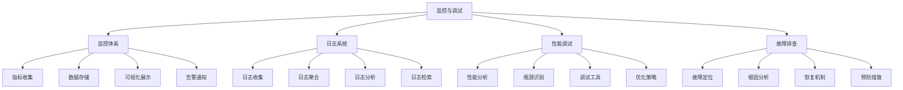

# 监控与调试面试题

[← 返回后端面试题目录](./README.md)

## 📚 题目概览

本部分考察系统监控、性能调试和故障排查的能力，重点关注日志系统、性能指标、链路追踪和错误监控等核心技术。

## 🎯 核心技术考察重点

### 监控体系设计
- **指标收集**：系统指标、业务指标、自定义指标的设计和采集
- **日志系统**：结构化日志、日志聚合、日志分析和检索
- **链路追踪**：分布式追踪、调用链分析、性能瓶颈定位
- **告警机制**：阈值设置、告警策略、故障自动恢复

### 性能调试技术
- **性能分析**：CPU、内存、I/O、网络的性能分析方法
- **瓶颈识别**：系统瓶颈的定位和分析技术
- **调试工具**：Profiler、APM工具、调试器的使用
- **优化策略**：性能优化的方法论和最佳实践

### 故障排查能力
- **故障定位**：快速定位问题根因的方法和工具
- **日志分析**：日志挖掘和异常模式识别
- **监控告警**：有效告警策略和噪音过滤
- **恢复机制**：故障自愈和快速恢复策略

## 📊 知识结构关联图

## 📝 核心面试题目

### 监控体系设计 [高级]

#### 题目1：企业级监控体系的架构设计和实现
**问题背景**：设计支持微服务架构的完整监控体系

**技术挑战**：
- 多维度指标的收集和聚合策略
- 海量监控数据的存储和查询优化
- 实时告警和异常检测机制
- 监控系统的高可用和扩展性设计

**考察要点**：
- Prometheus、Grafana、AlertManager的架构设计
- 指标命名规范和标签体系设计
- 时序数据库的选择和优化策略
- 告警规则的设计和噪音控制

**📁 完整解决方案**：[企业级监控体系架构](../../solutions/common/enterprise-monitoring-system.md)

#### 题目2：分布式系统的链路追踪设计和实现
**问题背景**：实现微服务间的完整调用链追踪

**技术挑战**：
- 分布式追踪的数据模型和传播机制
- 高并发场景下的性能影响控制
- 追踪数据的采样和存储优化
- 调用链分析和性能瓶颈定位

**考察要点**：
- OpenTracing、Jaeger、Zipkin的原理和对比
- Span和Trace的数据结构设计
- 追踪上下文的传播和注入机制
- 分布式追踪的性能开销控制

**📁 完整解决方案**：[分布式链路追踪系统](../../solutions/common/distributed-tracing-system.md)

### 日志系统架构 [中级]

#### 题目3：高性能日志系统的设计和优化
**问题背景**：设计支持高并发写入的日志系统

**技术挑战**：
- 异步日志写入和缓冲机制设计
- 结构化日志的格式和索引优化
- 日志轮转和存储空间管理
- 日志传输的可靠性和性能保障

**考察要点**：
- 日志级别的设计和使用策略
- 异步写入的实现原理和性能优化
- 日志聚合和集中化处理架构
- ELK Stack的部署和调优经验

**📁 完整解决方案**：[高性能日志系统设计](../../solutions/common/high-performance-logging-system.md)

#### 题目4：日志分析和异常检测的实现
**问题背景**：构建智能化的日志分析和异常检测系统

**技术挑战**：
- 海量日志数据的实时分析处理
- 异常模式的识别和机器学习应用
- 日志关联分析和根因定位
- 告警的智能化和误报控制

**考察要点**：
- 日志解析和结构化处理技术
- 异常检测算法和阈值设置策略
- 日志数据的实时流处理架构
- 机器学习在日志分析中的应用

**📁 完整解决方案**：[智能日志分析系统](../../solutions/common/intelligent-log-analysis.md)

### 性能调试技术 [高级]

#### 题目5：应用性能分析和瓶颈定位方法
**问题背景**：诊断和解决生产环境的性能问题

**技术挑战**：
- 多层次性能指标的收集和分析
- 性能瓶颈的快速定位和诊断
- 生产环境的安全性能分析方法
- 性能优化效果的量化评估

**考察要点**：
- CPU、内存、I/O、网络的性能分析方法
- Profiler工具的使用和火焰图分析
- 数据库查询和缓存性能优化
- 并发性能和锁竞争的分析

**📁 完整解决方案**：[应用性能分析实践](../../solutions/common/application-performance-analysis.md)

#### 题目6：APM工具的选择和集成实践
**问题背景**：选择和部署适合的应用性能监控工具

**技术挑战**：
- APM工具的功能对比和选择依据
- 监控代理的部署和配置优化
- 性能数据的采集和传输策略
- 监控系统对应用性能的影响控制

**考察要点**：
- New Relic、AppDynamics、Datadog等工具对比
- 监控数据的采样率和精度平衡
- 自定义指标和业务监控的实现
- 监控成本和ROI的评估

**📁 完整解决方案**：[APM工具集成实践](../../solutions/common/apm-tools-integration.md)

### 故障排查能力 [高级]

#### 题目7：生产环境故障的快速定位和恢复
**问题背景**：处理生产环境的紧急故障和系统异常

**技术挑战**：
- 故障现象的快速分析和初步判断
- 多系统协作下的问题定位方法
- 故障恢复的优先级和策略选择
- 故障复盘和预防措施的制定

**考察要点**：
- 故障处理的标准流程和最佳实践
- 日志分析和指标关联的技巧
- 回滚和降级策略的设计和执行
- 故障知识库和经验积累

**📁 完整解决方案**：[生产故障处理实践](../../solutions/common/production-incident-handling.md)

#### 题目8：监控告警策略的设计和优化
**问题背景**：设计有效的告警策略，减少误报和漏报

**技术挑战**：
- 告警阈值的科学设置和动态调整
- 告警聚合和去重机制设计
- 告警优先级和升级策略
- 告警疲劳的预防和处理

**考察要点**：
- 基于统计学的阈值设置方法
- 多维度告警和复合条件的设计
- 告警通知渠道和时间策略
- 告警效果的评估和持续优化

**📁 完整解决方案**：[智能告警策略设计](../../solutions/common/intelligent-alerting-strategy.md)

### 监控工具实践 [中级]

#### 题目9：Prometheus监控系统的部署和调优
**问题背景**：部署和优化Prometheus监控系统

**技术挑战**：
- Prometheus集群的高可用部署
- 监控数据的存储和查询优化
- 自定义指标的设计和实现
- Grafana仪表板的设计和优化

**考察要点**：
- Prometheus的架构原理和数据模型
- PromQL查询语言的高级用法
- 监控规则和告警规则的编写
- 监控系统的容量规划和扩展

**📁 完整解决方案**：[Prometheus监控系统实践](../../solutions/common/prometheus-monitoring-practice.md)

#### 题目10：容器化环境的监控和调试
**问题背景**：实现Kubernetes环境的全方位监控

**技术挑战**：
- 容器和Pod级别的资源监控
- 服务网格的可观测性实现
- 容器日志的收集和聚合
- Kubernetes集群的健康监控

**考察要点**：
- Kubernetes监控架构和组件
- 容器资源限制和监控指标
- Service Mesh的追踪和监控
- 云原生监控工具的选择和使用

**📁 完整解决方案**：[Kubernetes监控实践](../../solutions/common/kubernetes-monitoring-practice.md)

## 📊 面试评分标准

### 基础知识 (30分)
- 监控理论和日志系统的基本概念
- 常用监控工具和技术栈的了解
- 性能分析和调试方法的掌握

### 技术深度 (40分)
- 监控体系架构的设计能力
- 复杂故障的排查和解决能力
- 监控系统的优化和调优经验

### 实践能力 (30分)
- 生产环境监控的部署经验
- 故障处理和应急响应能力
- 监控工具的使用和定制能力

## 🎯 备考建议

### 理论学习路径
1. **监控基础**：了解监控理论、指标体系、告警策略
2. **工具掌握**：熟练使用Prometheus、Grafana、ELK Stack
3. **性能调试**：掌握性能分析方法和调试工具
4. **故障处理**：学习故障排查流程和最佳实践

### 实践项目建议
1. **监控系统搭建**：从零搭建完整的监控体系
2. **性能优化项目**：进行实际的性能分析和优化
3. **故障模拟**：通过故障注入练习排查技能
4. **工具定制**：开发自定义监控和告警组件

## 🔗 相关资源链接

- [性能优化面试题](./performance-optimization.md)
- [分布式系统设计](./distributed-systems.md)
- [微服务架构设计](./microservices.md)
- [DevOps部署实践](./deployment-devops.md)
