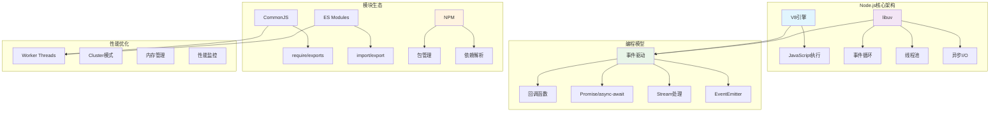

# Node.js基础面试题

[← 返回后端面试题目录](./README.md)

## 📚 题目概览

Node.js是基于Chrome V8引擎的JavaScript运行时环境，以其事件驱动、非阻塞I/O模型著称。本章节重点考察候选人对Node.js核心概念的理解，包括事件循环、模块系统、异步编程等关键技术，以及在实际项目中的应用能力。

## 🎯 核心技术考察重点

### 事件循环与异步编程
- Event Loop的工作机制和各个阶段
- 微任务和宏任务的执行优先级
- process.nextTick()和setImmediate()的区别
- 异步编程模式和最佳实践

### 模块系统与包管理
- CommonJS和ES Modules的对比
- 模块加载机制和缓存策略
- NPM包管理和依赖解析
- 模块打包和优化策略

### Stream与Buffer处理
- 四种Stream类型的使用场景
- 背压处理和流量控制
- Buffer的内存管理和性能优化
- 大文件处理的最佳实践

### 性能优化与监控
- CPU密集型任务的处理策略
- 内存管理和垃圾回收机制
- 性能监控和调试技巧
- 集群模式和负载均衡

## 📊 知识结构关联图

## 📝 核心面试题目

### Event Loop与异步机制 🔄

#### 题目1：Event Loop工作原理深度解析
**问题背景**：理解Node.js单线程如何处理高并发请求的核心机制

**技术挑战**：
- Event Loop各个阶段的执行顺序和特点
- 微任务队列和宏任务队列的优先级
- 不同异步操作的调度策略
- 性能瓶颈的识别和优化

**考察要点**：
- 对事件循环六个阶段的深度理解
- process.nextTick()和Promise的执行时机
- Timer、I/O、Check阶段的调度机制
- 如何避免事件循环阻塞

**📁 完整解决方案**：[Event Loop机制详解](../../solutions/common/nodejs-event-loop.md)

#### 题目2：异步编程模式最佳实践
**问题背景**：在复杂业务场景中选择合适的异步编程模式

**技术挑战**：
- 回调地狱的解决方案
- Promise链式调用的优化
- async/await的错误处理
- 并发控制和流量管理

**考察要点**：
- 不同异步模式的适用场景
- 错误处理的最佳实践
- 性能和可读性的权衡
- 异步操作的测试策略

**📁 完整解决方案**：[Node.js异步编程实践](../../solutions/common/nodejs-async-patterns.md)

### 模块系统与生态 📦

#### 题目3：模块系统设计与优化
**问题背景**：设计可维护、高性能的模块架构

**技术挑战**：
- CommonJS与ES Modules的混用
- 模块循环依赖的处理
- 动态导入和代码分割
- 模块缓存和热重载

**考察要点**：
- 模块加载机制的深度理解
- 依赖管理的最佳实践
- 性能优化策略
- 模块化架构设计

**📁 完整解决方案**：[Node.js模块系统实现](../../solutions/common/nodejs-module-system.md)

### Stream与数据处理 🌊

#### 题目4：高性能Stream处理系统
**问题背景**：处理大量数据流时的性能优化和内存管理

**技术挑战**：
- 背压处理和流量控制
- Transform流的自定义实现
- 多个流的组合和管道设计
- 错误处理和恢复机制

**考察要点**：
- 四种Stream类型的深度应用
- 内存效率和性能优化
- 错误传播和处理策略
- 与其他I/O操作的集成

**📁 完整解决方案**：[Node.js Stream处理系统](../../solutions/common/nodejs-stream-processing.md)

### 性能优化与监控 ⚡

#### 题目5：CPU密集型任务处理策略
**问题背景**：在Node.js中高效处理计算密集型任务

**技术挑战**：
- Worker Threads的设计和使用
- 子进程通信和数据传递
- 任务分解和负载均衡
- 资源管理和监控

**考察要点**：
- 多线程编程的最佳实践
- 进程间通信的设计
- 性能监控和调优
- 内存和CPU资源管理

**📁 完整解决方案**：[Node.js多线程处理实现](../../solutions/common/nodejs-worker-threads.md)

#### 题目6：内存管理与性能监控
**问题背景**：构建生产级的性能监控和内存管理系统

**技术挑战**：
- V8垃圾回收机制的优化
- 内存泄漏的检测和预防
- 性能指标的收集和分析
- 实时监控和告警系统

**考察要点**：
- V8内存模型的深度理解
- 性能调优的系统性方法
- 监控工具的使用和开发
- 生产环境的最佳实践

**📁 完整解决方案**：[Node.js性能监控系统](../../solutions/common/nodejs-performance-monitoring.md)

## 📊 面试评分标准

### 基础理解 (30分)
- **概念掌握**：能清晰解释Node.js的核心概念和工作原理
- **API熟悉**：熟练使用Node.js的核心API和模块
- **最佳实践**：了解社区推荐的编程规范和模式

### 实践应用 (40分)
- **问题解决**：能够识别和解决常见的Node.js开发问题
- **性能优化**：具备性能分析和优化的实战能力
- **架构设计**：能够设计可扩展的Node.js应用架构

### 深度理解 (30分)
- **原理洞察**：深入理解底层机制和实现原理
- **生产经验**：具备生产环境的部署和运维经验
- **技术前瞻**：了解Node.js的发展趋势和新特性

## 🎯 备考建议

### 学习路径
1. **基础概念**：深入理解事件循环、模块系统等核心概念
2. **API实践**：熟练掌握Stream、Buffer、Process等核心API
3. **异步编程**：掌握各种异步编程模式和最佳实践
4. **性能优化**：学习性能分析工具和优化技巧
5. **生产实践**：通过实际项目积累部署和运维经验

### 技术重点
- **Event Loop**：深度理解事件循环机制
- **Stream API**：掌握流式数据处理
- **Worker Threads**：了解多线程编程
- **性能监控**：学习APM工具的使用
- **模块化**：掌握现代模块化开发

### 实践项目建议
- 构建高性能Web服务器
- 实现文件处理工具
- 开发实时通信应用
- 搭建微服务架构
- 创建性能监控系统

## 🔗 相关资源链接

- [Node.js Express框架面试题](./nodejs-express.md)
- [Node.js性能优化面试题](./nodejs-performance.md)
- [JavaScript核心面试题](../frontend/javascript-core.md)
- [微服务架构面试题](./microservices.md)
- [← 返回后端面试题目录](./README.md)

---

*掌握Node.js核心技术，构建高性能JavaScript服务端应用* 🚀 