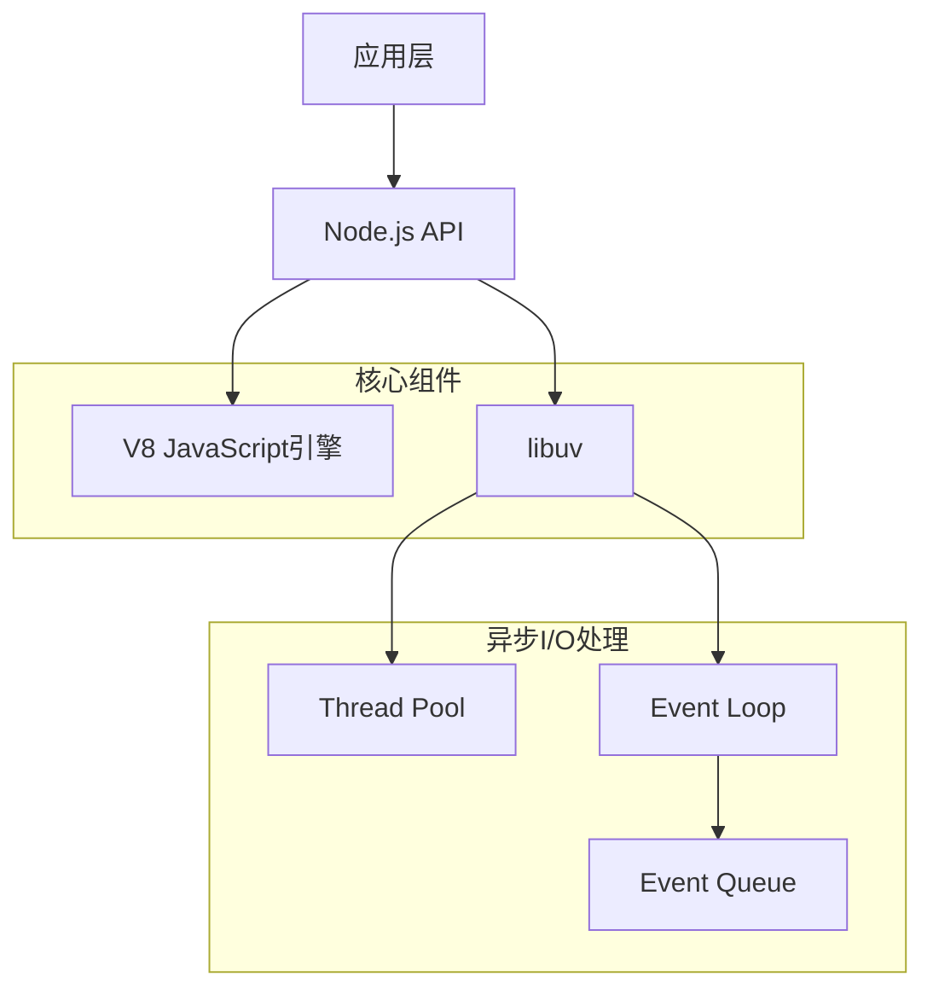
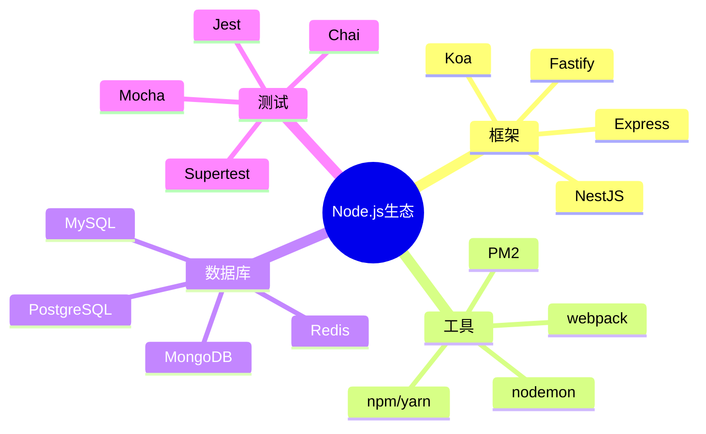

# Node.js 基础面试题

[← 返回后端面试题目录](./README.md)

## 🎯 核心知识点

- Event Loop (事件循环)
- 模块系统 (CommonJS/ES Modules)
- 异步编程模型
- Stream API
- Buffer 处理
- 进程和子进程
- 错误处理

## 📊 Node.js 架构概览



## 💡 面试题目

### **初级题目**

#### 1. 什么是Node.js？它的主要特点是什么？

**答案要点：**
- Node.js是基于Chrome V8引擎的JavaScript运行时环境
- 主要特点：
  - 事件驱动、非阻塞I/O模型
  - 单线程（主线程）+ 线程池
  - 跨平台
  - NPM生态系统丰富
  - 适合I/O密集型应用

#### 2. Node.js中的模块系统是如何工作的？

**答案要点：**
- CommonJS模块系统
- `require()` 和 `module.exports`
- 模块缓存机制
- 内置模块、本地模块、第三方模块

```javascript
// 导出模块
module.exports = {
    add: (a, b) => a + b,
    subtract: (a, b) => a - b
};

// 导入模块
const math = require('./math');
console.log(math.add(2, 3)); // 5
```

#### 3. Event Loop（事件循环）的工作原理是什么？

**答案要点：**
- 单线程主循环
- 事件循环阶段：
  1. Timer（定时器）
  2. Pending callbacks
  3. Idle, prepare
  4. Poll（轮询）
  5. Check（检查）
  6. Close callbacks


### **中级题目**

#### 4. 解释 process.nextTick() 和 setImmediate() 的区别

**答案要点：**
- `process.nextTick()`: 在当前阶段结束后立即执行
- `setImmediate()`: 在check阶段执行
- 执行优先级：process.nextTick > Promise.resolve > setImmediate

```javascript
console.log('start');

setImmediate(() => console.log('setImmediate'));
process.nextTick(() => console.log('nextTick'));
Promise.resolve().then(() => console.log('promise'));

console.log('end');

// 输出顺序：start -> end -> nextTick -> promise -> setImmediate
```

#### 5. Node.js中的Stream是什么？有哪些类型？

**答案要点：**
- Stream是处理数据流的抽象接口
- 四种类型：
  - Readable（可读流）
  - Writable（可写流）
  - Duplex（双工流）
  - Transform（转换流）

```javascript
const fs = require('fs');
const readStream = fs.createReadStream('input.txt');
const writeStream = fs.createWriteStream('output.txt');

readStream.pipe(writeStream);
```

#### 6. Buffer在Node.js中的作用是什么？

**答案要点：**
- 处理二进制数据
- 固定大小的内存分配
- 与字符串转换
- 性能优化

```javascript
// 创建Buffer
const buf1 = Buffer.alloc(10);
const buf2 = Buffer.from('hello world', 'utf8');

// Buffer操作
console.log(buf2.toString()); // 'hello world'
console.log(buf2.length); // 11
```

### **高级题目**

#### 7. 如何在Node.js中处理CPU密集型任务？

**答案要点：**
- 使用Worker Threads
- 子进程 (child_process)
- 集群模式 (cluster)
- 任务分解和异步处理

```javascript
// 使用Worker Threads
const { Worker, isMainThread, parentPort, workerData } = require('worker_threads');

if (isMainThread) {
    const worker = new Worker(__filename, { workerData: { num: 40 } });
    worker.on('message', (result) => {
        console.log('Fibonacci result:', result);
    });
} else {
    function fibonacci(n) {
        if (n < 2) return n;
        return fibonacci(n - 1) + fibonacci(n - 2);
    }
    
    const result = fibonacci(workerData.num);
    parentPort.postMessage(result);
}
```

#### 8. 解释Node.js中的内存管理和垃圾回收

**答案要点：**
- V8内存结构：新生代、老生代
- 垃圾回收算法：Scavenge、Mark-Sweep、Mark-Compact
- 内存泄漏检测和预防
- `--max-old-space-size` 参数

#### 9. 如何优化Node.js应用的性能？

**答案要点：**
- 代码优化：
  - 使用异步操作
  - 避免阻塞主线程
  - 合理使用缓存
- 内存优化：
  - 避免内存泄漏
  - 使用对象池
- I/O优化：
  - 连接池
  - 批量操作
- 监控和分析：
  - Profile工具
  - APM监控

### **实战题目**

#### 10. 实现一个简单的HTTP服务器和客户端

```javascript
// 服务器端
const http = require('http');

const server = http.createServer((req, res) => {
    res.writeHead(200, { 'Content-Type': 'application/json' });
    res.end(JSON.stringify({ message: 'Hello World', timestamp: Date.now() }));
});

server.listen(3000, () => {
    console.log('Server running on port 3000');
});

// 客户端
const options = {
    hostname: 'localhost',
    port: 3000,
    path: '/',
    method: 'GET'
};

const req = http.request(options, (res) => {
    let data = '';
    res.on('data', (chunk) => data += chunk);
    res.on('end', () => console.log(JSON.parse(data)));
});

req.end();
```

#### 11. 实现一个文件上传处理器

```javascript
const fs = require('fs');
const path = require('path');
const { promisify } = require('util');

class FileUploader {
    constructor(uploadDir = './uploads') {
        this.uploadDir = uploadDir;
        this.ensureDir();
    }
    
    ensureDir() {
        if (!fs.existsSync(this.uploadDir)) {
            fs.mkdirSync(this.uploadDir, { recursive: true });
        }
    }
    
    async saveFile(filename, data) {
        const filepath = path.join(this.uploadDir, filename);
        const writeFile = promisify(fs.writeFile);
        
        try {
            await writeFile(filepath, data);
            return { success: true, path: filepath };
        } catch (error) {
            return { success: false, error: error.message };
        }
    }
    
    async processUpload(req) {
        return new Promise((resolve, reject) => {
            let data = Buffer.alloc(0);
            
            req.on('data', chunk => {
                data = Buffer.concat([data, chunk]);
            });
            
            req.on('end', async () => {
                const filename = `upload_${Date.now()}.bin`;
                const result = await this.saveFile(filename, data);
                resolve(result);
            });
            
            req.on('error', reject);
        });
    }
}
```

## 🔗 扩展学习

### Node.js生态系统



### 相关主题
- [Express 框架面试题](./nodejs-express.md)
- [Node.js 性能优化](./nodejs-performance.md)
- [异步编程面试题](./python-async.md)
- [Web安全面试题](./web-security.md)

## 📚 推荐资源

### 官方文档
- [Node.js 官方文档](https://nodejs.org/docs/)
- [NPM 文档](https://docs.npmjs.com/)

### 学习材料
- 《深入浅出Node.js》
- 《Node.js设计模式》
- [Node.js最佳实践](https://github.com/goldbergyoni/nodebestpractices)

---

*掌握Node.js核心概念，构建高性能后端应用* 🚀 