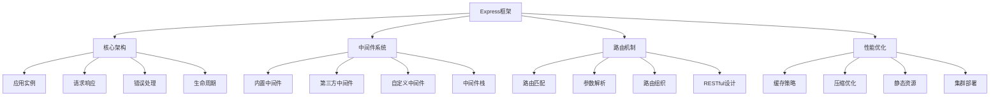

# Node.js Express框架面试题

[← 返回后端面试题目录](./README.md)

## 📚 题目概览

本部分考察Express.js框架的深度理解和应用能力，重点关注中间件机制、路由设计、性能优化和企业级应用开发。

## 🎯 核心技术考察重点

### Express框架架构
- **中间件机制**：中间件栈的执行流程和设计原理
- **路由系统**：路由匹配算法和参数处理机制
- **请求响应处理**：req/res对象的扩展和生命周期
- **错误处理**：异常捕获和错误处理中间件

### 高级特性应用
- **模板引擎集成**：EJS、Pug等模板引擎的性能对比
- **静态文件服务**：静态资源的缓存和优化策略
- **会话管理**：Session和Cookie的安全处理
- **安全防护**：CSRF、XSS、CORS等安全中间件

### 性能优化策略
- **中间件优化**：中间件顺序和性能调优
- **缓存策略**：HTTP缓存和应用层缓存
- **压缩优化**：Gzip压缩和资源优化
- **集群部署**：多实例部署和负载均衡

## 📊 知识结构关联图

## 📝 核心面试题目

### Express基础架构 [中级]

#### 题目1：Express中间件机制的设计原理和执行流程
**问题背景**：设计一个支持插件化的Web应用框架

**技术挑战**：
- 中间件栈的执行顺序和控制流程
- next()函数的实现机制和错误传播
- 中间件的异步处理和错误捕获
- 中间件的性能影响和优化策略

**考察要点**：
- 中间件函数的签名和执行模式
- 错误处理中间件的特殊处理机制
- 中间件的挂载方式和作用域
- 中间件栈的内部实现原理

**📁 完整解决方案**：[Express中间件机制实现](../../solutions/common/express-middleware-system.md)

#### 题目2：Express路由系统的设计和RESTful API实现
**问题背景**：构建一个标准的RESTful API服务

**技术挑战**：
- 路由匹配算法的实现和性能
- 路径参数和查询参数的处理
- 路由模块化和组织策略
- API版本控制和向后兼容

**考察要点**：
- Router类的实现原理和层级结构
- 路由参数的解析和验证机制
- HTTP方法的处理和路由优先级
- 路由中间件的应用和作用域

**📁 完整解决方案**：[Express路由系统设计](../../solutions/common/express-routing-system.md)

### 企业级应用开发 [高级]

#### 题目3：Express应用的安全防护和最佳实践
**问题背景**：构建安全可靠的企业级Web应用

**技术挑战**：
- 常见Web攻击的防护机制
- 认证授权系统的设计和实现
- 数据验证和输入过滤
- 安全头设置和HTTPS配置

**考察要点**：
- helmet.js等安全中间件的使用
- CSRF攻击的防护策略和实现
- XSS防护和内容安全策略
- 会话安全和JWT token管理

**📁 完整解决方案**：[Express安全防护体系](../../solutions/common/express-security-practices.md)

#### 题目4：Express应用的错误处理和日志管理
**问题背景**：建立完善的错误处理和监控体系

**技术挑战**：
- 统一错误处理机制的设计
- 异步错误的捕获和处理
- 日志分级和结构化日志
- 错误监控和告警机制

**考察要点**：
- 错误处理中间件的实现原理
- Promise和async/await的错误处理
- 日志中间件的设计和性能优化
- 错误追踪和调试信息的收集

**📁 完整解决方案**：[Express错误处理系统](../../solutions/common/express-error-handling.md)

### 性能优化实践 [高级]

#### 题目5：Express应用的性能监控和调优
**问题背景**：优化高并发场景下的Express应用性能

**技术挑战**：
- 性能瓶颈的识别和分析
- 中间件性能优化策略
- 内存使用和垃圾回收优化
- 数据库查询和缓存优化

**考察要点**：
- 性能监控中间件的实现
- 响应时间和吞吐量的测量
- 内存泄漏的检测和预防
- 缓存策略的设计和实现

**📁 完整解决方案**：[Express性能优化实践](../../solutions/common/express-performance-optimization.md)

#### 题目6：Express应用的缓存策略和静态资源优化
**问题背景**：优化Web应用的加载速度和用户体验

**技术挑战**：
- HTTP缓存头的设置和管理
- 静态资源的压缩和优化
- CDN集成和缓存策略
- 动态内容的缓存机制

**考察要点**：
- Cache-Control、ETag等缓存机制
- Gzip压缩和资源合并策略
- 静态文件服务的性能优化
- Redis等缓存中间件的集成

**📁 完整解决方案**：[Express缓存优化策略](../../solutions/common/express-caching-optimization.md)

### 微服务架构 [高级]

#### 题目7：Express在微服务架构中的应用和设计
**问题背景**：基于Express构建微服务架构

**技术挑战**：
- 服务间通信和API网关设计
- 服务发现和负载均衡
- 分布式追踪和监控
- 服务容错和降级机制

**考察要点**：
- RESTful API和GraphQL的设计
- 服务注册和健康检查机制
- 分布式日志和链路追踪
- 断路器和限流策略的实现

**📁 完整解决方案**：[Express微服务架构设计](../../solutions/common/express-microservices-architecture.md)

#### 题目8：Express应用的容器化部署和DevOps实践
**问题背景**：实现Express应用的自动化部署和运维

**技术挑战**：
- Docker容器化和镜像优化
- Kubernetes部署和服务编排
- CI/CD流水线的设计和实现
- 监控告警和日志聚合

**考察要点**：
- Dockerfile的优化和多阶段构建
- Kubernetes资源配置和扩缩容
- 健康检查和滚动更新策略
- Prometheus监控和Grafana可视化

**📁 完整解决方案**：[Express容器化部署实践](../../solutions/common/express-containerization-deployment.md)

### 高级特性应用 [中级]

#### 题目9：Express模板引擎集成和服务端渲染
**问题背景**：实现高性能的服务端渲染应用

**技术挑战**：
- 模板引擎的选择和性能对比
- 模板缓存和编译优化
- 数据绑定和组件化设计
- SEO优化和首屏渲染

**考察要点**：
- EJS、Pug、Handlebars等引擎特点
- 模板继承和局部模板的使用
- 模板安全和XSS防护
- 服务端渲染的性能优化

**📁 完整解决方案**：[Express模板引擎优化](../../solutions/common/express-template-optimization.md)

#### 题目10：Express中间件生态和自定义中间件开发
**问题背景**：开发可复用的Express中间件组件

**技术挑战**：
- 中间件的设计模式和最佳实践
- 中间件的配置和参数化
- 中间件的测试和文档编写
- 中间件的发布和版本管理

**考察要点**：
- 中间件的函数式设计和闭包应用
- 中间件的错误处理和异常传播
- 中间件的性能监控和调试
- 中间件生态的贡献和维护

**📁 完整解决方案**：[Express中间件开发指南](../../solutions/common/express-middleware-development.md)

## 📊 面试评分标准

### 基础知识 (30分)
- Express框架的核心概念和架构理解
- 中间件机制和路由系统的掌握程度
- HTTP协议和Web开发基础的熟悉程度

### 技术深度 (40分)
- 框架内部机制的深入理解
- 性能优化和安全防护的实践能力
- 企业级应用开发的架构设计能力

### 实践能力 (30分)
- 项目开发和部署经验
- 问题诊断和调试能力
- 团队协作和技术分享能力

## 🎯 备考建议

### 理论学习路径
1. **框架基础**：掌握Express的核心概念和基本用法
2. **中间件系统**：深入理解中间件的设计原理和实现机制
3. **性能优化**：学习Web应用的性能调优策略
4. **安全实践**：了解Web安全防护的最佳实践

### 实践项目建议
1. **RESTful API**：开发完整的API服务和文档
2. **中间件开发**：编写可复用的Express中间件
3. **性能测试**：对Express应用进行性能基准测试
4. **部署实践**：实现自动化部署和监控体系

## 🔗 相关资源链接

- [Node.js基础面试题](./nodejs-basics.md)
- [Node.js性能优化](./nodejs-performance.md)
- [API设计最佳实践](./api-design.md)
- [Web安全防护策略](./web-security.md) 