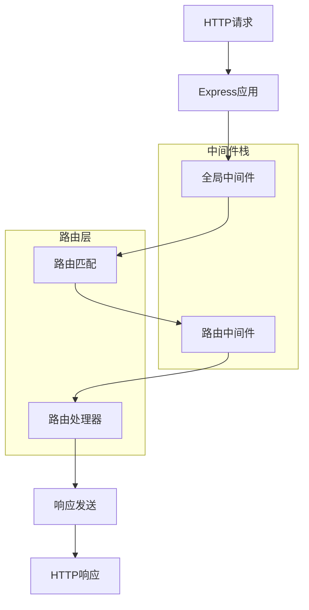
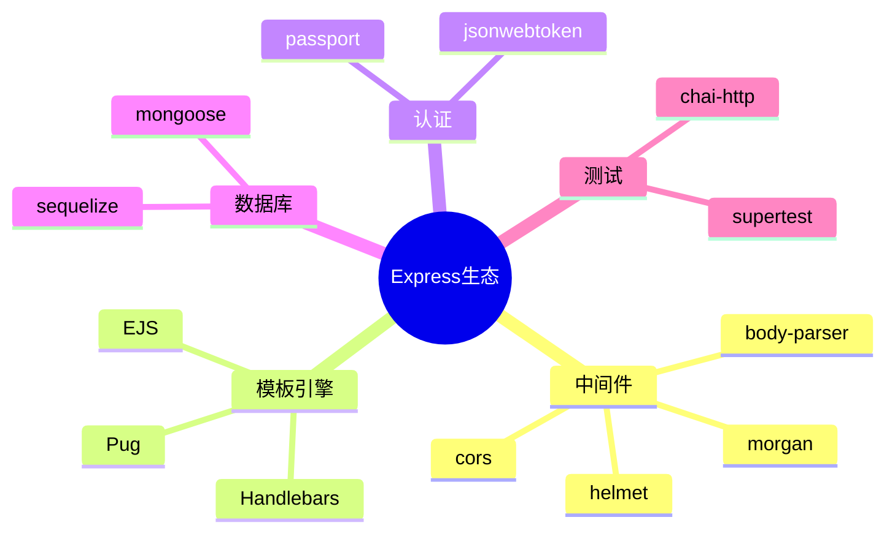

# Express 框架面试题

[← 返回后端面试题目录](./README.md)

## 🎯 核心知识点

- Express 基础架构
- 中间件 (Middleware)
- 路由系统
- 请求和响应对象
- 错误处理
- 模板引擎
- 静态文件服务
- 会话管理

## 📊 Express 请求处理流程



## 💡 面试题目

### **初级题目**

#### 1. Express是什么？它的主要特点是什么？

**答案要点：**
- Express是Node.js的轻量级Web框架
- 主要特点：
  - 简洁灵活的API
  - 强大的中间件系统
  - 路由系统
  - 模板引擎支持
  - 静态文件服务
  - 错误处理机制

#### 2. 什么是Express中间件？如何使用？

**答案要点：**
- 中间件是处理HTTP请求的函数
- 可以访问请求对象(req)、响应对象(res)和下一个中间件(next)
- 执行顺序：按注册顺序执行

```javascript
const express = require('express');
const app = express();

// 应用级中间件
app.use((req, res, next) => {
    console.log('请求时间:', Date.now());
    next();
});

// 路由级中间件
app.get('/users/:id', (req, res, next) => {
    console.log('用户ID:', req.params.id);
    next();
}, (req, res) => {
    res.send('用户信息');
});
```

#### 3. Express中的路由是如何工作的？

**答案要点：**
- 路由定义了应用如何响应客户端请求
- 由HTTP方法、路径和处理函数组成
- 支持路径参数、查询参数

```javascript
// 基本路由
app.get('/', (req, res) => res.send('主页'));
app.post('/users', (req, res) => res.send('创建用户'));

// 路径参数
app.get('/users/:id', (req, res) => {
    res.send(`用户ID: ${req.params.id}`);
});

// 查询参数
app.get('/search', (req, res) => {
    res.send(`搜索: ${req.query.q}`);
});
```

### **中级题目**

#### 4. 解释Express中不同类型的中间件

**答案要点：**
- **应用级中间件**: 绑定到app对象
- **路由级中间件**: 绑定到express.Router()
- **错误处理中间件**: 四个参数(err, req, res, next)
- **内置中间件**: express.static, express.json等
- **第三方中间件**: body-parser, cors等

```javascript
// 应用级中间件
app.use(express.json());

// 路由级中间件
const router = express.Router();
router.use((req, res, next) => {
    console.log('路由中间件');
    next();
});

// 错误处理中间件
app.use((err, req, res, next) => {
    console.error(err.stack);
    res.status(500).send('服务器错误');
});
```

#### 5. 如何在Express中处理错误？

**答案要点：**
- 同步错误：自动捕获
- 异步错误：需要调用next(err)
- 错误处理中间件：四个参数
- 错误处理最佳实践

```javascript
// 异步错误处理
app.get('/async-error', async (req, res, next) => {
    try {
        const result = await someAsyncOperation();
        res.json(result);
    } catch (error) {
        next(error); // 传递给错误处理中间件
    }
});

// 错误处理中间件
app.use((err, req, res, next) => {
    if (err instanceof CustomError) {
        res.status(err.statusCode).json({ error: err.message });
    } else {
        res.status(500).json({ error: '内部服务器错误' });
    }
});
```

#### 6. Express中的req和res对象有哪些常用方法？

**答案要点：**
- **req对象**：
  - `req.params`, `req.query`, `req.body`
  - `req.headers`, `req.cookies`
  - `req.method`, `req.url`, `req.path`
  
- **res对象**：
  - `res.send()`, `res.json()`, `res.status()`
  - `res.cookie()`, `res.redirect()`
  - `res.render()`, `res.sendFile()`

### **高级题目**

#### 7. 如何实现Express应用的性能优化？

**答案要点：**
- 启用Gzip压缩
- 使用缓存策略
- 优化中间件顺序
- 数据库连接池
- 静态资源优化

```javascript
const compression = require('compression');
const helmet = require('helmet');

// 安全中间件
app.use(helmet());

// 压缩中间件
app.use(compression());

// 缓存静态文件
app.use(express.static('public', {
    maxAge: '1d',
    etag: false
}));
```

#### 8. 如何实现Express应用的身份验证？

**答案要点：**
- JWT认证
- Session认证
- OAuth认证
- 中间件实现认证检查

```javascript
const jwt = require('jsonwebtoken');

// JWT认证中间件
const authenticateToken = (req, res, next) => {
    const authHeader = req.headers['authorization'];
    const token = authHeader && authHeader.split(' ')[1];
    
    if (!token) {
        return res.sendStatus(401);
    }
    
    jwt.verify(token, process.env.JWT_SECRET, (err, user) => {
        if (err) return res.sendStatus(403);
        req.user = user;
        next();
    });
};

// 受保护的路由
app.get('/protected', authenticateToken, (req, res) => {
    res.json({ message: '受保护的资源', user: req.user });
});
```

#### 9. 如何实现Express应用的测试？

**答案要点：**
- 单元测试：测试单个函数
- 集成测试：测试API端点
- 使用测试框架：Jest, Mocha
- 使用Supertest进行HTTP测试

```javascript
const request = require('supertest');
const app = require('../app');

describe('GET /users', () => {
    it('should return users list', async () => {
        const response = await request(app)
            .get('/users')
            .expect(200);
            
        expect(response.body).toHaveProperty('users');
        expect(Array.isArray(response.body.users)).toBe(true);
    });
});
```

### **实战题目**

#### 10. 实现一个完整的RESTful API

```javascript
const express = require('express');
const app = express();

app.use(express.json());

// 模拟数据库
let users = [
    { id: 1, name: '张三', email: 'zhang@example.com' },
    { id: 2, name: '李四', email: 'li@example.com' }
];

// GET /users - 获取所有用户
app.get('/users', (req, res) => {
    res.json({ users, total: users.length });
});

// GET /users/:id - 获取单个用户
app.get('/users/:id', (req, res) => {
    const id = parseInt(req.params.id);
    const user = users.find(u => u.id === id);
    
    if (!user) {
        return res.status(404).json({ error: '用户不存在' });
    }
    
    res.json(user);
});

// POST /users - 创建用户
app.post('/users', (req, res) => {
    const { name, email } = req.body;
    
    if (!name || !email) {
        return res.status(400).json({ error: '姓名和邮箱是必需的' });
    }
    
    const newUser = {
        id: users.length + 1,
        name,
        email
    };
    
    users.push(newUser);
    res.status(201).json(newUser);
});

// PUT /users/:id - 更新用户
app.put('/users/:id', (req, res) => {
    const id = parseInt(req.params.id);
    const userIndex = users.findIndex(u => u.id === id);
    
    if (userIndex === -1) {
        return res.status(404).json({ error: '用户不存在' });
    }
    
    users[userIndex] = { ...users[userIndex], ...req.body };
    res.json(users[userIndex]);
});

// DELETE /users/:id - 删除用户
app.delete('/users/:id', (req, res) => {
    const id = parseInt(req.params.id);
    const userIndex = users.findIndex(u => u.id === id);
    
    if (userIndex === -1) {
        return res.status(404).json({ error: '用户不存在' });
    }
    
    users.splice(userIndex, 1);
    res.status(204).send();
});

module.exports = app;
```

#### 11. 实现文件上传功能

```javascript
const multer = require('multer');
const path = require('path');

// 配置multer
const storage = multer.diskStorage({
    destination: (req, file, cb) => {
        cb(null, 'uploads/');
    },
    filename: (req, file, cb) => {
        const uniqueSuffix = Date.now() + '-' + Math.round(Math.random() * 1E9);
        cb(null, file.fieldname + '-' + uniqueSuffix + path.extname(file.originalname));
    }
});

const upload = multer({ 
    storage: storage,
    limits: { fileSize: 5 * 1024 * 1024 }, // 5MB
    fileFilter: (req, file, cb) => {
        const allowedTypes = /jpeg|jpg|png|gif/;
        const extname = allowedTypes.test(path.extname(file.originalname).toLowerCase());
        const mimetype = allowedTypes.test(file.mimetype);
        
        if (mimetype && extname) {
            return cb(null, true);
        } else {
            cb(new Error('只允许上传图片文件'));
        }
    }
});

// 单文件上传
app.post('/upload', upload.single('file'), (req, res) => {
    if (!req.file) {
        return res.status(400).json({ error: '没有选择文件' });
    }
    
    res.json({
        message: '文件上传成功',
        filename: req.file.filename,
        originalname: req.file.originalname,
        size: req.file.size
    });
});

// 多文件上传
app.post('/upload-multiple', upload.array('files', 5), (req, res) => {
    if (!req.files || req.files.length === 0) {
        return res.status(400).json({ error: '没有选择文件' });
    }
    
    const fileInfo = req.files.map(file => ({
        filename: file.filename,
        originalname: file.originalname,
        size: file.size
    }));
    
    res.json({
        message: '文件上传成功',
        files: fileInfo
    });
});
```

## 🔗 扩展学习

### Express生态系统



### 相关主题
- [Node.js 基础面试题](./nodejs-basics.md)
- [Node.js 性能优化](./nodejs-performance.md)
- [Web安全面试题](./web-security.md)
- [API设计面试题](./api-design.md)

## 📚 推荐资源

### 官方文档
- [Express 官方文档](https://expressjs.com/)
- [Express中间件指南](https://expressjs.com/en/guide/using-middleware.html)

### 学习材料
- 《Express实战》
- [Express最佳实践](https://expressjs.com/en/advanced/best-practice-security.html)

---

*掌握Express框架，构建高效的Web应用* 🚀 