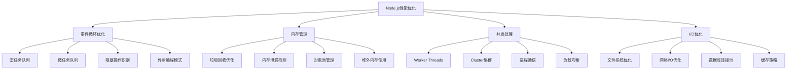

# Node.js性能优化面试题

[← 返回后端面试题目录](./README.md)

## 📚 题目概览

本部分考察Node.js应用的性能优化能力，重点关注事件循环机制、内存管理、并发处理和监控调优等核心技术。

## 🎯 核心技术考察重点

### 事件循环与异步机制
- **事件循环原理**：六个阶段的执行机制和优先级
- **异步I/O模型**：libuv的实现原理和性能特性
- **回调地狱解决**：Promise、async/await的性能影响
- **微任务队列**：process.nextTick和Promise的执行顺序

### 内存管理与优化
- **V8内存模型**：新生代、老生代的垃圾回收机制
- **内存泄漏检测**：常见内存泄漏场景和检测方法
- **内存优化策略**：对象池、缓存管理、大对象处理
- **堆外内存**：Buffer和ArrayBuffer的使用场景

### 并发处理与集群
- **单线程模型**：事件驱动的并发处理机制
- **Worker Threads**：CPU密集型任务的处理策略
- **Cluster模块**：多进程架构的设计和实现
- **负载均衡**：进程间负载分配和故障恢复

## 📊 知识结构关联图

## 📝 核心面试题目

### 事件循环机制 [中级]

#### 题目1：Node.js事件循环的六个阶段和执行机制
**问题背景**：分析一个高并发Web服务的性能瓶颈

**技术挑战**：
- 事件循环各阶段的执行顺序和特点
- 宏任务和微任务的优先级处理
- 阻塞操作对事件循环的影响
- 异步操作的调度和执行机制

**考察要点**：
- Timer、I/O callbacks、Idle、Poll、Check、Close callbacks阶段
- process.nextTick和Promise.resolve的执行时机
- setImmediate vs setTimeout(0)的区别
- 事件循环阻塞的识别和解决方法

**📁 完整解决方案**：[Node.js事件循环机制详解](../../solutions/common/nodejs-event-loop.md)

#### 题目2：异步编程模式的性能对比和选择
**问题背景**：优化一个包含大量异步操作的数据处理服务

**技术挑战**：
- 回调函数、Promise、async/await的性能差异
- 并发控制和错误处理机制
- 异步操作的内存占用和垃圾回收
- 异步栈追踪和调试优化

**考察要点**：
- 不同异步模式的执行效率对比
- Promise链和async/await的内存使用
- 异步并发控制的最佳实践
- 异步错误处理和异常传播机制

**📁 完整解决方案**：[Node.js异步编程优化](../../solutions/common/nodejs-async-optimization.md)

### 内存管理优化 [高级]

#### 题目3：V8垃圾回收机制和内存优化策略
**问题背景**：解决Node.js应用的内存泄漏和性能问题

**技术挑战**：
- V8堆内存的分代管理机制
- 垃圾回收的触发条件和性能影响
- 内存泄漏的常见场景和检测方法
- 大对象处理和内存优化策略

**考察要点**：
- 新生代Scavenge和老生代Mark-Sweep算法
- 内存快照分析和泄漏定位方法
- 闭包、全局变量、事件监听器的内存管理
- --max-old-space-size等V8参数调优

**📁 完整解决方案**：[Node.js内存管理优化](../../solutions/common/nodejs-memory-optimization.md)

#### 题目4：Buffer和Stream的性能优化实践
**问题背景**：优化大文件处理和网络传输的性能

**技术挑战**：
- Buffer的内存分配和回收机制
- Stream的背压处理和流控制
- 大文件读写的内存优化策略
- 网络传输的缓冲区管理

**考察要点**：
- Buffer.allocUnsafe vs Buffer.alloc的性能差异
- Readable、Writable、Transform流的实现原理
- 流的背压机制和highWaterMark配置
- 零拷贝技术和堆外内存的使用

**📁 完整解决方案**：[Node.js Buffer和Stream优化](../../solutions/common/nodejs-buffer-stream-optimization.md)

### 并发处理架构 [高级]

#### 题目5：Worker Threads和CPU密集型任务优化
**问题背景**：处理图像处理、数据分析等CPU密集型任务

**技术挑战**：
- Worker Threads的创建和管理策略
- 主线程和工作线程的通信机制
- CPU密集型任务的负载均衡
- 线程池的设计和资源管理

**考察要点**：
- Worker Threads vs Child Process的选择依据
- SharedArrayBuffer和MessageChannel的使用
- 线程间数据传递的序列化开销
- CPU密集型任务的分片和调度策略

**📁 完整解决方案**：[Node.js Worker Threads优化](../../solutions/common/nodejs-worker-threads.md)

#### 题目6：Cluster集群架构和负载均衡设计
**问题背景**：设计支持高并发的Node.js集群架构

**技术挑战**：
- 多进程架构的设计和实现
- 进程间负载分配和故障恢复
- 共享状态和会话管理
- 集群监控和自动扩缩容

**考察要点**：
- Cluster模块的fork和IPC通信机制
- Round-robin和操作系统负载均衡策略
- 进程重启和优雅关闭的实现
- PM2等进程管理工具的使用

**📁 完整解决方案**：[Node.js集群架构设计](../../solutions/common/nodejs-cluster-architecture.md)

### I/O性能优化 [中级]

#### 题目7：文件系统和网络I/O的性能调优
**问题背景**：优化文件服务和API网关的I/O性能

**技术挑战**：
- 文件系统操作的异步优化
- 网络连接的复用和管理
- I/O密集型应用的性能瓶颈
- 缓存策略和数据预取

**考察要点**：
- fs.promises vs fs callback的性能对比
- HTTP Keep-Alive和连接池的配置
- 文件描述符的管理和限制
- 缓存层次的设计和实现

**📁 完整解决方案**：[Node.js I/O性能优化](../../solutions/common/nodejs-io-optimization.md)

#### 题目8：数据库连接池和查询优化
**问题背景**：优化数据库密集型应用的性能

**技术挑战**：
- 数据库连接池的配置和管理
- 查询并发控制和超时处理
- 数据库事务的性能优化
- ORM和原生查询的性能对比

**考察要点**：
- 连接池大小和超时配置的调优
- 数据库查询的批量处理和缓存
- 事务隔离级别和锁机制的影响
- 数据库监控和慢查询分析

**📁 完整解决方案**：[Node.js数据库优化策略](../../solutions/common/nodejs-database-optimization.md)

### 监控与调试 [高级]

#### 题目9：Node.js应用的性能监控和调试
**问题背景**：建立完善的Node.js应用监控体系

**技术挑战**：
- 性能指标的收集和分析
- 内存泄漏和CPU使用的监控
- 分布式追踪和日志聚合
- 性能瓶颈的自动检测和告警

**考察要点**：
- clinic.js、0x等性能分析工具的使用
- 内存快照和CPU火焰图的分析
- APM工具的集成和配置
- 性能基线和异常检测机制

**📁 完整解决方案**：[Node.js性能监控体系](../../solutions/common/nodejs-performance-monitoring.md)

#### 题目10：生产环境的性能调优和故障排查
**问题背景**：解决生产环境中的性能问题和稳定性问题

**技术挑战**：
- 生产环境的性能分析方法
- 零停机的性能优化部署
- 故障快速定位和恢复
- 性能回归的预防和检测

**考察要点**：
- 生产环境的安全性能分析方法
- 蓝绿部署和灰度发布策略
- 故障预案和自动恢复机制
- 性能基准测试和回归检测

**📁 完整解决方案**：[Node.js生产环境调优](../../solutions/common/nodejs-production-tuning.md)

## 📊 面试评分标准

### 基础知识 (30分)
- Node.js事件循环和异步机制的理解
- V8引擎和内存管理的掌握程度
- 并发处理模型的熟悉程度

### 技术深度 (40分)
- 性能瓶颈识别和优化能力
- 内存泄漏检测和解决技能
- 集群架构设计和实现能力

### 实践能力 (30分)
- 生产环境性能调优经验
- 监控体系建设和故障排查能力
- 性能测试和基准分析技能

## 🎯 备考建议

### 理论学习路径
1. **事件循环机制**：深入理解Node.js的核心执行模型
2. **内存管理**：掌握V8垃圾回收和内存优化策略
3. **并发处理**：学习多进程、多线程的设计模式
4. **I/O优化**：了解文件系统、网络、数据库的优化方法

### 实践项目建议
1. **性能测试**：对Node.js应用进行全面的性能基准测试
2. **内存分析**：使用工具分析和解决内存泄漏问题
3. **集群部署**：实现高可用的Node.js集群架构
4. **监控系统**：建立完整的性能监控和告警体系

## 🔗 相关资源链接

- [Node.js基础面试题](./nodejs-basics.md)
- [Node.js Express框架](./nodejs-express.md)
- [性能优化通用策略](./performance-optimization.md)
- [监控调试最佳实践](./monitoring-debugging.md) 