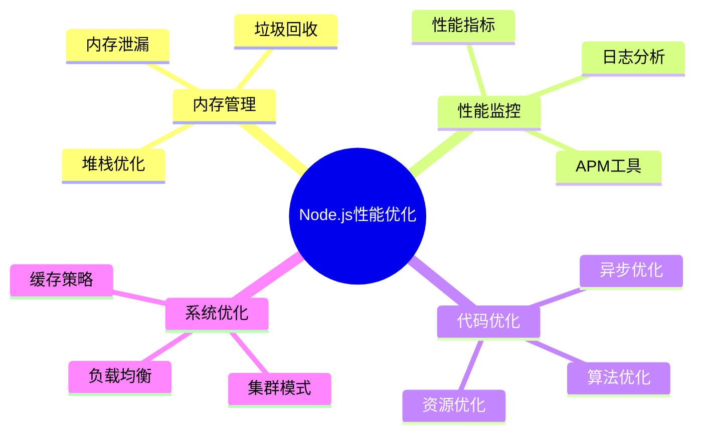

# Node.js 性能优化面试题

[← 返回后端面试题目录](./README.md)

## 📋 目录

- [内存管理](#内存管理)
- [性能监控](#性能监控)
- [代码优化](#代码优化)
- [并发处理](#并发处理)
- [实战案例](#实战案例)

## 🎯 核心知识点



## 内存管理

### 💡 初级题目

#### 1. Node.js 的内存结构和垃圾回收机制？

**答案要点：**
- **堆内存**：存储对象和闭包
- **栈内存**：存储基本类型和函数调用
- **V8 垃圾回收**：分代回收，新生代和老生代
- **内存限制**：默认约1.4GB（64位系统）

```javascript
// 内存使用监控
function getMemoryUsage() {
    const usage = process.memoryUsage();
    return {
        rss: `${Math.round(usage.rss / 1024 / 1024)} MB`,
        heapTotal: `${Math.round(usage.heapTotal / 1024 / 1024)} MB`,
        heapUsed: `${Math.round(usage.heapUsed / 1024 / 1024)} MB`,
        external: `${Math.round(usage.external / 1024 / 1024)} MB`
    };
}

// 内存泄漏检测
class MemoryLeakDetector {
    constructor() {
        this.baseline = process.memoryUsage();
        this.samples = [];
    }
    
    sample() {
        const current = process.memoryUsage();
        this.samples.push({
            timestamp: Date.now(),
            heapUsed: current.heapUsed,
            rss: current.rss
        });
        
        // 保持最近100个样本
        if (this.samples.length > 100) {
            this.samples.shift();
        }
    }
    
    detectLeak() {
        if (this.samples.length < 10) return false;
        
        const recent = this.samples.slice(-10);
        const trend = recent.every((sample, index) => {
            if (index === 0) return true;
            return sample.heapUsed > recent[index - 1].heapUsed;
        });
        
        return trend;
    }
}
```

### 🔥 中级题目

#### 2. 如何优化 Node.js 应用的内存使用？

**答案要点：**
- **对象池**：重用对象减少 GC 压力
- **流式处理**：处理大文件时使用 Stream
- **缓存策略**：合理的缓存大小和过期策略
- **内存监控**：定期监控和分析内存使用

```javascript
// 对象池实现
class ObjectPool {
    constructor(createFn, resetFn, maxSize = 100) {
        this.createFn = createFn;
        this.resetFn = resetFn;
        this.maxSize = maxSize;
        this.pool = [];
    }
    
    acquire() {
        if (this.pool.length > 0) {
            return this.pool.pop();
        }
        return this.createFn();
    }
    
    release(obj) {
        if (this.pool.length < this.maxSize) {
            this.resetFn(obj);
            this.pool.push(obj);
        }
    }
}

// 流式文件处理
const fs = require('fs');
const { Transform } = require('stream');

class DataProcessor extends Transform {
    constructor(options) {
        super({ objectMode: true, ...options });
        this.processedCount = 0;
    }
    
    _transform(chunk, encoding, callback) {
        try {
            // 处理数据块
            const processed = this.processChunk(chunk);
            this.processedCount++;
            
            if (this.processedCount % 1000 === 0) {
                console.log(`已处理 ${this.processedCount} 条记录`);
            }
            
            callback(null, processed);
        } catch (error) {
            callback(error);
        }
    }
    
    processChunk(chunk) {
        // 具体的数据处理逻辑
        return chunk.toString().toUpperCase();
    }
}
```

## 性能监控

### 🔥 中级题目

#### 3. 如何实现 Node.js 应用性能监控？

**答案要点：**
- **性能指标**：响应时间、吞吐量、错误率
- **监控工具**：clinic.js、0x、heapdump
- **APM 集成**：New Relic、AppDynamics
- **自定义指标**：业务相关的性能指标

```javascript
// 性能监控中间件
class PerformanceMonitor {
    constructor() {
        this.metrics = {
            requests: 0,
            responses: 0,
            errors: 0,
            responseTimes: [],
            activeConnections: 0
        };
    }
    
    middleware() {
        return (req, res, next) => {
            const start = process.hrtime.bigint();
            this.metrics.requests++;
            this.metrics.activeConnections++;
            
            res.on('finish', () => {
                const end = process.hrtime.bigint();
                const duration = Number(end - start) / 1000000; // 转换为毫秒
                
                this.metrics.responses++;
                this.metrics.responseTimes.push(duration);
                this.metrics.activeConnections--;
                
                if (res.statusCode >= 400) {
                    this.metrics.errors++;
                }
                
                // 保持最近1000个响应时间
                if (this.metrics.responseTimes.length > 1000) {
                    this.metrics.responseTimes.shift();
                }
            });
            
            next();
        };
    }
    
    getStats() {
        const responseTimes = this.metrics.responseTimes;
        
        return {
            requests: this.metrics.requests,
            responses: this.metrics.responses,
            errors: this.metrics.errors,
            errorRate: this.metrics.responses > 0 ? 
                (this.metrics.errors / this.metrics.responses * 100).toFixed(2) + '%' : '0%',
            activeConnections: this.metrics.activeConnections,
            avgResponseTime: responseTimes.length > 0 ? 
                (responseTimes.reduce((a, b) => a + b, 0) / responseTimes.length).toFixed(2) + 'ms' : '0ms',
            memory: process.memoryUsage()
        };
    }
}
```

## 代码优化

### ⚡ 高级题目

#### 4. 如何优化 Node.js 应用的并发处理？

**答案要点：**
- **集群模式**：利用多核 CPU
- **工作线程**：CPU 密集型任务
- **连接池**：数据库连接复用
- **缓存策略**：减少重复计算

```javascript
// 集群模式实现
const cluster = require('cluster');
const os = require('os');

if (cluster.isMaster) {
    const numWorkers = os.cpus().length;
    
    console.log(`主进程 ${process.pid} 启动`);
    console.log(`启动 ${numWorkers} 个工作进程`);
    
    // 启动工作进程
    for (let i = 0; i < numWorkers; i++) {
        cluster.fork();
    }
    
    // 监听工作进程退出
    cluster.on('exit', (worker, code, signal) => {
        console.log(`工作进程 ${worker.process.pid} 退出`);
        console.log('启动新的工作进程');
        cluster.fork();
    });
    
} else {
    // 工作进程代码
    const express = require('express');
    const app = express();
    
    app.get('/', (req, res) => {
        res.json({ 
            message: 'Hello from worker', 
            pid: process.pid 
        });
    });
    
    app.listen(3000, () => {
        console.log(`工作进程 ${process.pid} 监听端口 3000`);
    });
}

// 工作线程池
const { Worker, isMainThread, parentPort, workerData } = require('worker_threads');

class WorkerPool {
    constructor(workerScript, poolSize = os.cpus().length) {
        this.workerScript = workerScript;
        this.poolSize = poolSize;
        this.workers = [];
        this.queue = [];
        
        this.initWorkers();
    }
    
    initWorkers() {
        for (let i = 0; i < this.poolSize; i++) {
            this.createWorker();
        }
    }
    
    createWorker() {
        const worker = new Worker(this.workerScript);
        worker.busy = false;
        
        worker.on('message', (result) => {
            worker.busy = false;
            worker.resolve(result);
            this.processQueue();
        });
        
        worker.on('error', (error) => {
            worker.busy = false;
            worker.reject(error);
            this.processQueue();
        });
        
        this.workers.push(worker);
    }
    
    execute(data) {
        return new Promise((resolve, reject) => {
            const task = { data, resolve, reject };
            
            const availableWorker = this.workers.find(w => !w.busy);
            if (availableWorker) {
                this.runTask(availableWorker, task);
            } else {
                this.queue.push(task);
            }
        });
    }
    
    runTask(worker, task) {
        worker.busy = true;
        worker.resolve = task.resolve;
        worker.reject = task.reject;
        worker.postMessage(task.data);
    }
    
    processQueue() {
        if (this.queue.length === 0) return;
        
        const availableWorker = this.workers.find(w => !w.busy);
        if (availableWorker) {
            const task = this.queue.shift();
            this.runTask(availableWorker, task);
        }
    }
}
```

## 实战案例

### ⚡ 高级题目

#### 5. 设计一个高性能的文件上传服务

**答案要点：**
- **流式上传**：支持大文件分块上传
- **并发控制**：限制同时上传数量
- **进度跟踪**：实时上传进度反馈
- **错误恢复**：支持断点续传

```javascript
const multer = require('multer');
const fs = require('fs').promises;
const path = require('path');

class HighPerformanceUploadService {
    constructor(options = {}) {
        this.uploadDir = options.uploadDir || './uploads';
        this.maxConcurrent = options.maxConcurrent || 5;
        this.chunkSize = options.chunkSize || 1024 * 1024; // 1MB
        
        this.activeUploads = new Map();
        this.uploadQueue = [];
        this.processing = 0;
    }
    
    async handleUpload(req, res) {
        const { filename, chunkIndex, totalChunks, uploadId } = req.body;
        
        try {
            // 保存分块
            const chunkPath = path.join(
                this.uploadDir, 
                'temp', 
                `${uploadId}_${chunkIndex}`
            );
            
            await fs.writeFile(chunkPath, req.file.buffer);
            
            // 更新上传进度
            this.updateProgress(uploadId, chunkIndex, totalChunks);
            
            // 检查是否所有分块都已上传
            if (await this.isUploadComplete(uploadId, totalChunks)) {
                const finalPath = await this.mergeChunks(uploadId, filename, totalChunks);
                res.json({ 
                    status: 'completed', 
                    path: finalPath 
                });
            } else {
                res.json({ 
                    status: 'uploading', 
                    progress: this.getProgress(uploadId) 
                });
            }
            
        } catch (error) {
            res.status(500).json({ error: error.message });
        }
    }
    
    async mergeChunks(uploadId, filename, totalChunks) {
        const finalPath = path.join(this.uploadDir, filename);
        const writeStream = require('fs').createWriteStream(finalPath);
        
        for (let i = 0; i < totalChunks; i++) {
            const chunkPath = path.join(
                this.uploadDir, 
                'temp', 
                `${uploadId}_${i}`
            );
            
            const chunkData = await fs.readFile(chunkPath);
            writeStream.write(chunkData);
            
            // 删除临时分块文件
            await fs.unlink(chunkPath);
        }
        
        writeStream.end();
        return finalPath;
    }
    
    updateProgress(uploadId, chunkIndex, totalChunks) {
        if (!this.activeUploads.has(uploadId)) {
            this.activeUploads.set(uploadId, new Set());
        }
        
        this.activeUploads.get(uploadId).add(chunkIndex);
    }
    
    getProgress(uploadId) {
        const chunks = this.activeUploads.get(uploadId);
        return chunks ? chunks.size : 0;
    }
    
    async isUploadComplete(uploadId, totalChunks) {
        const chunks = this.activeUploads.get(uploadId);
        return chunks && chunks.size === totalChunks;
    }
}

// 使用示例
const express = require('express');
const app = express();

const uploadService = new HighPerformanceUploadService({
    uploadDir: './uploads',
    maxConcurrent: 3
});

const upload = multer({ storage: multer.memoryStorage() });

app.post('/upload/chunk', upload.single('chunk'), (req, res) => {
    uploadService.handleUpload(req, res);
});

app.listen(3000, () => {
    console.log('文件上传服务启动在端口 3000');
});
```

## 🔗 相关链接

- [← 返回后端面试题目录](./README.md)
- [Node.js 基础面试题](./nodejs-basics.md)
- [Express 框架面试题](./nodejs-express.md)
- [性能优化通用策略](./performance-optimization.md)

---

*专注于 Node.js 性能优化的深度理解和实践应用* 🚀 