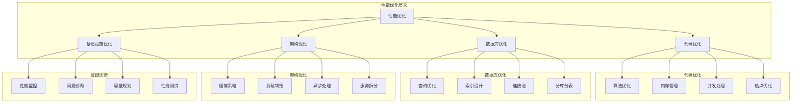

# 性能优化面试题

[← 返回后端面试题目录](./README.md)

## 📚 题目概览

性能优化是后端开发的核心技能，直接影响用户体验和系统成本。本章节重点考察候选人对性能优化方法论的深度理解，包括性能分析、代码优化、架构优化等核心技术，以及在不同场景下的实际优化能力。

## 🎯 核心技术考察重点

### 性能分析与诊断
- 性能指标的定义和测量方法
- 性能瓶颈的识别和分析技巧
- 性能监控工具的使用和数据解读
- 性能问题的根因分析方法

### 代码层面优化
- 算法和数据结构的优化策略
- 内存管理和垃圾回收优化
- 并发编程的性能考虑
- 代码热点的识别和优化

### 数据库性能优化
- SQL查询优化和执行计划分析
- 索引设计和优化策略
- 数据库连接池和事务优化
- 分库分表和读写分离

### 系统架构优化
- 缓存架构的设计和优化
- 负载均衡和水平扩展
- 微服务性能优化策略
- CDN和静态资源优化

## 📊 知识结构关联图

## 📝 核心面试题目

### 性能分析与诊断 🔍

#### 题目1：性能瓶颈识别与分析方法
**问题背景**：系统响应缓慢，需要快速定位性能瓶颈

**技术挑战**：
- 如何系统性地分析性能问题
- 如何选择合适的监控工具和指标
- 如何从海量监控数据中找到关键线索

**考察要点**：
- 性能分析的方法论和工具使用
- 监控指标的理解和数据解读能力
- 问题定位的逻辑思维和实践经验

**📁 完整解决方案**：[性能瓶颈分析完整实现](../../solutions/common/performance-bottleneck-analysis.md)

#### 题目2：APM系统设计与性能监控
**问题背景**：构建全链路性能监控系统

**技术挑战**：
- 设计分布式链路追踪机制
- 实现性能指标的实时收集和分析
- 建立智能化的性能告警体系

**考察要点**：
- APM系统的架构设计能力
- 性能监控的技术实现原理
- 大规模系统的可观测性设计

**📁 完整解决方案**：[APM监控系统完整实现](../../solutions/common/apm-monitoring-system.md)

### 代码层面优化 ⚡

#### 题目3：Java应用性能调优实战
**问题背景**：Java应用在高并发场景下性能不佳

**技术挑战**：
- JVM参数调优和垃圾回收优化
- 代码热点分析和算法优化
- 并发编程的性能优化策略

**考察要点**：
- JVM内存模型和垃圾回收机制
- Java性能调优的实践经验
- 并发编程的深度理解

**📁 完整解决方案**：[Java性能调优完整实现](../../solutions/common/java-performance-tuning.md)

#### 题目4：高性能算法设计与优化
**问题背景**：核心业务算法成为系统性能瓶颈

**技术挑战**：
- 算法复杂度分析和优化策略
- 数据结构的选择和优化
- 内存访问模式的优化

**考察要点**：
- 算法设计和分析能力
- 数据结构的深度理解
- 性能优化的思维方式

**📁 完整解决方案**：[高性能算法优化完整实现](../../solutions/common/high-performance-algorithm-optimization.md)

### 数据库性能优化 💾

#### 题目5：数据库查询优化与索引设计
**问题背景**：数据库查询响应缓慢，影响整体性能

**技术挑战**：
- SQL查询的优化策略和执行计划分析
- 索引的设计原则和优化技巧
- 大数据量场景下的查询优化

**考察要点**：
- SQL优化的深度理解
- 索引原理和设计能力
- 数据库性能调优经验

**📁 完整解决方案**：[数据库查询优化完整实现](../../solutions/common/database-query-optimization.md)

#### 题目6：分布式数据库性能优化
**问题背景**：分布式数据库架构的性能优化

**技术挑战**：
- 数据分片策略和负载均衡
- 跨库查询的性能优化
- 分布式事务的性能考虑

**考察要点**：
- 分布式数据库的架构理解
- 数据分片和路由策略
- 分布式系统的性能优化

**📁 完整解决方案**：[分布式数据库优化完整实现](../../solutions/common/distributed-database-optimization.md)

## 📊 面试评分标准

### 理论基础掌握 (25%)
- **优秀 (90-100分)**：深入理解性能优化原理，掌握系统性的优化方法论
- **良好 (80-89分)**：了解主要优化技术，具备基本的性能分析能力
- **一般 (70-79分)**：知道常见优化方法，但理解不够深入
- **不足 (60-69分)**：性能优化概念模糊，缺乏系统性认知

### 实践经验展示 (30%)
- **优秀 (90-100分)**：有丰富的性能优化实战经验，能分享具体案例和效果
- **良好 (80-89分)**：有一定优化实践，能结合项目讲解优化过程
- **一般 (70-79分)**：有基础的优化经验，但案例不够深入
- **不足 (60-69分)**：缺乏实际的性能优化项目经验

### 问题分析能力 (25%)
- **优秀 (90-100分)**：能够系统性分析性能问题，快速定位瓶颈
- **良好 (80-89分)**：具备基本的问题分析思路，能识别常见问题
- **一般 (70-79分)**：有一定分析能力，但方法不够系统
- **不足 (60-69分)**：问题分析能力薄弱，缺乏逻辑性

### 技术深度理解 (20%)
- **优秀 (90-100分)**：深入理解各层次优化技术的原理和实现
- **良好 (80-89分)**：掌握主要优化技术的基本原理
- **一般 (70-79分)**：了解常用优化技术，但原理理解有限
- **不足 (60-69分)**：技术理解浅显，缺乏深度认知

## 🎯 备考建议

### 理论基础强化
- 深入学习计算机系统的性能原理
- 掌握不同层次的性能优化方法
- 理解性能指标的定义和测量方法
- 学习性能分析的系统性方法论

### 实践技能提升
- 熟练使用各种性能分析工具
- 积累不同场景的优化实践经验
- 掌握主流技术栈的性能调优
- 了解大规模系统的性能挑战

### 案例分析能力
- 分析知名公司的性能优化案例
- 理解不同业务场景的性能需求
- 掌握性能问题的根因分析方法
- 培养系统性的性能思维

### 技术广度拓展
- 了解前端、后端、数据库的性能优化
- 掌握分布式系统的性能设计
- 学习云原生环境的性能优化
- 关注性能优化的新技术和趋势

## 🔗 相关资源链接

- [Java性能调优指南](https://docs.oracle.com/javase/8/docs/technotes/guides/vm/gctuning/)
- [MySQL性能优化手册](https://dev.mysql.com/doc/refman/8.0/en/optimization.html)
- [数据库设计与优化](./database-design.md)
- [监控调试技术](./monitoring-debugging.md)

---

*性能优化是一个系统性工程，需要从多个维度综合考虑，平衡性能、成本和复杂度* ⚡ 