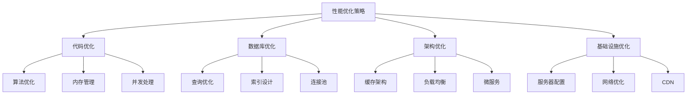
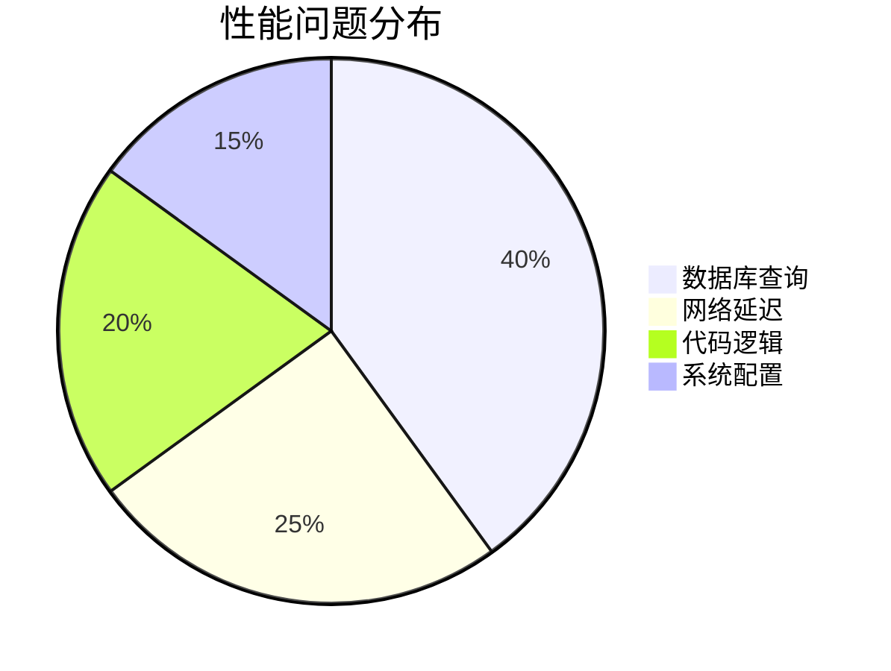
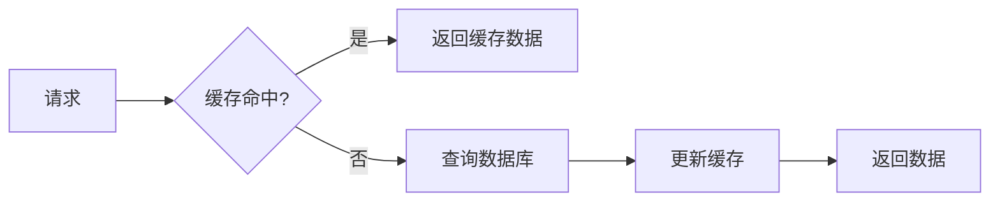
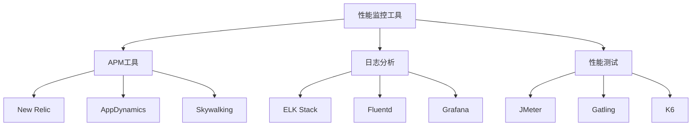

# 性能优化面试题

[← 返回后端面试题目录](./README.md)

## 🎯 核心知识点

- 性能分析方法
- 代码层面优化
- 数据库优化
- 架构优化
- 缓存策略
- 负载均衡
- 监控与诊断
- 性能测试

## 📊 性能优化金字塔



## 💡 面试题目

### **初级题目**

#### 1. 什么是性能优化？为什么重要？

**答案要点：**
- 性能优化的定义：提高系统响应速度、吞吐量、减少资源消耗
- 重要性：
  - 用户体验提升
  - 资源成本节省
  - 系统稳定性
  - 竞争优势

#### 2. 常见的性能指标有哪些？

**答案要点：**
- **响应时间**：用户发起请求到收到响应的时间
- **吞吐量**：单位时间内处理的请求数量
- **并发用户数**：同时访问系统的用户数
- **CPU使用率**：处理器利用率
- **内存使用率**：内存占用情况
- **I/O指标**：磁盘和网络I/O性能



#### 3. 如何识别性能瓶颈？

**答案要点：**
- 性能监控工具
- 日志分析
- APM(应用性能监控)
- 压力测试
- 性能分析器(Profiler)

### **中级题目**

#### 4. 数据库查询优化的常见方法有哪些？

**答案要点：**
- **索引优化**：
  - 创建合适的索引
  - 避免过多索引
  - 复合索引设计
  
- **查询优化**：
  - 避免SELECT *
  - 使用LIMIT分页
  - 优化JOIN操作
  
- **架构优化**：
  - 读写分离
  - 分库分表
  - 缓存策略

```sql
-- 优化前
SELECT * FROM users WHERE email LIKE '%@gmail.com' ORDER BY created_at;

-- 优化后
SELECT id, name, email FROM users 
WHERE email_domain = 'gmail.com' 
ORDER BY created_at 
LIMIT 20 OFFSET 0;

-- 添加索引
CREATE INDEX idx_email_domain_created ON users(email_domain, created_at);
```

#### 5. 缓存策略有哪些？如何选择？

**答案要点：**
- **缓存类型**：
  - 内存缓存 (Redis, Memcached)
  - 本地缓存 (HashMap, LRU)
  - 分布式缓存
  - CDN缓存
  
- **缓存策略**：
  - Cache-Aside
  - Write-Through
  - Write-Behind
  - Refresh-Ahead



#### 6. 如何优化Java应用的性能？

**答案要点：**
- **JVM优化**：
  - 垃圾回收器选择
  - 堆内存配置
  - JIT编译优化
  
- **代码优化**：
  - 避免对象过度创建
  - 使用合适的集合类
  - 优化循环和条件判断

```java
// 优化前 - 字符串拼接
String result = "";
for (int i = 0; i < 10000; i++) {
    result += "item" + i;
}

// 优化后 - 使用StringBuilder
StringBuilder sb = new StringBuilder();
for (int i = 0; i < 10000; i++) {
    sb.append("item").append(i);
}
String result = sb.toString();

// JVM参数优化
// -Xms2g -Xmx4g -XX:+UseG1GC -XX:MaxGCPauseMillis=200
```

### **高级题目**

#### 7. 微服务架构下如何进行性能优化？

**答案要点：**
- **服务间通信优化**：
  - gRPC vs REST
  - 连接池管理
  - 异步通信
  
- **服务治理**：
  - 熔断器模式
  - 限流策略
  - 超时设置
  
- **数据一致性**：
  - 事件驱动架构
  - SAGA模式
  - 最终一致性

```java
// Hystrix熔断器示例
@HystrixCommand(fallbackMethod = "getDefaultUser", 
    commandProperties = {
        @HystrixProperty(name = "execution.isolation.thread.timeoutInMilliseconds", value = "3000"),
        @HystrixProperty(name = "circuitBreaker.requestVolumeThreshold", value = "10"),
        @HystrixProperty(name = "circuitBreaker.errorThresholdPercentage", value = "50")
    })
public User getUserById(Long id) {
    return userService.findById(id);
}

public User getDefaultUser(Long id) {
    return new User(id, "Default User");
}
```

#### 8. 如何设计高性能的API？

**答案要点：**
- **API设计原则**：
  - RESTful设计
  - 分页处理
  - 字段过滤
  - 版本控制
  
- **性能优化**：
  - 响应压缩
  - HTTP缓存
  - 异步处理
  - 批量操作

```python
# FastAPI高性能API示例
from fastapi import FastAPI, BackgroundTasks, Query
from typing import Optional, List
import asyncio

app = FastAPI()

@app.get("/users")
async def get_users(
    page: int = Query(1, ge=1),
    size: int = Query(10, ge=1, le=100),
    fields: Optional[str] = None
):
    # 分页查询
    offset = (page - 1) * size
    users = await User.objects.offset(offset).limit(size)
    
    # 字段过滤
    if fields:
        selected_fields = fields.split(',')
        users = [{k: v for k, v in user.dict().items() if k in selected_fields} for user in users]
    
    return {"users": users, "page": page, "size": size}

@app.post("/users/batch")
async def create_users_batch(users: List[dict], background_tasks: BackgroundTasks):
    # 批量创建
    created_users = await User.bulk_create(users)
    
    # 异步后处理
    background_tasks.add_task(send_welcome_emails, created_users)
    
    return {"created": len(created_users)}
```

#### 9. 大数据场景下的性能优化策略？

**答案要点：**
- **数据处理优化**：
  - 分片(Sharding)
  - 分区(Partitioning)
  - 流式处理
  - 批处理优化
  
- **存储优化**：
  - 列式存储
  - 数据压缩
  - 分布式存储
  - 索引设计

```python
# Apache Spark性能优化示例
from pyspark.sql import SparkSession
from pyspark.sql.functions import col, count, sum

spark = SparkSession.builder \
    .appName("DataProcessingOptimization") \
    .config("spark.sql.adaptive.enabled", "true") \
    .config("spark.sql.adaptive.coalescePartitions.enabled", "true") \
    .getOrCreate()

# 读取数据时指定分区
df = spark.read.parquet("hdfs://data/transactions") \
    .filter(col("date") >= "2023-01-01") \
    .repartition(200, col("user_id"))

# 缓存频繁使用的数据
df_cached = df.cache()

# 优化聚合操作
result = df_cached.groupBy("user_id", "category") \
    .agg(count("*").alias("transaction_count"),
         sum("amount").alias("total_amount")) \
    .orderBy("total_amount", ascending=False)

result.write.mode("overwrite").parquet("hdfs://output/user_summary")
```

### **实战题目**

#### 10. 实现一个高性能的计数器服务

```java
@Service
public class HighPerformanceCounter {
    private final RedisTemplate<String, String> redisTemplate;
    private final AtomicLong localCounter = new AtomicLong(0);
    private final ScheduledExecutorService scheduler = Executors.newScheduledThreadPool(1);
    
    // 批量更新策略
    private final long BATCH_SIZE = 100;
    private final long FLUSH_INTERVAL = 5; // 秒
    
    @PostConstruct
    public void init() {
        // 定时批量同步到Redis
        scheduler.scheduleAtFixedRate(this::flushToRedis, 
            FLUSH_INTERVAL, FLUSH_INTERVAL, TimeUnit.SECONDS);
    }
    
    public void increment(String key) {
        // 本地计数器快速响应
        localCounter.incrementAndGet();
        
        // 异步批量更新
        if (localCounter.get() % BATCH_SIZE == 0) {
            CompletableFuture.runAsync(() -> flushToRedis());
        }
    }
    
    private void flushToRedis() {
        long count = localCounter.getAndSet(0);
        if (count > 0) {
            redisTemplate.opsForValue().increment("global_counter", count);
        }
    }
    
    public long getCount() {
        // 合并本地和远程计数
        long localCount = localCounter.get();
        String redisCount = redisTemplate.opsForValue().get("global_counter");
        return localCount + (redisCount != null ? Long.parseLong(redisCount) : 0);
    }
}
```

#### 11. 实现数据库连接池优化

```java
@Configuration
public class DatabaseOptimizationConfig {
    
    @Bean
    @Primary
    public DataSource primaryDataSource() {
        HikariConfig config = new HikariConfig();
        config.setJdbcUrl("jdbc:mysql://localhost:3306/mydb");
        config.setUsername("user");
        config.setPassword("password");
        
        // 连接池优化
        config.setMaximumPoolSize(20);
        config.setMinimumIdle(5);
        config.setConnectionTimeout(30000);
        config.setIdleTimeout(600000);
        config.setMaxLifetime(1800000);
        
        // SQL优化
        config.addDataSourceProperty("cachePrepStmts", "true");
        config.addDataSourceProperty("prepStmtCacheSize", "250");
        config.addDataSourceProperty("prepStmtCacheSqlLimit", "2048");
        config.addDataSourceProperty("useServerPrepStmts", "true");
        
        return new HikariDataSource(config);
    }
    
    @Bean
    public DataSource readOnlyDataSource() {
        // 读写分离配置
        HikariConfig config = new HikariConfig();
        config.setJdbcUrl("jdbc:mysql://readonly-host:3306/mydb");
        config.setReadOnly(true);
        config.setMaximumPoolSize(15);
        
        return new HikariDataSource(config);
    }
}

@Repository
public class OptimizedUserRepository {
    
    @Autowired
    @Qualifier("primaryDataSource")
    private JdbcTemplate writeTemplate;
    
    @Autowired
    @Qualifier("readOnlyDataSource")
    private JdbcTemplate readTemplate;
    
    // 批量插入优化
    public void batchInsertUsers(List<User> users) {
        String sql = "INSERT INTO users (name, email, created_at) VALUES (?, ?, ?)";
        
        readTemplate.batchUpdate(sql, new BatchPreparedStatementSetter() {
            @Override
            public void setValues(PreparedStatement ps, int i) throws SQLException {
                User user = users.get(i);
                ps.setString(1, user.getName());
                ps.setString(2, user.getEmail());
                ps.setTimestamp(3, Timestamp.valueOf(user.getCreatedAt()));
            }
            
            @Override
            public int getBatchSize() {
                return users.size();
            }
        });
    }
}
```

## 🔗 性能优化工具

### 监控工具对比



### 相关主题
- [缓存技术面试题](./caching.md)
- [数据库优化面试题](../database/README.md)
- [微服务架构面试题](./microservices.md)
- [系统设计面试题](../system-design/README.md)

## 📚 推荐资源

### 书籍推荐
- 《高性能MySQL》
- 《Java性能权威指南》
- 《性能之巅：洞悉系统、企业与云计算》

### 在线资源
- [Google Web Fundamentals](https://developers.google.com/web/fundamentals/performance)
- [High Scalability](http://highscalability.com/)

---

*性能优化是一个持续的过程，需要在设计、开发、部署的各个阶段都要考虑* 🚀 