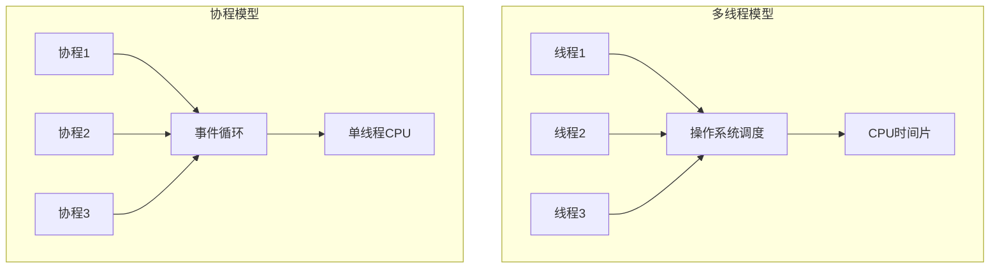

# Python 异步编程面试题

## 📋 目录
- [协程基础](#协程基础)
- [asyncio 核心组件](#asyncio-核心组件)
- [异步IO操作](#异步io操作)
- [并发控制](#并发控制)
- [性能优化](#性能优化)

## 🎯 核心知识点
- async/await 语法
- asyncio 事件循环
- 协程调度机制
- 异步上下文管理器
- 异步生成器和迭代器

## 📊 异步编程模型图

```mermaid
graph TD
    A[Python 异步编程] --> B[协程 Coroutines]
    A --> C[事件循环 Event Loop]
    A --> D[异步IO]
    
    B --> B1[async def]
    B --> B2[await 表达式]
    B --> B3[协程对象]
    
    C --> C1[asyncio.run()]
    C --> C2[loop.run_until_complete()]
    C --> C3[任务调度]
    
    D --> D1[aiohttp]
    D --> D2[aiofiles]
    D --> D3[asyncpg]
```

## 协程基础

### 💡 面试题目

#### 1. **[中级]** 解释协程的概念和与线程的区别

**协程 vs 线程对比：**



**基础协程示例：**

```python
import asyncio
import time

# 传统同步函数
def sync_task(name, duration):
    print(f"任务 {name} 开始")
    time.sleep(duration)  # 阻塞操作
    print(f"任务 {name} 完成")
    return f"结果 {name}"

# 协程函数
async def async_task(name, duration):
    print(f"任务 {name} 开始")
    await asyncio.sleep(duration)  # 非阻塞操作
    print(f"任务 {name} 完成")
    return f"结果 {name}"

# 性能对比测试
async def compare_performance():
    # 同步执行
    start = time.time()
    sync_task("A", 1)
    sync_task("B", 1)
    sync_task("C", 1)
    sync_time = time.time() - start
    print(f"同步执行时间: {sync_time:.2f}s")
    
    # 异步并发执行
    start = time.time()
    tasks = [
        async_task("A", 1),
        async_task("B", 1),
        async_task("C", 1)
    ]
    results = await asyncio.gather(*tasks)
    async_time = time.time() - start
    print(f"异步执行时间: {async_time:.2f}s")
    print(f"性能提升: {sync_time/async_time:.2f}x")

# 运行比较
asyncio.run(compare_performance())
```

#### 2. **[高级]** 详解 asyncio 事件循环的工作原理

**事件循环架构：**

```mermaid
sequenceDiagram
    participant App as 应用代码
    participant Loop as 事件循环
    participant Queue as 任务队列
    participant IO as IO选择器
    
    App->>Loop: 启动事件循环
    Loop->>Queue: 检查就绪任务
    Queue->>Loop: 返回可运行任务
    Loop->>App: 执行任务
    App->>Loop: await IO操作
    Loop->>IO: 注册IO事件
    IO->>Loop: IO就绪通知
    Loop->>App: 恢复任务执行
```

**自定义事件循环示例：**

```python
import asyncio
import time
from typing import List, Callable, Any

class SimpleEventLoop:
    """简化版事件循环实现"""
    
    def __init__(self):
        self.tasks: List[asyncio.Task] = []
        self.ready_queue: List[asyncio.Task] = []
        self.running = False
    
    def create_task(self, coro):
        """创建任务"""
        task = asyncio.Task(coro, loop=self)
        self.tasks.append(task)
        self.ready_queue.append(task)
        return task
    
    def run_until_complete(self, coro):
        """运行直到完成"""
        main_task = self.create_task(coro)
        self.running = True
        
        while self.running and not main_task.done():
            self._run_once()
        
        if main_task.done():
            return main_task.result()
    
    def _run_once(self):
        """运行一次循环"""
        # 处理就绪任务
        while self.ready_queue:
            task = self.ready_queue.pop(0)
            if not task.done():
                try:
                    # 执行任务直到下一个await
                    task._step()
                except StopIteration:
                    # 任务完成
                    task.set_result(None)
        
        # 检查是否还有未完成的任务
        if not any(not task.done() for task in self.tasks):
            self.running = False

# 使用自定义事件循环
async def example_coroutine():
    print("开始执行")
    await asyncio.sleep(0.1)
    print("执行完成")
    return "结果"

# 标准事件循环使用
loop = asyncio.new_event_loop()
asyncio.set_event_loop(loop)

# 事件循环调试
async def debug_event_loop():
    # 获取当前事件循环
    loop = asyncio.get_running_loop()
    
    # 监控事件循环状态
    print(f"事件循环: {loop}")
    print(f"是否运行中: {loop.is_running()}")
    
    # 设置调试模式
    loop.set_debug(True)
    
    # 创建任务
    task1 = loop.create_task(async_task("Task1", 1))
    task2 = loop.create_task(async_task("Task2", 2))
    
    # 等待任务完成
    results = await asyncio.gather(task1, task2)
    print(f"任务结果: {results}")
    
    # 检查未完成的任务
    pending_tasks = [task for task in asyncio.all_tasks() if not task.done()]
    print(f"未完成任务数: {len(pending_tasks)}")

asyncio.run(debug_event_loop())
```

## asyncio 核心组件

#### 3. **[中级]** asyncio.gather() vs asyncio.wait() vs asyncio.as_completed()

**不同并发控制方法对比：**

```python
import asyncio
import random
import time

async def fetch_data(url, delay):
    """模拟数据获取"""
    await asyncio.sleep(delay)
    if random.random() < 0.1:  # 10%概率失败
        raise Exception(f"Failed to fetch {url}")
    return f"Data from {url}"

async def demo_concurrent_methods():
    urls = [f"http://api{i}.com" for i in range(5)]
    delays = [random.uniform(0.5, 2.0) for _ in range(5)]
    
    # 1. asyncio.gather() - 等待所有任务完成
    print("=== asyncio.gather() ===")
    start = time.time()
    try:
        tasks = [fetch_data(url, delay) for url, delay in zip(urls, delays)]
        results = await asyncio.gather(*tasks, return_exceptions=True)
        for i, result in enumerate(results):
            if isinstance(result, Exception):
                print(f"任务 {i} 失败: {result}")
            else:
                print(f"任务 {i} 成功: {result}")
    except Exception as e:
        print(f"gather 异常: {e}")
    print(f"总耗时: {time.time() - start:.2f}s\n")
    
    # 2. asyncio.wait() - 更灵活的等待控制
    print("=== asyncio.wait() ===")
    start = time.time()
    tasks = [asyncio.create_task(fetch_data(url, delay)) 
             for url, delay in zip(urls, delays)]
    
    # 等待第一个完成
    done, pending = await asyncio.wait(
        tasks, return_when=asyncio.FIRST_COMPLETED
    )
    print(f"第一个完成的任务结果: {list(done)[0].result()}")
    
    # 取消剩余任务
    for task in pending:
        task.cancel()
    
    print(f"等待第一个完成耗时: {time.time() - start:.2f}s\n")
    
    # 3. asyncio.as_completed() - 按完成顺序处理
    print("=== asyncio.as_completed() ===")
    start = time.time()
    tasks = [fetch_data(url, delay) for url, delay in zip(urls, delays)]
    
    for i, coro in enumerate(asyncio.as_completed(tasks)):
        try:
            result = await coro
            print(f"第 {i+1} 个完成: {result}")
        except Exception as e:
            print(f"第 {i+1} 个失败: {e}")
    
    print(f"按完成顺序处理耗时: {time.time() - start:.2f}s\n")

# 高级并发控制
async def advanced_concurrency_control():
    """高级并发控制示例"""
    
    # 信号量限制并发数
    semaphore = asyncio.Semaphore(3)  # 最多3个并发
    
    async def limited_fetch(url, delay):
        async with semaphore:
            return await fetch_data(url, delay)
    
    # 超时控制
    async def fetch_with_timeout(url, delay, timeout=1.0):
        try:
            return await asyncio.wait_for(
                fetch_data(url, delay), timeout=timeout
            )
        except asyncio.TimeoutError:
            return f"Timeout for {url}"
    
    # 重试机制
    async def fetch_with_retry(url, delay, max_retries=3):
        for attempt in range(max_retries):
            try:
                return await fetch_data(url, delay)
            except Exception as e:
                if attempt == max_retries - 1:
                    raise e
                await asyncio.sleep(0.5 * (attempt + 1))  # 指数退避
    
    # 测试各种控制机制
    urls = [f"http://api{i}.com" for i in range(10)]
    delays = [random.uniform(0.1, 2.0) for _ in range(10)]
    
    # 限制并发数
    print("=== 限制并发数 ===")
    start = time.time()
    tasks = [limited_fetch(url, delay) for url, delay in zip(urls, delays)]
    results = await asyncio.gather(*tasks, return_exceptions=True)
    print(f"限制并发耗时: {time.time() - start:.2f}s")
    
    # 超时控制
    print("\n=== 超时控制 ===")
    start = time.time()
    tasks = [fetch_with_timeout(url, delay) for url, delay in zip(urls, delays)]
    results = await asyncio.gather(*tasks)
    print(f"超时控制耗时: {time.time() - start:.2f}s")

asyncio.run(demo_concurrent_methods())
asyncio.run(advanced_concurrency_control())
```

## 异步IO操作

#### 4. **[高级]** 实现异步HTTP客户端和服务器

**异步HTTP客户端实现：**

```python
import asyncio
import aiohttp
import aiofiles
import json
from typing import Dict, List, Optional

class AsyncHTTPClient:
    """异步HTTP客户端"""
    
    def __init__(self, timeout: int = 30, max_connections: int = 100):
        self.timeout = aiohttp.ClientTimeout(total=timeout)
        self.connector = aiohttp.TCPConnector(limit=max_connections)
        self.session: Optional[aiohttp.ClientSession] = None
    
    async def __aenter__(self):
        self.session = aiohttp.ClientSession(
            timeout=self.timeout,
            connector=self.connector
        )
        return self
    
    async def __aexit__(self, exc_type, exc_val, exc_tb):
        if self.session:
            await self.session.close()
    
    async def get(self, url: str, **kwargs) -> Dict:
        """GET请求"""
        async with self.session.get(url, **kwargs) as response:
            return {
                'status': response.status,
                'headers': dict(response.headers),
                'data': await response.text()
            }
    
    async def post(self, url: str, data=None, json_data=None, **kwargs) -> Dict:
        """POST请求"""
        async with self.session.post(
            url, data=data, json=json_data, **kwargs
        ) as response:
            return {
                'status': response.status,
                'headers': dict(response.headers),
                'data': await response.text()
            }
    
    async def batch_requests(self, requests: List[Dict]) -> List[Dict]:
        """批量请求"""
        semaphore = asyncio.Semaphore(10)  # 限制并发
        
        async def make_request(req_config):
            async with semaphore:
                method = req_config.get('method', 'GET').upper()
                url = req_config['url']
                
                try:
                    if method == 'GET':
                        return await self.get(url, **req_config.get('params', {}))
                    elif method == 'POST':
                        return await self.post(
                            url, 
                            data=req_config.get('data'),
                            json_data=req_config.get('json')
                        )
                except Exception as e:
                    return {'error': str(e), 'url': url}
        
        tasks = [make_request(req) for req in requests]
        return await asyncio.gather(*tasks, return_exceptions=True)

# 异步HTTP服务器实现
from aiohttp import web, WSMsgType
import weakref

class AsyncHTTPServer:
    """异步HTTP服务器"""
    
    def __init__(self):
        self.app = web.Application()
        self.websocket_connections = weakref.WeakSet()
        self.setup_routes()
    
    def setup_routes(self):
        """设置路由"""
        self.app.router.add_get('/', self.index)
        self.app.router.add_get('/api/status', self.status)
        self.app.router.add_post('/api/data', self.handle_data)
        self.app.router.add_get('/ws', self.websocket_handler)
        self.app.router.add_static('/static', 'static')
    
    async def index(self, request):
        """首页"""
        return web.Response(text="异步HTTP服务器运行中", content_type='text/plain')
    
    async def status(self, request):
        """状态接口"""
        return web.json_response({
            'status': 'running',
            'connections': len(self.websocket_connections),
            'memory_usage': self.get_memory_usage()
        })
    
    async def handle_data(self, request):
        """处理POST数据"""
        try:
            data = await request.json()
            # 模拟异步处理
            await asyncio.sleep(0.1)
            
            # 处理数据
            result = {
                'received': data,
                'processed_at': asyncio.get_event_loop().time(),
                'status': 'success'
            }
            
            # 通知WebSocket客户端
            await self.broadcast_to_websockets(result)
            
            return web.json_response(result)
        
        except Exception as e:
            return web.json_response(
                {'error': str(e)}, 
                status=400
            )
    
    async def websocket_handler(self, request):
        """WebSocket处理器"""
        ws = web.WebSocketResponse()
        await ws.prepare(request)
        
        self.websocket_connections.add(ws)
        
        try:
            async for msg in ws:
                if msg.type == WSMsgType.TEXT:
                    data = json.loads(msg.data)
                    response = {'echo': data, 'timestamp': asyncio.get_event_loop().time()}
                    await ws.send_text(json.dumps(response))
                elif msg.type == WSMsgType.ERROR:
                    print(f'WebSocket错误: {ws.exception()}')
        
        except Exception as e:
            print(f'WebSocket异常: {e}')
        
        finally:
            self.websocket_connections.discard(ws)
        
        return ws
    
    async def broadcast_to_websockets(self, message):
        """向所有WebSocket连接广播消息"""
        if not self.websocket_connections:
            return
        
        message_text = json.dumps(message)
        for ws in list(self.websocket_connections):
            try:
                await ws.send_text(message_text)
            except Exception:
                self.websocket_connections.discard(ws)
    
    def get_memory_usage(self):
        """获取内存使用情况"""
        import psutil
        process = psutil.Process()
        return process.memory_info().rss / 1024 / 1024  # MB
    
    def run(self, host='localhost', port=8080):
        """运行服务器"""
        web.run_app(self.app, host=host, port=port)

# 使用示例
async def client_example():
    """客户端使用示例"""
    async with AsyncHTTPClient() as client:
        # 单个请求
        response = await client.get('https://httpbin.org/get')
        print(f"GET响应: {response['status']}")
        
        # 批量请求
        requests = [
            {'url': 'https://httpbin.org/get', 'method': 'GET'},
            {'url': 'https://httpbin.org/post', 'method': 'POST', 'json': {'key': 'value'}},
            {'url': 'https://httpbin.org/delay/2', 'method': 'GET'},
        ]
        
        results = await client.batch_requests(requests)
        for i, result in enumerate(results):
            if 'error' in result:
                print(f"请求 {i} 失败: {result['error']}")
            else:
                print(f"请求 {i} 成功: {result['status']}")

# 运行示例
if __name__ == '__main__':
    # 启动客户端测试
    # asyncio.run(client_example())
    
    # 启动服务器
    server = AsyncHTTPServer()
    server.run()
```

## 并发控制

#### 5. **[高级]** 实现异步任务队列和限流器

**异步任务队列实现：**

```python
import asyncio
import time
from enum import Enum
from dataclasses import dataclass
from typing import Any, Callable, Optional, Dict
import heapq
import logging

class TaskStatus(Enum):
    PENDING = "pending"
    RUNNING = "running"
    COMPLETED = "completed"
    FAILED = "failed"
    CANCELLED = "cancelled"

@dataclass
class TaskResult:
    task_id: str
    status: TaskStatus
    result: Any = None
    error: Optional[Exception] = None
    start_time: Optional[float] = None
    end_time: Optional[float] = None
    
    @property
    def duration(self) -> Optional[float]:
        if self.start_time and self.end_time:
            return self.end_time - self.start_time
        return None

class AsyncTaskQueue:
    """异步任务队列"""
    
    def __init__(self, max_workers: int = 10, max_queue_size: int = 1000):
        self.max_workers = max_workers
        self.max_queue_size = max_queue_size
        self.queue = asyncio.Queue(maxsize=max_queue_size)
        self.results: Dict[str, TaskResult] = {}
        self.workers = []
        self.running = False
        self.stats = {
            'total_tasks': 0,
            'completed_tasks': 0,
            'failed_tasks': 0,
            'active_workers': 0
        }
    
    async def start(self):
        """启动任务队列"""
        self.running = True
        self.workers = [
            asyncio.create_task(self._worker(f"worker-{i}"))
            for i in range(self.max_workers)
        ]
        logging.info(f"任务队列启动，{self.max_workers}个工作者")
    
    async def stop(self):
        """停止任务队列"""
        self.running = False
        
        # 等待所有任务完成
        await self.queue.join()
        
        # 取消所有工作者
        for worker in self.workers:
            worker.cancel()
        
        # 等待工作者退出
        await asyncio.gather(*self.workers, return_exceptions=True)
        logging.info("任务队列已停止")
    
    async def submit(self, task_id: str, coro_func: Callable, *args, **kwargs) -> str:
        """提交任务"""
        if not self.running:
            raise RuntimeError("任务队列未启动")
        
        task_data = {
            'task_id': task_id,
            'coro_func': coro_func,
            'args': args,
            'kwargs': kwargs,
            'submit_time': time.time()
        }
        
        # 初始化任务结果
        self.results[task_id] = TaskResult(task_id, TaskStatus.PENDING)
        
        await self.queue.put(task_data)
        self.stats['total_tasks'] += 1
        
        return task_id
    
    async def get_result(self, task_id: str, timeout: Optional[float] = None) -> TaskResult:
        """获取任务结果（阻塞等待）"""
        start_time = time.time()
        
        while True:
            if task_id in self.results:
                result = self.results[task_id]
                if result.status in [TaskStatus.COMPLETED, TaskStatus.FAILED, TaskStatus.CANCELLED]:
                    return result
            
            if timeout and (time.time() - start_time) > timeout:
                raise asyncio.TimeoutError(f"等待任务 {task_id} 超时")
            
            await asyncio.sleep(0.1)
    
    def get_result_nowait(self, task_id: str) -> Optional[TaskResult]:
        """获取任务结果（非阻塞）"""
        return self.results.get(task_id)
    
    async def _worker(self, worker_name: str):
        """工作者协程"""
        logging.info(f"工作者 {worker_name} 启动")
        
        while self.running:
            try:
                # 获取任务
                task_data = await asyncio.wait_for(
                    self.queue.get(), timeout=1.0
                )
                
                task_id = task_data['task_id']
                result = self.results[task_id]
                
                # 更新状态
                result.status = TaskStatus.RUNNING
                result.start_time = time.time()
                self.stats['active_workers'] += 1
                
                try:
                    # 执行任务
                    coro = task_data['coro_func'](*task_data['args'], **task_data['kwargs'])
                    task_result = await coro
                    
                    # 任务成功
                    result.result = task_result
                    result.status = TaskStatus.COMPLETED
                    self.stats['completed_tasks'] += 1
                    
                except Exception as e:
                    # 任务失败
                    result.error = e
                    result.status = TaskStatus.FAILED
                    self.stats['failed_tasks'] += 1
                    logging.error(f"任务 {task_id} 失败: {e}")
                
                finally:
                    result.end_time = time.time()
                    self.stats['active_workers'] -= 1
                    self.queue.task_done()
                    
                    logging.info(
                        f"任务 {task_id} 完成，耗时 {result.duration:.2f}s"
                    )
            
            except asyncio.TimeoutError:
                # 等待任务超时，继续循环
                continue
            except Exception as e:
                logging.error(f"工作者 {worker_name} 错误: {e}")
        
        logging.info(f"工作者 {worker_name} 退出")

# 限流器实现
class RateLimiter:
    """异步限流器"""
    
    def __init__(self, rate: int, per: float = 1.0):
        """
        :param rate: 允许的请求数量
        :param per: 时间窗口（秒）
        """
        self.rate = rate
        self.per = per
        self.allowance = rate
        self.last_check = time.time()
        self.lock = asyncio.Lock()
    
    async def acquire(self, permits: int = 1) -> bool:
        """获取许可"""
        async with self.lock:
            current = time.time()
            time_passed = current - self.last_check
            self.last_check = current
            
            # 补充令牌
            self.allowance += time_passed * (self.rate / self.per)
            if self.allowance > self.rate:
                self.allowance = self.rate
            
            # 检查是否有足够的令牌
            if self.allowance >= permits:
                self.allowance -= permits
                return True
            
            return False
    
    async def wait_for_permit(self, permits: int = 1):
        """等待获取许可"""
        while not await self.acquire(permits):
            await asyncio.sleep(0.01)

# 使用示例
async def example_task(task_id: str, duration: float):
    """示例任务"""
    await asyncio.sleep(duration)
    return f"任务 {task_id} 完成，耗时 {duration}s"

async def queue_example():
    """任务队列使用示例"""
    # 创建任务队列
    queue = AsyncTaskQueue(max_workers=3)
    await queue.start()
    
    try:
        # 提交任务
        task_ids = []
        for i in range(10):
            task_id = f"task-{i}"
            await queue.submit(task_id, example_task, task_id, 1.0)
            task_ids.append(task_id)
        
        # 等待所有任务完成
        results = []
        for task_id in task_ids:
            result = await queue.get_result(task_id, timeout=5.0)
            results.append(result)
            print(f"任务 {task_id}: {result.status.value}, 结果: {result.result}")
        
        # 打印统计信息
        print(f"统计信息: {queue.stats}")
        
    finally:
        await queue.stop()

async def rate_limiter_example():
    """限流器使用示例"""
    limiter = RateLimiter(rate=5, per=1.0)  # 每秒5个请求
    
    async def limited_request(request_id):
        await limiter.wait_for_permit()
        print(f"请求 {request_id} 在 {time.time():.2f} 执行")
        return f"结果 {request_id}"
    
    # 发送10个请求
    tasks = [limited_request(i) for i in range(10)]
    start_time = time.time()
    results = await asyncio.gather(*tasks)
    duration = time.time() - start_time
    
    print(f"10个请求完成，总耗时: {duration:.2f}s")
    print(f"平均RPS: {10/duration:.2f}")

# 运行示例
if __name__ == '__main__':
    logging.basicConfig(level=logging.INFO)
    asyncio.run(queue_example())
    asyncio.run(rate_limiter_example())
```

## 🔗 相关链接

- [← 返回后端面试题](./README.md)
- [Python 基础面试题](./python-basics.md)
- [Python Web 框架](./python-web-frameworks.md)
- [性能优化面试题](./performance-optimization.md)

---

*掌握Python异步编程，构建高性能的并发应用* ⚡ 