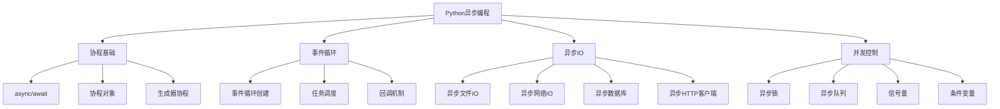

# Python异步编程面试题

[← 返回后端面试题目录](./README.md)

## 📚 题目概览

Python异步编程面试题涵盖协程机制、asyncio事件循环、异步IO操作、并发控制等核心技术点。重点考察候选人对Python异步编程模型的深入理解、性能优化能力，以及在高并发场景下的实际应用经验。

## 🎯 核心技术考察重点

### 协程与事件循环
- **async/await语法**：协程函数的定义和调用机制
- **事件循环原理**：asyncio事件循环的工作机制
- **协程调度**：协程的创建、暂停、恢复和销毁
- **任务管理**：Task对象的生命周期管理

### 异步IO操作
- **文件IO异步化**：aiofiles等异步文件操作
- **网络IO优化**：aiohttp、asyncio网络编程
- **数据库异步访问**：asyncpg、aiomysql等异步数据库驱动
- **缓存异步操作**：aioredis等异步缓存客户端

### 并发控制与同步
- **异步锁机制**：asyncio.Lock、Semaphore的使用
- **队列操作**：asyncio.Queue的生产者消费者模式
- **并发限制**：控制并发数量和资源使用
- **异常处理**：异步代码中的错误处理策略

### 性能优化技巧
- **协程池管理**：合理控制协程数量
- **内存管理**：避免内存泄漏和过度消耗
- **CPU密集型任务**：结合多进程处理CPU密集型任务
- **性能监控**：异步应用的性能分析和调优

## 📊 知识结构关联图

## 📝 核心面试题目

### 协程基础 ⭐⭐

#### 题目1：协程与线程的区别和适用场景
**问题背景**：Python中协程和线程在并发处理上有什么本质区别？

**技术挑战**：
- 协程的轻量级特性和调度机制
- GIL对线程和协程的不同影响
- IO密集型vs CPU密集型任务的选择

**考察要点**：
- 理解协程的单线程并发模型
- 掌握协程相比线程的优势和局限
- 能够根据场景选择合适的并发方案

**📁 完整解决方案**：[Python协程机制完整实现](../../solutions/common/python-coroutine-mechanism.md)

#### 题目2：async/await语法和协程生命周期
**问题背景**：async/await是如何实现异步编程的语法糖的？

**技术挑战**：
- 协程函数vs普通函数的区别
- await表达式的执行机制
- 协程的创建、执行和清理过程

**考察要点**：
- 深入理解async/await的工作原理
- 掌握协程对象的生命周期管理
- 理解协程的暂停和恢复机制

**📁 完整解决方案**：[async/await语法解析完整实现](../../solutions/common/async-await-syntax.md)

### 事件循环机制 ⭐⭐⭐

#### 题目3：asyncio事件循环的工作原理
**问题背景**：事件循环是如何实现单线程并发的？

**技术挑战**：
- 事件循环的内部结构和调度算法
- 任务队列和就绪队列的管理
- IO多路复用的集成机制

**考察要点**：
- 深入理解事件循环的架构设计
- 掌握任务调度的优先级机制
- 理解IO事件的处理流程

**📁 完整解决方案**：[asyncio事件循环完整实现](../../solutions/common/asyncio-event-loop.md)

#### 题目4：自定义事件循环和任务调度
**问题背景**：如何实现自定义的事件循环和任务调度器？

**技术挑战**：
- 事件循环的核心接口实现
- 任务的创建、调度和执行
- 异常处理和资源清理

**考察要点**：
- 理解事件循环的底层实现原理
- 能够设计自定义的调度策略
- 掌握异步编程的核心概念

**📁 完整解决方案**：[自定义事件循环完整实现](../../solutions/common/custom-event-loop.md)

### 异步IO操作 ⭐⭐⭐

#### 题目5：高性能异步网络编程
**问题背景**：如何使用asyncio构建高性能的网络服务？

**技术挑战**：
- 异步TCP/UDP服务器的实现
- 连接池和资源管理
- 请求处理的并发控制

**考察要点**：
- 掌握asyncio网络编程的最佳实践
- 理解异步IO的性能优势
- 能够处理大量并发连接

**📁 完整解决方案**：[异步网络编程完整实现](../../solutions/common/async-network-programming.md)

#### 题目6：异步数据库操作和连接池管理
**问题背景**：如何在异步应用中高效地访问数据库？

**技术挑战**：
- 异步数据库驱动的使用
- 连接池的设计和管理
- 事务处理和错误恢复

**考察要点**：
- 掌握异步数据库编程的技巧
- 理解连接池的重要性和实现
- 能够处理数据库相关的异常情况

**📁 完整解决方案**：[异步数据库操作完整实现](../../solutions/common/async-database-operations.md)

## 📊 面试评分标准

### 基础理解 (30分)
- **协程概念掌握** (10分)：async/await语法、协程生命周期
- **事件循环理解** (10分)：事件循环的基本工作原理
- **异步IO认知** (10分)：异步IO的优势和适用场景

### 深度分析 (40分)
- **性能优化能力** (15分)：异步编程的性能调优技巧
- **并发控制能力** (15分)：异步锁、队列等并发控制机制
- **架构设计能力** (10分)：异步应用的架构设计思路

### 实践应用 (30分)
- **问题解决能力** (15分)：能够解决异步编程中的实际问题
- **代码质量** (10分)：异步代码的组织和错误处理
- **生产经验** (5分)：在生产环境中使用异步编程的经验

## 🎯 备考建议

### 基础巩固路径
1. **协程基础**：深入理解async/await语法和协程机制
2. **事件循环**：掌握asyncio事件循环的工作原理
3. **异步库使用**：熟悉常用的异步库和工具
4. **性能分析**：学习异步应用的性能分析方法

### 进阶学习重点
1. **源码阅读**：阅读asyncio源码理解底层实现
2. **性能优化**：学习异步编程的性能优化技巧
3. **并发模式**：掌握常见的异步并发设计模式
4. **错误处理**：学习异步代码的异常处理策略

### 实战项目建议
1. **异步Web服务**：使用FastAPI或aiohttp构建异步Web服务
2. **异步爬虫**：开发高并发的异步网络爬虫
3. **异步消息处理**：构建异步消息队列处理系统
4. **实时数据处理**：开发实时数据流处理系统

## 🔗 相关资源链接

- [Python asyncio官方文档](https://docs.python.org/3/library/asyncio.html)
- [aiohttp文档](https://docs.aiohttp.org/)
- [FastAPI文档](https://fastapi.tiangolo.com/)
- [异步编程最佳实践](https://docs.python.org/3/library/asyncio-dev.html)
- [Python并发编程指南](https://realpython.com/async-io-python/)

[← 返回后端面试题目录](./README.md) 