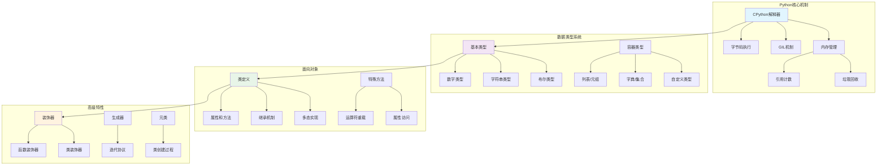

# Python基础面试题

[← 返回后端面试题目录](./README.md)

## 📚 题目概览

Python作为一门简洁优雅的编程语言，以其易读性和强大的生态系统广受欢迎。本章节重点考察候选人对Python核心特性的理解，包括语言机制、数据结构、面向对象编程等基础知识，以及在实际开发中的应用能力。

## 🎯 核心技术考察重点

### 语言特性与内存管理
- GIL（全局解释器锁）的工作原理和影响
- 内存管理机制和垃圾回收策略
- 变量作用域和命名空间机制
- Python解释器的执行模型

### 数据类型与数据结构
- 可变类型与不可变类型的区别
- 列表、字典、集合的内部实现
- 字符串处理和编码机制
- 数据结构的性能特点和选择策略

### 面向对象编程
- 类的定义和实例化机制
- 继承、多态和封装的实现
- 特殊方法（魔法方法）的使用
- 属性访问控制和描述符

### 高级特性与设计模式
- 装饰器的实现原理和应用场景
- 生成器和迭代器的设计模式
- 上下文管理器的实现和使用
- 元类编程和动态类创建

## 📊 知识结构关联图

## 📝 核心面试题目

### 语言机制与性能 🔧

#### 题目1：GIL机制深度解析与多线程优化
**问题背景**：理解Python GIL对多线程性能的影响和优化策略

**技术挑战**：
- GIL的工作原理和释放时机
- CPU密集型与I/O密集型任务的不同表现
- 多线程、多进程、异步编程的选择策略
- 性能测试和瓶颈分析方法

**考察要点**：
- 深度理解GIL的实现机制和设计原因
- 能够分析不同并发模型的适用场景
- 掌握Python并发编程的最佳实践
- 具备性能优化的实战经验

**📁 完整解决方案**：[Python GIL机制与并发优化](../../solutions/common/python-gil-concurrency.md)

#### 题目2：内存管理与垃圾回收机制
**问题背景**：深入理解Python内存管理和性能优化策略

**技术挑战**：
- 引用计数和循环引用的处理
- 分代垃圾回收算法的实现
- 内存泄漏的识别和预防
- 大对象和内存池的管理策略

**考察要点**：
- Python内存管理的底层机制
- 垃圾回收的触发条件和优化策略
- 内存泄漏的常见原因和解决方案
- 内存性能监控和调优方法

**📁 完整解决方案**：[Python内存管理详解](../../solutions/common/python-memory-management.md)

### 数据结构与算法 📊

#### 题目3：高性能数据结构实现
**问题背景**：实现高效的缓存和数据结构算法

**技术挑战**：
- LRU缓存的O(1)时间复杂度实现
- 哈希表冲突处理和性能优化
- 自定义数据结构的设计和实现
- 大数据场景下的内存效率优化

**考察要点**：
- 数据结构的时间空间复杂度分析
- Python内置数据结构的实现原理
- 算法设计和性能优化思路
- 实际应用场景的技术选型

**📁 完整解决方案**：[Python数据结构实现](../../solutions/common/python-data-structures.md)

### 面向对象编程 🏗️

#### 题目4：高级面向对象设计模式
**问题背景**：设计灵活可扩展的面向对象架构

**技术挑战**：
- 多重继承和MRO（方法解析顺序）
- 抽象基类和接口设计
- 设计模式的Python实现
- 元类编程和动态类创建

**考察要点**：
- 面向对象设计原则的应用
- Python特有的面向对象特性
- 设计模式的实际应用场景
- 代码的可维护性和可扩展性

**📁 完整解决方案**：[Python面向对象高级特性](../../solutions/common/python-oop-advanced.md)

### 高级特性与设计模式 ⚡

#### 题目5：装饰器模式深度应用
**问题背景**：实现复杂的装饰器系统和中间件架构

**技术挑战**：
- 带参数装饰器的实现机制
- 类装饰器和函数装饰器的区别
- 装饰器链的执行顺序和性能
- 装饰器在框架中的应用模式

**考察要点**：
- 装饰器的实现原理和闭包机制
- 不同类型装饰器的使用场景
- 装饰器的性能影响和优化策略
- 在实际项目中的应用经验

**📁 完整解决方案**：[Python装饰器系统实现](../../solutions/common/python-decorators.md)

#### 题目6：生成器与迭代器优化
**问题背景**：实现高效的数据流处理和内存优化

**技术挑战**：
- 生成器的内存效率和性能特点
- 自定义迭代器的实现和优化
- 异步生成器的使用场景
- 大数据处理的流式计算

**考察要点**：
- 迭代协议的深度理解
- 生成器在内存优化中的作用
- 惰性计算的设计模式
- 数据流处理的最佳实践

**📁 完整解决方案**：[Python生成器与迭代器](../../solutions/common/python-generators.md)

## 📊 面试评分标准

### 基础理解 (30分)
- **语言特性**：深入理解Python的核心机制和设计哲学
- **数据结构**：熟练掌握内置数据结构的特点和使用场景
- **语法掌握**：能够编写符合Python规范的高质量代码

### 实践应用 (40分)
- **问题解决**：能够分析复杂问题并设计有效的解决方案
- **性能优化**：具备代码性能分析和优化的实战能力
- **架构设计**：能够设计可维护、可扩展的Python应用架构

### 深度理解 (30分)
- **原理洞察**：深入理解Python解释器和运行时机制
- **最佳实践**：掌握Python开发的最佳实践和设计模式
- **生态系统**：了解Python生态系统和第三方库的使用

## 🎯 备考建议

### 学习路径
1. **基础巩固**：深入理解Python语言特性和核心机制
2. **数据结构**：掌握常用数据结构和算法的Python实现
3. **面向对象**：学习Python的面向对象编程和设计模式
4. **高级特性**：掌握装饰器、生成器、元类等高级特性
5. **性能优化**：学习性能分析和优化技巧

### 技术重点
- **GIL机制**：理解全局解释器锁的影响和优化策略
- **内存管理**：掌握Python的内存管理和垃圾回收机制
- **并发编程**：了解多线程、多进程、异步编程的选择
- **数据结构**：熟练使用和实现各种数据结构
- **设计模式**：掌握常用设计模式的Python实现

### 实践项目建议
- 实现高性能缓存系统
- 开发数据处理工具
- 构建Web应用框架
- 创建自动化测试框架
- 设计API服务系统

## 🔗 相关资源链接

- [Python异步编程面试题](./python-async.md)
- [Python Web框架面试题](./python-web-frameworks.md)
- [数据结构与算法面试题](../algorithms/README.md)
- [面向对象设计面试题](../system-design/README.md)
- [← 返回后端面试题目录](./README.md)

---

*掌握Python核心技术，构建高效优雅的应用程序* 🐍 