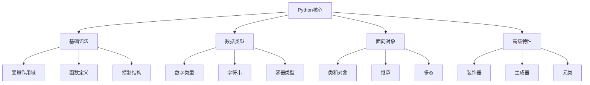

# Python 基础面试题

## 🏷️ 标签
- 技术栈: Python, 基础语法, 数据结构
- 难度: 初级到中级
- 类型: 概念题, 编程题, 原理题

## 💡 核心知识点
- Python 语言特性和内存管理
- 数据类型和数据结构
- 函数式编程和面向对象
- 装饰器和元类
- 异常处理和性能优化

## 📊 Python 技术体系



## 📝 面试题目

### 1. Python 语言特性

#### **【中级】** Python 的 GIL 是什么？对多线程有什么影响？

**💡 考察要点:**
- GIL 的工作原理
- 多线程性能影响
- 解决方案

**📝 参考答案:**

**GIL (Global Interpreter Lock) 详解:**

```python
import threading
import time
from concurrent.futures import ThreadPoolExecutor, ProcessPoolExecutor

# 1. GIL 对CPU密集型任务的影响
def cpu_intensive_task(n):
    """CPU密集型任务"""
    start = time.time()
    total = 0
    for i in range(n):
        total += i * i
    end = time.time()
    return f"结果: {total}, 耗时: {end - start:.2f}秒"

# 单线程执行
def single_thread_test():
    start = time.time()
    results = [cpu_intensive_task(1000000) for _ in range(4)]
    end = time.time()
    print(f"单线程总耗时: {end - start:.2f}秒")

# 多线程执行 (受GIL限制)
def multi_thread_test():
    start = time.time()
    with ThreadPoolExecutor(max_workers=4) as executor:
        futures = [executor.submit(cpu_intensive_task, 1000000) for _ in range(4)]
        results = [future.result() for future in futures]
    end = time.time()
    print(f"多线程总耗时: {end - start:.2f}秒")

# 多进程执行 (绕过GIL)
def multi_process_test():
    start = time.time()
    with ProcessPoolExecutor(max_workers=4) as executor:
        futures = [executor.submit(cpu_intensive_task, 1000000) for _ in range(4)]
        results = [future.result() for future in futures]
    end = time.time()
    print(f"多进程总耗时: {end - start:.2f}秒")

# 2. GIL 对IO密集型任务影响较小
import requests

def io_intensive_task(url):
    """IO密集型任务"""
    start = time.time()
    response = requests.get(url)
    end = time.time()
    return f"状态: {response.status_code}, 耗时: {end - start:.2f}秒"

def io_multithread_test():
    urls = ["http://httpbin.org/delay/1"] * 4
    
    # 多线程IO测试
    start = time.time()
    with ThreadPoolExecutor(max_workers=4) as executor:
        futures = [executor.submit(io_intensive_task, url) for url in urls]
        results = [future.result() for future in futures]
    end = time.time()
    print(f"IO多线程总耗时: {end - start:.2f}秒")

# GIL解决方案
print("=== GIL影响测试 ===")
print("CPU密集型任务:")
single_thread_test()
multi_thread_test()
multi_process_test()

print("\nIO密集型任务:")
io_multithread_test()
```

---

### 2. 数据结构和算法

#### **【中级】** 实现一个 LRU 缓存，要求 O(1) 时间复杂度

**💡 考察要点:**
- 数据结构设计
- 时间复杂度优化
- Python 实现技巧

```python
from collections import OrderedDict
from typing import Optional

class LRUCache:
    """LRU缓存实现 - 使用OrderedDict"""
    
    def __init__(self, capacity: int):
        self.capacity = capacity
        self.cache = OrderedDict()
    
    def get(self, key: int) -> int:
        if key in self.cache:
            # 移动到末尾 (最近使用)
            self.cache.move_to_end(key)
            return self.cache[key]
        return -1
    
    def put(self, key: int, value: int) -> None:
        if key in self.cache:
            # 更新值并移动到末尾
            self.cache[key] = value
            self.cache.move_to_end(key)
        else:
            # 新增键值对
            if len(self.cache) >= self.capacity:
                # 删除最久未使用的 (第一个)
                self.cache.popitem(last=False)
            self.cache[key] = value

# 手动实现双向链表版本
class Node:
    def __init__(self, key: int = 0, value: int = 0):
        self.key = key
        self.value = value
        self.prev: Optional[Node] = None
        self.next: Optional[Node] = None

class LRUCacheManual:
    """LRU缓存 - 手动实现双向链表"""
    
    def __init__(self, capacity: int):
        self.capacity = capacity
        self.cache = {}  # key -> node
        
        # 创建虚拟头尾节点
        self.head = Node()
        self.tail = Node()
        self.head.next = self.tail
        self.tail.prev = self.head
    
    def _add_node(self, node: Node) -> None:
        """在头部添加节点"""
        node.prev = self.head
        node.next = self.head.next
        
        self.head.next.prev = node
        self.head.next = node
    
    def _remove_node(self, node: Node) -> None:
        """删除节点"""
        prev_node = node.prev
        next_node = node.next
        
        prev_node.next = next_node
        next_node.prev = prev_node
    
    def _move_to_head(self, node: Node) -> None:
        """移动节点到头部"""
        self._remove_node(node)
        self._add_node(node)
    
    def _pop_tail(self) -> Node:
        """删除尾部节点"""
        last_node = self.tail.prev
        self._remove_node(last_node)
        return last_node
    
    def get(self, key: int) -> int:
        node = self.cache.get(key)
        if node:
            # 移动到头部
            self._move_to_head(node)
            return node.value
        return -1
    
    def put(self, key: int, value: int) -> None:
        node = self.cache.get(key)
        
        if node:
            # 更新现有节点
            node.value = value
            self._move_to_head(node)
        else:
            # 创建新节点
            new_node = Node(key, value)
            
            if len(self.cache) >= self.capacity:
                # 删除尾部节点
                tail = self._pop_tail()
                del self.cache[tail.key]
            
            self.cache[key] = new_node
            self._add_node(new_node)

# 测试LRU缓存
def test_lru_cache():
    print("=== LRU缓存测试 ===")
    
    lru = LRUCache(2)
    
    lru.put(1, 1)
    lru.put(2, 2)
    print(f"get(1): {lru.get(1)}")  # 1
    
    lru.put(3, 3)  # 删除key=2
    print(f"get(2): {lru.get(2)}")  # -1
    
    lru.put(4, 4)  # 删除key=1
    print(f"get(1): {lru.get(1)}")  # -1
    print(f"get(3): {lru.get(3)}")  # 3
    print(f"get(4): {lru.get(4)}")  # 4

test_lru_cache()
```

---

### 3. 高级特性

#### **【高级】** 装饰器的实现原理，如何创建带参数的装饰器？

**📝 参考答案:**

```python
import functools
import time
from typing import Callable, Any

# 1. 基础装饰器
def timer(func: Callable) -> Callable:
    """计时装饰器"""
    @functools.wraps(func)
    def wrapper(*args, **kwargs):
        start = time.time()
        result = func(*args, **kwargs)
        end = time.time()
        print(f"{func.__name__} 执行时间: {end - start:.4f}秒")
        return result
    return wrapper

# 2. 带参数的装饰器
def retry(max_attempts: int = 3, delay: float = 1.0):
    """重试装饰器"""
    def decorator(func: Callable) -> Callable:
        @functools.wraps(func)
        def wrapper(*args, **kwargs):
            for attempt in range(max_attempts):
                try:
                    return func(*args, **kwargs)
                except Exception as e:
                    if attempt == max_attempts - 1:
                        raise e
                    print(f"第{attempt + 1}次尝试失败: {e}")
                    time.sleep(delay)
        return wrapper
    return decorator

# 3. 类装饰器
class RateLimiter:
    """限流装饰器"""
    def __init__(self, max_calls: int, period: float):
        self.max_calls = max_calls
        self.period = period
        self.calls = []
    
    def __call__(self, func: Callable) -> Callable:
        @functools.wraps(func)
        def wrapper(*args, **kwargs):
            now = time.time()
            
            # 清理过期记录
            self.calls = [call_time for call_time in self.calls 
                         if now - call_time < self.period]
            
            if len(self.calls) >= self.max_calls:
                raise Exception(f"Rate limit exceeded: {self.max_calls} calls per {self.period}s")
            
            self.calls.append(now)
            return func(*args, **kwargs)
        return wrapper

# 4. 属性装饰器
class cached_property:
    """缓存属性装饰器"""
    def __init__(self, func):
        self.func = func
        self.__doc__ = func.__doc__
    
    def __get__(self, obj, cls):
        if obj is None:
            return self
        
        # 计算属性值并缓存
        value = self.func(obj)
        setattr(obj, self.func.__name__, value)
        return value

# 使用示例
@timer
@retry(max_attempts=3, delay=0.5)
def unreliable_function():
    """不稳定的函数"""
    import random
    if random.random() < 0.7:
        raise Exception("随机失败")
    return "成功执行"

@RateLimiter(max_calls=5, period=10.0)
def api_call():
    """API调用"""
    return "API响应"

class ExpensiveComputation:
    def __init__(self, data):
        self.data = data
    
    @cached_property
    def expensive_result(self):
        """昂贵的计算"""
        print("执行复杂计算...")
        time.sleep(1)  # 模拟耗时操作
        return sum(self.data) ** 2

# 测试装饰器
print("=== 装饰器测试 ===")
try:
    result = unreliable_function()
    print(f"结果: {result}")
except Exception as e:
    print(f"最终失败: {e}")

# 测试限流
for i in range(7):
    try:
        api_call()
        print(f"API调用 {i+1} 成功")
    except Exception as e:
        print(f"API调用 {i+1} 失败: {e}")

# 测试缓存属性
obj = ExpensiveComputation([1, 2, 3, 4, 5])
print(f"第一次访问: {obj.expensive_result}")
print(f"第二次访问: {obj.expensive_result}")  # 从缓存读取
```

---

## 🎯 面试技巧建议

### Python 回答策略
1. **概念理解**: 先解释基本概念
2. **代码示例**: 用实际代码演示
3. **对比分析**: 与其他语言对比
4. **实践应用**: 结合项目经验

### 常见追问问题
- "Python2 和 Python3 的主要区别？"
- "list 和 tuple 的区别？"
- "深拷贝和浅拷贝的区别？"
- "Python 的内存管理机制？"

## 🔗 相关链接

- [← 返回后端目录](./README.md)
- [Python Web框架](./python-web-frameworks.md)
- [Python 异步编程](./python-async.md)
- [性能优化](./performance-optimization.md)

---

*Python 简洁优雅，但深度理解其特性对高级开发至关重要* 🐍 