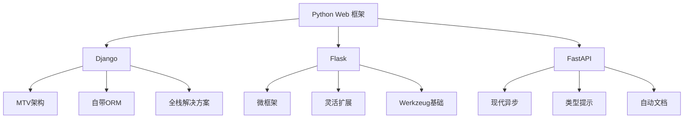
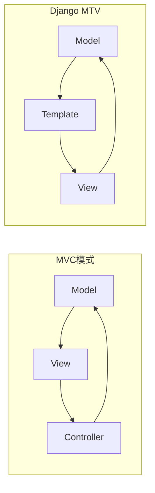
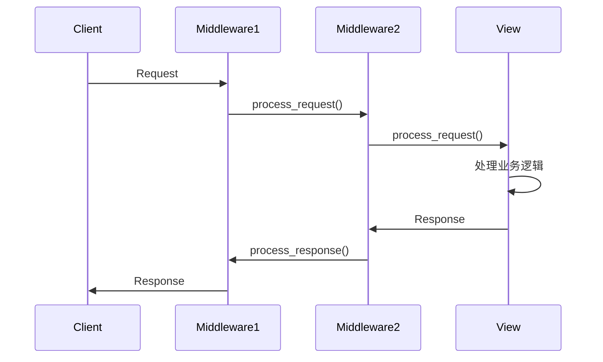
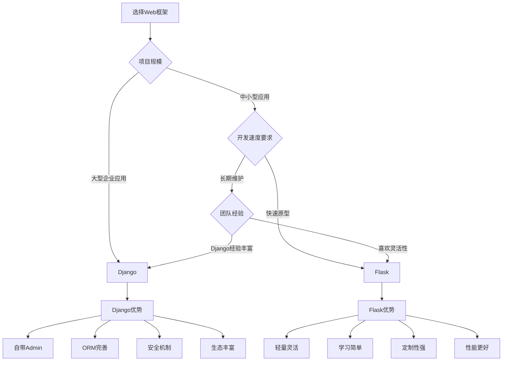

# Python Web 框架面试题

## 📋 目录
- [Django 框架](#django-框架)
- [Flask 框架](#flask-框架)
- [性能对比](#性能对比)
- [项目架构](#项目架构)

## 🎯 核心知识点
- Django MTV架构模式
- Flask 微框架设计理念
- ORM vs SQLAlchemy
- 中间件与扩展机制
- 异步支持和性能优化

## 📊 框架对比图



## Django 框架

### 💡 面试题目

#### 1. **[中级]** Django的MTV架构模式是什么？与传统MVC有什么区别？

**核心概念：**
- Model：数据模型层，负责数据的存取
- Template：模板层，负责数据的展示
- View：视图层，负责业务逻辑处理

**关键区别：**



**实际示例：**

```python
# models.py - Model层
from django.db import models

class Article(models.Model):
    title = models.CharField(max_length=200)
    content = models.TextField()
    created_at = models.DateTimeField(auto_now_add=True)
    
    class Meta:
        ordering = ['-created_at']

# views.py - View层
from django.shortcuts import render
from .models import Article

def article_list(request):
    articles = Article.objects.all()
    return render(request, 'articles/list.html', {
        'articles': articles
    })

# templates/articles/list.html - Template层
<!DOCTYPE html>
<html>
<head>
    <title>文章列表</title>
</head>
<body>
    
        <div class="article">
            <h2>{{ article.title }}</h2>
            <p>{{ article.content|truncatewords:30 }}</p>
            <small>{{ article.created_at|date:"Y-m-d H:i" }}</small>
        </div>
    
</body>
</html>
```

#### 2. **[高级]** Django ORM的查询优化策略有哪些？

**查询优化技术：**

```python
# 1. select_related - 一对一/多对一关系优化
# 避免N+1查询问题
articles = Article.objects.select_related('author', 'category').all()

# 2. prefetch_related - 多对多/一对多关系优化
authors = Author.objects.prefetch_related('articles').all()

# 3. 自定义Prefetch对象
from django.db.models import Prefetch

authors = Author.objects.prefetch_related(
    Prefetch('articles', 
             queryset=Article.objects.filter(status='published'))
).all()

# 4. only() 和 defer() - 字段级优化
# 只获取需要的字段
articles = Article.objects.only('title', 'created_at').all()

# 延迟加载大字段
articles = Article.objects.defer('content').all()

# 5. 使用聚合函数
from django.db.models import Count, Avg

stats = Article.objects.aggregate(
    total_count=Count('id'),
    avg_views=Avg('view_count')
)

# 6. 使用annotate进行统计
authors_with_count = Author.objects.annotate(
    article_count=Count('articles')
).filter(article_count__gt=5)

# 7. 批量操作
# 批量创建
Article.objects.bulk_create([
    Article(title=f'Article {i}', content=f'Content {i}')
    for i in range(1000)
])

# 批量更新
Article.objects.filter(status='draft').update(status='published')
```

**查询分析工具：**

```python
# settings.py - 开启查询日志
LOGGING = {
    'version': 1,
    'handlers': {
        'console': {
            'class': 'logging.StreamHandler',
        },
    },
    'loggers': {
        'django.db.backends': {
            'handlers': ['console'],
            'level': 'DEBUG',
        },
    },
}

# 使用django-debug-toolbar分析查询
# pip install django-debug-toolbar

# 在shell中分析查询
from django.db import connection
from django.test.utils import override_settings

with override_settings(DEBUG=True):
    # 执行查询
    list(Article.objects.all())
    # 查看执行的SQL
    print(connection.queries)
```

#### 3. **[中级]** Django中间件的执行顺序和自定义中间件实现

**中间件执行流程：**



**自定义中间件实现：**

```python
# middleware.py
import time
import logging
from django.utils.deprecation import MiddlewareMixin

class RequestLoggingMiddleware(MiddlewareMixin):
    """请求日志中间件"""
    
    def process_request(self, request):
        """请求前处理"""
        request.start_time = time.time()
        logging.info(f"Request started: {request.method} {request.path}")
        return None  # 继续处理
    
    def process_response(self, request, response):
        """响应后处理"""
        if hasattr(request, 'start_time'):
            duration = time.time() - request.start_time
            logging.info(
                f"Request completed: {request.method} {request.path} "
                f"- {response.status_code} in {duration:.2f}s"
            )
        return response
    
    def process_exception(self, request, exception):
        """异常处理"""
        logging.error(f"Exception in {request.path}: {str(exception)}")
        return None  # 让Django处理异常

class RateLimitMiddleware(MiddlewareMixin):
    """简单的限流中间件"""
    
    def __init__(self, get_response):
        self.get_response = get_response
        self.requests = {}  # 简单内存存储，生产环境应使用Redis
        
    def process_request(self, request):
        import time
        from django.http import HttpResponse
        
        client_ip = self.get_client_ip(request)
        current_time = time.time()
        
        # 清理过期记录
        self.cleanup_old_requests(current_time)
        
        # 检查限流
        if client_ip in self.requests:
            request_times = self.requests[client_ip]
            if len(request_times) >= 100:  # 每分钟100次请求限制
                return HttpResponse("Rate limit exceeded", status=429)
            request_times.append(current_time)
        else:
            self.requests[client_ip] = [current_time]
        
        return None
    
    def get_client_ip(self, request):
        x_forwarded_for = request.META.get('HTTP_X_FORWARDED_FOR')
        if x_forwarded_for:
            ip = x_forwarded_for.split(',')[0]
        else:
            ip = request.META.get('REMOTE_ADDR')
        return ip
    
    def cleanup_old_requests(self, current_time):
        for ip in list(self.requests.keys()):
            # 保留最近1分钟的请求记录
            self.requests[ip] = [
                t for t in self.requests[ip] 
                if current_time - t < 60
            ]
            if not self.requests[ip]:
                del self.requests[ip]

# settings.py
MIDDLEWARE = [
    'myapp.middleware.RequestLoggingMiddleware',
    'django.middleware.security.SecurityMiddleware',
    'django.contrib.sessions.middleware.SessionMiddleware',
    'myapp.middleware.RateLimitMiddleware',
    'django.middleware.common.CommonMiddleware',
    # ... 其他中间件
]
```

## Flask 框架

#### 4. **[中级]** Flask的应用工厂模式实现和蓝图使用

**应用工厂模式：**

```python
# app/__init__.py
from flask import Flask
from flask_sqlalchemy import SQLAlchemy
from flask_migrate import Migrate
from flask_login import LoginManager

db = SQLAlchemy()
migrate = Migrate()
login_manager = LoginManager()

def create_app(config_name='default'):
    app = Flask(__name__)
    
    # 配置加载
    from .config import config
    app.config.from_object(config[config_name])
    
    # 初始化扩展
    db.init_app(app)
    migrate.init_app(app, db)
    login_manager.init_app(app)
    login_manager.login_view = 'auth.login'
    
    # 注册蓝图
    from .main import bp as main_bp
    app.register_blueprint(main_bp)
    
    from .auth import bp as auth_bp
    app.register_blueprint(auth_bp, url_prefix='/auth')
    
    from .api import bp as api_bp
    app.register_blueprint(api_bp, url_prefix='/api/v1')
    
    return app

# app/config.py
import os

class Config:
    SECRET_KEY = os.environ.get('SECRET_KEY') or 'hard-to-guess-string'
    SQLALCHEMY_DATABASE_URI = os.environ.get('DATABASE_URL') or \
        'sqlite:///app.db'
    SQLALCHEMY_TRACK_MODIFICATIONS = False

class DevelopmentConfig(Config):
    DEBUG = True
    
class ProductionConfig(Config):
    DEBUG = False

config = {
    'development': DevelopmentConfig,
    'production': ProductionConfig,
    'default': DevelopmentConfig
}

# app/main/__init__.py
from flask import Blueprint

bp = Blueprint('main', __name__)

from . import routes

# app/main/routes.py
from flask import render_template, request, jsonify
from . import bp
from ..models import User
from .. import db

@bp.route('/')
def index():
    users = User.query.all()
    return render_template('index.html', users=users)

@bp.route('/api/users')
def api_users():
    users = User.query.all()
    return jsonify([{
        'id': user.id,
        'username': user.username,
        'email': user.email
    } for user in users])

# run.py
from app import create_app
import os

app = create_app(os.environ.get('FLASK_ENV') or 'default')

if __name__ == '__main__':
    app.run(debug=True)
```

#### 5. **[高级]** Flask中的请求上下文和应用上下文机制

**上下文管理机制：**

```python
from flask import Flask, request, current_app, g
from werkzeug.local import LocalStack, LocalProxy
import threading

# Flask上下文原理简化版
class AppContext:
    def __init__(self, app):
        self.app = app
        
class RequestContext:
    def __init__(self, app, environ):
        self.app = app
        self.request = Request(environ)

# LocalStack实现线程隔离
_app_ctx_stack = LocalStack()
_request_ctx_stack = LocalStack()

# 代理对象
current_app = LocalProxy(lambda: _app_ctx_stack.top.app)
request = LocalProxy(lambda: _request_ctx_stack.top.request)

# 实际使用示例
app = Flask(__name__)

@app.before_request
def before_request():
    """在每个请求之前执行"""
    g.start_time = time.time()
    g.user_id = request.headers.get('X-User-ID')
    
    # 数据库连接
    if not hasattr(g, 'db'):
        g.db = get_db_connection()

@app.teardown_request
def teardown_request(exception):
    """请求结束后清理"""
    db = getattr(g, 'db', None)
    if db is not None:
        db.close()
    
    # 记录请求时间
    if hasattr(g, 'start_time'):
        duration = time.time() - g.start_time
        current_app.logger.info(f'Request took {duration:.2f}s')

# 手动管理上下文
def background_task():
    """后台任务中使用应用上下文"""
    with app.app_context():
        # 现在可以使用current_app
        current_app.logger.info('Background task running')
        
        # 创建请求上下文进行测试
        with app.test_request_context('/api/test'):
            # 现在可以使用request对象
            print(f"Testing endpoint: {request.endpoint}")

# 自定义上下文处理器
@app.context_processor
def utility_processor():
    """向所有模板添加工具函数"""
    def format_datetime(dt):
        return dt.strftime('%Y-%m-%d %H:%M:%S')
    
    return dict(format_datetime=format_datetime)

# 异步上下文处理（Flask 2.0+）
import asyncio
from flask import copy_current_request_context

@app.route('/async-task')
def start_async_task():
    @copy_current_request_context
    def background_work():
        # 这里可以访问原始请求的上下文
        user_id = request.headers.get('X-User-ID')
        # 执行耗时操作
        time.sleep(5)
        current_app.logger.info(f'Task completed for user {user_id}')
    
    # 在新线程中执行
    threading.Thread(target=background_work).start()
    return 'Task started'
```

## 性能对比

#### 6. **[高级]** Django vs Flask 性能对比和选择策略

**性能基准测试：**

```python
# Django视图
from django.http import JsonResponse
from django.views.decorators.csrf import csrf_exempt

@csrf_exempt
def api_view(request):
    return JsonResponse({'message': 'Hello Django'})

# Flask视图
from flask import Flask, jsonify

app = Flask(__name__)

@app.route('/api')
def api_view():
    return jsonify({'message': 'Hello Flask'})

# 性能测试脚本
import requests
import time
import concurrent.futures
import statistics

def benchmark_endpoint(url, num_requests=1000, concurrency=10):
    """性能测试函数"""
    
    def make_request():
        start = time.time()
        response = requests.get(url)
        end = time.time()
        return end - start, response.status_code
    
    # 并发测试
    with concurrent.futures.ThreadPoolExecutor(max_workers=concurrency) as executor:
        futures = [executor.submit(make_request) for _ in range(num_requests)]
        results = [future.result() for future in futures]
    
    # 统计结果
    response_times = [r[0] for r in results]
    status_codes = [r[1] for r in results]
    
    return {
        'total_requests': num_requests,
        'successful_requests': sum(1 for code in status_codes if code == 200),
        'average_response_time': statistics.mean(response_times),
        'median_response_time': statistics.median(response_times),
        'min_response_time': min(response_times),
        'max_response_time': max(response_times),
        'requests_per_second': num_requests / sum(response_times) * concurrency
    }

# 使用示例
django_results = benchmark_endpoint('http://localhost:8000/api')
flask_results = benchmark_endpoint('http://localhost:5000/api')

print("Django Results:", django_results)
print("Flask Results:", flask_results)
```

**选择决策树：**



## 🔗 相关链接

- [← 返回后端面试题](./README.md)
- [Python 基础面试题](./python-basics.md)
- [Python 异步编程](./python-async.md)
- [API 设计面试题](./api-design.md)

---

*掌握Python Web框架的核心原理，构建高质量的Web应用* 🐍 