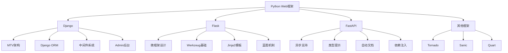

# Python Web框架面试题

[← 返回后端面试题目录](./README.md)

## 📚 题目概览

本部分考察Python Web开发框架的选择、使用和优化能力，重点关注Django、Flask、FastAPI等主流框架的特性对比和架构设计。

## 🎯 核心技术考察重点

### 框架架构设计
- **Django MTV架构**：Model-Template-View的设计模式和实现原理
- **Flask微框架**：轻量级设计理念和扩展机制
- **FastAPI现代化**：异步支持、类型提示、自动文档生成
- **架构对比**：全栈框架vs微框架的选择依据

### ORM与数据库交互
- **Django ORM**：查询优化、关系处理、事务管理
- **SQLAlchemy**：Core与ORM的设计理念和使用场景
- **异步ORM**：Tortoise-ORM、SQLAlchemy异步支持
- **性能优化**：N+1问题解决、查询缓存、批量操作

### 中间件与扩展机制
- **Django中间件**：请求处理流程和自定义中间件
- **Flask扩展**：蓝图、应用工厂模式、扩展开发
- **ASGI/WSGI**：Web服务器接口的区别和应用
- **安全机制**：CSRF防护、XSS防护、认证授权

## 📊 知识结构关联图

## 📝 核心面试题目

### Django框架深度 [中级]

#### 题目1：Django MTV架构设计和实现原理
**问题背景**：设计一个支持高并发的内容管理系统

**技术挑战**：
- MTV架构与传统MVC的区别和优势
- 请求处理流程的完整链路
- 模板系统的渲染机制和优化
- URL路由的匹配算法和性能

**考察要点**：
- Django请求-响应周期的详细流程
- Model层的数据抽象和ORM实现
- Template层的继承机制和上下文处理
- View层的函数视图vs类视图设计

**📁 完整解决方案**：[Django MTV架构实现](../../solutions/common/django-mtv-architecture.md)

#### 题目2：Django ORM查询优化和性能调优
**问题背景**：优化一个包含复杂关系的电商系统数据查询

**技术挑战**：
- N+1查询问题的识别和解决
- 复杂关系查询的优化策略
- 大数据量场景下的分页和缓存
- 数据库连接池的配置和管理

**考察要点**：
- select_related和prefetch_related的使用场景
- 查询集的惰性加载和缓存机制
- 聚合查询和原生SQL的性能对比
- 数据库索引设计和查询计划分析

**📁 完整解决方案**：[Django ORM优化策略](../../solutions/common/django-orm-optimization.md)

### Flask框架设计 [中级]

#### 题目3：Flask微框架设计理念和扩展机制
**问题背景**：基于Flask构建可扩展的微服务架构

**技术挑战**：
- 微框架的核心设计原则
- 应用工厂模式的实现和优势
- 蓝图机制的模块化设计
- 扩展系统的开发和集成

**考察要点**：
- Flask的WSGI应用结构和请求上下文
- 蓝图的注册机制和URL前缀处理
- Flask-SQLAlchemy等扩展的集成原理
- 应用配置的管理和环境隔离

**📁 完整解决方案**：[Flask微框架架构设计](../../solutions/common/flask-microframework-design.md)

#### 题目4：Flask vs Django的技术选型和架构对比
**问题背景**：为不同规模的项目选择合适的Web框架

**技术挑战**：
- 项目规模与框架选择的匹配
- 开发效率与灵活性的权衡
- 生态系统和社区支持对比
- 性能特征和扩展能力分析

**考察要点**：
- Django的"约定优于配置"vs Flask的灵活性
- 内置功能丰富度与学习曲线的关系
- ORM选择：Django ORM vs SQLAlchemy
- 部署和运维的复杂度对比

**📁 完整解决方案**：[Python Web框架选型指南](../../solutions/common/python-web-framework-comparison.md)

### 现代化框架 [高级]

#### 题目5：FastAPI异步Web框架的设计和应用
**问题背景**：构建高性能的API服务和微服务架构

**技术挑战**：
- 异步编程模型的理解和应用
- 类型提示系统的设计和验证
- 自动文档生成的实现机制
- 依赖注入系统的设计原理

**考察要点**：
- ASGI vs WSGI的技术区别和性能优势
- Pydantic模型的数据验证和序列化
- OpenAPI文档的自动生成机制
- 异步数据库操作和连接池管理

**📁 完整解决方案**：[FastAPI异步框架实践](../../solutions/common/fastapi-async-framework.md)

#### 题目6：Python Web框架的性能优化和监控
**问题背景**：优化Web应用的响应时间和并发处理能力

**技术挑战**：
- 应用性能瓶颈的识别和分析
- 数据库查询和缓存策略优化
- 静态资源处理和CDN集成
- 应用监控和性能指标收集

**考察要点**：
- 性能分析工具的使用和指标解读
- 缓存层次的设计：内存缓存、Redis、CDN
- 数据库连接池和查询优化策略
- APM工具的集成和监控体系建设

**📁 完整解决方案**：[Python Web性能优化实践](../../solutions/common/python-web-performance-optimization.md)

### 企业级应用 [高级]

#### 题目7：大规模Django应用的架构设计和部署
**问题背景**：设计支持百万用户的Django应用架构

**技术挑战**：
- 应用的水平扩展和负载均衡
- 数据库的读写分离和分库分表
- 缓存策略的多层次设计
- 静态文件的处理和分发

**考察要点**：
- Django应用的容器化部署策略
- 数据库迁移和版本管理
- 消息队列和异步任务处理
- 监控、日志和错误追踪体系

**📁 完整解决方案**：[大规模Django应用架构](../../solutions/common/large-scale-django-architecture.md)

#### 题目8：Python Web安全最佳实践和防护机制
**问题背景**：构建安全可靠的Web应用防护体系

**技术挑战**：
- 常见Web攻击的防护机制
- 认证授权系统的设计和实现
- 数据加密和敏感信息保护
- 安全审计和漏洞扫描

**考察要点**：
- CSRF、XSS、SQL注入的防护策略
- JWT vs Session的安全性对比
- OAuth2和OpenID Connect的实现
- 安全头设置和HTTPS配置

**📁 完整解决方案**：[Python Web安全防护体系](../../solutions/common/python-web-security-practices.md)

## 📊 面试评分标准

### 基础知识 (30分)
- Python Web框架的基本概念和特性
- MTV/MVC架构模式的理解
- ORM和数据库交互的掌握程度

### 技术深度 (40分)
- 框架内部机制的深入理解
- 性能优化和调优的实践能力
- 大规模应用的架构设计能力

### 实践能力 (30分)
- 项目开发和部署经验
- 问题诊断和解决能力
- 技术选型和架构决策能力

## 🎯 备考建议

### 理论学习路径
1. **框架基础**：掌握Django、Flask的核心概念和基本用法
2. **架构设计**：理解MTV模式、微框架设计理念
3. **性能优化**：学习ORM优化、缓存策略、异步编程
4. **安全实践**：了解Web安全防护和最佳实践

### 实践项目建议
1. **博客系统**：使用Django构建完整的内容管理系统
2. **API服务**：使用Flask或FastAPI开发RESTful API
3. **微服务架构**：基于Python框架的微服务设计和实现
4. **性能测试**：对Web应用进行压力测试和性能优化

## 🔗 相关资源链接

- [API设计最佳实践](./api-design.md)
- [数据库设计优化](../database/design-optimization.md)
- [缓存系统设计](./caching.md)
- [微服务架构设计](./microservices.md) 