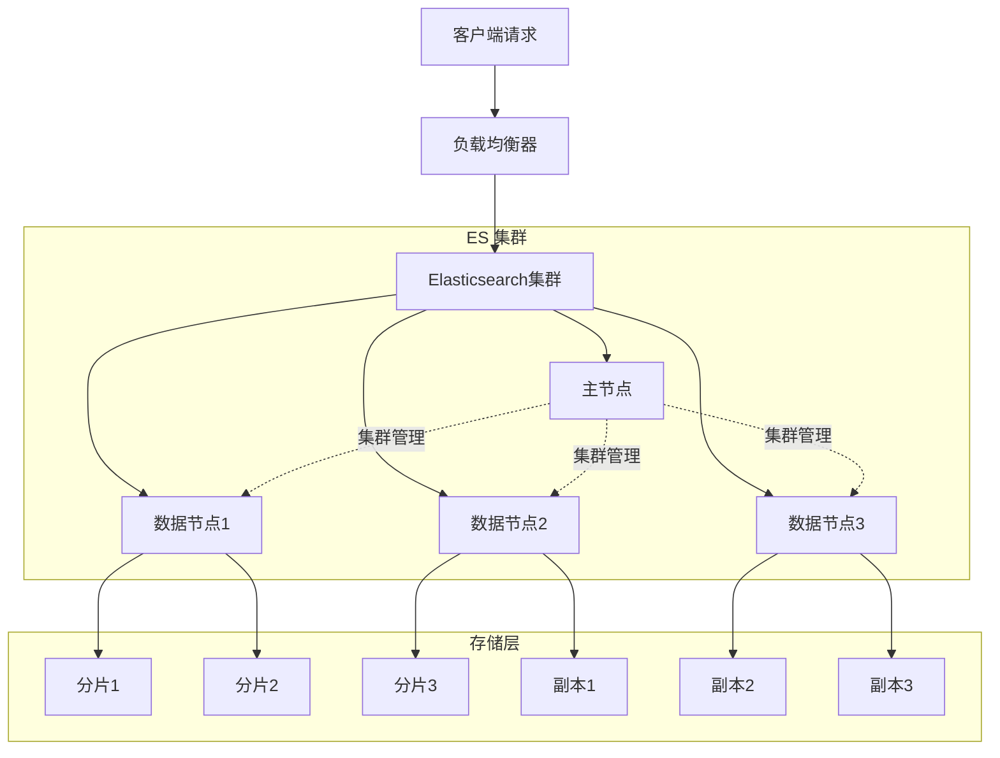
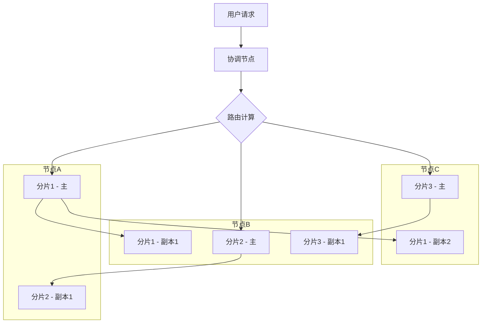
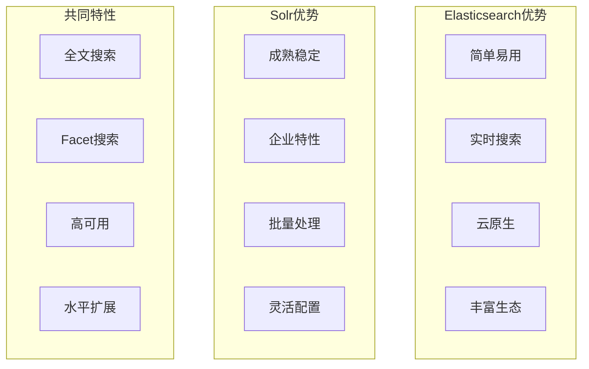
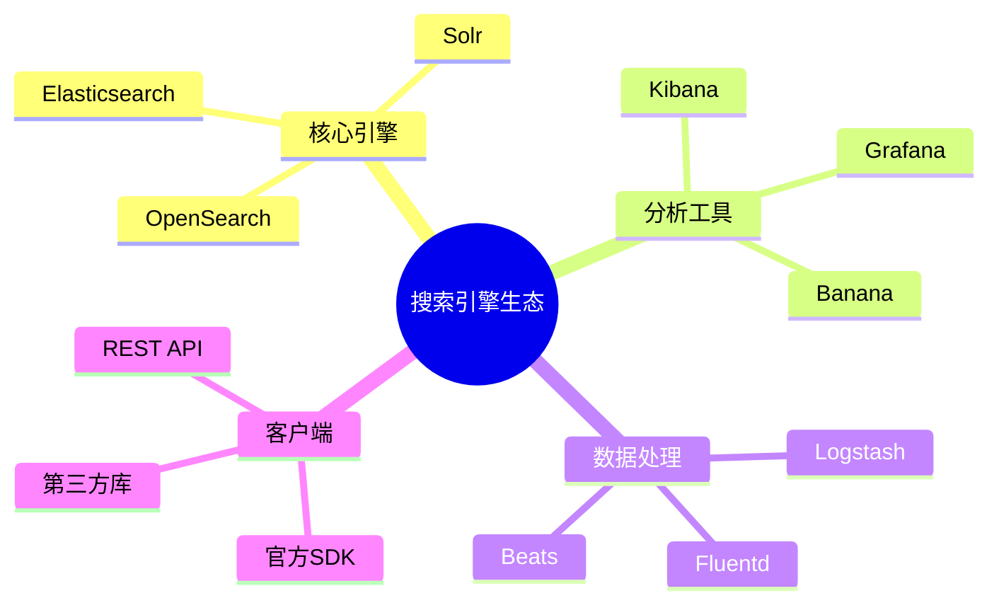

# 搜索引擎面试题

[← 返回后端面试题目录](./README.md)

## 🎯 核心知识点

- Elasticsearch 架构
- Lucene 核心概念
- 索引设计与优化
- 查询语法与性能
- 分布式搜索
- 日志分析与监控
- Solr vs Elasticsearch

## 📊 Elasticsearch 架构概览



## 💡 面试题目

### **初级题目**

#### 1. 什么是Elasticsearch？它的主要特性有哪些？

**答案要点：**
- **定义**：基于Lucene的分布式搜索引擎
- **主要特性**：
  - 分布式架构
  - RESTful API
  - 实时搜索
  - 全文检索
  - 结构化查询
  - 水平扩展

#### 2. Elasticsearch中的基本概念有哪些？

**答案要点：**
- **集群(Cluster)**：一个或多个节点的集合
- **节点(Node)**：集群中的一个服务器
- **索引(Index)**：类似于数据库
- **类型(Type)**：类似于数据表（已废弃）
- **文档(Document)**：类似于数据行
- **字段(Field)**：类似于数据列
- **分片(Shard)**：索引的水平分割
- **副本(Replica)**：分片的副本

```json
{
  "cluster_name": "my-cluster",
  "nodes": {
    "node-1": {
      "name": "data-node-1",
      "roles": ["data", "ingest"]
    },
    "node-2": {
      "name": "master-node",
      "roles": ["master"]
    }
  },
  "indices": {
    "user_index": {
      "mappings": {
        "properties": {
          "name": {"type": "text"},
          "age": {"type": "integer"},
          "email": {"type": "keyword"}
        }
      }
    }
  }
}
```

#### 3. 如何创建索引和添加文档？

**答案要点：**
```bash
# 创建索引
PUT /user_index
{
  "settings": {
    "number_of_shards": 3,
    "number_of_replicas": 1
  },
  "mappings": {
    "properties": {
      "name": {
        "type": "text",
        "analyzer": "ik_max_word"
      },
      "age": {
        "type": "integer"
      },
      "email": {
        "type": "keyword"
      },
      "created_at": {
        "type": "date"
      }
    }
  }
}

# 添加文档
POST /user_index/_doc/1
{
  "name": "张三",
  "age": 25,
  "email": "zhangsan@example.com",
  "created_at": "2023-01-01T00:00:00Z"
}

# 批量添加文档
POST /_bulk
{"index": {"_index": "user_index", "_id": "2"}}
{"name": "李四", "age": 30, "email": "lisi@example.com"}
{"index": {"_index": "user_index", "_id": "3"}}
{"name": "王五", "age": 28, "email": "wangwu@example.com"}
```

### **中级题目**

#### 4. Elasticsearch的查询类型有哪些？

**答案要点：**
- **精确查询**：term, terms, range, exists
- **全文查询**：match, match_phrase, multi_match
- **复合查询**：bool, dis_max, function_score
- **聚合查询**：terms, date_histogram, avg, sum

```json
{
  "query": {
    "bool": {
      "must": [
        {
          "match": {
            "name": "张"
          }
        }
      ],
      "filter": [
        {
          "range": {
            "age": {
              "gte": 20,
              "lte": 30
            }
          }
        }
      ],
      "must_not": [
        {
          "term": {
            "status": "deleted"
          }
        }
      ]
    }
  },
  "aggs": {
    "age_distribution": {
      "histogram": {
        "field": "age",
        "interval": 5
      }
    }
  }
}
```

#### 5. 如何优化Elasticsearch的性能？

**答案要点：**
- **索引优化**：
  - 合理设置分片数量
  - 使用合适的mapping类型
  - 关闭不需要的功能
  
- **查询优化**：
  - 使用filter代替query
  - 减少deep paging
  - 使用scroll或search_after

```json
// 索引模板优化
PUT /_index_template/optimized_template
{
  "index_patterns": ["logs-*"],
  "template": {
    "settings": {
      "number_of_shards": 1,
      "number_of_replicas": 0,
      "refresh_interval": "30s",
      "index.codec": "best_compression"
    },
    "mappings": {
      "properties": {
        "@timestamp": {
          "type": "date"
        },
        "message": {
          "type": "text",
          "index": false
        },
        "level": {
          "type": "keyword"
        }
      }
    }
  }
}

// 高效分页查询
GET /user_index/_search
{
  "size": 10,
  "search_after": [1234567890000, "user_100"],
  "sort": [
    {"created_at": "desc"},
    {"_id": "desc"}
  ],
  "query": {
    "match_all": {}
  }
}
```

#### 6. Elasticsearch的分片和副本机制是如何工作的？

**答案要点：**
- **分片策略**：将大索引分割为多个小分片
- **路由算法**：`shard = hash(routing) % number_of_primary_shards`
- **副本机制**：每个主分片可以有多个副本
- **容错能力**：节点失败时自动故障转移



### **高级题目**

#### 7. 如何设计一个高性能的日志搜索系统？

**答案要点：**
- **架构设计**：ELK Stack (Elasticsearch + Logstash + Kibana)
- **数据分层**：热温冷数据分层存储
- **索引策略**：基于时间的索引滚动
- **查询优化**：预聚合和缓存

```yaml
# Logstash配置
input {
  beats {
    port => 5044
  }
}

filter {
  if [fields][service] == "web" {
    grok {
      match => { 
        "message" => "%{COMBINEDAPACHELOG}" 
      }
    }
    date {
      match => [ "timestamp", "dd/MMM/yyyy:HH:mm:ss Z" ]
    }
  }
  
  mutate {
    add_field => { "[@metadata][index]" => "logs-%{[fields][service]}-%{+YYYY.MM.dd}" }
  }
}

output {
  elasticsearch {
    hosts => ["elasticsearch:9200"]
    index => "%{[@metadata][index]}"
    template_name => "logs"
    template => "/usr/share/logstash/templates/logs.json"
  }
}
```

```python
# Python Elasticsearch客户端示例
from elasticsearch import Elasticsearch
from elasticsearch.helpers import bulk
import json
from datetime import datetime, timedelta

class LogSearchService:
    def __init__(self, hosts=['localhost:9200']):
        self.es = Elasticsearch(hosts)
        
    def create_index_template(self):
        template = {
            "index_patterns": ["logs-*"],
            "template": {
                "settings": {
                    "number_of_shards": 1,
                    "number_of_replicas": 1,
                    "refresh_interval": "30s"
                },
                "mappings": {
                    "properties": {
                        "@timestamp": {"type": "date"},
                        "level": {"type": "keyword"},
                        "service": {"type": "keyword"},
                        "message": {"type": "text"},
                        "user_id": {"type": "keyword"},
                        "ip": {"type": "ip"}
                    }
                }
            }
        }
        
        self.es.indices.put_index_template(
            name="logs-template",
            body=template
        )
    
    def bulk_index_logs(self, logs):
        def generate_docs():
            for log in logs:
                yield {
                    "_index": f"logs-{log['service']}-{datetime.now().strftime('%Y.%m.%d')}",
                    "_source": log
                }
        
        bulk(self.es, generate_docs())
    
    def search_logs(self, query, start_time, end_time, service=None):
        body = {
            "query": {
                "bool": {
                    "must": [
                        {
                            "range": {
                                "@timestamp": {
                                    "gte": start_time,
                                    "lte": end_time
                                }
                            }
                        }
                    ]
                }
            },
            "sort": [{"@timestamp": "desc"}],
            "size": 100
        }
        
        if query:
            body["query"]["bool"]["must"].append({
                "multi_match": {
                    "query": query,
                    "fields": ["message", "service"]
                }
            })
        
        if service:
            body["query"]["bool"]["must"].append({
                "term": {"service": service}
            })
        
        return self.es.search(
            index="logs-*",
            body=body
        )
    
    def get_error_trends(self, hours=24):
        end_time = datetime.now()
        start_time = end_time - timedelta(hours=hours)
        
        body = {
            "query": {
                "bool": {
                    "must": [
                        {"term": {"level": "ERROR"}},
                        {
                            "range": {
                                "@timestamp": {
                                    "gte": start_time,
                                    "lte": end_time
                                }
                            }
                        }
                    ]
                }
            },
            "aggs": {
                "error_trends": {
                    "date_histogram": {
                        "field": "@timestamp",
                        "calendar_interval": "1h"
                    },
                    "aggs": {
                        "services": {
                            "terms": {
                                "field": "service"
                            }
                        }
                    }
                }
            },
            "size": 0
        }
        
        return self.es.search(
            index="logs-*",
            body=body
        )
```

#### 8. Elasticsearch与Solr的对比？

**答案要点：**

| 特性 | Elasticsearch | Solr |
|------|--------------|------|
| 架构 | 原生分布式 | 基于SolrCloud |
| API | RESTful JSON | RESTful XML/JSON |
| 配置 | 代码配置 | XML配置文件 |
| 社区 | 活跃，生态丰富 | 成熟，企业级 |
| 性能 | 近实时搜索 | 批量索引优秀 |
| 学习曲线 | 相对简单 | 较为复杂 |



### **实战题目**

#### 9. 实现一个商品搜索系统

```python
class ProductSearchService:
    def __init__(self):
        self.es = Elasticsearch(['localhost:9200'])
        self.index_name = 'products'
    
    def create_product_index(self):
        mapping = {
            "mappings": {
                "properties": {
                    "name": {
                        "type": "text",
                        "analyzer": "ik_max_word",
                        "fields": {
                            "keyword": {"type": "keyword"}
                        }
                    },
                    "description": {
                        "type": "text",
                        "analyzer": "ik_max_word"
                    },
                    "category": {"type": "keyword"},
                    "brand": {"type": "keyword"},
                    "price": {"type": "double"},
                    "rating": {"type": "float"},
                    "tags": {"type": "keyword"},
                    "stock": {"type": "integer"},
                    "created_at": {"type": "date"},
                    "location": {"type": "geo_point"}
                }
            },
            "settings": {
                "number_of_shards": 3,
                "number_of_replicas": 1,
                "analysis": {
                    "analyzer": {
                        "ik_max_word": {
                            "type": "ik_max_word"
                        }
                    }
                }
            }
        }
        
        self.es.indices.create(index=self.index_name, body=mapping)
    
    def search_products(self, query=None, category=None, brand=None, 
                       min_price=None, max_price=None, location=None, 
                       distance=None, page=1, size=20):
        
        body = {
            "query": {"bool": {"must": [], "filter": []}},
            "sort": [{"_score": "desc"}, {"rating": "desc"}],
            "from": (page - 1) * size,
            "size": size,
            "highlight": {
                "fields": {
                    "name": {},
                    "description": {}
                }
            }
        }
        
        # 搜索查询
        if query:
            body["query"]["bool"]["must"].append({
                "multi_match": {
                    "query": query,
                    "fields": ["name^3", "description^2", "tags"],
                    "type": "best_fields",
                    "fuzziness": "AUTO"
                }
            })
        
        # 过滤条件
        if category:
            body["query"]["bool"]["filter"].append({
                "term": {"category": category}
            })
        
        if brand:
            body["query"]["bool"]["filter"].append({
                "term": {"brand": brand}
            })
        
        if min_price or max_price:
            price_filter = {"range": {"price": {}}}
            if min_price:
                price_filter["range"]["price"]["gte"] = min_price
            if max_price:
                price_filter["range"]["price"]["lte"] = max_price
            body["query"]["bool"]["filter"].append(price_filter)
        
        # 地理位置搜索
        if location and distance:
            body["query"]["bool"]["filter"].append({
                "geo_distance": {
                    "distance": distance,
                    "location": location
                }
            })
        
        # 聚合统计
        body["aggs"] = {
            "categories": {
                "terms": {"field": "category"}
            },
            "brands": {
                "terms": {"field": "brand"}
            },
            "price_ranges": {
                "range": {
                    "field": "price",
                    "ranges": [
                        {"to": 100},
                        {"from": 100, "to": 500},
                        {"from": 500, "to": 1000},
                        {"from": 1000}
                    ]
                }
            }
        }
        
        return self.es.search(index=self.index_name, body=body)
    
    def get_suggestions(self, text):
        body = {
            "suggest": {
                "product_suggest": {
                    "prefix": text,
                    "completion": {
                        "field": "suggest",
                        "size": 10
                    }
                }
            }
        }
        
        return self.es.search(index=self.index_name, body=body)
```

## 🔗 扩展学习

### 搜索引擎生态



### 相关主题
- [分布式系统面试题](./distributed-systems.md)
- [性能优化面试题](./performance-optimization.md)
- [数据库面试题](../database/README.md)

## 📚 推荐资源

### 官方文档
- [Elasticsearch官方文档](https://www.elastic.co/guide/)
- [Apache Solr文档](https://solr.apache.org/guide/)

### 学习材料
- 《Elasticsearch权威指南》
- 《深入理解Elasticsearch》

---

*掌握搜索引擎技术，构建高效的信息检索系统* 🚀 