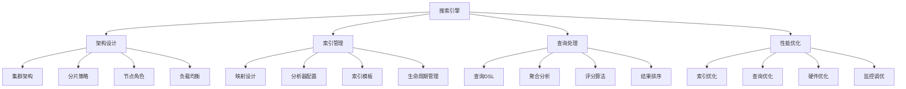

# 搜索引擎面试题

[← 返回后端面试题目录](./README.md)

## 📚 题目概览

本部分考察搜索引擎技术的理解和应用能力，重点关注Elasticsearch、Lucene等技术的架构设计、索引优化和查询性能。

## 🎯 核心技术考察重点

### 搜索引擎架构
- **Elasticsearch架构**：集群、节点、分片、副本的设计原理
- **Lucene核心**：倒排索引、分词器、评分算法
- **分布式搜索**：数据分布、查询路由、结果聚合
- **存储机制**：段合并、索引压缩、缓存策略

### 索引设计与优化
- **映射设计**：字段类型选择、分析器配置
- **索引策略**：分片设计、副本配置、索引模板
- **性能优化**：批量索引、刷新策略、段合并优化
- **存储优化**：字段存储、压缩算法、冷热数据分离

### 查询与分析
- **查询类型**：全文检索、精确匹配、复合查询
- **聚合分析**：统计聚合、桶聚合、管道聚合
- **评分机制**：TF-IDF、BM25、自定义评分
- **查询优化**：查询缓存、过滤器优化、分页策略

## 📊 知识结构关联图

## 📝 核心面试题目

### 搜索引擎基础 [中级]

#### 题目1：Elasticsearch架构设计和核心概念
**问题背景**：设计一个支持大规模数据搜索的Elasticsearch集群

**技术挑战**：
- 集群节点的角色分工和配置
- 分片和副本的数量规划
- 数据分布和查询路由机制
- 故障恢复和高可用保障

**考察要点**：
- 主节点、数据节点、协调节点的职责
- 分片大小和数量的计算依据
- 集群发现和脑裂问题的解决
- 索引生命周期和数据治理策略

**📁 完整解决方案**：[Elasticsearch集群架构设计](../../solutions/common/elasticsearch-cluster-architecture.md)

#### 题目2：Lucene倒排索引原理和实现
**问题背景**：理解搜索引擎底层的索引结构和查询机制

**技术挑战**：
- 倒排索引的构建和存储方式
- 分词和标准化处理流程
- 索引文件的组织和压缩
- 查询时的索引遍历和匹配

**考察要点**：
- 倒排索引与正排索引的区别和应用
- Term Dictionary和Posting List的设计
- 分词器的选择和自定义配置
- 索引段的合并和优化策略

**📁 完整解决方案**：[Lucene倒排索引实现](../../solutions/common/lucene-inverted-index.md)

### 索引设计优化 [中级]

#### 题目3：索引映射设计和字段类型选择
**问题背景**：为复杂的业务数据设计合适的索引映射

**技术挑战**：
- 不同数据类型的字段映射选择
- 分析器和标准化器的配置
- 动态映射与静态映射的权衡
- 嵌套对象和父子文档的处理

**考察要点**：
- text、keyword、numeric等字段类型的适用场景
- 中文分词器的选择和配置方法
- 多字段映射和copy_to的使用策略
- 索引模板和组件模板的设计原则

**📁 完整解决方案**：[Elasticsearch索引映射设计](../../solutions/common/elasticsearch-mapping-design.md)

#### 题目4：大规模数据的索引策略和性能优化
**问题背景**：处理TB级数据的索引构建和维护

**技术挑战**：
- 批量索引的性能优化策略
- 索引刷新和段合并的调优
- 热温冷数据的分层存储
- 索引别名和滚动索引的管理

**考察要点**：
- bulk API的使用和参数调优
- refresh_interval和translog的配置
- ILM（Index Lifecycle Management）策略
- 分片分配和节点亲和性配置

**📁 完整解决方案**：[大规模索引优化策略](../../solutions/common/large-scale-indexing-optimization.md)

### 查询与聚合 [高级]

#### 题目5：复杂查询DSL的设计和优化
**问题背景**：构建支持复杂业务逻辑的搜索查询

**技术挑战**：
- 多条件复合查询的组合策略
- 全文检索和精确匹配的结合
- 查询性能的优化和缓存策略
- 自定义评分和结果排序

**考察要点**：
- bool查询中must、should、filter的使用场景
- 查询上下文和过滤上下文的性能差异
- 查询缓存和字段数据缓存的配置
- function_score和script_score的应用

**📁 完整解决方案**：[Elasticsearch查询优化实践](../../solutions/common/elasticsearch-query-optimization.md)

#### 题目6：聚合分析和数据统计实现
**问题背景**：实现复杂的数据分析和统计功能

**技术挑战**：
- 多维度数据聚合的设计
- 大数据量聚合的性能优化
- 实时聚合与离线分析的结合
- 聚合结果的可视化展示

**考察要点**：
- terms、date_histogram、range等聚合的应用
- 嵌套聚合和管道聚合的使用
- 聚合精度和性能的权衡
- 聚合缓存和预计算策略

**📁 完整解决方案**：[Elasticsearch聚合分析实现](../../solutions/common/elasticsearch-aggregation-analysis.md)

### 生产环境实践 [高级]

#### 题目7：搜索引擎的监控和运维策略
**问题背景**：建立完善的搜索引擎监控和运维体系

**技术挑战**：
- 关键指标的监控和告警
- 集群健康状态的评估
- 性能瓶颈的诊断和优化
- 数据备份和灾难恢复

**考察要点**：
- 集群状态、索引状态、查询性能的监控
- 慢查询日志和性能分析工具
- 节点故障和数据恢复机制
- 版本升级和配置变更策略

**📁 完整解决方案**：[Elasticsearch运维监控体系](../../solutions/common/elasticsearch-monitoring-operations.md)

#### 题目8：搜索相关性和用户体验优化
**问题背景**：提升搜索结果的相关性和用户体验

**技术挑战**：
- 搜索结果排序算法的优化
- 个性化搜索和推荐结合
- 搜索建议和自动补全功能
- 搜索分析和效果评估

**考察要点**：
- 相关性评分的调优方法
- 用户行为数据的收集和分析
- 搜索日志的挖掘和应用
- A/B测试和效果评估指标

**📁 完整解决方案**：[搜索相关性优化实践](../../solutions/common/search-relevance-optimization.md)

## 📊 面试评分标准

### 基础知识 (30分)
- 搜索引擎基本概念的理解
- Elasticsearch和Lucene架构的掌握
- 索引和查询机制的熟悉程度

### 技术深度 (40分)
- 索引设计和优化的能力
- 复杂查询和聚合的实现
- 性能调优和问题诊断技能

### 实践能力 (30分)
- 生产环境的部署和运维经验
- 业务场景的技术方案设计
- 问题解决和技术创新能力

## 🎯 备考建议

### 理论学习路径
1. **基础概念**：理解搜索引擎的基本原理和核心概念
2. **架构设计**：掌握Elasticsearch集群架构和配置
3. **索引优化**：学习索引设计和性能优化策略
4. **查询分析**：熟练使用查询DSL和聚合分析

### 实践项目建议
1. **集群搭建**：搭建多节点Elasticsearch集群
2. **索引设计**：为不同业务场景设计索引结构
3. **性能测试**：进行大数据量的索引和查询测试
4. **监控运维**：建立完整的监控和运维体系

## 🔗 相关资源链接

- [分布式系统设计](./distributed-systems.md)
- [数据库设计优化](../database/design-optimization.md)
- [缓存系统设计](./caching.md)
- [性能优化实践](./performance-optimization.md) 