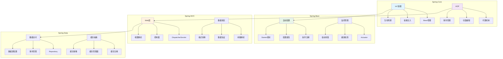

# Spring框架面试题

[← 返回后端面试题目录](./README.md)

## 📚 题目概览

Spring框架作为Java企业级开发的核心框架，其设计思想和技术实现深刻影响了现代Java应用的架构模式。本章节重点考察候选人对Spring核心特性的理解，包括IoC容器、AOP编程、Spring Boot自动配置等关键技术，以及在复杂业务场景中的应用能力。

## 🎯 核心技术考察重点

### IoC容器与依赖注入
- 控制反转和依赖注入的设计原理
- Bean生命周期管理和作用域控制
- 循环依赖的检测和解决机制
- 自定义BeanPostProcessor的应用

### AOP面向切面编程
- AOP核心概念和实现原理
- 动态代理和CGLIB代理的选择策略
- 切面表达式的编写和优化
- 事务管理和声明式事务的实现

### Spring Boot自动配置
- 自动配置的实现原理和条件注解
- Starter机制的设计和自定义开发
- 配置属性的绑定和验证
- 监控和健康检查的集成

### Spring MVC架构
- DispatcherServlet的工作流程
- 请求映射和参数绑定机制
- 视图解析和内容协商
- 异常处理和全局异常处理器

## 📊 知识结构关联图

## 📝 核心面试题目

### IoC容器与依赖注入 🏗️

#### 题目1：Spring IoC容器核心机制深度剖析
**问题背景**：深入理解Spring IoC容器的设计原理和Bean管理机制

**技术挑战**：
- IoC容器的初始化和Bean定义加载过程
- 不同作用域Bean的创建和管理策略
- 循环依赖的检测机制和解决方案
- 自定义Bean后处理器的设计和应用

**考察要点**：
- 对Spring容器架构的深度理解
- Bean生命周期各阶段的扩展点掌握
- 复杂依赖关系的分析和解决能力
- 容器扩展机制的设计和实现

**📁 完整解决方案**：[Spring IoC容器实现原理](../../solutions/common/spring-ioc-container.md)

#### 题目2：Spring Bean生命周期与扩展点应用
**问题背景**：掌握Spring Bean的完整生命周期和各种扩展机制

**技术挑战**：
- Bean实例化、属性注入、初始化的详细流程
- BeanPostProcessor和BeanFactoryPostProcessor的应用
- InitializingBean和DisposableBean接口的使用
- 自定义生命周期回调的实现策略

**考察要点**：
- Bean生命周期各阶段的深入理解
- 扩展点的正确使用和性能考虑
- 框架级开发的设计思维
- 生产环境中的最佳实践

**📁 完整解决方案**：[Spring Bean生命周期管理](../../solutions/common/spring-bean-lifecycle.md)

### AOP面向切面编程 ✂️

#### 题目3：Spring AOP实现原理与高级应用
**问题背景**：深入理解Spring AOP的实现机制和在企业应用中的使用

**技术挑战**：
- JDK动态代理和CGLIB代理的选择和性能对比
- 切点表达式的编写和性能优化
- 多个切面的执行顺序控制
- 自定义注解和切面的开发

**考察要点**：
- AOP核心概念的准确理解
- 代理模式的深度应用
- 切面编程的设计模式
- 性能优化和最佳实践

**📁 完整解决方案**：[Spring AOP高级应用](../../solutions/common/spring-aop-advanced.md)

#### 题目4：Spring事务管理机制深度解析
**问题背景**：掌握Spring声明式事务的实现原理和复杂场景应用

**技术挑战**：
- 事务传播行为的理解和应用场景
- 事务隔离级别的选择和性能影响
- 分布式事务的处理策略
- 事务失效场景的识别和解决

**考察要点**：
- 事务管理的深度理解
- 数据库事务特性的掌握
- 复杂业务场景的事务设计
- 分布式系统的事务处理

**📁 完整解决方案**：[Spring事务管理实现](../../solutions/common/spring-transaction-management.md)

### Spring Boot自动配置 🚀

#### 题目5：Spring Boot自动配置原理与定制开发
**问题背景**：理解Spring Boot自动配置的实现机制和自定义Starter开发

**技术挑战**：
- 自动配置类的加载机制和条件注解应用
- 配置属性的绑定和验证机制
- 自定义Starter的设计和开发
- 配置优先级和覆盖策略

**考察要点**：
- Spring Boot核心机制的理解
- 条件注解的灵活应用
- 框架扩展的设计能力
- 配置管理的最佳实践

**📁 完整解决方案**：[Spring Boot自动配置实现](../../solutions/common/spring-boot-autoconfiguration.md)

### Spring MVC架构 🌐

#### 题目6：Spring MVC请求处理流程与性能优化
**问题背景**：深入理解Spring MVC的工作原理和高性能Web应用开发

**技术挑战**：
- DispatcherServlet的请求分发机制
- HandlerMapping和HandlerAdapter的工作原理
- 视图解析和内容协商的实现
- 异步请求处理和性能优化

**考察要点**：
- Web MVC架构的深度理解
- HTTP请求处理的完整流程
- Web应用性能优化技巧
- RESTful API设计的最佳实践

**📁 完整解决方案**：[Spring MVC高性能实现](../../solutions/common/spring-mvc-performance.md)

## 📊 面试评分标准

### 理论基础 (35分)
- **核心概念**：准确理解IoC、AOP、自动配置等核心概念
- **实现原理**：深入掌握Spring框架的底层实现机制
- **设计思想**：理解Spring的设计哲学和架构思维

### 实践应用 (40分)
- **框架使用**：熟练使用Spring各个模块解决实际问题
- **配置管理**：掌握不同环境下的配置管理策略
- **性能优化**：具备Spring应用的性能分析和优化能力

### 架构设计 (25分)
- **系统设计**：能够基于Spring构建复杂的企业级应用
- **扩展开发**：具备框架扩展和自定义组件开发能力
- **最佳实践**：掌握Spring开发的最佳实践和设计模式

## 🎯 备考建议

### 学习路径
1. **基础概念**：深入理解IoC、DI、AOP等核心概念
2. **源码分析**：阅读Spring核心模块的源码实现
3. **实践项目**：通过实际项目加深对框架的理解
4. **性能调优**：学习Spring应用的性能分析和优化
5. **架构设计**：掌握基于Spring的系统架构设计

### 技术重点
- **IoC容器**：Bean管理、依赖注入、生命周期控制
- **AOP编程**：切面设计、代理机制、事务管理
- **Spring Boot**：自动配置、Starter开发、监控管理
- **Spring MVC**：请求处理、数据绑定、异常处理
- **Spring Data**：数据访问、Repository模式、缓存管理

### 实践项目建议
- 开发自定义Spring Boot Starter
- 实现基于注解的权限控制系统
- 构建多数据源的数据访问层
- 设计分布式事务处理方案
- 创建Spring Cloud微服务架构

## 🔗 相关资源链接

- [Java基础面试题](./java-basics.md)
- [Java并发编程面试题](./java-concurrency.md)
- [微服务架构面试题](./microservices.md)
- [数据库面试题](../database/README.md)
- [← 返回后端面试题目录](./README.md)

---

*掌握Spring框架，构建现代化企业级应用* 🌱 