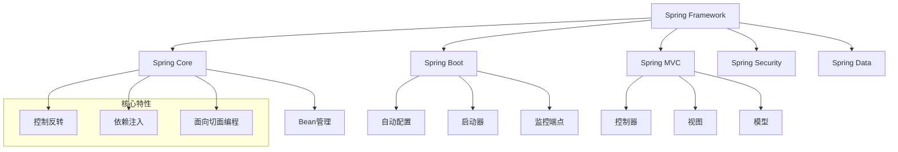
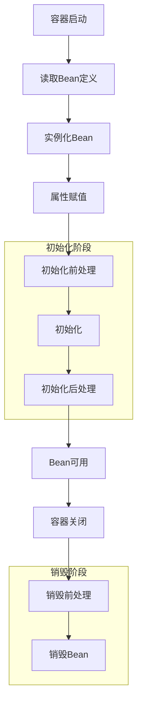
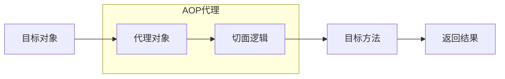

# Spring 框架面试题

## 🏷️ 标签
- 技术栈: Java, Spring
- 难度: 初级到高级
- 类型: 概念题, 实现题, 架构题

## 📋 题目描述

本文包含 Spring 框架相关的常见面试题，涵盖 Spring Core、Spring Boot、Spring MVC、Spring Security 等核心模块。

## 💡 核心知识点
- 依赖注入 (DI) 和控制反转 (IoC)
- Spring Bean 生命周期
- AOP 面向切面编程
- Spring Boot 自动配置
- Spring MVC 工作原理
- Spring Security 认证授权

## 📊 Spring 核心概念关系图



## 📝 面试题目

### 1. 基础概念题

#### **【初级】** 什么是 Spring 框架？它解决了什么问题？

**💡 考察要点:**
- Spring 框架的核心价值
- 企业级应用开发的痛点
- Spring 的主要特性

**📝 参考答案:**

Spring 是一个轻量级的企业级应用开发框架，主要解决以下问题：

1. **对象创建和依赖管理**: 通过 IoC 容器管理对象的创建和依赖关系
2. **代码耦合度高**: 通过依赖注入降低组件间的耦合
3. **横切关注点**: 通过 AOP 处理日志、事务、安全等横切关注点
4. **配置复杂**: 提供注解和自动配置简化开发

**核心特性:**
- **IoC (控制反转)**: 对象的创建和依赖关系由容器管理
- **DI (依赖注入)**: 通过构造器、setter、字段注入依赖
- **AOP (面向切面编程)**: 分离横切关注点
- **模块化**: 可选择性使用不同模块

---

#### **【初级】** 解释 IoC 和 DI 的概念及其关系

**💡 考察要点:**
- IoC 和 DI 的定义
- 两者的关系和区别
- 实际应用场景

**📝 参考答案:**

**IoC (控制反转):**
- 是一种设计原则，对象的创建控制权从代码转移到外部容器
- 传统方式：对象内部 `new` 创建依赖对象
- IoC 方式：由容器创建并注入依赖对象

**DI (依赖注入):**
- 是 IoC 的具体实现方式
- 通过外部方式将依赖对象注入到目标对象中

```java
// 传统方式 - 对象自己创建依赖
public class UserService {
    private UserRepository userRepository = new UserRepository();
}

// DI 方式 - 依赖由外部注入
@Service
public class UserService {
    @Autowired
    private UserRepository userRepository;
}
```

**关系:** IoC 是思想，DI 是实现 IoC 的一种技术手段。

---

#### **【中级】** Spring Bean 的生命周期是怎样的？

**💡 考察要点:**
- Bean 创建到销毁的完整流程
- 各个阶段的扩展点
- 实际应用中的注意事项



**📝 参考答案:**

Spring Bean 生命周期包含以下阶段：

1. **实例化**: 通过反射调用构造器创建 Bean 实例
2. **属性赋值**: 通过反射调用 setter 方法注入依赖
3. **初始化前置处理**: 调用 `BeanPostProcessor.postProcessBeforeInitialization()`
4. **初始化**: 
   - 调用 `@PostConstruct` 注解的方法
   - 调用 `InitializingBean.afterPropertiesSet()`
   - 调用自定义的 `init-method`
5. **初始化后置处理**: 调用 `BeanPostProcessor.postProcessAfterInitialization()`
6. **使用**: Bean 可以被应用程序使用
7. **销毁前处理**: 调用 `@PreDestroy` 注解的方法
8. **销毁**: 
   - 调用 `DisposableBean.destroy()`
   - 调用自定义的 `destroy-method`

```java
@Component
public class LifeCycleBean implements InitializingBean, DisposableBean {
    
    @PostConstruct
    public void postConstruct() {
        System.out.println("@PostConstruct");
    }
    
    @Override
    public void afterPropertiesSet() {
        System.out.println("InitializingBean.afterPropertiesSet()");
    }
    
    @PreDestroy
    public void preDestroy() {
        System.out.println("@PreDestroy");
    }
    
    @Override
    public void destroy() {
        System.out.println("DisposableBean.destroy()");
    }
}
```

---

### 2. Spring Boot 相关

#### **【中级】** Spring Boot 的核心特性和优势是什么？

**💡 考察要点:**
- Spring Boot 与 Spring 的关系
- 自动配置原理
- 快速开发的优势

**📝 参考答案:**

**Spring Boot 核心特性:**

1. **自动配置 (Auto Configuration)**
   - 根据类路径下的依赖自动配置 Spring 应用
   - 减少手动配置的工作量

2. **起步依赖 (Starter Dependencies)**
   - 预定义的依赖组合
   - 解决依赖版本冲突问题

3. **内嵌服务器**
   - 内置 Tomcat、Jetty、Undertow
   - 支持独立运行，无需外部容器

4. **Actuator 监控**
   - 提供健康检查、指标监控等端点
   - 便于生产环境监控

**自动配置原理:**

```java
@SpringBootApplication
public class Application {
    public static void main(String[] args) {
        SpringApplication.run(Application.class, args);
    }
}

// @SpringBootApplication 等价于：
@SpringBootConfiguration  // 配置类
@EnableAutoConfiguration  // 启用自动配置
@ComponentScan           // 组件扫描
```

**条件注解示例:**
```java
@ConditionalOnClass(DataSource.class)
@ConditionalOnProperty(name = "spring.datasource.url")
@Configuration
public class DataSourceAutoConfiguration {
    
    @Bean
    @ConditionalOnMissingBean
    public DataSource dataSource() {
        return new HikariDataSource();
    }
}
```

---

#### **【高级】** 如何自定义 Spring Boot Starter？

**💡 考察要点:**
- Starter 的设计原理
- 自动配置类的编写
- 条件注解的使用

**📝 参考答案:**

创建自定义 Starter 的步骤：

1. **创建 autoconfigure 模块**
```java
// 自动配置类
@Configuration
@ConditionalOnClass(MyService.class)
@ConditionalOnProperty(prefix = "myservice", name = "enabled", 
                      havingValue = "true", matchIfMissing = true)
@EnableConfigurationProperties(MyServiceProperties.class)
public class MyServiceAutoConfiguration {
    
    @Bean
    @ConditionalOnMissingBean
    public MyService myService(MyServiceProperties properties) {
        return new MyService(properties);
    }
}

// 配置属性类
@ConfigurationProperties(prefix = "myservice")
public class MyServiceProperties {
    private String name = "default";
    private int timeout = 30;
    // getters and setters
}
```

2. **创建 spring.factories 文件**
```properties
# resources/META-INF/spring.factories
org.springframework.boot.autoconfigure.EnableAutoConfiguration=\
com.example.MyServiceAutoConfiguration
```

3. **创建 starter 模块**
```xml
<!-- starter 模块的 pom.xml -->
<dependencies>
    <dependency>
        <groupId>com.example</groupId>
        <artifactId>myservice-autoconfigure</artifactId>
    </dependency>
</dependencies>
```

4. **使用 starter**
```yaml
# application.yml
myservice:
  enabled: true
  name: "custom-service"
  timeout: 60
```

---

### 3. AOP 相关

#### **【中级】** 解释 Spring AOP 的工作原理

**💡 考察要点:**
- AOP 的核心概念
- 代理模式的应用
- 切点表达式的使用



**📝 参考答案:**

**AOP 核心概念:**
- **切面 (Aspect)**: 横切关注点的模块化
- **连接点 (JoinPoint)**: 程序执行的特定点
- **切点 (Pointcut)**: 连接点的集合
- **通知 (Advice)**: 在切点执行的代码
- **织入 (Weaving)**: 将切面应用到目标对象的过程

**Spring AOP 实现原理:**
1. **JDK 动态代理**: 针对实现了接口的类
2. **CGLIB 代理**: 针对没有接口的类

```java
@Aspect
@Component
public class LoggingAspect {
    
    @Pointcut("execution(* com.example.service.*.*(..))")
    public void serviceLayer() {}
    
    @Before("serviceLayer()")
    public void logBefore(JoinPoint joinPoint) {
        System.out.println("执行前: " + joinPoint.getSignature().getName());
    }
    
    @After("serviceLayer()")
    public void logAfter(JoinPoint joinPoint) {
        System.out.println("执行后: " + joinPoint.getSignature().getName());
    }
    
    @Around("serviceLayer()")
    public Object logAround(ProceedingJoinPoint joinPoint) throws Throwable {
        long start = System.currentTimeMillis();
        Object result = joinPoint.proceed();
        long end = System.currentTimeMillis();
        System.out.println("执行时间: " + (end - start) + "ms");
        return result;
    }
}
```

---

### 4. 实践应用题

#### **【高级】** 在微服务架构中，如何使用 Spring Cloud 实现服务间通信？

**💡 考察要点:**
- 微服务架构理解
- Spring Cloud 组件使用
- 服务发现和负载均衡

**📝 参考答案:**

**Spring Cloud 微服务通信方案:**

1. **服务注册与发现 (Eureka/Consul)**
```java
// 服务提供者
@RestController
@EnableEurekaClient
public class UserController {
    
    @GetMapping("/users/{id}")
    public User getUser(@PathVariable Long id) {
        return userService.findById(id);
    }
}

// 服务消费者
@Service
public class OrderService {
    
    @Autowired
    private RestTemplate restTemplate;
    
    public Order createOrder(OrderRequest request) {
        // 通过服务名调用
        User user = restTemplate.getForObject(
            "http://user-service/users/" + request.getUserId(), 
            User.class);
        return new Order(user, request);
    }
}
```

2. **负载均衡 (Ribbon)**
```java
@Configuration
public class RestTemplateConfig {
    
    @Bean
    @LoadBalanced  // 启用客户端负载均衡
    public RestTemplate restTemplate() {
        return new RestTemplate();
    }
}
```

3. **声明式服务调用 (OpenFeign)**
```java
@FeignClient(name = "user-service")
public interface UserServiceClient {
    
    @GetMapping("/users/{id}")
    User getUser(@PathVariable("id") Long id);
}

@Service
public class OrderService {
    
    @Autowired
    private UserServiceClient userServiceClient;
    
    public Order createOrder(OrderRequest request) {
        User user = userServiceClient.getUser(request.getUserId());
        return new Order(user, request);
    }
}
```

4. **熔断器 (Hystrix/Resilience4j)**
```java
@Component
public class UserServiceClient {
    
    @HystrixCommand(fallbackMethod = "getDefaultUser")
    public User getUser(Long id) {
        return restTemplate.getForObject(
            "http://user-service/users/" + id, User.class);
    }
    
    public User getDefaultUser(Long id) {
        return new User(id, "Default User");
    }
}
```

---

## 🎯 面试技巧建议

### 回答策略
1. **理论结合实践**: 不仅要说出原理，还要结合实际使用经验
2. **举例说明**: 用具体的代码示例佐证你的理解
3. **对比分析**: 比较不同方案的优缺点
4. **扩展思考**: 从一个点扩展到相关的技术领域

### 常见追问
- "你在项目中是如何使用 Spring 的？"
- "遇到过什么 Spring 相关的问题，如何解决的？"
- "Spring 和其他框架相比有什么优势？"
- "如何优化 Spring 应用的性能？"

## 🔗 相关链接

- [← 返回后端目录](./README.md)
- [Java 基础知识](./java-basics.md)
- [Java 并发编程](./java-concurrency.md)
- [微服务架构](./microservices.md)

---

*深入理解 Spring 框架的设计思想和实现原理，才能在面试中游刃有余* 🎯 