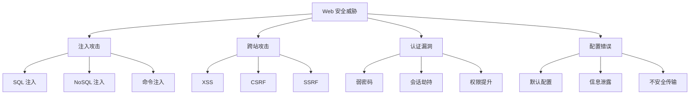
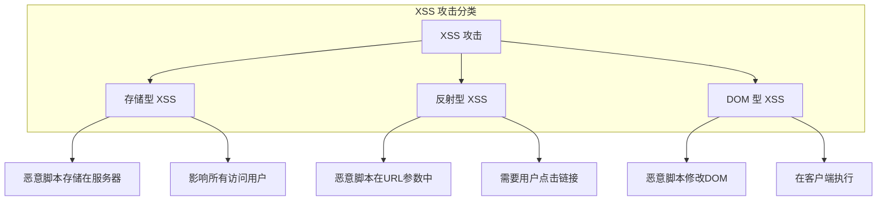
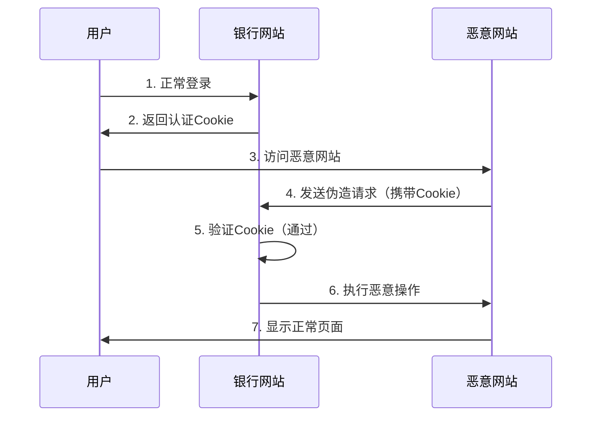

# Web 安全面试题

## 📋 目录
- [XSS 跨站脚本攻击](#xss-跨站脚本攻击)
- [CSRF 跨站请求伪造](#csrf-跨站请求伪造)
- [SQL 注入攻击](#sql-注入攻击)
- [身份认证安全](#身份认证安全)
- [HTTPS 和传输安全](#https-和传输安全)

## 🎯 核心知识点
- Web 安全威胁模型
- 输入验证和输出编码
- 安全认证机制
- 传输层安全
- 安全编码实践

## 📊 Web 安全威胁图



## XSS 跨站脚本攻击

### 💡 面试题目

#### 1. **[中级]** XSS 攻击的类型和防护措施

**XSS 攻击类型：**



**防护措施实现：**

```python
# Python Flask XSS 防护示例
from flask import Flask, request, render_template_string, escape
import html
import re
from markupsafe import Markup

app = Flask(__name__)

# 1. 输出编码防护
def safe_render(template, **kwargs):
    """安全渲染模板"""
    # 对所有变量进行HTML编码
    safe_kwargs = {}
    for key, value in kwargs.items():
        if isinstance(value, str):
            safe_kwargs[key] = escape(value)
        else:
            safe_kwargs[key] = value
    
    return render_template_string(template, **safe_kwargs)

# 2. 输入验证和清理
class XSSFilter:
    """XSS 过滤器"""
    
    # 危险标签
    DANGEROUS_TAGS = [
        'script', 'iframe', 'object', 'embed', 'form',
        'input', 'textarea', 'button', 'select', 'option'
    ]
    
    # 危险属性
    DANGEROUS_ATTRS = [
        'onload', 'onerror', 'onclick', 'onmouseover',
        'onfocus', 'onblur', 'onchange', 'onsubmit'
    ]
    
    @classmethod
    def clean_html(cls, content):
        """清理HTML内容"""
        if not content:
            return ""
        
        # 移除危险标签
        for tag in cls.DANGEROUS_TAGS:
            pattern = re.compile(f'<{tag}[^>]*>.*?</{tag}>', re.IGNORECASE | re.DOTALL)
            content = pattern.sub('', content)
            
            # 移除自闭合标签
            pattern = re.compile(f'<{tag}[^>]*/?>', re.IGNORECASE)
            content = pattern.sub('', content)
        
        # 移除危险属性
        for attr in cls.DANGEROUS_ATTRS:
            pattern = re.compile(f'{attr}\\s*=\\s*["\'][^"\']*["\']', re.IGNORECASE)
            content = pattern.sub('', content)
        
        # 移除javascript协议
        content = re.sub(r'javascript:', '', content, flags=re.IGNORECASE)
        
        return content
    
    @classmethod
    def validate_input(cls, data):
        """验证输入数据"""
        if isinstance(data, dict):
            return {key: cls.clean_html(str(value)) for key, value in data.items()}
        elif isinstance(data, str):
            return cls.clean_html(data)
        else:
            return data

# 3. 内容安全策略 (CSP)
@app.after_request
def add_security_headers(response):
    """添加安全头"""
    # CSP 策略
    csp_policy = (
        "default-src 'self'; "
        "script-src 'self' 'unsafe-inline' https://cdn.jsdelivr.net; "
        "style-src 'self' 'unsafe-inline'; "
        "img-src 'self' data: https:; "
        "font-src 'self' https://fonts.gstatic.com; "
        "connect-src 'self'; "
        "frame-ancestors 'none';"
    )
    
    response.headers['Content-Security-Policy'] = csp_policy
    response.headers['X-Content-Type-Options'] = 'nosniff'
    response.headers['X-Frame-Options'] = 'DENY'
    response.headers['X-XSS-Protection'] = '1; mode=block'
    
    return response

# 使用示例
@app.route('/comment', methods=['POST'])
def add_comment():
    comment = request.form.get('comment', '')
    
    # 输入验证和清理
    safe_comment = XSSFilter.validate_input(comment)
    
    # 存储到数据库（示例）
    # db.save_comment(safe_comment)
    
    return safe_render('''
    <div class="comment">
        <h3>您的评论：</h3>
        <p>{{ comment }}</p>
    </div>
    ''', comment=safe_comment)

if __name__ == '__main__':
    app.run(debug=False)  # 生产环境关闭调试模式
```

#### 2. **[高级]** DOM XSS 防护和前端安全实践

**前端 XSS 防护：**

```javascript
// JavaScript XSS 防护工具类
class XSSProtection {
    /**
     * HTML 编码
     */
    static htmlEncode(str) {
        if (!str) return '';
        
        const div = document.createElement('div');
        div.textContent = str;
        return div.innerHTML;
    }
    
    /**
     * HTML 解码
     */
    static htmlDecode(str) {
        if (!str) return '';
        
        const div = document.createElement('div');
        div.innerHTML = str;
        return div.textContent || div.innerText || '';
    }
    
    /**
     * URL 编码
     */
    static urlEncode(str) {
        return encodeURIComponent(str);
    }
    
    /**
     * JavaScript 编码
     */
    static jsEncode(str) {
        if (!str) return '';
        
        return str.replace(/[\u0000-\u001f\u007f-\u009f\u00ad\u0600-\u0604\u070f\u17b4\u17b5\u200c-\u200f\u2028-\u202f\u2060-\u206f\ufeff\ufff0-\uffff]/g, 
            function(char) {
                return '\\u' + ('0000' + char.charCodeAt(0).toString(16)).substr(-4);
            });
    }
    
    /**
     * 安全的 innerHTML 设置
     */
    static safeSetInnerHTML(element, content) {
        // 使用 DOMPurify 库进行清理（需要引入）
        if (typeof DOMPurify !== 'undefined') {
            element.innerHTML = DOMPurify.sanitize(content);
        } else {
            // 简单的清理方案
            element.textContent = content;
        }
    }
    
    /**
     * 安全的动态脚本执行
     */
    static safeEval(code, allowedFunctions = []) {
        // 创建安全的执行环境
        const safeGlobals = {
            console: {
                log: console.log.bind(console)
            }
        };
        
        // 添加允许的函数
        allowedFunctions.forEach(func => {
            if (typeof window[func] === 'function') {
                safeGlobals[func] = window[func];
            }
        });
        
        try {
            // 使用 Function 构造器替代 eval
            const func = new Function(
                ...Object.keys(safeGlobals),
                `"use strict"; ${code}`
            );
            
            return func(...Object.values(safeGlobals));
        } catch (error) {
            console.error('安全执行失败:', error);
            return null;
        }
    }
    
    /**
     * URL 安全检查
     */
    static isUrlSafe(url) {
        if (!url) return false;
        
        try {
            const urlObj = new URL(url);
            
            // 检查协议
            const allowedProtocols = ['http:', 'https:', 'mailto:', 'tel:'];
            if (!allowedProtocols.includes(urlObj.protocol)) {
                return false;
            }
            
            // 检查是否为 javascript: 协议
            if (url.toLowerCase().startsWith('javascript:')) {
                return false;
            }
            
            return true;
        } catch (error) {
            return false;
        }
    }
}

// 使用示例
class SafeCommentSystem {
    constructor(containerElement) {
        this.container = containerElement;
        this.comments = [];
    }
    
    addComment(authorName, content) {
        // 输入验证
        if (!authorName || !content) {
            throw new Error('作者名和内容不能为空');
        }
        
        // XSS 防护
        const safeAuthor = XSSProtection.htmlEncode(authorName);
        const safeContent = XSSProtection.htmlEncode(content);
        
        const comment = {
            id: Date.now(),
            author: safeAuthor,
            content: safeContent,
            timestamp: new Date().toISOString()
        };
        
        this.comments.push(comment);
        this.renderComments();
    }
    
    renderComments() {
        const html = this.comments.map(comment => `
            <div class="comment" data-id="${comment.id}">
                <div class="comment-author">${comment.author}</div>
                <div class="comment-content">${comment.content}</div>
                <div class="comment-time">${new Date(comment.timestamp).toLocaleString()}</div>
            </div>
        `).join('');
        
        // 安全设置 HTML
        XSSProtection.safeSetInnerHTML(this.container, html);
    }
    
    loadCommentsFromUrl(url) {
        // URL 安全检查
        if (!XSSProtection.isUrlSafe(url)) {
            throw new Error('不安全的URL');
        }
        
        fetch(url)
            .then(response => response.json())
            .then(data => {
                // 清理接收到的数据
                data.forEach(comment => {
                    this.addComment(comment.author, comment.content);
                });
            })
            .catch(error => {
                console.error('加载评论失败:', error);
            });
    }
}

// CSP 违规报告处理
document.addEventListener('securitypolicyviolation', function(event) {
    console.warn('CSP 违规:', {
        violatedDirective: event.violatedDirective,
        blockedURI: event.blockedURI,
        lineNumber: event.lineNumber,
        columnNumber: event.columnNumber,
        sourceFile: event.sourceFile
    });
    
    // 发送违规报告到服务器
    fetch('/csp-report', {
        method: 'POST',
        headers: {
            'Content-Type': 'application/json',
        },
        body: JSON.stringify({
            violatedDirective: event.violatedDirective,
            blockedURI: event.blockedURI,
            documentURI: event.documentURI,
            timestamp: new Date().toISOString()
        })
    });
});
```

## CSRF 跨站请求伪造

#### 3. **[中级]** CSRF 攻击原理和防护机制

**CSRF 攻击流程：**



**CSRF 防护实现：**

```python
# Python Django CSRF 防护示例
import hashlib
import hmac
import secrets
import time
from django.conf import settings
from django.http import HttpResponseForbidden
from django.middleware.csrf import get_token
from django.views.decorators.csrf import csrf_protect
from django.utils.decorators import method_decorator

class CSRFProtection:
    """CSRF 防护工具类"""
    
    @staticmethod
    def generate_csrf_token(session_key=None):
        """生成 CSRF Token"""
        if not session_key:
            session_key = secrets.token_urlsafe(32)
        
        timestamp = str(int(time.time()))
        message = f"{session_key}:{timestamp}"
        
        # 使用HMAC生成签名
        signature = hmac.new(
            settings.SECRET_KEY.encode(),
            message.encode(),
            hashlib.sha256
        ).hexdigest()
        
        return f"{timestamp}:{signature}"
    
    @staticmethod
    def verify_csrf_token(token, session_key, max_age=3600):
        """验证 CSRF Token"""
        if not token or ':' not in token:
            return False
        
        try:
            timestamp_str, signature = token.split(':', 1)
            timestamp = int(timestamp_str)
            
            # 检查时间有效性
            if time.time() - timestamp > max_age:
                return False
            
            # 重新生成签名进行比较
            message = f"{session_key}:{timestamp_str}"
            expected_signature = hmac.new(
                settings.SECRET_KEY.encode(),
                message.encode(),
                hashlib.sha256
            ).hexdigest()
            
            return hmac.compare_digest(signature, expected_signature)
            
        except (ValueError, TypeError):
            return False

# 自定义 CSRF 中间件
class CustomCSRFMiddleware:
    """自定义 CSRF 中间件"""
    
    def __init__(self, get_response):
        self.get_response = get_response
    
    def __call__(self, request):
        # 处理请求前
        if request.method in ('POST', 'PUT', 'DELETE', 'PATCH'):
            if not self.verify_csrf(request):
                return HttpResponseForbidden("CSRF verification failed")
        
        response = self.get_response(request)
        
        # 处理响应后
        if request.method == 'GET':
            # 为GET请求生成CSRF token
            csrf_token = CSRFProtection.generate_csrf_token(
                request.session.session_key
            )
            response.set_cookie('csrftoken', csrf_token, httponly=False)
        
        return response
    
    def verify_csrf(self, request):
        """验证 CSRF"""
        # 获取token
        csrf_token = (
            request.POST.get('csrfmiddlewaretoken') or
            request.META.get('HTTP_X_CSRFTOKEN') or
            request.COOKIES.get('csrftoken')
        )
        
        if not csrf_token:
            return False
        
        # 验证token
        return CSRFProtection.verify_csrf_token(
            csrf_token,
            request.session.session_key
        )

# 双重提交Cookie模式
class DoubleSubmitCSRF:
    """双重提交Cookie CSRF防护"""
    
    @staticmethod
    def generate_token():
        """生成随机token"""
        return secrets.token_urlsafe(32)
    
    @staticmethod
    def set_csrf_cookie(response, token):
        """设置CSRF Cookie"""
        response.set_cookie(
            'csrf_token',
            token,
            max_age=3600,
            secure=True,      # HTTPS only
            httponly=False,   # JavaScript 可访问
            samesite='Strict' # 同站策略
        )
    
    @staticmethod
    def verify_double_submit(request):
        """验证双重提交"""
        cookie_token = request.COOKIES.get('csrf_token')
        
        # 从请求头或表单获取token
        request_token = (
            request.META.get('HTTP_X_CSRF_TOKEN') or
            request.POST.get('csrf_token')
        )
        
        if not cookie_token or not request_token:
            return False
        
        return hmac.compare_digest(cookie_token, request_token)

# 使用示例
@method_decorator(csrf_protect, name='dispatch')
class SecureTransferView(View):
    """安全转账视图"""
    
    def get(self, request):
        # 生成CSRF token
        csrf_token = get_token(request)
        
        return render(request, 'transfer.html', {
            'csrf_token': csrf_token
        })
    
    def post(self, request):
        # CSRF 验证由装饰器自动处理
        
        # 额外的业务验证
        amount = request.POST.get('amount')
        to_account = request.POST.get('to_account')
        
        # 验证金额
        try:
            amount = float(amount)
            if amount <= 0:
                raise ValueError("金额必须大于0")
        except (ValueError, TypeError):
            return JsonResponse({'error': '无效的金额'}, status=400)
        
        # 验证账户
        if not self.validate_account(to_account):
            return JsonResponse({'error': '无效的目标账户'}, status=400)
        
        # 执行转账
        try:
            self.process_transfer(request.user, to_account, amount)
            return JsonResponse({'success': True})
        except Exception as e:
            return JsonResponse({'error': str(e)}, status=500)
    
    def validate_account(self, account):
        """验证账户有效性"""
        # 账户验证逻辑
        return account and len(account) >= 10
    
    def process_transfer(self, user, to_account, amount):
        """处理转账业务"""
        # 转账业务逻辑
        pass
```

## SQL 注入攻击

#### 4. **[高级]** SQL 注入攻击类型和防护策略

**SQL 注入防护：**

```python
# Python SQL 注入防护示例
import sqlite3
import pymysql
from typing import List, Dict, Any, Optional
import logging

class SecureDatabase:
    """安全的数据库操作类"""
    
    def __init__(self, connection):
        self.conn = connection
        self.logger = logging.getLogger(__name__)
    
    def execute_query(self, query: str, params: tuple = None) -> List[Dict[str, Any]]:
        """安全执行查询"""
        try:
            cursor = self.conn.cursor(dictionary=True)
            
            # 记录查询日志（不包含敏感参数）
            self.logger.info(f"执行查询: {query}")
            
            if params:
                cursor.execute(query, params)
            else:
                cursor.execute(query)
            
            results = cursor.fetchall()
            cursor.close()
            
            return results
            
        except Exception as e:
            self.logger.error(f"查询执行失败: {e}")
            raise
    
    def get_user_by_id(self, user_id: int) -> Optional[Dict[str, Any]]:
        """根据ID获取用户（安全方式）"""
        # 使用参数化查询
        query = "SELECT * FROM users WHERE id = %s"
        results = self.execute_query(query, (user_id,))
        
        return results[0] if results else None
    
    def search_users(self, search_term: str) -> List[Dict[str, Any]]:
        """搜索用户（防注入）"""
        # 输入验证
        if not search_term or len(search_term.strip()) == 0:
            return []
        
        # 清理输入
        safe_term = self.sanitize_search_term(search_term)
        
        # 使用参数化查询和LIKE操作
        query = """
        SELECT id, username, email, created_at 
        FROM users 
        WHERE username LIKE %s OR email LIKE %s
        LIMIT 100
        """
        
        like_pattern = f"%{safe_term}%"
        return self.execute_query(query, (like_pattern, like_pattern))
    
    def sanitize_search_term(self, term: str) -> str:
        """清理搜索词"""
        # 移除SQL关键字和特殊字符
        dangerous_patterns = [
            'SELECT', 'INSERT', 'UPDATE', 'DELETE', 'DROP', 'CREATE',
            'ALTER', 'EXEC', 'UNION', 'SCRIPT', '--', ';', '"', "'",
            'OR', 'AND', '=', '<', '>', '(', ')', '{', '}', '[', ']'
        ]
        
        clean_term = term
        for pattern in dangerous_patterns:
            clean_term = clean_term.replace(pattern.lower(), '')
            clean_term = clean_term.replace(pattern.upper(), '')
        
        # 限制长度
        return clean_term[:50].strip()
    
    def create_user(self, username: str, email: str, password_hash: str) -> int:
        """创建用户（安全方式）"""
        # 输入验证
        if not self.validate_username(username):
            raise ValueError("无效的用户名")
        
        if not self.validate_email(email):
            raise ValueError("无效的邮箱地址")
        
        # 使用参数化查询
        query = """
        INSERT INTO users (username, email, password_hash, created_at)
        VALUES (%s, %s, %s, NOW())
        """
        
        cursor = self.conn.cursor()
        try:
            cursor.execute(query, (username, email, password_hash))
            user_id = cursor.lastrowid
            self.conn.commit()
            
            self.logger.info(f"创建用户成功: {username}")
            return user_id
            
        except Exception as e:
            self.conn.rollback()
            self.logger.error(f"创建用户失败: {e}")
            raise
        finally:
            cursor.close()
    
    def validate_username(self, username: str) -> bool:
        """验证用户名"""
        import re
        
        if not username or len(username) < 3 or len(username) > 30:
            return False
        
        # 只允许字母、数字和下划线
        pattern = re.compile(r'^[a-zA-Z0-9_]+$')
        return bool(pattern.match(username))
    
    def validate_email(self, email: str) -> bool:
        """验证邮箱地址"""
        import re
        
        if not email or len(email) > 100:
            return False
        
        pattern = re.compile(r'^[a-zA-Z0-9._%+-]+@[a-zA-Z0-9.-]+\.[a-zA-Z]{2,}$')
        return bool(pattern.match(email))

# ORM 方式防护（使用 SQLAlchemy）
from sqlalchemy import create_engine, Column, Integer, String, DateTime, text
from sqlalchemy.ext.declarative import declarative_base
from sqlalchemy.orm import sessionmaker
from datetime import datetime

Base = declarative_base()

class User(Base):
    __tablename__ = 'users'
    
    id = Column(Integer, primary_key=True)
    username = Column(String(50), unique=True, nullable=False)
    email = Column(String(100), unique=True, nullable=False)
    password_hash = Column(String(255), nullable=False)
    created_at = Column(DateTime, default=datetime.utcnow)

class SecureUserService:
    """安全的用户服务（ORM方式）"""
    
    def __init__(self, session):
        self.session = session
    
    def get_user_by_id(self, user_id: int) -> Optional[User]:
        """根据ID获取用户"""
        # ORM 自动防护 SQL 注入
        return self.session.query(User).filter(User.id == user_id).first()
    
    def search_users_safe(self, search_term: str) -> List[User]:
        """安全搜索用户"""
        if not search_term:
            return []
        
        # 使用 ORM 的参数化查询
        return self.session.query(User).filter(
            User.username.like(f'%{search_term}%') |
            User.email.like(f'%{search_term}%')
        ).limit(100).all()
    
    def execute_raw_query_safe(self, search_term: str) -> List[Dict]:
        """安全执行原生SQL（当必要时）"""
        # 使用 text() 和参数绑定
        query = text("""
            SELECT id, username, email 
            FROM users 
            WHERE username LIKE :search_term 
            LIMIT 100
        """)
        
        result = self.session.execute(
            query, 
            {'search_term': f'%{search_term}%'}
        )
        
        return [dict(row) for row in result]

# 输入验证装饰器
def validate_sql_input(param_name: str):
    """SQL 输入验证装饰器"""
    def decorator(func):
        def wrapper(*args, **kwargs):
            if param_name in kwargs:
                value = kwargs[param_name]
                if not SecureDatabase.validate_sql_input(value):
                    raise ValueError(f"Invalid input for {param_name}")
            return func(*args, **kwargs)
        return wrapper
    return decorator

# 使用示例
def demo_secure_database():
    """安全数据库使用示例"""
    
    # 创建数据库连接
    conn = pymysql.connect(
        host='localhost',
        user='username',
        password='password',
        database='test_db',
        charset='utf8mb4'
    )
    
    # 创建安全数据库操作实例
    db = SecureDatabase(conn)
    
    try:
        # 安全的用户查询
        user = db.get_user_by_id(123)
        print(f"找到用户: {user}")
        
        # 安全的搜索
        users = db.search_users("john")
        print(f"搜索结果: {len(users)} 个用户")
        
        # 安全的用户创建
        user_id = db.create_user(
            username="newuser",
            email="newuser@example.com",
            password_hash="hashed_password"
        )
        print(f"创建用户ID: {user_id}")
        
    finally:
        conn.close()

if __name__ == '__main__':
    demo_secure_database()
```

## 🔗 相关链接

- [← 返回后端面试题](./README.md)
- [身份认证面试题](./authentication.md)
- [HTTPS 和传输安全](./https-security.md)
- [安全编码实践](./secure-coding.md)

---

*构建安全的Web应用，防范各种安全威胁* 🔒 