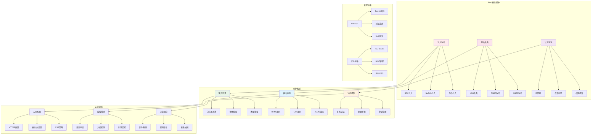

# Web安全面试题

[← 返回后端面试题目录](./README.md)

## 📚 题目概览

Web安全是现代Web应用开发中不可忽视的关键领域。随着网络攻击手段的不断演进，开发者需要具备全面的安全防护意识和技术能力。本章节重点考察候选人对常见Web安全威胁的理解、防护机制的掌握，以及在实际项目中的安全实践能力。

## 🎯 核心技术考察重点

### Web安全威胁识别
- 常见Web攻击类型的识别和分析
- 攻击向量和利用方式的理解
- 安全漏洞的发现和评估方法
- 威胁建模和风险评估流程

### 安全防护机制
- 输入验证和输出编码的实现策略
- 身份认证和授权机制设计
- 会话管理和状态保护
- 传输层安全和数据加密

### 安全编码实践
- 安全开发生命周期的实施
- 代码审计和安全测试方法
- 安全配置和部署策略
- 监控和应急响应机制

### 合规性和标准
- OWASP Top 10安全风险
- 行业安全标准和最佳实践
- 隐私保护和数据合规要求
- 安全审计和合规性检查

## 📊 知识结构关联图

## 📝 核心面试题目

### 注入攻击防护 💉

#### 题目1：SQL注入攻击防护机制设计
**问题背景**：深入理解SQL注入攻击的原理和全面的防护策略

**技术挑战**：
- SQL注入攻击的各种变种和绕过技术
- 参数化查询和预编译语句的实现
- 动态SQL构建的安全策略
- 数据库层面的安全配置和权限控制

**考察要点**：
- 对SQL注入攻击原理的深度理解
- 多层次防护策略的设计能力
- 数据库安全配置的最佳实践
- 代码审计和安全测试技能

**📁 完整解决方案**：[SQL注入防护完整实现](../../solutions/common/sql-injection-protection.md)

#### 题目2：NoSQL注入和命令注入防护
**问题背景**：掌握现代应用中NoSQL和系统命令注入的防护技术

**技术挑战**：
- NoSQL数据库的注入攻击向量分析
- 系统命令执行的安全控制机制
- 输入验证和参数化的实现策略
- 容器化环境下的安全隔离

**考察要点**：
- 对新型注入攻击的理解和应对
- 系统级安全控制的设计能力
- 容器安全和隔离技术的应用
- 安全开发流程的建立和执行

**📁 完整解决方案**：[现代注入攻击防护](../../solutions/common/modern-injection-protection.md)

### 跨站攻击防护 🔐

#### 题目3：XSS攻击全面防护体系
**问题背景**：构建完整的XSS攻击防护体系和安全编码规范

**技术挑战**：
- 存储型、反射型、DOM型XSS的识别和防护
- 内容安全策略(CSP)的设计和实施
- 输出编码和上下文感知的安全处理
- 富文本编辑器的安全实现

**考察要点**：
- XSS攻击类型的准确识别和分析
- 多层次防护机制的设计和实现
- 前端安全编码的最佳实践
- 安全策略的配置和管理

**📁 完整解决方案**：[XSS防护完整体系](../../solutions/common/xss-protection-system.md)

#### 题目4：CSRF攻击防护和会话安全
**问题背景**：实现CSRF攻击防护和安全的会话管理机制

**技术挑战**：
- CSRF攻击的识别和防护策略
- 安全Token的生成和验证机制
- 会话固定和会话劫持的防护
- 单点登录(SSO)的安全实现

**考察要点**：
- CSRF攻击原理和防护机制的理解
- 会话管理的安全设计能力
- 认证和授权机制的实现
- 分布式环境下的会话安全

**📁 完整解决方案**：[CSRF防护和会话安全](../../solutions/common/csrf-session-security.md)

### 身份认证与授权 🔑

#### 题目5：现代身份认证体系设计
**问题背景**：设计安全可靠的身份认证和授权体系

**技术挑战**：
- 多因素认证(MFA)的实现和集成
- JWT令牌的安全使用和管理
- OAuth 2.0和OpenID Connect的实现
- 生物识别和无密码认证技术

**考察要点**：
- 现代认证技术的深度理解
- 安全令牌的设计和管理
- 联合身份认证的实现能力
- 用户体验和安全性的平衡

**📁 完整解决方案**：[现代身份认证系统](../../solutions/common/modern-authentication-system.md)

### 传输和数据安全 🛡️

#### 题目6：HTTPS和数据加密安全实践
**问题背景**：实现全面的传输层安全和敏感数据保护

**技术挑战**：
- TLS/SSL协议的配置和优化
- 证书管理和PKI基础设施
- 敏感数据的加密存储和传输
- 密钥管理和轮换策略

**考察要点**：
- 加密技术的原理和应用
- 证书和密钥管理的实践
- 数据保护的合规要求
- 性能和安全的平衡考虑

**📁 完整解决方案**：[传输和数据安全实现](../../solutions/common/transport-data-security.md)

## 📊 面试评分标准

### 安全理论基础 (30分)
- **威胁识别**：准确识别和分析各类Web安全威胁
- **攻击原理**：深入理解攻击技术的实现原理
- **防护机制**：掌握相应的防护技术和实现方法

### 实践应用能力 (40分)
- **安全编码**：具备安全编码的实践能力
- **工具使用**：熟练使用安全测试和检测工具
- **问题解决**：能够分析和解决实际的安全问题

### 架构设计能力 (30分)
- **安全架构**：能够设计安全的系统架构
- **风险评估**：具备安全风险评估和管理能力
- **合规实践**：了解相关安全标准和合规要求

## 🎯 备考建议

### 学习路径
1. **基础理论**：学习Web安全的基本概念和原理
2. **攻击技术**：了解常见攻击手段和实现方式
3. **防护机制**：掌握相应的防护技术和实现方法
4. **实践演练**：通过实际项目和练习平台加深理解
5. **持续学习**：关注最新的安全威胁和防护技术

### 技术重点
- **OWASP Top 10**：深入理解十大安全风险
- **安全编码**：掌握安全编码的最佳实践
- **渗透测试**：了解基本的渗透测试方法
- **安全工具**：熟练使用常见的安全测试工具
- **合规标准**：了解相关的安全标准和要求

### 实践项目建议
- 构建安全的Web应用框架
- 实现完整的身份认证系统
- 开发安全审计和监控系统
- 设计安全的API网关
- 创建安全培训和测试平台

### 学习资源
- **OWASP官方资源**：权威的Web安全指南
- **安全社区**：参与安全技术交流社区
- **在线课程**：系统学习Web安全课程
- **实验平台**：使用WebGoat、DVWA等练习平台
- **安全会议**：关注安全技术会议和分享

## 🔗 相关资源链接

- [API设计面试题](./api-design.md)
- [认证授权面试题](./authentication.md)
- [系统设计面试题](../system-design/README.md)
- [监控调试面试题](./monitoring-debugging.md)
- [← 返回后端面试题目录](./README.md)

---

*安全是Web应用的生命线，掌握全面的安全知识是每个开发者的必修课* 🔒 