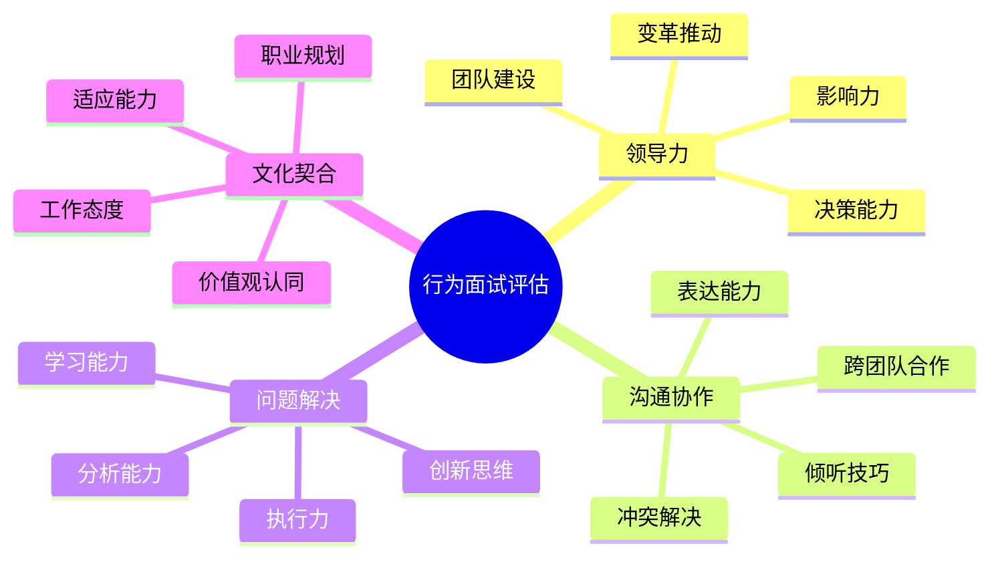

# 行为面试题库

## 📋 简介

行为面试是技术面试中的重要组成部分，主要考察候选人的软技能、工作经历、团队协作能力和文化契合度。本目录提供通用的行为面试准备指南和方法论。

## 🎯 行为面试核心要素

### STAR方法
**S**ituation（情境）→ **T**ask（任务）→ **A**ction（行动）→ **R**esult（结果）

这是回答行为面试题的黄金法则，确保回答结构化、逻辑清晰。

📖 **详细指南**：[STAR方法完整教程](./star-method-guide.md)

### 通用评估维度

## 📚 通用面试题分类

### 1. 项目经历类
- [项目管理经验](./project-management.md)
- [技术挑战解决](./technical-challenges.md)
- [跨团队协作](./cross-team-collaboration.md)
- [项目失败处理](./project-failure-handling.md)

### 2. 领导力类
- [团队领导经验](./leadership-experience.md)
- [冲突解决案例](./conflict-resolution.md)
- [变革推动经历](./change-management.md)
- [人才培养案例](./talent-development.md)

### 3. 问题解决类
- [复杂问题分析](./complex-problem-solving.md)
- [创新思维展示](./innovation-examples.md)
- [压力管理经历](./stress-management.md)
- [学习能力证明](./learning-agility.md)

### 4. 沟通协作类
- [有效沟通案例](./effective-communication.md)
- [团队合作经历](./teamwork-examples.md)
- [客户服务经验](./customer-service.md)
- [跨文化交流](./cross-cultural-communication.md)

### 5. 职业发展类
- [职业规划思考](./career-planning.md)
- [自我提升经历](./self-improvement.md)
- [价值观体现](./values-demonstration.md)
- [工作动机分析](./work-motivation.md)

## 🏢 公司特定行为面试题

不同公司有不同的企业文化和价值观，建议结合通用方法论和公司特定要求进行准备：

### 外资金融机构
- [汇丰银行 (HSBC)](../company-specific/hsbc/behavioral-star.md) ✅
- [渣打银行 (Standard Chartered)](../company-specific/standard-chartered/behavioral-interview.md) ✅
- [摩根大通 (JPMorgan Chase)](../company-specific/jpmorgan/behavioral-interview.md) ✅

### 科技公司
- [Google](../company-specific/google/behavioral-interview.md)
- [Microsoft](../company-specific/microsoft/behavioral-interview.md)
- [Amazon](../company-specific/amazon/behavioral-interview.md)

### 互联网公司
- [阿里巴巴](../company-specific/alibaba/behavioral-interview.md)
- [腾讯](../company-specific/tencent/behavioral-interview.md)
- [字节跳动](../company-specific/bytedance/behavioral-interview.md)

## 💡 面试准备策略

### 1. 故事库建设
准备8-10个核心故事，涵盖不同场景：
- 成功项目案例（2-3个）
- 失败学习案例（1-2个）
- 团队协作案例（2-3个）
- 领导力案例（1-2个）
- 创新解决案例（1-2个）

### 2. STAR方法练习
每个故事都要用STAR方法组织：
- **Situation**: 背景要具体，有时间、地点、人物
- **Task**: 任务要明确，突出你的责任和目标
- **Action**: 行动要详细，展示你的思考过程和具体做法
- **Result**: 结果要量化，用数据证明影响力

### 3. 价值观对齐
- 研究目标公司的核心价值观
- 将个人经历与公司价值观联系
- 准备体现价值观的具体案例

### 4. 常见追问准备
- "如果重新来一次，你会怎么做？"
- "你从这个经历中学到了什么？"
- "这个经历如何影响了你后续的工作？"
- "你如何将这个经验应用到我们公司？"

## 🔍 面试技巧

### 回答结构
1. **开门见山**：直接回答问题核心
2. **逻辑清晰**：按STAR顺序组织内容
3. **重点突出**：强调你的贡献和影响
4. **适度详细**：提供足够细节但不冗长

### 表达技巧
- **具体化**：用具体数字和事实支撑
- **积极性**：即使是失败案例也要展现学习和成长
- **诚实性**：不夸大事实，承认不足
- **相关性**：与目标岗位和公司需求相关

### 非语言沟通
- 保持眼神交流
- 适当的手势和表情
- 自信的坐姿
- 积极的语调

## 📊 评分标准

### 优秀表现 (4-5分)
- 故事结构完整，逻辑清晰
- 展现出色的问题解决能力
- 体现强烈的主人翁意识
- 结果具有显著影响力
- 与公司价值观高度契合

### 良好表现 (3分)
- 故事基本完整，有明确结果
- 展现一定的能力和经验
- 与岗位要求基本匹配
- 有学习和成长的体现

### 需要改进 (1-2分)
- 故事不够具体或逻辑混乱
- 缺乏主动性和影响力
- 与岗位要求不匹配
- 结果不明确或价值有限

## 🌟 成功案例特征

### 技术类案例
- 主动发现和解决技术问题
- 运用创新方法提升效率
- 推动技术标准和最佳实践
- 具有可复制和推广价值

### 管理类案例
- 在困难情况下展现领导力
- 成功协调多方资源和利益
- 推动团队或组织变革
- 培养和发展团队成员

### 协作类案例
- 跨部门或跨文化协作成功
- 有效解决冲突和分歧
- 建立长期合作关系
- 促进知识分享和传承

## 🎓 持续改进

### 面试后反思
- 记录面试问题和自己的回答
- 分析回答的优缺点
- 总结可改进的地方
- 更新和完善故事库

### 定期练习
- 与朋友进行模拟面试
- 录制视频自我评估
- 参加面试技巧培训
- 关注行业面试趋势

## 🔗 相关资源

### 内部资源
- [面试技巧指南](../../docs/interview-tips.md)
- [算法面试题库](../algorithms/README.md)
- [系统设计题库](../system-design/README.md)
- [公司特定题库](../company-specific/README.md)

### 外部资源
- [STAR方法详解](https://www.indeed.com/career-advice/interviewing/how-to-use-the-star-method)
- [行为面试准备指南](https://www.glassdoor.com/blog/behavioral-interview-questions/)
- [领导力面试题库](https://www.themuse.com/advice/leadership-interview-questions)

---
[← 返回主目录](../../README.md) 